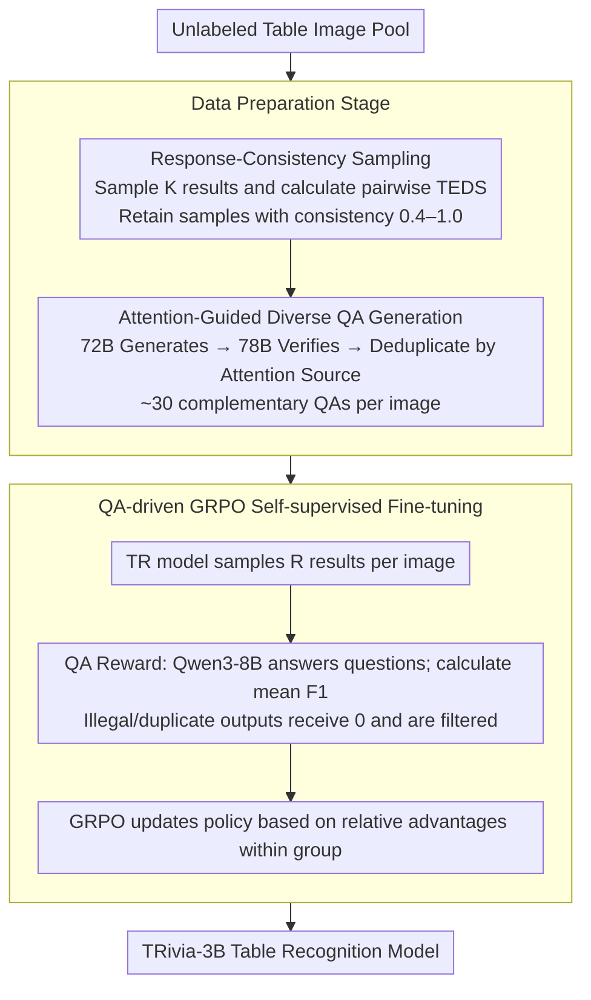

# TRivia: Self-supervised Fine-tuning of Vision-Language Models for Table Recognition

**Conference**: CVPR 2026  
**arXiv**: [2512.01248](https://arxiv.org/abs/2512.01248)  
**Code**: [https://github.com/HKU-TASR/TRivia](https://github.com/HKU-TASR/TRivia)  
**Area**: Multimodal VLM  
**Keywords**: Table recognition, self-supervised fine-tuning, GRPO, vision-language models, reinforcement learning

## TL;DR
The TRivia self-supervised fine-tuning framework is proposed, which enables VLMs to learn table recognition directly from unlabeled table images through table Question Answering (QA)-driven GRPO reinforcement learning. With 3B parameters, TRivia-3B outperforms proprietary models such as Gemini 2.5 Pro and GPT-5 across multiple benchmarks.

## Background & Motivation

**Background**: Table Recognition (TR) aims to convert table images into semi-structured representations like HTML or Markdown. Recent VLM developments have significantly improved TR performance, with proprietary models like Gemini 2.5 Pro demonstrating powerful TR capabilities. Open-source VLMs still lag behind due to limited labeled data scales.

**Limitations of Prior Work**: TR data acquisition faces a trilemma: (1) Synthetic data is scalable but lacks real-world visual diversity; (2) Real-world data labeling is expensive and time-consuming; (3) Distilling pseudo-labels from proprietary models is costly, restricted by the teacher model's performance ceiling, and may violate service agreements. Even MinerU2.5, utilizing millions of samples with manual labeling and Gemini distillation, fails to surpass its teacher model.

**Key Challenge**: The labeled data for open-source TR models is limited, and the ceiling is dictated by the teacher model—the bottleneck of labeled data vs. performance. Meanwhile, massive amounts of unlabeled table images are easily accessible but cannot be directly utilized.

**Goal**: (1) How to extract effective supervision signals from unlabeled table images; (2) How to filter samples with the highest training value; (3) How to generate diverse and verifiable QA pairs as reward signals.

**Key Insight**: QA is a downstream task of TR—if a model can correctly answer questions about a table, it implicitly indicates that its recognition of the table's structure and content is accurate. This is easier than directly predicting HTML labels, and the correctness of QA pairs can be verified through cross-validation.

**Core Idea**: Utilize "correctness in answering table questions" as a proxy reward to enable self-supervised learning of table recognition from unlabeled images for VLMs via GRPO.

## Method

### Overall Architecture
TRivia consists of two stages: (1) **Data Preparation Stage**—first selecting samples with the highest training value from massive unlabeled images using "Response-Consistency Sampling," then automatically generating a set of verifiable QA pairs covering the entire table for each image via "Attention-Guided QA Generation"; (2) **Training Stage**—performing GRPO reinforcement learning using "whether the model's recognition result enables correct answers to these QA pairs" as a reward to fine-tune the VLM without manual labels. This RL stage is the final step in a three-stage training pipeline: OTSL warm-up (700K synthetic data) $\rightarrow$ Supervised Fine-Tuning (50K real data) $\rightarrow$ TRivia self-supervised RL (50K unlabeled data).

### Key Designs

**1. Response-Consistency Sampling: Using model uncertainty to select optimal samples**

While unlabeled table images are plentiful, not all are valuable for training. Clustering measures diversity between samples but fails to evaluate "training value for the current model." TRivia utilizes GRPO's characteristic: since GRPO benefits from a diverse set of responses, samples for which the model is most uncertain—producing varied outputs during sampling—are the most valuable. Specifically, the TR model generates $K$ results for an image, and the average pairwise TEDS (Tree Edit Distance-based Similarity) is calculated as the consistency score:

$$\text{Consistency}(I) = \frac{2}{K^2-K}\sum_{i<j}\text{TEDS}(o_i, o_j)$$

Lower scores indicate higher model uncertainty and higher sample value. However, very low scores often correspond to noisy images, so samples with consistency below 0.4 are filtered, and uniform sampling is performed within the 0.4–1.0 range—avoiding both trivial tables and pure noise.

**2. Attention-Guided Diverse QA Generation: Ensuring total table coverage**

The effectiveness of QA rewards depends on whether the questions cover the entire table. Single-pass generation attracts focus to specific parts, and multiple samples often results in paraphrased questions about the same cells. TRivia uses VLM attention during answering to label "visual sources": visual tokens highly attended to during answer generation define the region supporting the QA.

$$VS\big((q,a)\big) = \{\, v \mid \mathcal{A}(v\mid a) > \tau_\mathcal{A}\,\}$$

With visual sources, coverage becomes quantifiable. The workflow involves three steps: first, Qwen2.5-VL-72B multi-sampling creates a candidate pool; second, InternVL3-78B performs cross-validation ensuring questions require the image to be answered; finally, a subset of QAs with minimal visual source IoU is greedily selected to ensure they target different regions, resulting in ~30 complementary QA pairs per image.

**3. QA-driven GRPO Self-supervised Fine-tuning: Verifiable signals from answer accuracy**

Directly predicting HTML labels is difficult to verify automatically due to the mix of content and structural elements (colspan/rowspan). TRivia posits that if a model recognizes a table correctly, its output should enable correct answers to questions about that table. For each image, the TR model (policy) samples $R$ recognition results $\{o_j\}$. Each result and the prepared QA pairs are fed to an LLM (Qwen3-8B) to generate answers, using the mean F1 score as the reward:

$$\text{Reward}(o_j) = \frac{1}{|QA|}\sum_{(q,a)} F1\big(M_{LLM}(q;o_j),\, a\big)$$

GRPO uses the relative reward differences within the $R$ results to update the policy. A critical stability detail is illegal-sample filtering: rewards for invalid or repetitive outputs are set to 0. If not filtered, a group of all zeros would flatten the reward distribution and invalidate relative advantages; thus, these samples are removed during training.

### Loss & Training
A three-stage training strategy is employed: Stage 1 utilizes 700K synthetic and public data for OTSL format warm-up (visual encoder frozen); Stage 2 performs full-parameter supervised fine-tuning on 50K real tables; Stage 3 applies the TRivia framework for GRPO RL fine-tuning on 50K unlabeled data.

## Key Experimental Results

### Main Results

| Model | OmniDocBench TEDS | CC-OCR TEDS | OCRBench TEDS | Overall TEDS |
|------|-------------------|-------------|---------------|--------------|
| UniTable | 82.76 | 57.84 | 67.73 | 70.86 |
| Qwen2.5-VL-72B | 87.85 | 81.22 | 81.33 | 83.52 |
| Gemini 2.5 Pro | 90.90 | **85.56** | 88.94 | 88.93 |
| GPT-5 | 84.91 | 63.25 | 79.91 | 78.30 |
| MinerU2.5 | 90.85 | 79.76 | 87.13 | 86.82 |
| PaddleOCR-VL | 91.12 | 79.62 | 79.29 | 83.36 |
| **Ours (TRivia-3B)** | **91.60** | 84.90 | **90.76** | **89.88** |

### Ablation Study

| Configuration | OmniDocBench | CC-OCR | OCRBench | Overall | Description |
|------|-------------|--------|----------|---------|------|
| Stage-2 (SFT baseline) | 90.08 | 82.48 | 90.08 | 88.57 | Supervised ceiling |
| + 72B Pseudo-label SFT | 84.41 | 70.54 | 80.87 | 80.02 | Poor quality, performance drops -8.55 |
| + 72B Pseudo-label GRPO | 86.19 | 78.12 | 84.16 | 83.65 | GRPO mitigates but still drops -4.92 |
| TRivia-3B | 91.60 | 84.90 | 90.76 | 89.88 | QA reward breaks ceiling by +1.31 |
| w/o Attention-guided QA | - | - | - | Significant Dec. | Fragile on complex tables |
| w/o Response-consistency | - | - | - | TEDS 52$\rightarrow$63.5 | Slower convergence |
| w/o Illegal filtering | - | - | - | Unstable | Conv. steps +25%, -3 TEDS |

### Key Findings
- **QA proxy reward breaks the supervised ceiling**: TRivia-3B (89.88 TEDS) surpasses the Stage-2 supervised limit (88.57) by 1.31 TEDS. In contrast, using the same teacher model (72B) to generate pseudo-labels results in a drop of over 8 TEDS.
- **3B parameters outperform 72B+ proprietary models**: TRivia-3B surpasses Gemini 2.5 Pro and GPT-5 despite the gap in parameter scale, proving self-supervised RL can compensate for size.
- **Response-consistency sampling accelerates convergence**: Compared to random sampling, TEDS improved from 52 to 63.5 within the same training steps by selecting the most challenging samples.
- **Illegal-sample filtering is vital for stability**: Failure to filter illegal outputs leads to severe oscillation in late-stage training; filtering reduces convergence steps by 25%.
- **Value as an annotator**: Pseudo-labels generated by TRivia-3B for SFT distillation achieve 89.99 TEDS, nearly identical to TRivia-3B itself.

## Highlights & Insights
- **Ingenious design of QA as proxy supervision**: The framework avoids the difficulty of verifying HTML labels by using the correctness of the downstream task (QA) as indirect supervision. This paradigm can be extended to other structured output tasks where downstream verification is feasible.
- **Creative use of attention distribution**: Utilizing attention maps to locate visual sources of QA pairs achieves spatial grounding without additional labeling, solving the diversity issue.
- **Bypassing the teacher ceiling**: While traditional distillation is capped by the teacher's quality, TRivia bypasses this by not using teacher outputs as labels but rather as verification tools (QA generation), allowing the student to surpass the teacher.

## Limitations & Future Work
- Currently validated only for **Table Recognition**; extension to other document parsing tasks (charts, formulas) requires redesigned QA proxies.
- Response-consistency sampling is performed offline; the sample distribution may not remain optimal as the model evolves—online updates might yield further gains.
- Dependency on multiple external models (72B for generation, 78B for verification, 8B for answering) results in high deployment complexity.
- Validated only on the OTSL format; applicability to Markdown/HTML remains to be proven.
- S-TEDS on PubTabNet is slightly lower than specialized expert models, suggesting that over-fitting to specific domain data still holds value.

## Related Work & Insights
- **vs MinerU2.5**: Relies on large-scale manual labeling and Gemini distillation, limited by the teacher ceiling (86.82 TEDS). TRivia breaks the ceiling (89.88) without manual labels via RL.
- **vs UniTable**: Traditional image-to-markup methods are limited by resolution and context windows (448×448, 512 tokens), performing poorly on complex tables. TRivia supports higher resolutions via the Qwen2.5-VL architecture.
- **vs DeepSeek-R1 GRPO**: While DeepSeek-R1 applies GRPO to LLM reasoning, TRivia migrates it to visual document understanding, confirming GRPO's effectiveness in vision tasks.

## Rating
- Novelty: ⭐⭐⭐⭐⭐ The paradigm of self-supervised RL breaking the labeled data ceiling is highly novel.
- Experimental Thoroughness: ⭐⭐⭐⭐⭐ Comprehensive evaluation across four benchmarks, 12 baselines, and extensive ablations.
- Writing Quality: ⭐⭐⭐⭐ Method descriptions are clear, though the length is significant.
- Value: ⭐⭐⭐⭐⭐ 3B model surpassing Gemini 2.5 Pro sets a strong direction for open-source TR via self-supervised RL.

<!-- RELATED:START -->

## Related Papers

- [\[CVPR 2026\] VisPlay: Self-Evolving Vision-Language Models](visplay_self-evolving_vision-language_models.md)
- [\[CVPR 2026\] Phrase-Grounding-Aware Supervised Fine-Tuning for Chart Recognition via Side-Masked Attention](phrase-grounding-aware_supervised_fine-tuning_for_chart_recognition_via_side-mas.md)
- [\[CVPR 2026\] AGFT: Alignment-Guided Fine-Tuning for Zero-Shot Adversarial Robustness of Vision-Language Models](agft_alignment-guided_fine-tuning_for_zero-shot_adversarial_robustness_of_vision.md)
- [\[CVPR 2026\] DEVA: Fine-tuning Multimodal Large Language Models for Visual Perception Tasks](deva_fine-tuning_multimodal_large_language_models_for_visual_perception_tasks.md)
- [\[CVPR 2026\] Rethinking BCE Loss for Multi-Label Image Recognition with Fine-Tuning](rethinking_bce_loss_for_multi-label_image_recognition_with_fine-tuning.md)

<!-- RELATED:END -->
