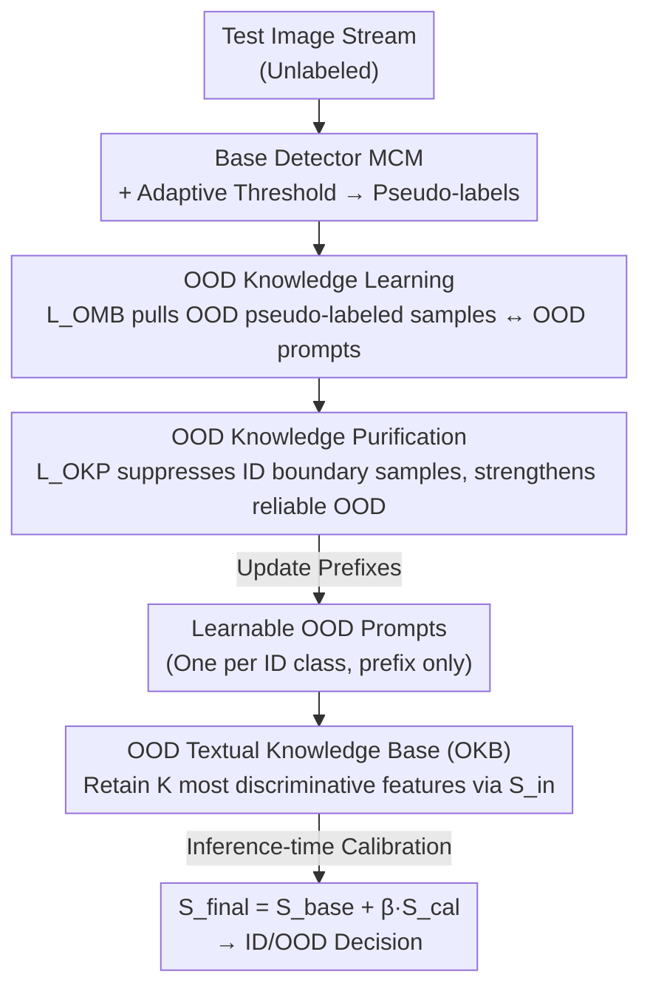

# TTL: Test-time Textual Learning for OOD Detection with Pretrained Vision-Language Models

**Conference**: CVPR 2026  
**arXiv**: [2604.15756](https://arxiv.org/abs/2604.15756)  
**Code**: https://github.com/figec/TTL (Available)  
**Area**: Multi-modal VLM / OOD Detection / Test-time Adaptation  
**Keywords**: OOD Detection, CLIP, Test-time Adaptation, Prompt Learning, Pseudo-label Purification

## TL;DR
Addressing the limitation where existing CLIP-based OOD detection relies on "fixed external OOD labels" that fail to cover the open world, TTL **updates only a set of learnable OOD textual prompts** on the test stream. It employs pseudo-labels to amplify OOD similarity, a purification loss to eliminate noise from ID boundary samples, and a textual knowledge base for cross-batch score calibration. TTL reduces the average FPR95 by 12.67% and improves AUROC by 3.94% across nine OOD datasets in two major benchmarks.

## Background & Motivation
**Background**: Vision-Language Models like CLIP are naturally suited for OOD detection due to image-text alignment. By encoding ID class names into templates ("a photo of a {class}") as textual features, OOD scores can be calculated via image-text cosine similarity (e.g., MCM). To enhance performance, one category of methods introduces **external OOD knowledge** by mining potential OOD labels from large-scale corpora (Neglabel, CSP) or learning negative prompts (CLIPN). Another category performs **Test-Time Adaptation (TTA)** to adapt the model online to the actual OOD distribution.

**Limitations of Prior Work**: External OOD labels are **finite and fixed**, whereas the real-world OOD semantic space is **open, infinite, and constantly evolving**. Fixed labels cannot represent the diverse and shifting OOD semantics in a test stream. AdaNeg, a state-of-the-art TTA method incorporating textual modalities, merely aligns fixed external labels with the actual test distribution; it fails when test samples fall outside these predefined semantic ranges (as shown in Figure 1c). Furthermore, naive online parameter update methods (like AdaND) are prone to catastrophic forgetting and unstable detection performance.

**Key Challenge**: Fixed textual semantic space $\leftrightarrow$ Open and infinite real OOD distribution. Existing methods focus on "adjusting visual features within a fixed textual space," leaving the adaptation potential of the textual side untapped.

**Goal**: Can **OOD textual semantics be learned directly from the test stream** (rather than fitting existing labels to the OOD distribution), thereby eliminating reliance on external OOD labels?

**Key Insight**: Inspired by Prompt Learning (CoOp), fine-tuning prompts can better align textual features with the actual data distribution. This work introduces this concept to test-time OOD detection for the first time: assigning a **learnable OOD prompt** to each ID class to learn textual representations online that are "close to real OOD and separated from ID."

**Core Idea**: Use a set of OOD textual prompts, dynamically learned and purified from the test stream, to replace fixed external OOD labels, achieving test-time OOD detection without predefined OOD categories.

## Method

### Overall Architecture
TTL takes an unlabeled test image stream as input and outputs ID/OOD decision scores. The image/text encoders of CLIP, the ID prompts, and the class name portions of the OOD prompts are all frozen. **Only the prefixes of $N$ learnable OOD prompts** (the "a photo of a" part) are updated, with each ID class corresponding to one OOD prompt.

The workflow consists of two phases. **Adaptation Phase**: A base detector (MCM) first scores each test sample and produces ID/OOD pseudo-labels using an adaptive threshold. **OOD Knowledge Learning** optimizes OOD prompts using these pseudo-labels, pulling images with OOD pseudo-labels toward the OOD prompts. To handle the inherent noise in pseudo-labels, **OOD Knowledge Purification** distinguishes "ID boundary samples misclassified as OOD" from "reliable OOD samples," suppressing the former and strengthening the latter. The learned high-quality OOD textual features are accumulated in an **OOD Textual Knowledge Base (OKB)** for cross-batch consistency. **Inference Phase**: The knowledge base is used to **calibrate** the scores from the base detector to produce the final OOD score.

### Key Designs

**1. Learnable OOD Prompts + OMB Loss: Growing OOD Semantics on the Textual Side**

To solve the issue of fixed labels not covering open OOD space, TTL introduces a learnable OOD prompt $u^{ood}_i$ for each ID class $c$. It is initialized with the same manual template as the ID prompt (inheriting CLIP's prior semantics), but **only the prefix is learnable while the class name and encoder are frozen**. This preserves generalization while moving textual features toward the real OOD distribution. Given a test sample $x$, the OOD probability is defined as the ratio of OOD prompt similarity to the total ID+OOD similarity:

$$p(x) = \frac{\sum_{k=1}^{N} s(x, t^{ood}_k)}{\sum_{j=1}^{N} s(x, t^{id}_j) + \sum_{j=1}^{N} s(x, t^{ood}_j)}, \quad s(x,t)=\exp(\cos(f(x),t)/\tau)$$

Optimization is performed using the **OOD-focused minority-balanced loss** $L_{OMB}$: it suppresses $p(x)$ for pseudo-labeled ID samples and elevates $p(x)$ for OOD samples. Normalization is applied using the ID/OOD ratios $\pi^+, \pi^-$ in the pseudo-labels to mitigate ID/OOD imbalance in the test stream:

$$L_{OMB} = -\frac{1}{\pi^+}\sum_{i:\hat y_i=1}\log(1-p(x_i)) - \frac{1}{\pi^-}\sum_{j:\hat y_j=0}\log p(x_j)$$

The essence of this step is to amplify the cosine similarity between "image features with OOD pseudo-labels" and "learnable OOD textual prompt features," allowing OOD prompts to absorb OOD knowledge online.

**2. OOD Knowledge Purification (OKP): Kicking out ID Boundary Samples**

Pseudo-labels are inevitably noisy. Samples misclassified as OOD are often **ID boundary samples**, which bias OOD prompts toward ID semantics; this bias amplifies with batch accumulation. Current TTA methods simply update based on base detector results without handling this noise. OKP operates by first gathering the set of OOD pseudo-labeled samples within a batch. It then uses their OOD probabilities $p(x)$ as scores and applies the same adaptive threshold $\theta$ (minimizing intra-class variance) to split the set into a high-confidence subset $S_h=\{i\mid p(x_i)>\theta\}$ and a low-confidence subset $S_\ell=\{j\mid p(x_j)\le\theta\}$ (the ID boundary samples). The purification loss simultaneously increases $p(x)$ for $S_h$ and decreases $p(x)$ for $S_\ell$:

$$L_{OKP} = -\Big(\frac{1}{|S_h|}\sum_{i\in S_h}p(x_i) - \frac{1}{|S_\ell|}\sum_{j\in S_\ell}p(x_j)\Big)$$

This reduces the similarity between ID boundary samples and OOD prompts while further increasing it for high-confidence OOD samples. The total objective is $L = L_{OMB} + \alpha\cdot L_{OKP}$, where $\alpha$ balances learning new OOD semantics and noise suppression.

**3. OOD Textual Knowledge Base (OKB) + Score Calibration: Stabilizing Detection Cross-Batch**

Prompts optimized on a single batch only capture local semantics and are unstable under distribution shift. OKB uses a **fixed capacity $K$** to accumulate high-quality OOD textual features across batches, preventing forgetting and expanding semantic coverage. The base is updated using a "latent OOD score"—the **minimum distance from an OOD textual feature to all ID prompt textual features**:

$$S_{in}(t^{ood}_i) = \min_c \big(-\cos(t^{id}_c, t^{ood}_i)\big)$$

When the base is full, only the $K$ features with the highest scores are retained, meaning the "furthest from ID and most discriminative" OOD prompts are kept. During inference, for an image feature $z$, a calibration score is calculated using features in the base $S_{cal}(x) = -\max_{j\in\{1..K\}}\cos(z, t^{ood}_j)$, which is then fused into the base detector:

$$S_{final}(x) = S_{base}(x) + \beta\cdot S_{cal}(x)$$

The distribution overlap between ID and OOD samples is significantly reduced from 24.67% to 2.76% (Figure 3).

### Loss & Training
- Total loss $L = L_{OMB} + \alpha L_{OKP}$, with $\alpha=0.5$.
- Backbone: CLIP ViT-B/16; Base detector: MCM. Only OOD prompt prefixes are optimized via AdamW (LR: 0.005).
- OKB capacity $K=2048$, batch size $B=64$, fusion coefficient $\beta$: ImageNet 0.0005 / CIFAR-100 0.006.

## Key Experimental Results

### Main Results
ImageNet-1k Benchmark (ID=ImageNet, OOD=iNaturalist/SUN/Places/Texture), average results:

| Method | Type | FPR95↓ | AUROC↑ |
|------|------|--------|--------|
| MCM | post-hoc | 42.77 | 90.76 |
| CSP (w/ Ext. Labels) | post-hoc | 17.51 | 95.76 |
| MoFE | Training-based | 20.02 | 94.89 |
| OODD | TTA | 23.64 | 94.09 |
| AdaNeg (w/ Ext. Labels) | TTA | 19.22 | 96.17 |
| **TTL (Ours)** | TTA | **12.46** | **97.29** |

Without using any external OOD labels, TTL achieves an average FPR95 of 12.46 and AUROC of 97.29, outperforming the sub-optimal AdaNeg by 6.76% in FPR95.

CIFAR-100 Benchmark (Average of six OOD datasets):

| Method | FPR95↓ | AUROC↑ |
|------|--------|--------|
| AdaND | 20.95 | 92.50 |
| AdaNeg | 40.52 | 88.97 |
| FA | 36.11 | 92.43 |
| **TTL (Ours)** | **2.36** | **99.26** |

### Ablation Study
Ablation of the three components (Left ImageNet-1k / Right CIFAR-100, FPR95 / AUROC):

| L_OMB | L_OKP | OKB | ImageNet FPR95 | ImageNet AUROC | CIFAR FPR95 | CIFAR AUROC |
|:---:|:---:|:---:|---|---|---|---|
| ✗ | ✗ | ✗ | 42.77 | 90.76 | 73.09 | 81.40 |
| ✓ | ✗ | ✗ | 30.56 | 92.54 | 14.40 | 96.25 |
| ✓ | ✓ | ✗ | 24.59 | 93.95 | 4.14 | 98.71 |
| ✓ | ✗ | ✓ | 18.40 | 95.63 | 5.23 | 98.86 |
| ✓ | ✓ | ✓ | **12.46** | **97.29** | **2.36** | **99.26** |

Comparison of OKB update strategies (Ours vs. Random/FIFO/Store-All):

| Strategy | ImageNet FPR95 | ImageNet AUROC | CIFAR FPR95 | CIFAR AUROC |
|------|---|---|---|---|
| RAND | 27.29 | 93.07 | 29.06 | 87.07 |
| FIFO | 14.69 | 96.40 | 8.15 | 98.78 |
| SA (All) | 23.19 | 94.27 | 27.33 | 88.04 |
| **Ours (Top-K Discriminative)** | **12.46** | **97.29** | **2.36** | **99.26** |

### Key Findings
- **All components are essential and complementary**: $L_{OMB}$ alone reduces ImageNet FPR95 from 42.77 to 30.56. Adding OKB or OKP further reduces it significantly; only together do they reach 12.46. OKP contributes ~1.03% to AUROC, highlighting its importance for robustness.
- **OKB update strategy is critical**: Retaining the $K$ features based on "maximum distance from ID text" significantly outperforms other strategies.
- **Insensitive to base detector**: Improvements are observed when using GL-MCM, Neglabel, or FA as bases.
- **Initialization with class names + manual template is optimal**: Initializing OOD prompts with ID class names guides the model to explore "ID semantic boundaries," reducing FPR95 on CIFAR from 45.23 (random init) to 2.36.

## Highlights & Insights
- **Shifting adaptation from visual to textual**: Unlike prior TTA methods that adjust visual features or store visual banks, TTL freezes visuals and learns textual prompts online—this is a clean paradigm shift.
- **Learnable prefixes with frozen class names**: This design allows OOD prompts to inherit CLIP's priors while being constrained to "near ID classes," preventing aimless learning.
- **Multipurpose adaptive thresholds**: Reusing the minimal intra-class variance threshold for both pseudo-labeling and OKP is highly efficient.
- **Transferable OKB retention criterion**: Using "minimum distance to ID text" as a discriminative filter for memory banks is a strategy that could be applied to other online tasks requiring OOD/negative sample maintenance.

## Limitations & Future Work
- **Dependence on base detector pseudo-label quality**: The process starts with MCM pseudo-labels. While OKP cleans noise, a systematic failure of the base detector on specific distributions will limit the performance ceiling.
- **Assumptions on test stream batches and distribution**: TTL was validated on batch sizes of 64 with relatively clustered streams. Robustness under single-sample streaming or extreme ID/OOD ratios remains to be fully explored.
- **One OOD prompt per ID class**: Overhead for $N$ learnable prompts and the OKB may increase in scenarios with massive label counts or open-vocabulary settings.
- **Linear score calibration**: $S_{final}=S_{base}+\beta S_{cal}$ uses a global $\beta$, which is sensitive to magnitude differences. Adaptive fusion might be more robust.

## Related Work & Insights
- **vs. AdaNeg**: Both use text, but AdaNeg relies on **fixed external OOD labels**. TTL **learns** OOD textual prompts directly from the stream, reducing FPR95 on ImageNet from 19.22 to 12.46 without external labels.
- **vs. OODD**: OODD stores **visual** features for calibration; TTL stores **textual** features and actively learns OOD semantics, proving that textual-side adaptation can be more effective.
- **vs. CoOp**: CoOp uses labeled ID data during training; TTL is the first to apply prompt learning to **unlabeled test-time** OOD detection to align with the real OOD distribution.

## Rating
- Novelty: ⭐⭐⭐⭐⭐ First to use test-time textual prompt learning for OOD detection, shifting the paradigm from visual adjustment to textual learning without external labels.
- Experimental Thoroughness: ⭐⭐⭐⭐⭐ Comprehensive coverage across nine datasets, three-component ablation, four update strategies, and sensitivity analysis of bases/hyperparameters.
- Writing Quality: ⭐⭐⭐⭐ Clear logical chain from motivation to calibration.
- Value: ⭐⭐⭐⭐⭐ Significant gains (FPR95 -12.67%, AUROC +3.94%) and strong practicality by outperforming methods that use external labels.

<!-- RELATED:START -->

## Related Papers

- [\[CVPR 2026\] STAR: Test-Time Adaptation Can Enhance Universal Prompt Learning for Vision-Language Models](star_test-time_adaptation_can_enhance_universal_prompt_learning_for_vision-langu.md)
- [\[CVPR 2026\] Activation Matters: Test-time Activated Negative Labels for OOD Detection with Vision-Language Models](activation_matters_test-time_activated_negative_labels_for_ood_detection_with_vi.md)
- [\[CVPR 2026\] Controllable Federated Prompt Learning at Test Time](controllable_federated_prompt_learning_at_test_time.md)
- [\[CVPR 2026\] Dynamic Logits Adjustment and Exploration for Test-Time Adaptation in Vision Language Models](dynamic_logits_adjustment_and_exploration_for_test-time_adaptation_in_vision_lan.md)
- [\[CVPR 2026\] UNI-OOD: Unified Object- and Image-level Out-of-Distribution Detection via Cross-Context Attentive Vision-Language Modeling](uni-ood_unified_object-_and_image-level_out-of-distribution_detection_via_cross-.md)

<!-- RELATED:END -->
