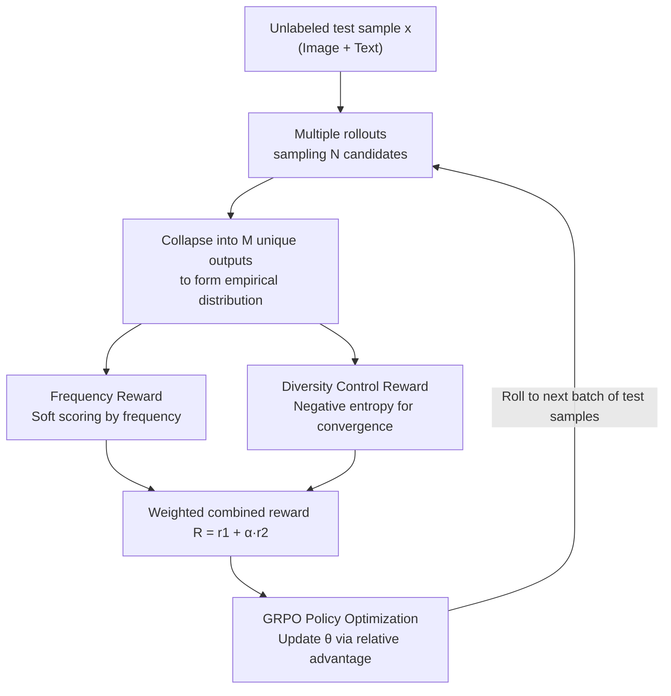

# TTRV: Test-Time Reinforcement Learning for Vision Language Models

**Conference**: CVPR 2026  
**Paper**: [CVF Open Access](https://openaccess.thecvf.com/content/CVPR2026/html/Singh_TTRV_Test-Time_Reinforcement_Learning_for_Vision_Language_Models_CVPR_2026_paper.html)  
**Area**: Multimodal VLM  
**Keywords**: Test-Time Reinforcement Learning, GRPO, Unsupervised Rewards, VLM Adaptation, Entropy Regularization

## TL;DR
TTRV enables off-the-shelf decoder-based VLMs to perform reinforcement learning directly on **unlabeled** test data during the inference stage. Driven by two self-supervised rewards—"frequency of the model's own output" and "entropy of the output distribution"—through GRPO, it achieves an average 24.6% improvement in object recognition and 10.0% in VQA across 16 datasets. It even pushes the ImageNet recognition of InternVL3-8B beyond GPT-4o.

## Background & Motivation

**Background**: Using RL for VLM post-training (RFT) has become a powerful tool for performance gains. The lineage of RLHF, DPO, and GRPO has proven that "rule-based rewards + policy optimization" can significantly enhance the recognition, reasoning, and alignment capabilities of VLMs (e.g., VLM-R1, Perception-R1, CLS-RL). However, this paradigm shares a common prerequisite: reward signals come from human annotations, and training occurs on a specifically partitioned training split.

**Limitations of Prior Work**: In the real world, natural "training/test set" divisions do not exist. Once trained, models are static; encountering new domains or tasks requires re-labeling data and fine-tuning, which is costly and reactive. This is contrary to how humans "learn by doing" in an environment, continuously refining skills from fuzzy, unlabeled experiences.

**Key Challenge**: While RL purports to "learn from experience," it actually relies on meticulously curated benchmarks and human labels—rewards cannot grow on their own from "wild, unlabeled" data streams. In other words, there is a lack of a mechanism that generates effective rewards at **test-time with zero labels**.

**Goal**: To create a framework for decoder-based VLMs (LMMs, such as InternVL, Qwen-VL) that can extract rewards and perform RL adaptation on-site using unlabeled test samples during inference.

**Key Insight**: The authors observed that when a model repeatedly samples the same image, the **more frequently an answer occurs, the more likely it is to be correct**; furthermore, a confident, converged model should have **low entropy** in its empirical output distribution. Neither of these quantities requires labels; they can be calculated purely from the model's own rollout statistics, making them naturally suitable as rewards.

**Core Idea**: Replace the "label reward" in GRPO with two self-supervised rewards: **Frequency Reward** (encouraging consistent, consensus answers) + **Diversity Control Reward** (using negative entropy to force distribution convergence). By sampling multiple times for each sample at test-time and updating the policy on the fly, a static VLM is transformed into a dynamic system capable of self-improvement.

## Method

### Overall Architecture
TTRV does not modify the VLM architecture or require any labels; it directly wraps GRPO around off-the-shelf VLMs (e.g., InternVL). The process is as follows: for each unlabeled test prompt $x$ (image + text), $N$ candidate responses $\{\hat{y}_1, \dots, \hat{y}_N\}$ are sampled using the current policy $\pi_\theta(\cdot|x)$. These responses are collapsed into $M$ **unique outputs** $\{\tilde{y}_1, \dots, \tilde{y}_M\}$, forming an empirical probability distribution. Two types of rewards are extracted from this distribution—frequency reward (scoring based on occurrence count) and diversity control reward (negative entropy, forcing distribution convergence). These are weighted into a final reward $R$, which is then converted into relative group advantages via GRPO to update the policy. This "sample → statistics → calculate reward → update" cycle rolls continuously on the test data, with the model adapting as it performs inference.

### Key Designs

**1. Frequency Reward: Replacing human labels with "answer frequency"**

Since there is no ground truth at test-time, it is impossible to calculate "correctness." The authors' alternative intuition is: when a model answers the same question repeatedly, the answer produced most consistently is more likely to be correct. Thus, after sampling $N$ responses for sample $x$, the empirical probability of each unique output $\tilde{y}_m$ is estimated:

$$p(\tilde{y}_m) = \frac{1}{N}\sum_{j=1}^{N}\mathbb{1}\{\hat{y}_j = \tilde{y}_m\}$$

Then the reward for a single response $\hat{y}_j$ is defined as the frequency of the unique output it belongs to:

$$r_1(\hat{y}_j) = \sum_{m=1}^{M} p(\tilde{y}_m)\cdot\mathbb{1}\{\hat{y}_j = \tilde{y}_m\}$$

The key is that it is **soft** rather than hard. Closest work like TTRL [74] uses best-of-N/majority voting, selecting only the most frequent one as a pseudo-label and discarding the rest. When the model is uncertain or the most frequent answer happens to be wrong, this provides a "confident but incorrect" strong misleading signal. TTRV, conversely, allows every response to receive a non-zero, graded reward according to its frequency, preserving uncertainty about minority reasoning paths. The authors liken this to a Bayesian approach—not collapsing to a point estimate, but shaping learning while carrying hypothetical uncertainty. Ablations (Table 3) show this soft reward consistently outperforms majority voting.

**2. Diversity Control Reward: Forcing output convergence with negative entropy**

With frequency rewards alone, the model might spread across multiple modes and fail to converge. The authors add an entropy-based regularization term: calculating the Shannon entropy of the empirical distribution:

$$H(P) = -\sum_{m=1}^{M} p(\tilde{y}_m)\log p(\tilde{y}_m)$$

The auxiliary reward is set to its negative value $r_2 = -H(P)$, punishing an excessively dispersed output distribution. Thus, the model explores diverse reasoning patterns in the early stages via the frequency reward, while in later stages, it is driven by negative entropy to aggregate probability mass onto stable, high-probability answers rather than scattering attention among redundant responses. Notably, "using only this term (removing the frequency reward)" is equivalent to moving TENT [58] entropy minimization to test-time. The full TTRV significantly outperforms this pure entropy minimization variant in ablations, showing that the two rewards are complementary and essential.

**3. Merged Reward + GRPO Relative Advantage: Converting self-supervision into stable updates**

The two rewards are weighted to form the final reward:

$$R(\hat{y}_j) = r_1(\hat{y}_j) + \alpha\, r_2$$

$\alpha$ is a hyperparameter balancing "convergence vs. diversity." The RL objective is to maximize the expected reward under the policy $\max_\theta \mathbb{E}_{y\sim\pi_\theta(\cdot|x)}[R(y)]$, which is optimized for decoder-based VLMs through standard autoregressive language modeling objectives by applying sample-level soft weighting of predicted tokens using the reward. However, instead of performing gradient ascent directly on the raw rewards, authors utilize GRPO to transform the rewards into relative advantages within the group:

$$A_i = \frac{r(x,y_i) - \mathrm{mean}_j(r(x,y_j))}{\mathrm{std}_j(r(x,y_j))}$$

with KL regularization to constrain deviation from the reference policy. This step shifts optimization from "absolute rewards" to "intra-group relative comparisons," which is what makes test-time RL stable and trainable without real labels or reliable reward scales—relative advantage is naturally insensitive to the absolute magnitude of rewards, focusing only on which is better within the group.

## Key Experimental Results

### Main Results
Using the InternVL series across three sizes and **randomly sampling only 20 test images** per dataset for TTRV, the average gains in object recognition (Table 1, 8 benchmarks) are substantial. InternVL3-8B is pushed to >99% on ImageNet, exceeding GPT-4o by approximately 2.3% on average.

| Model (Recognition, Mean of 8 Datasets) | Metric | Base | w/ TTRV | Gain |
|--------|------|------|----------|------|
| InternVL3-2B | Top-1 Acc | 62.03 | 94.99 | +32.95 |
| InternVL2.5-4B | Top-1 Acc | 70.47 | 82.34 | +11.88 |
| InternVL3-8B | Top-1 Acc | 66.74 | 95.71 | +28.97 |
| GPT-4o (Ref) | Top-1 Acc | 93.37 | — | — |

VQA (Table 2, 8 datasets) also shows consistent improvement, with maximum individual items like InternVL3-2B on AI2D reaching +28.07 and InternVL3-8B on MME reaching +29.75:

| Model (VQA, Mean of 8 Datasets) | Metric | Base | w/ TTRV | Gain |
|--------|------|------|----------|------|
| InternVL3-2B | Acc | 47.47 | 57.15 | +9.69 |
| InternVL2.5-4B | Acc | 66.37 | 69.40 | +3.03 |
| InternVL3-8B | Acc | 38.05 | 55.56 | +17.50 |

### Ablation Study
Table 3 decomposes the two rewards and compares them with TTRL's majority voting reward (using InternVL2.5-4B as the base, selected datasets):

| Configuration | AI2D | SEED | Relative to Base | Description |
|------|------|------|---------|------|
| Majority Voting (TTRL-style) | 47.52 | 58.37 | AI2D −4.03 | Hard pseudo-labels, results in degradation |
| w/o Frequency Reward (≈ TENT) | 52.66 | 58.87 | AI2D +1.11 | Only negative entropy, limited gain |
| w/o Diversity Reward | 53.06 | 59.27 | AI2D +1.51 | Only frequency, lacks convergence |
| Full TTRV (Freq + Diversity) | 61.09 | 61.14 | AI2D +9.54 | Complementary rewards yield optimal result |

### Key Findings
- **Hard pseudo-labels from majority voting can be harmful**: TTRL-style majority voting dropped by 4.03 on AI2D and 2.73 on CRPE relative to the base, while TTRV soft rewards showed massive gains. This proves that "preserving distribution uncertainty" is safer than "collapsing to a single point."
- **Both rewards are essential and complementary**: Either frequency or negative entropy alone provided only small gains (approx +1), while together they achieved +9.54 on AI2D, indicating that exploration (frequency) and convergence (negative entropy) must work together.
- **Extreme data efficiency**: Significant gains were achieved with only 20 images; even a **single random test sample** yielded improvements—ImageNet-A +4.61, ImageNet-R +5.47 (Table 6). This suggests TTRV is not fitting the data distribution but rather **awakening existing capabilities within the pre-trained model that were weakened by instruction tuning**.
- **Cross-dataset generalization**: Performing TTRV on Food101 but testing on DTD still showed large gains (Figure 3, e.g., +52.03), further supporting that it enhances underlying task capabilities rather than distribution adaptation.
- **Rewards must be meaningful**: Random rewards (Table 5) caused performance drops for InternVL (SEED −4.96), showing that TTRV's gains come from true signals rather than a "fake rewards also improve performance" phenomenon in GRPO.
- **Cross-model family**: The method consistently improves performance when switched to Qwen2.5-VL-3B (Table 7, Recognition/VQA both +2.6~+4.1), showing it is not bound to InternVL.
- **Failure cases**: When the base model is extremely weak (e.g., InternVL2.5-4B on Resisc45 base is only 23.44), poor rollout quality combined with GRPO instability caused TTRV to drop by 10.14—reward quality is constrained by base quality.

## Highlights & Insights
- **The "frequency as label" soft reward design is clever**: Instead of discarding minorities, it uses frequency-graded scoring to upgrade the hard decision of majority voting to a Bayesian-style soft supervision. This avoids misleading the model while preserving exploration—the most core "aha" moment of the paper.
- **A unified perspective connects two lines of work**: Removing the frequency reward reduces the method to TENT entropy minimization, and the full version outperforms the reduced one—explaining clearly "why frequency rewards are needed" in one sentence with clean logic.
- **The "recovery vs. adaptation" explanation is thought-provoking**: Gains from 20 images, a single image, or across datasets strongly imply that instruction tuning actually **suppresses** recognition capabilities from pre-training, which test-time RL then reactivates. This viewpoint could migrate to the broader proposition of "using unsupervised signals to repair side effects of instruction tuning."
- **Plug-and-play capability**: TTRV does not modify model architecture or require labels; any open-source decoder VLM can bootstrap with it, lowering the barrier to deployment.

## Limitations & Future Work
- **Lack of theoretical support**: The authors admit they only have empirical evidence that TTRV "enhances task capability rather than fitting distributions," with no theoretical explanation for why this happens.
- **Constrained by base model quality**: When the base is weak, rollouts are poor, and both frequency/entropy rewards are built on garbage outputs, potentially leading to performance drops (e.g., −10.14 on Resisc45). A safety mechanism for "when to exit/downweight" is missing.
- **Implicit assumptions on answer space for frequency rewards**: Discrete, enumerable outputs like recognition or multiple-choice questions are suitable for "counting frequency." However, for open-ended long-form text generation, unique outputs rarely overlap, and the frequency distribution would degenerate—the applicability to free-form generation tasks is questionable.
- **Test-time computational overhead**: Each sample requires $N$ rollouts and on-site updates. Latency analysis is relegated to the appendix and not fully discussed in the main text regarding deployment costs.
- **Directions for improvement**: Explore using base confidence or rollout consistency as a gate to automatically determine which samples to enable TTRV for and what $\alpha$ to use, preventing reverse optimization on low-quality samples.

## Related Work & Insights
- **vs TTRL [74]**: Both use "test-time RL + self-generated rewards," but TTRL targets LLMs and uses majority voting to pick a single pseudo-label (hard). TTRV expands to multimodal and uses frequency soft rewards + negative entropy regularization (soft + convergence), with ablations proving soft rewards are significantly superior.
- **vs TENT [58] / Entropy Minimization TTT**: TENT relies on entropy minimization of class probability distributions. Decoder VLMs output autoregressive token distributions over the entire vocabulary, lacking class-level distributions, making them difficult to apply directly. TTRV approximates this using the empirical output distribution, and the full version (with frequency rewards) beats pure entropy minimization.
- **vs TPT/DiffTPT/C-TPT and other prompt-level TTT**: These mainly focus on dual-encoder CLIP and tune prompts. TTRV directly targets decoder-style LMMs and updates model parameters, shifting the objective from matching to open recognition/reasoning.
- **vs VLM-R1 / Perception-R1 / CLS-RL and other RFT**: These still rely on curated training splits and label feedback. TTRV shifts the reward source from "human annotation" to "model self-rollout statistics at test-time," which is a paradigm shift.

## Rating
- Novelty: ⭐⭐⭐⭐⭐ The first test-time RL framework for decoder-style VLMs. The frequency + negative entropy unsupervised reward design is clean and effective.
- Experimental Thoroughness: ⭐⭐⭐⭐⭐ Extremely comprehensive ablations across 16 datasets, multiple model families, single-sample/cross-dataset/random reward/biased sampling, etc., and honest reporting of failure cases.
- Writing Quality: ⭐⭐⭐⭐ Motivation-Method-Ablation logic is clear with complete formulas. The "recovery vs adaptation" explanation is slightly speculative and lacks theory.
- Value: ⭐⭐⭐⭐⭐ Enables self-improvement for off-the-shelf VLMs during inference without labels and can exceed GPT-4o, providing inspiration for both actual deployment and "repairing instruction tuning side effects."

<!-- RELATED:START -->

## Related Papers

- [\[CVPR 2026\] TTL: Test-time Textual Learning for OOD Detection with Pretrained Vision-Language Models](ttl_test-time_textual_learning_for_ood_detection_with_pretrained_vision-language.md)
- [\[CVPR 2026\] STAR: Test-Time Adaptation Can Enhance Universal Prompt Learning for Vision-Language Models](star_test-time_adaptation_can_enhance_universal_prompt_learning_for_vision-langu.md)
- [\[CVPR 2026\] Controllable Federated Prompt Learning at Test Time](controllable_federated_prompt_learning_at_test_time.md)
- [\[CVPR 2026\] MoE-GRPO: Optimizing Mixture-of-Experts via Reinforcement Learning in Vision-Language Models](moe-grpo_optimizing_mixture-of-experts_via_reinforcement_learning_in_vision-lang.md)
- [\[CVPR 2026\] Dynamic Logits Adjustment and Exploration for Test-Time Adaptation in Vision Language Models](dynamic_logits_adjustment_and_exploration_for_test-time_adaptation_in_vision_lan.md)

<!-- RELATED:END -->
