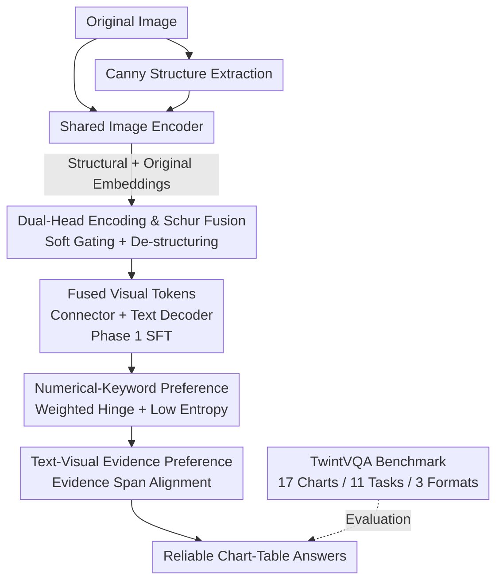

# Twin-T & TwintVQA: A Reliable Structure-Detail Separating VLM and a Comprehensive Benchmark for Chart and Table Tasks

**Conference**: CVPR 2026  
**Paper**: [CVF Open Access](https://openaccess.thecvf.com/content/CVPR2026/html/Bao_Twin-T__TwintVQA_A_Reliable_Structure-Detail_Separating_VLM_and_a_CVPR_2026_paper.html)  
**Code**: https://github.com/Samsara-1999/Twin-T-TwintVQA  
**Area**: Multimodal VLM  
**Keywords**: Chart Understanding, Table QA, Dual-Head Visual Encoding, Preference Learning, Evaluation Benchmark

## TL;DR
Twin-T explicitly separates and recombines chart structural cues (axes, grids, layout) and detail cues (values, legends, text) using a "dual-head image encoder + Schur-style fusion." It further enhances numerical and keyword fidelity via MINT preference learning. Accompanying this is the TwintVQA benchmark, covering 17 chart types, 11 tasks, and 3 formats. The 7B model outperforms GLM-4.5V-106B on mainstream chart-table leaderboards, approaching the performance of GPT-4o and Gemini-2.5-Pro.

## Background & Motivation

**Background**: Charts and tables are primary carriers of quantitative information. The demand for automated analysis has surged with the popularization of VLMs. Mainstream chart expert models (ChartLlama, ChartVLM, ChartAst, etc.) generally follow the universal recipe of a "single visual encoder + text decoder," relying on large-scale chart-table instruction tuning for performance gains.

**Limitations of Prior Work**: The authors identify two specific shortcomings. First, a single encoder **implicitly mixes** structural cues with fine-grained details, lacking chart-specific inductive biases. This makes it difficult to align global layouts (axes, grids, headers) with local numerical values, legends, and text regions. Existing works use auxiliary tokens, linear layers, routing modules, or cross-layer fusion blocks, but none **explicitly separate and control** the interaction between structure and detail. Second, chart data is numerically intensive, yet models are insensitive to numbers—they prioritize visual content but often misread specific values, leading to poor reliability in real-world scenarios.

**Key Challenge**: Human chart reading follows a "structure first, details later" approach—the first impression of a pie chart is the global skeleton of proportions, followed by color and specific numbers. Current VLMs blend these signals, failing to use structure as a scaffold for interpreting details or treating numbers as critical tokens requiring specialized fidelity.

**Goal**: To enable VLMs to **separate and then integrate** structure and details like humans, specifically ensuring the accuracy of numerical values and keywords at the generation end, while providing a sufficiently broad evaluation benchmark.

**Core Idea**: Replace the single encoder with "dual-head visual encoding (structure head + detail head) + Schur-style de-structuring fusion." Replace uniform preference optimization with MINT preference learning, which features "numerical/comparison word weighting + low entropy + text-visual evidence alignment."

## Method

### Overall Architecture
Twin-T is a chart-table expert VLM trained in two stages. The 1B version is based on Ovis2-1B, and the 7B version is based on Qwen2.5-VL-7B. **Phase 1 (Dual-Head Visual Encoding)** focuses on visual enhancement: in addition to the original image, a "structure map" is extracted using Canny edges. Both images pass through a shared, trainable image encoder to produce structural embeddings and original image embeddings, respectively. A **parameter-free Schur-style module** is inserted to softly gate and subtract structural directions from the original image embeddings, yielding pure detail embeddings. Structure and detail are then merged into fused visual tokens, fed into a connector and text decoder, and supervised via cross-entropy for instruction fine-tuning to adapt the VLM to this dual-head path. **Phase 2 (MINT Preference Learning)** focuses on generation enhancement: preference data (chosen vs. rejected responses) is constructed based on Phase 1 data. Only the text decoder is trained using MINT loss to simultaneously improve numerical fidelity, suppress the entropy of numerical token logits, and increase text-visual evidence alignment.

### Key Designs

**1. Dual-Head Visual Encoding and Schur-style Fusion: "Subtracting" Structure from Image Features**

To address the issue where single encoders implicitly mix structure and detail, Phase 1 explicitly constructs two signal paths. The structural path leverages the prior that edges, lines, and boxes are high-frequency components with larger pixel magnitudes. A structure map is extracted via Canny edges and passed with the original image through a shared encoder to obtain structural embeddings $E_{Stru}\in\mathbb{R}^{B\times N_{vis}\times D_{vis}}$ and image embeddings $E_{Img}$ (containing both).

Since Canny maps often contain pseudo-edges and background noise, the authors use the norm of the structural embedding to measure structural strength, passed through a **soft gate** rather than a hard threshold:

$$w_{Stru}[b,t]=\sigma\big(\alpha(\|E_{Stru}[b,t,:]\|_2-\tau)\big),\quad w_{Det}[b,t]=1-w_{Stru}[b,t]$$

where $\alpha$ is temperature and $\tau$ is the threshold. A sigmoid avoids instability from hard thresholds. Tokens with strong structures have gate values approaching 1. **Schur-style fusion** then projects out the structural direction from the image embedding. Using the structural unit direction $u$ and a retention factor $\gamma[b,t]=\frac{\|E_{Stru}\|_2^2}{\lambda+\|E_{Stru}\|_2^2}$ (where larger $\lambda$ retains less structure), the detail embedding is:

$$E_{Det}[b,t]=E_{Img}[b,t]-\underbrace{\gamma[b,t]\,w_{Stru}[b,t]^2}_{\text{Adaptive Subtraction}}\,\mathrm{proj}\big(E_{Img}[b,t]\big)$$

Final recombination: $E_{fuse}=w_{Det}\,E_{Det}+w_{Stru}\,E_{Stru}$. The "adaptive subtraction" ensures that structural leakage is suppressed only at highly structured positions, shifting the representation toward detail, while detail-dominant positions remain largely unchanged. Ablations show that removing the dual-head encoder drops performance by ~5% Overall, acting as the primary contributor in Phase 1.

**2. Numerical-Keyword Preference: Concentrating Gradients on Numbers and Comparison Words**

Phase 1 models still struggle with numerical tokens and comparison words. Chart-table tasks revolve around numbers—reading values, comparing sizes, calculating ratios, and identifying trends. Standard preference learning treats all tokens equally, diluting the optimization of numerical accuracy with stylistic or filler words. MINT's first component concentrates training on numerical values and comparison keywords (e.g., *greater*, *smaller*).

Using masks $M_{num},M_{key}\in\{0,1\}$, per-token weights are constructed: $W[b,t]=\mathrm{norm}(1+M_{num}[b,t]+M_{key}[b,t])$. A weighted hinge contrastive loss is applied to these "gold tokens" to force the logits of chosen responses to be higher than rejected ones:

$$L_{NK}=\frac{1}{N}\sum_{t=0}^{N} W[b,t]\big[-(\ell^{ch}_{[b,t]}-\ell^{rj}_{[b,t]})\big]_{+}$$

To stabilize numerical generation further, a low-entropy regularization $L_{Ent}=\frac{1}{|P|}\sum_{t\in P}H_{[b,t]}$ is added at numerical positions $P$, reducing output entropy and making generation more confident. The combination is $L_{NKp}=L_{NK}+L_{Ent}$.

**3. Text-Visual Evidence Preference: Anchoring Answers to Visual Evidence**

To ensure reliability, the model should expose its reasoning evidence and ensure it matches visual facts. Evidence spans in responses are wrapped in `<evidence>...</evidence>`. For example, if a chosen response includes `<evidence>(0.52-0.5)/0.5=4%</evidence>`, whereas the rejected one uses a wrong value, the model is penalized.

The cosine similarity matrix $Mat_{txt\text{-}vis}$ is computed between text tokens and visual tokens. For each evidence text token, the maximum similarity across all visual tokens is averaged to get the span's text-visual match score $\mu$. A hinge loss is constructed based on the difference between chosen and rejected match scores:

$$L_{TV}=\frac{1}{B}\sum_{b=1}^{B}\big[-\big(\mu(Mat^{ch}_{txt\text{-}vis}[b])-\mu(Mat^{rj}_{txt\text{-}vis}[b])\big)\big]_{+}$$

This rewards models whose evidence is more visually grounded. The final MINT loss is $L_{MINT}=L_{NKp}+L_{TV}$.

**4. TwintVQA: A Comprehensive Chart-Table Benchmark**

Existing benchmarks lack task diversity and chart types, often relying on short answers. TwintVQA contains 4,941 questions across **17 chart/table types** and **11 task categories** (Table→LaTeX, Chart→Python, Analysis/Summary for Image/LaTeX/Python, Multiple Choice, Numerical QA, Open QA), utilizing **3 data formats** (Image, LaTeX, Python). Every QA is scored [0, 1] by GPT-4o-Mini. Training data includes ~200K QA pairs generated via GPT-4o from 40K web-collected images, while the benchmark uses ~5K manually filtered images from arXiv and the web with no overlap.

### Loss & Training
Phase 1 uses cross-entropy to adapt the model to the fused visual tokens $E_{fuse}$ for generating target responses. Phase 2 **trains only the text decoder** using $L_{MINT}=L_{NK}+L_{Ent}+L_{TV}$ for preference optimization. All experiments were conducted on NVIDIA A800.

## Key Experimental Results

### Main Results
Comparison across 10 benchmarks (AI2D, CharXivD/R, ChartMimic, ChartQA, LogicVista, OCRVQA, SEEDBench2, TableVQA, TwintVQA). "Overall" is the aggregate score:

| Model | Params | TwintVQA↑ | Overall↑ | Note |
|-------|--------|-----------|----------|------|
| Twin-T-7B | 7B | **70.20** | **719.94** | Open-source SOTA, exceeds GLM-4.5V-106B |
| Twin-T-1B | 1B | 58.79 | 576.20 | Leading small model |
| GLM-4.5V-106B | 106B | 60.62 | 667.08 | Outperformed by 7B |
| GPT-4o | API | 67.06 | 714.89 | 7B is competitive |
| Gemini-2.5-Pro | API | 63.58 | 724.26 | Slightly higher than 7B |
| Qwen2.5-VL-7B (Base) | 7B | 51.36 | 631.09 | 7B achieves +88.85 gain |

Twin-T-7B achieves the strongest open-source results on several benchmarks but lags in OCR-heavy and code reconstruction (ChartMimic, C2P) tasks due to smaller parameter counts compared to proprietary models.

### Ablation Study
Ablation of phases (7B, Overall) and components:

| Configuration | Overall↑ | Key Metric Change | Note |
|---------------|----------|-------------------|------|
| Full (7B) | 719.94 | NK Acc 90.60 / Entropy 13.40 / Match 95.80 | Complete model |
| w/o Stage 2 | 675.05 ▼44.89 | — | No preference learning |
| w/o Stage 1 | 672.52 ▼47.42 | TwintVQA ▼13.15 | No dual-head visual |
| w/o Dual-head (S1) | 642.28 ▼32.77 | — | Biggest Phase 1 driver |
| w/o Structure gating (S1) | 656.98 ▼18.07 | — | Soft gating ~+2.7% |
| w/o Schur fusion (S1) | 660.26 ▼14.79 | — | Fusion ~+2.2% |
| w/o Num-Key (S2) | 692.50 ▼27.44 | NK Acc ▼5.90 | Most critical for Phase 2 |
| w/o Low-Entropy (S2) | 702.36 ▼17.58 | Entropy ▲3.80 | Distribution widens |
| w/o Txt-Vis (S2) | 695.65 ▼24.29 | Match ▼1.70 | Reduced evidence alignment |

### Key Findings
- **Dual-head encoding is the engine of Phase 1**: Removing it causes the largest drop, proving that separating structure and detail is inherently valuable.
- **Numerical-keyword preference is vital for Phase 2**: It significantly boosts NK Accuracy. Low-entropy regularization effectively tightens the numerical distribution (entropy 13.4% vs 17.2%).
- **Canny is the optimal structural extractor**: It offers the best performance-speed trade-off with negligible inference overhead.
- **Weaknesses are explainable**: C2P (Chart-to-Python) tasks are difficult for all models as they require precise program reconstruction and code-alignment supervision, which exceeds current data/parameter scales.

## Highlights & Insights
- **Translating human perception into explicit feature decomposition**: The intuition of "global structure first" is implemented via Canny maps, soft gates, and Schur projections, making it a computable and ablatable mechanism.
- **Clever Schur-style "Adaptive Subtraction"**: By using $\gamma\cdot w_{Stru}^2$, the model selectively removes structural noise only at high-structure sites, preventing broad subtraction from damaging detail representing.
- **Token-level preference weighting**: Concentrating gradients on digits and comparison words is a strategy applicable to any task where specific tokens (e.g., math, code) determine correctness.
- **Anti-hallucination via evidence spans**: Wrapping reasoning in `<evidence>` and optimizing visual alignment transforms "groundedness" into a loss objective.

## Limitations & Future Work
- **Performance Gaps**: OCR-heavy and code reconstruction (C2P) tasks still lag due to parameter and data scale limitations.
- **Structural Prior Dependency**: The structural head relies on the Canny high-frequency assumption. It may struggle with low-contrast, hand-drawn, or extremely noisy non-standard layouts.
- **Bias in Evaluation**: Heavy reliance on GPT-4o for data generation and GPT-4o-Mini for scoring may introduce evaluation biases.
- **Future Directions**: Adding code-alignment supervision; transitioning from static Canny to learnable/adaptive structural extractors; introducing objective metrics like numerical exact-match.

## Related Work & Insights
- **vs. General VLMs**: While models like Qwen-VL rely on implicit mixing, Twin-T's explicit separation provides a gain of +88.85 over its 7B base, proving that architectural induction bias is essential.
- **vs. Chart Expert Models**: Unlike ChartLlama or ChartAst which use uniform pre-training, Twin-T introduces task-aware structural supervision and a significantly broader benchmark.
- **vs. Standard Preference Learning (DPO)**: While DPO treats all tokens equally, MINT shifts optimization toward factual correctness via token-level weighting and reasoning alignment.

## Rating
- Novelty: ⭐⭐⭐⭐ The combination of dual-head structural separation and token-level numerical preference is both novel and self-consistent.
- Experimental Thoroughness: ⭐⭐⭐⭐⭐ 10 benchmarks, multi-dimensional grouping, and extensive sensitivity analysis for $\alpha/\tau/\lambda$.
- Writing Quality: ⭐⭐⭐⭐ Clear motivation-method-formula linkage; formulas and diagrams are well-structured.
- Value: ⭐⭐⭐⭐ Provides an open-source model (1B/7B) and a comprehensive benchmark, offering high utility to the document understanding community.

<!-- RELATED:START -->

## Related Papers

- [\[CVPR 2026\] Is your VLM Sky-Ready? A Comprehensive Spatial Intelligence Benchmark for UAV Navigation](is_your_vlm_sky-ready_a_comprehensive_spatial_intelligence_benchmark_for_uav_nav.md)
- [\[CVPR 2026\] Beyond Graph Model: Reliable VLM Fine-Tuning via Random Graph Adapter](beyond_graph_model_reliable_vlm_fine-tuning_via_random_graph_adapter.md)
- [\[CVPR 2026\] PIX-TAB: Efficient PIXel-Precise TABle Structure Recognition Approach with Speculative Decoding and Region-Based Image Segmentation](pix-tab_efficient_pixel-precise_table_structure_recognition_approach_with_specul.md)
- [\[CVPR 2026\] PAI-Bench: A Comprehensive Benchmark for Physical AI](pai-bench_a_comprehensive_benchmark_for_physical_ai.md)
- [\[CVPR 2026\] ENC-Bench: A Benchmark for Evaluating MLLMs in Electronic Navigational Chart Understanding](enc-bench_a_benchmark_for_evaluating_multimodal_large_language_models_in_electro.md)

<!-- RELATED:END -->
