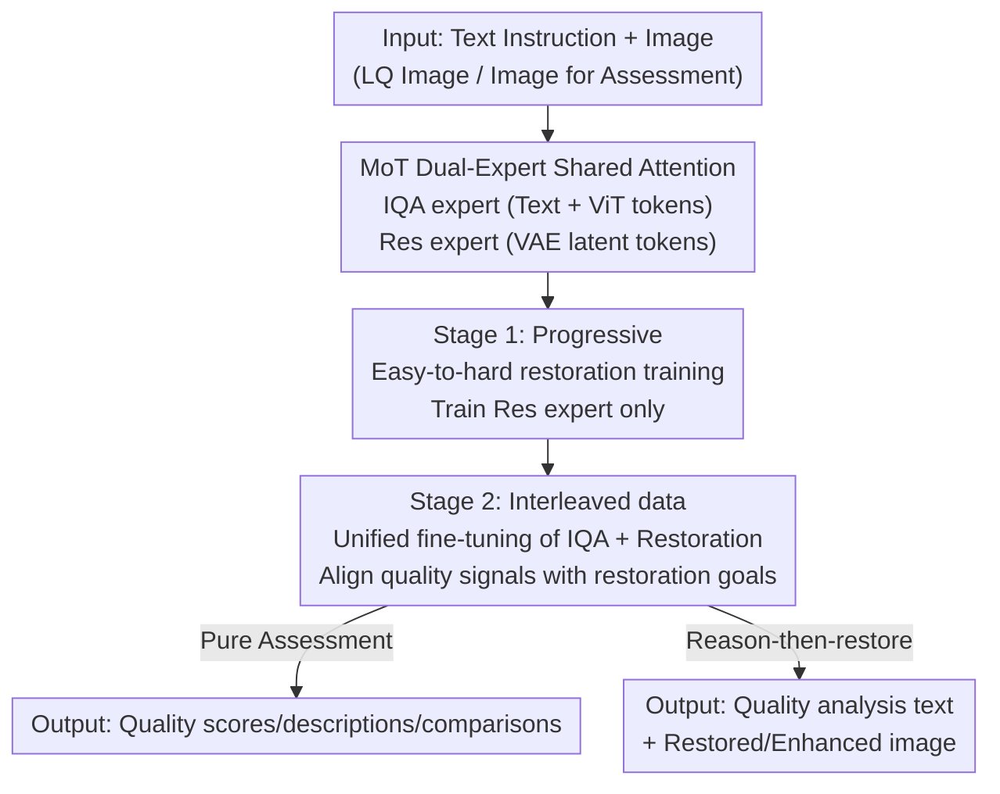

# UARE: A Unified Vision-Language Model for Image Quality Assessment, Restoration, and Enhancement

**Conference**: CVPR 2026  
**Paper**: [CVF Open Access](https://openaccess.thecvf.com/content/CVPR2026/html/Li_UARE_A_Unified_Vision-Language_Model_for_Image_Quality_Assessment_Restoration_CVPR_2026_paper.html)  
**Area**: Multimodal VLM  
**Keywords**: Unified Vision-Language Model, Image Quality Assessment, Image Restoration, MoT Experts, reason-then-restore  

## TL;DR
UARE integrates Image Quality Assessment (IQA), restoration, and enhancement into a single Mixture-of-Transformers (MoT) based vision-language model. By employing a two-stage training strategy with interleaved "reason-then-restore" data, the authors systematically validate the hypothesis that "explicit quality analysis improves restoration results" for the first time. The model achieves competitive performance across SR, multi-degradation restoration, and IQA tasks.

## Background & Motivation

**Background**: Image Quality Assessment (IQA, predicting human-perceived quality via scalar scores or natural language) and image restoration/enhancement (recovering clean images from degraded ones) are two long-standing parallel tracks in low-level vision. Recently, MLLMs have entered IQA providing fine-grained descriptions, while the restoration side has seen all-in-one models like PromptIR, diffusion priors, and FoundIR.

**Limitations of Prior Work**: These two tracks remain almost entirely decoupled. IQA methods provide scores or descriptions without considering the needs of downstream restoration; restoration methods focus on image repair without leveraging the quality context provided by IQA. Consequently, fine-grained descriptions generated by MLLMs (e.g., "where the blur is," "noise levels") are rarely utilized by restoration models.

**Key Challenge**: IQA and restoration are logically complementary (assessment guides restoration toward human preference, while restoration calibrates assessment). However, they possess fundamentally different objective functions (maximum likelihood for text prediction vs. regression for image generation). Simply merging them into one model often leads to objective conflicts and mutual performance degradation.

**Key Insight**: The authors draw an analogy from recent unified understanding-generation models (Chameleon, Transfusion, Bagel), which prove that "stronger understanding improves generation." IQA is to restoration what understanding is to generation. Therefore, by treating IQA as "understanding" and restoration as "generation" within a unified architecture, IQA should theoretically benefit restoration.

**Core Idea**: A MoT dual-expert VLM is used to simultaneously support IQA and restoration. Through interleaved training data following a "first analyze quality, then execute restoration" logic, the goals are aligned, allowing quality assessment to act as a guiding signal for restoration.

## Method

### Overall Architecture
UARE utilizes Bagel’s MoT architecture as its backbone, featuring two full-capacity transformer experts: the **IQA expert** receives text tokens (from a text tokenizer) and understanding-side visual tokens (from a ViT encoder) to handle scoring, description, and comparison; the **Res expert** receives VAE latent tokens to handle image restoration. Both experts operate on a single interleaved token stream and share self-attention in every block. This shared context maintains cross-modal alignment, while separated expert parameters reduce gradient interference between tasks.

Training is divided into two stages: Stage 1 trains only the Res expert using a progressive curriculum (single degradation → multi-degradation → high-order degradation) to convert generative capacity into restoration capability. Stage 2 thaws the entire model (except the VAE and text tokenizer) for joint fine-tuning on IQA data and interleaved "analyze-restore" data. At inference, the model supports an "assessment-guided restoration" flow: it first outputs a quality analysis text, and the Res expert then updates VAE latents conditioned on this analysis via shared self-attention, eventually outputting both the analysis and the restored image.

### Key Designs

**1. MoT Dual-Expert + Shared Self-Attention: Resolving Task Conflict**
The IQA objective is text prediction (auto-regressive MLE), while restoration is image generation (flow-matching regression). Their gradient directions conflict, causing performance drops in a single network. UARE resolves this using Mixture-of-Transformers: the IQA and Res experts maintain independent parameters for their respective tokens but **share self-attention across the interleaved token stream in every block**. This allows cross-modal information (e.g., "this image has noise") to flow to the restoration side while preventing parameter interference.

**2. Progressive Easy-to-Hard Restoration Training (Stage 1): Smoothing Capacity Transfer**
Directly training on complex high-order degradations makes it difficult to transfer the generative power of a pre-trained Bagel model. Stage 1 freezes other components and focuses solely on the Res expert with a difficulty curriculum: starting with single degradations (FoundIR), moving to multi-degradation combinations, and finally high-order degradations (RealESRGAN/APISR pipeline). This curriculum smoothly adapts the base generative capacity into a robust restoration capability across various degradation types and intensities.

**3. Interleaved "Analyze-Restore" Data + Unified Fine-tuning (Stage 2): IQA as Guidance**
To ensure IQA benefits restoration, the authors construct **interleaved image-text data**. For existing LQ-HQ pairs, instructions are generated to prompt the model to "briefly analyze defects, list processing steps, and then return the improved image." The output follows a four-step structure: (1) user intent, (2) current quality analysis, (3) enhancement plan, and (4) expected outcome. This forces the Res expert to condition on the IQA expert's output, explicitly linking "quality analysis" to "restoration action."

**4. Reason-then-restore Inference: Diagnosis Before Repair**
During inference, UARE follows an analysis-then-restore paradigm. Given a "analyze and enhance" instruction, the IQA expert generates a compact quality analysis. These analysis tokens remain in the shared stream, providing a condition for the Res expert as it updates the VAE latents. Ablations show that this "in-house" analysis (MUSIQ 69.67) performs better than using external model suggestions (64.43), as the IQA and restoration capabilities are intrinsically aligned within the same model.

### Loss & Training
Both sample types consist of a condition (instruction + image) and a response. Text targets use auto-regressive maximum likelihood loss on response tokens:

$$\mathcal{L}_{AR}(\theta) = -\mathbb{E}_{\mathbf{x}\sim \mathcal{D}_\text{IQA}}\left[\sum_{i=l_\text{con}}^{l-1} \log P_{\theta}(\mathbf{x}_{i+1}\mid \mathbf{x}_1,\dots,\mathbf{x}_i)\right]$$

Image restoration uses a rectified flow objective, $\mathbf{z}_t = t\,\mathbf{x}_\text{res} + (1-t)\,\mathbf{z}_0$:

$$\mathcal{L}_{RF}(\theta) = \mathbb{E}_{\mathbf{x}\sim \mathcal{D}_\text{res},\,\mathbf{z}_0\sim \mathcal{N}(0,\mathbf{I})}\left[\|v_{\theta}(\mathbf{z}_t, t\mid \mathbf{x}_con) - (\mathbf{x}_\text{res}-\mathbf{z}_0)\|^2\right]$$

Stage 1 uses $\mathcal{L}_{s1}=\mathcal{L}_{RF}$. Stage 2 uses $\mathcal{L}_{s2}=\mathcal{L}_{RF}+\lambda\mathcal{L}_{AR}$ with $\lambda=0.25$. The base is Bagel (ViT encoder + FLUX VAE). Training utilized 64×H20 GPUs for approximately one week.

## Key Experimental Results

### Main Results: 4× Super-Resolution (RealSR)
UARE dominates in perceptual metrics, though fidelity metrics (PSNR/SSIM) are slightly lower—a standard trade-off in generative restoration.

| Method | PSNR↑ | LPIPS↓ | MUSIQ↑ | MANIQA↑ | TOPIQ↑ |
|------|-------|--------|--------|---------|--------|
| OSEDiff | 23.07 | 0.2941 | 68.95 | 0.4876 | 0.6441 |
| S3Diff | 23.16 | 0.2748 | 67.57 | 0.4677 | 0.6301 |
| PURE | 21.31 | 0.3859 | 66.57 | 0.4829 | 0.6301 |
| **Ours** | 21.38 | 0.3095 | **69.67** | **0.5260** | **0.6796** |

### IQA Scoring (PLCC / SRCC)
UARE's pure IQA capability significantly outperforms the previous SOTA, Q-Insight, particularly on KADID and CSIQ.

| Method | SPAQ | KADID | CSIQ |
|------|-------|------|-------|
| Q-Align | 0.886 / 0.887 | 0.674 / 0.684 | 0.671 / 0.737 |
| Q-Insight | 0.913 / 0.907 | 0.757 / 0.765 | 0.768 / 0.740 |
| **Ours** | 0.902 / 0.898 | **0.878 / 0.873** | **0.930 / 0.915** |

### Ablation Study: Two-Stage Training (RealSR)

| Configuration | PSNR↑ | LPIPS↓ | MUSIQ↑ | MANIQA↑ | Note |
|------|-------|--------|--------|---------|------|
| Base Bagel | 21.00 | 0.5906 | 29.66 | 0.1792 | Base model, no restoration ability |
| + high-order deg. | 22.74 | 0.2603 | 60.21 | 0.4082 | Stage 1 final; jump in perception |
| **Ours** | 21.38 | 0.3095 | **69.67** | **0.5260** | After Stage 2 IQA joint tuning |

### Key Findings
- **IQA Joint Tuning (Stage 2) is Pivotal**: Moving from Stage 1 to Stage 2 saw MUSIQ increase from 60.21 to 69.67 and MANIQA from 0.4082 to 0.5260, providing direct evidence that IQA data improves perceptual restoration quality.
- **Progressive Curriculum vs. One-Stage**: A single-stage mixed training yields higher PSNR but significantly lower perceptual scores (MUSIQ 57.50), proving the curriculum is essential for balancing fidelity and perception.
- **Intrinsic Alignment > External Planning**: Self-generated analysis (69.67) outperforms using Q-Insight suggestions (64.43). The advantage lies in the alignment of understanding and execution within the same model.

## Highlights & Insights
- **Mapping Understanding-Generation success to Low-Level Vision**: Framing "IQA as Understanding" and "Restoration as Generation" provides a clear theoretical path for unifying previously siloed tasks.
- **Structural Text as Supervision**: The four-step text structure (Intent → Analysis → Plan → Outcome) transforms abstract logic into a concrete training signal.
- **MoT for Objective Conflict**: The "separate but connected" design (separate parameters, shared attention) is an elegant paradigm for models handling heterogeneous targets (e.g., classification + generation).
- **Alignment vs. Raw Capability**: The finding that self-produced guidance beats external "stronger" models highlights that internal alignment is often more critical than the quality of the prompt itself.

## Limitations & Future Work
- **Fidelity Sacrifice**: Lower PSNR/SSIM makes the model less suitable for pixel-perfect applications like medical imaging.
- **Computational Barrier**: Sustaining a heavy VLM (Bagel + FLUX VAE) requires significant resources (64×H20).
- **Causality of IQA Benefit**: While the correlation is proven, it remains unclear if the gain stems from semantic guidance or simply more high-quality image-text data.
- **Future Directions**: Introducing adjustable guidance scales for fidelity/perception trade-offs or using RL to optimize IQA analysis based on restoration rewards.

## Related Work & Insights
- **vs. Q-Insight / DeQA**: These are assessment-only; UARE embeds IQA into the restoration loop and actually outperforms them on pure IQA benchmarks.
- **vs. FoundIR / PromptIR**: These focus on all-in-one restoration without IQA capability.
- **vs. Bagel**: UARE is the first systematic application of the "understanding boosts generation" VLM paradigm to the IQA and restoration domain.

## Rating
- Novelty: ⭐⭐⭐⭐⭐ First VLM to unify IQA, restoration, and enhancement with a systematic "understanding feeds generation" framework.
- Experimental Thoroughness: ⭐⭐⭐⭐ Broad coverage across three task types; however, causality analysis for IQA benefits could be deeper.
- Writing Quality: ⭐⭐⭐⭐ Clear motivation, well-described data flows, and focused ablations.
- Value: ⭐⭐⭐⭐⭐ High potential for guiding future unified low-level vision models.

<!-- RELATED:START -->

## Related Papers

- [\[CVPR 2026\] Probabilistic Prompt Adaptation for Unified Image Aesthetics and Quality Assessment](probabilistic_prompt_adaptation_for_unified_image_aesthetics_and_quality_assessm.md)
- [\[CVPR 2026\] R4-CGQA: Retrieval-based Vision Language Models for Computer Graphics Image Quality Assessment](r4-cgqa_retrieval-based_vision_language_models_for_computer_graphics_image_quali.md)
- [\[ICLR 2026\] Self-Evolving Vision-Language Models for Image Quality Assessment via Voting and Ranking](../../ICLR2026/multimodal_vlm/self-evolving_vision-language_models_for_image_quality_assessment_via_voting_and.md)
- [\[ICLR 2026\] Grounding-IQA: Grounding Multimodal Language Models for Image Quality Assessment](../../ICLR2026/multimodal_vlm/grounding-iqa_grounding_multimodal_language_model_for_image_quality_assessment.md)
- [\[CVPR 2026\] VITAL: Vision-Encoder-centered Pre-training for LMMs in Visual Quality Assessment](vital_vision-encoder-centered_pre-training_for_lmms_in_visual_quality_assessment.md)

<!-- RELATED:END -->
