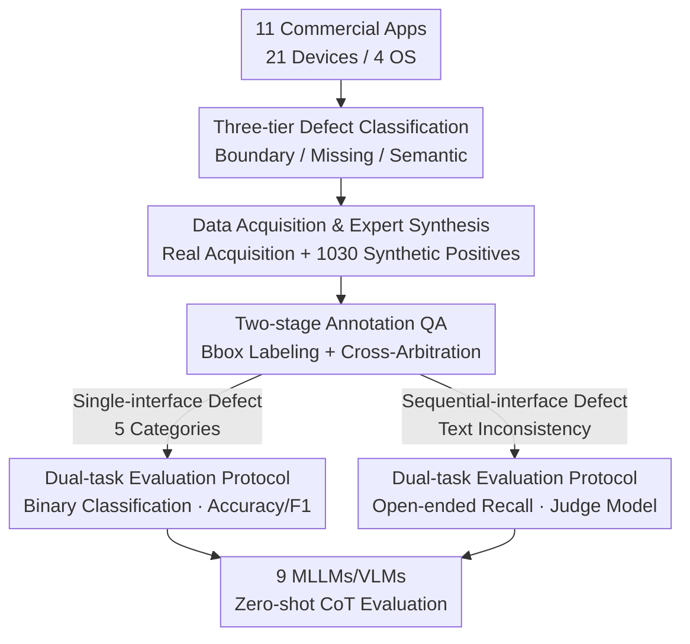

# UI-Lens: Assessing General MLLMs' Potential to Automate UI Display Quality Assurance

**Conference**: CVPR 2026  
**Paper**: [CVF Open Access](https://openaccess.thecvf.com/content/CVPR2026/html/Xiang_UI-Lens_Assessing_General_MLLMs_Potential_to_Automate_UI_Display_Quality_CVPR_2026_paper.html)  
**Code**: Dataset available (paper states both Chinese and English versions will be open-sourced; check the original text for links)  
**Area**: Multimodal VLM  
**Keywords**: UI defect detection, MLLM benchmark, fine-grained boundary awareness, cross-interface semantic consistency, commercial App interfaces

## TL;DR
UI-Lens constructs a multilingual UI display defect detection benchmark for real-world commercial Apps (4,759 Chinese interfaces + 3,392 English interfaces, with 6 defect categories and expert naming). Systematic evaluation of 9 mainstream MLLMs/VLMs reveals that they perform nearly identically to random guessing on fine-grained boundary defects (Text Overflow F1 only 22.19%) and cross-interface semantic consistency (F1 only 11.44%), exposing a fundamental shortcoming: current models "recognize what the object is but ignore how it is presented."

## Background & Motivation
**Background**: General MLLMs/VLMs have become highly capable at "understanding normal UIs"—they can identify controls, read text, and infer interface functions, performing well in OCR and UI understanding tasks. Consequently, the industry aims to apply them to UI quality assurance (QA) to automatically replace human manual checks for rendering anomalies.

**Limitations of Prior Work**: However, "understanding a normal interface" and "detecting a broken interface" are different. The paper points out a systematic bias in MLLMs—they are trained to be "object-centric," focusing on "what the object is" rather than "how it is presented and its current state." Display defects fall into the latter category: problems like text overflow, cropped content, or overlapping containers often differ by only a few pixels or require comparisons across multiple screens. Most existing MLLM research is conducted on clean pages for OCR or UI understanding, entirely bypassing this scenario.

**Key Challenge**: There is a lack of a benchmark capable of eliciting the true capabilities of models. Existing UI defect evaluations are mostly based on outdated open-source datasets like RICO, which feature simple interaction logic and obsolete styles, failing to capture the diverse display defects in modern commercial-grade Apps. Furthermore, real defects are naturally scarce (high-quality commercial Apps rarely have bugs), making it difficult to construct large-scale evaluation sets. Thus, whether foundation models can detect real UI display defects remains unknown.

**Goal**: Transform this unknown into a quantifiable conclusion by: (1) defining a fine-grained task system covering real display defects; (2) creating a high-density, expert-annotated, and realistic evaluation set; (3) systematically evaluating mainstream models using a unified protocol to locate exactly where they fail.

**Key Insight**: The authors argue that display defect detection requires three capabilities—fine-grained element boundary understanding, missing content awareness, and semantic consistency judgment—all of which are blind spots for object-centric models. Rather than increasing scale, it is better to build a "high-difficulty, expert-refined, 1:1 positive-negative balanced" diagnostic benchmark to test the limits of SOTA models.

**Core Idea**: Use "expert synthesis + real-world acquisition" to compensate for the scarcity of defect samples, paired with a three-tier defect classification and a dual-task evaluation protocol to systematically quantify the neglected dimension of UI display QA for the first time.

## Method
As a benchmark paper, the core of the "Method" lies in **how data is constructed** and **how evaluation is designed**, rather than proposing a new model. The process is divided into four steps: defining a three-tier defect classification system, gathering realistic samples via "real acquisition + expert synthesis," performing two-stage annotation quality control, and finally evaluating 9 models using dual-task protocols designed for single and sequential interfaces.

### Overall Architecture

The inputs are interface screenshots collected from real commercial Apps (and supplemented by experts), while the outputs are Accuracy and F1 scores along with error attribution for 9 mainstream models across 6 defect types. The intermediate stages include classification definition, data construction, annotation QA, and dual-task evaluation.

### Key Designs

**1. Three-tier Defect Classification: Decomposing "Broken UI" into Different Capabilities**

Instead of treating defects as a vague "anomaly," the authors organized 6 sub-categories into three major classes based on the required capabilities. **Element-boundary** defects include Text Overflow, Cropped Content, and Container Overlap, where defect areas are subtle and require analyzing spatial relationships between boundaries; **Content-missing** defects include Undisplayed Content and Abnormal Text Ellipsis, testing whether the model can perceive completeness; **Semantic-inconsistency** covers only Text Inconsistency, which typically occurs in sequential scenarios and requires cross-page context understanding (e.g., checking price consistency across a purchase flow). This hierarchy allows "boundary vs. missing vs. semantic" to be scored independently, leading to the conclusion that "models are nearly random on boundaries, okay at missing content, and worst at semantics."

**2. Data Acquisition & Expert Synthesis: Using Figma to Compensate for Defect Scarcity**

High-quality commercial Apps rarely have display defects, making it impossible to assemble a large-scale evaluation set purely from real samples. The authors first collected real interfaces from 11 top-tier commercial Apps (covering social media, e-commerce, creativity tools, etc., across 21 devices and 4 OSs, specifically including challenges like large font and dark modes). Then, they collaborated with 8 senior UI/UX experts (avg. 7.8 years experience) to synthesize an additional 1,030 positive samples (Chinese set) using Figma based on real interfaces. Crucially, the authenticity of synthetic data was verified: across 35,308 predictions, the average accuracy on synthetic and real sets was nearly identical (62.82% vs. 61.81%), with a Pearson correlation coefficient as high as $r=0.88$, proving synthetic samples closely mimic real-world defects.

**3. Two-stage Annotation QA: Building a Reliable Gold Standard**

Fine-grained defect detection is extremely sensitive to annotation quality. The 8 experts first established detailed standards for 6 defect types, followed by a two-stage process: (1) Initial labeling—experts used bounding boxes to mark defect areas; (2) Cross-validation and arbitration—a second expert reviewed labels, with disputes resolved by the expert group. To quantify consistency, Krippendorff's alpha was calculated on a subset of 1,000 multi-expert labels, yielding 0.8417 (exceeding the 0.80 threshold), which proves high reliability.

**4. Dual-task Evaluation Protocol: Different Metrics for Single and Sequential Interfaces**

Since the nature of judgment differs, separate evaluations were designed. **Single-interface Defect Detection**: Each defect category is treated as a binary classification task (presence/absence), covering 5 categories. Because the dataset maintains a strict 1:1 positive-negative balance, Accuracy is the primary metric (where 50% represents random guessing); Precision, Recall, and F1 are also reported. **Sequential-interface Defect Detection**: For Text Inconsistency, cross-page reasoning is modeled as an open-ended recall task. A judge model extracts standard answers and model outputs to perform "page intersection judgment" and "detail consistency verification," measured by Precision/Recall/F1. Accuracy is not used here because open-ended tasks lack a defined set of "true negatives." Metrics are defined as:

$$\text{Accuracy} = \frac{TP+TN}{TP+TN+FP+FN}, \quad \text{Precision} = \frac{TP}{TP+FP}$$

$$\text{Recall} = \frac{TP}{TP+FN}, \quad \text{F1} = \frac{2 \times \text{Precision} \times \text{Recall}}{\text{Precision} + \text{Recall}}$$

All evaluations used zero-shot CoT, with the average of two runs reported for fairness.

### Dataset Statistics
The Chinese set contains 4,759 interfaces with 5,356 defect instances. Single-interface defects maintain a 1:1 positive-negative ratio; sequential interfaces comprise 89 sequences, averaging 6.8 interfaces and 8.1 instances per sequence, totaling 735 instances of Text Inconsistency.

| Defect Sub-category | Total Samples | Positives | Defect Instances | Bbox | Sequence |
|---------|-------|-------|---------|------|------|
| Text Overflow | 716 | 358 | 835 | ✓ | ✗ |
| Cropped Content | 790 | 395 | 831 | ✓ | ✗ |
| Container Overlap | 872 | 436 | 921 | ✓ | ✗ |
| Undisplayed Content | 850 | 425 | 878 | ✓ | ✗ |
| Abnormal Text Ellipsis | 928 | 464 | 1,156 | ✓ | ✗ |
| Text Inconsistency | 603 | N/A | 735 | ✗ | ✓ |
| **Total** | **4,759** | **2,078** | **5,356** | — | — |

## Key Experimental Results

### Main Results
Evaluation of 9 models (7 closed-source + 2 open-source). The table below shows F1 scores (TO=Text Overflow, CC=Cropped Content, CO=Container Overlap, UC=Undisplayed Content, ATE=Abnormal Text Ellipsis, TI=Text Inconsistency).

| Model | TO | CC | CO | UC | ATE | TI |
|------|----|----|----|----|-----|-----|
| Seed1.6-Vison | 52.54 | 62.31 | 63.23 | 69.26 | 77.30 | 7.59 |
| Gemini-2.5-Pro | 64.67 | 61.60 | 65.05 | 67.68 | 74.97 | **24.94** |
| GPT-5 | 6.80 | 25.51 | 34.65 | 60.18 | 81.13 | 19.43 |
| GPT-4o | 38.77 | 62.01 | 36.24 | 61.11 | 74.42 | 11.71 |
| Seed1.5-VL | 4.91 | 30.62 | 8.83 | 57.28 | 74.06 | 1.92 |
| GLM-4.5V | 10.30 | 22.81 | N/A | 31.77 | 72.80 | 6.64 |
| **Mean (ALL)** | **22.19** | **42.05** | **33.75** | **57.78** | **75.24** | **11.44** |

Even the strongest Seed1.6-Vison and Gemini-2.5-Pro only achieved F1 scores of ~64%–66%. For fine-grained boundary tasks, the average Accuracy across all models was only 50.04% (TO), 54.07% (CC), and 54.14% (CO), essentially equivalent to a coin toss.

### Ablation Study (Prompting)
Comparison of 4 prompting paradigms on two SOTA models (F1 scores):

| Model | 0-shot | Self-correction | FGVP | One-shot |
|------|--------|-----------------|------|----------|
| Gemini-2.5-Pro | 66.79 | 66.89 (+0.10) | 67.08 (+0.29) | 67.39 (+0.60) |
| Seed1.6-Vison | 64.93 | 63.94 (−0.99) | 66.21 (+1.28) | 67.41 (+2.48) |

One-shot slightly outperformed self-reasoning methods, but the overall gain was marginal (+0.60 to +2.48), and self-correction sometimes decreased performance (−0.99).

### Key Findings
- **Boundaries and semantic consistency are major bottlenecks**: Boundary F1 was extremely low (TO 22.19%, CO 33.75%, CC 42.05%), and TI was only 11.44%. In contrast, content-missing was better (UC 57.78%, ATE 75.24%). Models excel at "presence" but fail at "boundary/consistency."
- **Polarized precision-recall**: Gemini-2.5-Pro takes an aggressive approach with the highest recall (81.41%) but lowest precision (56.85%); Seed1.5-VL is conservative with highest precision (75.7%) but only 27.07% recall. No model balances both.
- **Prompt engineering cannot solve fundamental shortcomings**: Advanced prompts yielded only marginal gains, suggesting models lack a "UI common-sense cognitive model." They reason on surface visual cues but lack "atomic defect detection" capabilities.
- **Error attribution reveals 4 core issues**: Fine-grained perception bottlenecks (e.g., sub-pixel text truncation), layout understanding failure (hallucinating defects in intentional white space), inability to infer design intent, and static analysis detached from interaction context.

## Highlights & Insights
- **Diagnostic rather than training benchmark**: Designed with "high density, expert refinement, and 1:1 balance" to test SOTA limits; 50% Accuracy = Random design makes the "near-random" conclusion highly persuasive.
- **Reusable expert synthesis + quantitative validation**: Solves the scarcity of real defects by using experts and Figma, then validating with statistical metrics ($r=0.88$). This approach can benefit any domain with scarce anomaly data.
- **Three-tier classification mapping to capabilities**: By grouping defects by capability (boundary/missing/semantic), the evaluation pinpointed exactly what models lack.
- **Judge protocol for sequence tasks**: Provides a workable evaluation paradigm for cross-page consistency, which is traditionally difficult to measure.

## Limitations & Future Work
- **Assessment without solutions**: The paper acts as a benchmark and identifies model shortcomings but does not propose new detection methods (e.g., boundary-aware modules).
- **Reliance on judge models**: Sequence task F1 depends on the judge model; any bias in the judge affects absolute values.
- **Potential bias in synthetic samples**: Despite statistical validation, synthetic defects may be "cleaner" or more "typical" than real ones, potentially missing the most complex edge cases.
- **Limited scale for training**: It is a test set, not a training set; moving models forward requires creating larger training resources.

## Related Work & Insights
- **vs Owl Eyes / Nighthawk**: Early systems focused on positioning anomalies using visual understanding; UI-Lens provides a broader, expert-annotated benchmark for modern Apps and MLLMs.
- **vs AutoConsis**: AutoConsis uses MLLM + LLM for cross-interface data inconsistency; UI-Lens integrates "text inconsistency" as a sub-category focus while assessing general capability boundaries.
- **vs WebRSSBench / GUI Testing Arena**: WebRSSBench tests color robustness in web; GUI Testing Arena tests agent defect discovery during execution; UI-Lens focuses on fine-grained perception (boundary/missing/semantic).
- **vs OCR / UI Understanding Benchmarks**: OCR and UI understanding assume "normal" pages; UI-Lens is the first to systematically quantify "whether the interface is broken" as an independent dimension.

## Rating
- Novelty: ⭐⭐⭐⭐ First systematic benchmark for UI display defect detection; the synthesis and validation methodology is solid.
- Experimental Thoroughness: ⭐⭐⭐⭐⭐ Comprehensive cross-evaluation of 9 models across 6 tasks with detailed error attribution.
- Writing Quality: ⭐⭐⭐⭐ Logical flow with findings and analysis; some statistical details are scattered.
- Value: ⭐⭐⭐⭐⭐ Reveals the "near-random" gap for MLLMs in UI QA, providing a direction for automated testing and next-gen visual encoders.

<!-- RELATED:START -->

## Related Papers

- [\[CVPR 2026\] Widget2Code: From Visual Widgets to UI Code via Multimodal LLMs](widget2code_from_visual_widgets_to_ui_code_via_multimodal_llms.md)
- [\[CVPR 2026\] FocusUI: Efficient UI Grounding via Position-Preserving Visual Token Selection](focusui_efficient_ui_grounding_via_position-preserving_visual_token_selection.md)
- [\[ACL 2026\] Beyond Screenshots: Evaluating VLMs' Understanding of UI Animations](../../ACL2026/multimodal_vlm/beyond_screenshots_evaluating_vlms_understanding_of_ui_animations.md)
- [\[CVPR 2026\] R-4B: Incentivizing General-Purpose Auto-Thinking in MLLMs via Bi-Mode Annealing and Reinforce Learning](r-4b_incentivizing_general-purpose_auto-thinking_in_mllms_via_bi-mode_annealing_.md)
- [\[ACL 2025\] Aria-UI: Visual Grounding for GUI Instructions](../../ACL2025/multimodal_vlm/aria-ui_visual_grounding_for_gui_instructions.md)

<!-- RELATED:END -->
