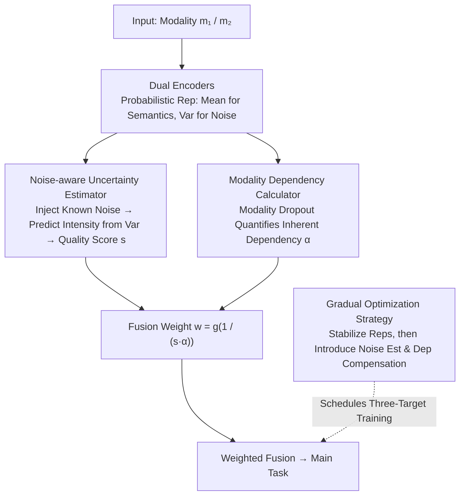

# Unbiased Dynamic Multimodal Fusion

**Conference**: CVPR 2026  
**arXiv**: [2603.19681](https://arxiv.org/abs/2603.19681)  
**Code**: [https://github.com/shicaiwei123/UDML](https://github.com/shicaiwei123/UDML)  
**Area**: Multimodal VLM / Multimodal Fusion  
**Keywords**: Dynamic Multimodal Fusion, Uncertainty Estimation, Modality Dependency Bias, Noise-aware, Dual Suppression

## TL;DR

UDML proposes an unbiased dynamic multimodal learning framework consisting of a noise-aware uncertainty estimator (achieving accurate quality assessment under both low and high noise conditions by injecting controllable noise and predicting its intensity) and a modality dependency calculator (quantifying inherent bias via Dropout and integrating it into a weighting mechanism). This addresses the dual suppression issue and consistently improves performance across multiple multimodal benchmarks.

## Background & Motivation

1. **Background**: Dynamic multimodal learning adjusts the contribution weights of each modality based on input quality, primarily through prior-based or uncertainty-based methods.
2. **Limitations of Prior Work**: (1) Uncertainty estimation bias: existing empirical metrics (e.g., energy scores, probabilistic embeddings) are insensitive to low noise (failing to detect slight degradation) and still assign non-negligible weights to severely damaged modalities at high noise levels. (2) Dual suppression effect: existing methods assume equal initial contributions, ignoring the modality dependency bias developed during optimization—hard-to-learn modalities are suppressed first by optimization bias and then again by high uncertainty.
3. **Key Challenge**: Dual suppression leads to dynamic fusion underperforming compared to static fusion, contradicting the design intent of dynamic fusion.
4. **Goal**: Design an uncertainty estimator accurate across all noise levels while quantifying and compensating for modality dependency bias.
5. **Key Insight**: Actively inject known noise to establish a clear correspondence between feature corruption and noise intensity; use modality Dropout to quantify inherent dependency.
6. **Core Idea**: A dual-pronged strategy of noise-aware estimation plus bias compensation.

## Method

### Overall Architecture

UDML aims to solve the phenomenon where dynamic multimodal fusion performs worse than static counterparts (e.g., on CREMA-D). The paper attributes this to inaccurate uncertainty estimation at extreme noise levels and inherent dependency bias. The pipeline operates as follows: after encoding modalities (represented probabilistically, where mean encodes semantics and variance reflects noise), one path feeds into the **noise-aware uncertainty estimator** to obtain a quality score $s$, while another path uses the **modality dependency calculator** to compute the inherent dependency $\alpha$. These jointly determine the fusion weight $w=g(1/(s\cdot\alpha))$. The weighted features are then fused for the main task. Training is managed by a **gradual optimization strategy** that stabilizes representations before introducing the other components. The framework acts on the representation layer and is compatible with any encoder or fusion architecture.

### Key Designs

**1. Noise-aware Uncertainty Estimator: Making Modality Quality Measurable at Any Noise Level**

Existing empirical metrics (energy scores, PE) lack direct supervision for noise, making them blunt at low noise and over-weighted at high noise. UDML adopts a principled approach: during training, it actively injects controllable noise of **known intensity** into modality data and requires the model to predict this intensity from encoded features. Using probabilistic representations, each modality is mapped to a distribution where the variance reflects noise characteristics. Because the injected intensity is known, a supervised correspondence is established. The model is forced to learn that "messier features have larger variance," ensuring a monotonic response from noise-free to severely corrupted states, unlike PE which saturates at extremes.

**2. Modality Dependency Calculator: Compensating for "Dual Suppression" of Hard-to-Learn Modalities**

Accurate uncertainty is insufficient. The paper notes that existing methods overlook optimization bias toward easy-to-learn modalities. Hard-to-learn modalities are suppressed first by optimization bias and then by high uncertainty—the "dual suppression" effect. UDML quantifies the dependency level $\alpha^m$ via modality Dropout (measuring performance drop when a modality is removed) and integrates it into the weighting formula:

$$w_i^{m_1} = g\!\left(\frac{1}{s(z_i^{m_1}) \cdot \alpha^{m_1}}\right)$$

where $s(\cdot)$ is the uncertainty score. This ensures highly dependent modalities are not overly penalized by uncertainty, while low-dependency, hard-to-learn modalities are shielded from secondary suppression. The $\alpha$ in the denominator acts as a floor, compensating for optimization-stage bias during fusion.

**3. Gradual Optimization Strategy: Balancing Multiple Objectives**

Simultaneous optimization of noise estimation, dependency compensation, and the main task can cause interference. UDML employs progressive training: stabilizing multimodal representations first, then gradually introducing noise-aware estimation and dependency compensation. This builds secondary tasks on a reliable representation foundation.

### Loss & Training

The total loss consists of three parts: main task loss (classification/detection/segmentation), noise prediction loss (MSE for supervising the estimator), and KL divergence regularization for probabilistic representations (constraining modality distributions and aiding generalization).

## Key Experimental Results

### Main Results

| Dataset | Task | Static Fusion | Dynamic (PE) | UDML (Ours) | Gain vs Dynamic |
|--------|------|---------|---------|------|-------------|
| CREMA-D | Audio-Visual Classification | 67.2 | 65.8 | 71.5 | +5.7 |
| Kinetics-Sound | Audio-Visual Classification | 64.1 | 63.5 | 66.8 | +3.3 |
| NYU Depth v2 | RGB-D Segmentation | 51.2 | 50.8 | 53.1 | +2.3 |

Note: On CREMA-D, PE dynamic fusion (65.8) is lower than static fusion (67.2), validating the dual suppression problem. UDML significantly resolves this.

### Ablation Study

| Configuration | CREMA-D Acc | Description |
|------|------------|------|
| Static Fusion Baseline | 67.2 | No dynamic weights |
| + Noise-aware Estimator | 69.8 | Contribution of accurate estimation |
| + Modality Dependency Calculator | 71.5 | Elimination of dual suppression |
| w/o Probabilistic Representation | 70.1 | Probabilistic representation aids generalization |

### Key Findings

- The noise-aware estimator responds monotonically across all levels, whereas PE fails at $\sigma < 4$ and $\sigma > 10$.
- The dependency calculator contributes ~1.7%, confirming dual suppression is a critical bottleneck.
- UDML is architecture-agnostic, improving various fusion types (Concat/Attention/Gating).
- Advantages are more pronounced under high-noise conditions, proving robustness.

## Highlights & Insights

- **Discovery of Dual Suppression**: First to clearly identify that dynamic fusion underperforming static fusion stems from dual suppression rather than the dynamic mechanism itself.
- **Noise Injection+Prediction Paradigm**: More principled than empirical metrics, establishing a direct causal link between noise levels and uncertainty.
- **Architecture-Agnostic Design**: All components operate on representations, allowing plug-and-play integration into any multimodal model.

## Limitations & Future Work

- Controllable noise injection assumes known noise types; real-world degradation may be of unknown types.
- Dependency calculated via modality Dropout is a global statistic rather than per-sample.
- Currently validated on bi-modal scenarios; scalability to three or more modalities remains to be tested.
- Future work could incorporate finer noise modeling, such as noise type classification.

## Related Work & Insights

- **vs Probabilistic Embeddings (PE)**: PE empirically uses variance for uncertainty; UDML learns it explicitly via a noise prediction task.
- **vs OGM-GE/Greedy**: These methods solve optimization imbalance via gradient modulation but do not handle dependency bias during inference.
- **vs TMC**: TMC models uncertainty with Dirichlet distributions but similarly assumes equal modality contributions.

## Rating

- Novelty: ⭐⭐⭐⭐ Deep analysis of dual suppression; sound noise-aware estimator design.
- Experimental Thoroughness: ⭐⭐⭐⭐ Validated across multiple tasks and datasets.
- Writing Quality: ⭐⭐⭐⭐ Clear problem analysis and intuitive visualizations.
- Value: ⭐⭐⭐⭐ Practical guidance for dynamic multimodal fusion.

<!-- RELATED:START -->

## Related Papers

- [\[CVPR 2026\] CoRiM: Conflict-driven Risk Minimization for Dynamic Multimodal Fusion](corim_conflict-driven_risk_minimization_for_dynamic_multimodal_fusion.md)
- [\[CVPR 2026\] Beyond Sequential Tools: A Unified VLM Agent System for Photographic Post-Processing via Dynamic Multi-Expert Fusion](beyond_sequential_tools_a_unified_vlm_agent_system_for_photographic_post-process.md)
- [\[CVPR 2026\] Towards Dynamic Modality Alignment in Multimodal Continual Learning](towards_dynamic_modality_alignment_in_multimodal_continual_learning.md)
- [\[CVPR 2026\] Multimodal Continual Instruction Tuning with Dynamic Gradient Guidance](multimodal_continual_instruction_tuning_with_dynamic_gradient_guidance.md)
- [\[CVPR 2026\] Geoint-R1: Formalizing Multimodal Geometric Reasoning with Dynamic Auxiliary Constructions](geoint-r1_formalizing_multimodal_geometric_reasoning_with_dynamic_auxiliary_cons.md)

<!-- RELATED:END -->
