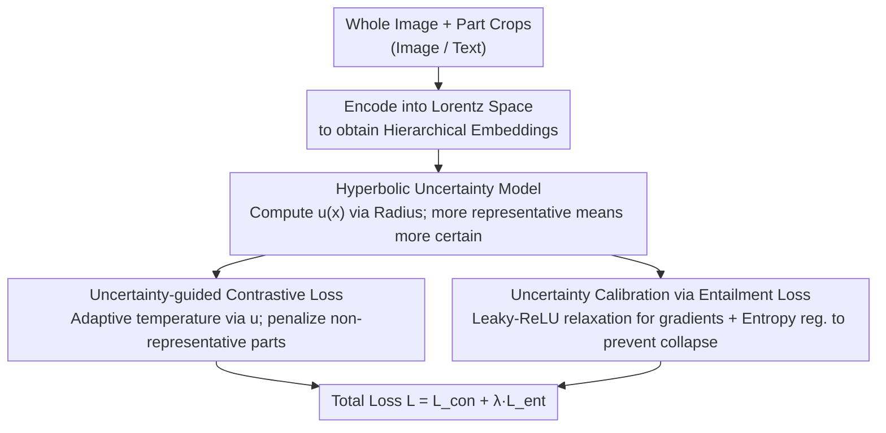

# Uncertainty-guided Compositional Alignment with Part-to-Whole Semantic Representativeness in Hyperbolic Vision-Language Models

**Conference**: CVPR2026  
**arXiv**: [2603.22042](https://arxiv.org/abs/2603.22042)  
**Code**: [github.com/jeeit17/UNCHA](https://github.com/jeeit17/UNCHA)  
**Area**: Multimodal VLM  
**Keywords**: Hyperbolic VLM, uncertainty modeling, part-to-whole alignment, compositional understanding, entailment loss

## TL;DR
The UNCHA framework is proposed to model the semantic representativeness of part images relative to the whole scene using hyperbolic uncertainty in hyperbolic VLMs. By utilizing uncertainty-guided contrastive and entailment losses, it enhances compositional scene understanding and outperforms existing hyperbolic VLMs across multiple downstream tasks.

## Background & Motivation

**Background**: VLMs such as CLIP struggle to capture hierarchical relationships (e.g., part-to-whole, parent-to-child structures) in Euclidean space and exhibit biases in multi-object compositional scenes. Hyperbolic VLMs (e.g., MERU, ATMG, HyCoCLIP) better preserve hierarchical structures through the negative curvature and exponential volume growth of hyperbolic space.

**Limitations of Prior Work**: Existing hyperbolic VLMs do not model the "varying semantic representativeness of different parts for the whole"—a crop containing the core object of a scene is more representative of the overall scene than a background crop. If all parts are treated equally, the model cannot distinguish between highly representative and less representative parts.

**Core Idea**: Hyperbolic uncertainty is used to model the "semantic representativeness of part images for the whole scene," enhancing compositional scene understanding through uncertainty-guided contrastive and entailment losses.

## Method

### Overall Architecture

Hyperbolic VLMs can preserve hierarchical structures like "part-to-whole" using negative curvature, but they typically treat all local crops of an image identically. UNCHA adds a layer of "representativeness" on top of HyCoCLIP: first, hyperbolic uncertainty is defined via the hyperbolic radius to reflect semantic representativeness; this uncertainty is then integrated into the contrastive loss to adjust the weights of each part. Finally, an entailment loss is used to calibrate the uncertainty, ensuring that "parts more representative of the whole have lower uncertainty." The entire process shares a single uncertainty $u$, which forks into contrastive and entailment loss branches before merging into a total loss.

### Key Designs

**1. Hyperbolic Uncertainty Model: Measuring "Representativeness" via Distance to Origin**

To differentiate representativeness, a quantifiable proxy is required. UNCHA leverages geometric properties of hyperbolic space—the hyperbolic radius (geodesic distance to the origin) is monotonically related to abstraction. Embeddings closer to the origin are more abstract and uncertain, while those farther away are more specific and certain. Uncertainty is defined as $u(x) = \log(1 + \exp(-\|x\|_2))$, such that parts more representative of the scene naturally correspond to lower uncertainty without requiring additional labels.

**2. Uncertainty-guided Contrastive Loss: Reducing Alignment for Ambiguous Parts**

If all parts participate equally in contrastive learning, background crops with poor representativeness can bias the alignment. UNCHA integrates uncertainty into the contrastive temperature, creating an adaptive temperature $\tau_{un,i}^I = \exp(u(i_i^{part})/2) \cdot \tau_{gl}$. Parts with higher uncertainty have larger temperatures and contribute less to the contrastive loss, effectively downweighting parts that do not resemble the whole. Simultaneously, local contrastive losses are added to align part images with part texts.

**3. Uncertainty Calibration via Entailment Loss: Allowing Uncertainty for Weak Relations**

When a part is pushed into the "entailment cone" of the whole, the original entailment loss provides zero gradient once constraints are met. UNCHA uses a piecewise continuous relaxation $L_{ent}^* = \max(0, \phi - \eta\omega) + \alpha\phi$ (Leaky-ReLU style) to preserve signals. Uncertainty calibration is performed as $L_{ent}^{cal} = \lfloor L_{ent}^* \rfloor e^{-u(p)} + u(p) + \mathcal{H}(\tilde{u}(p))$ (where $\lfloor\cdot\rfloor$ denotes stop-gradient). When the entailment relationship is weak, the $e^{-u(p)}$ term encourages increased uncertainty, the $u(p)$ term prevents uncertainty from becoming excessively high, and the entropy regularization $\mathcal{H}$ prevents collapse into a uniform distribution.

### Loss & Training

The total loss is the sum of the contrastive and entailment branches:
$$L = \mathcal{L}_{con}^{un} + \lambda_{ent}\mathcal{L}_{ent}^{un}$$
The entire process is conducted in hyperbolic space based on the Lorentz model, using exponential and logarithmic maps to transition between the manifold and the tangent space.

## Key Experimental Results

### Main Results

| Model | ImageNet | CIFAR-10 | CUB | Cars | Pets | Description |
|------|---------|----------|-----|------|------|------|
| CLIP (ViT-S/16) | 36.7 | 70.2 | 9.8 | 6.9 | 44.6 | Baseline |
| MERU | 35.4 | 71.2 | 11.3 | 5.2 | 42.7 | Hyperbolic Baseline |
| HyCoCLIP | Gain | Gain | Gain | Gain | Gain | Part Alignment added |
| UNCHA | Best | Best | Best | Best | Best | Uncertainty modeling added |

### Ablation Study

| Configuration | Key Metrics | Description |
|------|---------|------|
| w/o Uncertainty Guidance | Performance Drop | Treating all parts equally is insufficient |
| w/o Entropy Regularization | Embedding Collapse | Uncertainty tends toward uniform |
| Uncertainty vs. Similarity | r=-0.739 | Strong negative correlation confirms modeling effectiveness |

### Key Findings
- A strong negative correlation ($r=-0.739$) between uncertainty and part-to-whole similarity validates the modeling.
- Semantically more representative parts exhibit lower uncertainty, while ambiguous or non-representative crops show higher uncertainty.
- The model outperforms existing hyperbolic VLMs across multiple downstream tasks, including zero-shot classification, retrieval, and multi-label classification.

## Highlights & Insights
- Using the hyperbolic radius as a proxy for uncertainty is a natural and elegant design.
- Entropy regularization to prevent uncertainty collapse reflects an in-depth understanding of hyperbolic space properties.
- The Leaky-ReLU style relaxation for the entailment loss addresses the zero-gradient issue after convergence into the cone.
- Visual analysis demonstrates a direct correspondence between uncertainty and semantic representativeness.

## Limitations & Future Work
- The computational complexity of hyperbolic space limits scalability to larger models.
- Part images are generated via random cropping; more intelligent segmentation strategies remain unexplored.
- Validation is limited to ViT-S/16 and ViT-B/16; larger vision encoders require further testing.
- The setting of the uncertainty threshold $\tau_A$ is heuristic.

## Related Work & Insights
- MERU first introduced hyperbolic VLMs but only modeled cross-modal entailment.
- HyCoCLIP extended this to intra-modal entailment but did not differentiate part representativeness.
- The concept of using the hyperbolic radius as an uncertainty proxy can be generalized to any hyperbolic representation learning scenario.

## Rating
- Novelty: ⭐⭐⭐⭐ Innovative modeling of hyperbolic uncertainty and semantic representativeness.
- Experimental Thoroughness: ⭐⭐⭐⭐ Zero-shot classification on 16 datasets plus multi-dimensional evaluations.
- Writing Quality: ⭐⭐⭐⭐ Detailed derivations and clear structure.
- Value: ⭐⭐⭐⭐ Advances compositional understanding in hyperbolic VLMs.

<!-- RELATED:START -->

## Related Papers

- [\[CVPR 2026\] Hyperbolic Gramian Volumes for Multimodal Alignment](hyperbolic_gramian_volumes_for_multimodal_alignment.md)
- [\[CVPR 2026\] Proxy3D: Efficient 3D Representations for Vision-Language Models via Semantic Clustering and Alignment](proxy3d_efficient_3d_representations_for_vision-language_models_via_semantic_clu.md)
- [\[CVPR 2026\] Gravitation-Driven Semantic Alignment for Text Video Retrieval](gravitation-driven_semantic_alignment_for_text_video_retrieval.md)
- [\[CVPR 2026\] Uncertainty-Aware Knowledge Distillation for Multimodal Large Language Models](uncertainty-aware_knowledge_distillation_for_multimodal_large_language_models.md)
- [\[CVPR 2025\] Calico: Part-Focused Semantic Co-Segmentation with Large Vision-Language Models](../../CVPR2025/multimodal_vlm/calico_part-focused_semantic_co-segmentation_with_large_vision-language_models.md)

<!-- RELATED:END -->
