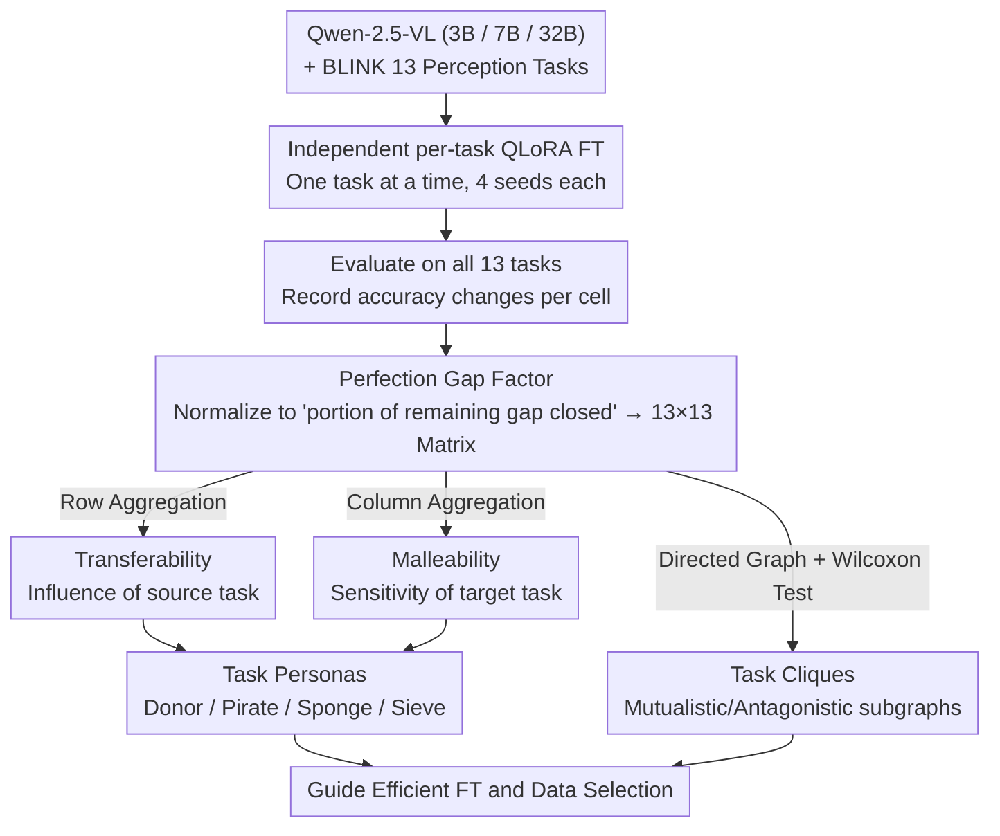

# Understanding Task Transfer in Vision-Language Models

**Conference**: CVPR 2026 Oral  
**arXiv**: [2511.18787](https://arxiv.org/abs/2511.18787)  
**Code**: [https://aka.ms/task-transfer-vlms](https://aka.ms/task-transfer-vlms) (Project Page)  
**Area**: Multimodal VLM  
**Keywords**: Vision-Language Models, Task Transfer, Perception Tasks, Fine-tuning, Perfection Gap Factor

## TL;DR
This paper presents the first systematic study of the impact of fine-tuning Vision-Language Models (VLMs) on a specific visual perception task on the zero-shot performance of other perception tasks. It proposes the Perfection Gap Factor (PGF), a normalized metric to quantify cross-task transfer. Using three scales of Qwen-2.5-VL, the study reveals structural patterns in task transfer (positive/negative transfer cliques, task persona classification, scale dependencies, etc.) and demonstrates that PGF can guide data selection to enhance fine-tuning efficiency.

## Background & Motivation

1. **Background**: While VLMs excel on multimodal benchmarks, they still lag behind humans and expert models in fundamental visual perception tasks (e.g., depth estimation, counting, object localization). On the BLINK benchmark, the best model (GPT-4o) achieves only 60%, compared to 95% for humans. In practice, methods like LoRA are typically used to fine-tune models on specific perception tasks to close this gap.

2. **Limitations of Prior Work**: After fine-tuning for one perception task, the performance change on other perception tasks is unpredictable—it can be either positive or negative transfer. This uncertainty makes task-specific fine-tuning risky, yet systematic research to understand these cross-task impacts is currently lacking.

3. **Key Challenge**: It is unknown how internal representations in VLMs are shared or compete across different perception tasks. Different tasks might rely on the same underlying visual features (mutual promotion) or compete for limited model capacity (mutual interference).

4. **Goal**: To answer a core question: How does fine-tuning a VLM on one perception task affect its zero-shot performance on others? How can these cross-task relationships be quantified and utilized?

5. **Key Insight**: Unlike Taskonomy, which requires transfer learning on both source and target tasks, this work investigates zero-shot cross-task transfer—fine-tuning only the source task without any training on the target task.

6. **Core Idea**: Systematically quantify zero-shot transfer relationships between VLM perception tasks using the Perfection Gap Factor (PGF) metric. The study finds that cross-task transfer follows structural patterns that can be used to guide efficient fine-tuning.

## Method

### Overall Architecture
The study addresses a specific question: How does fine-tuning a VLM on a single perception task alter its zero-shot performance on others? The authors investigate three scales of Qwen-2.5-VL (3B, 7B, 32B) by **independently fine-tuning** each of the 13 perception tasks from the BLINK benchmark (using LoRA on one task at a time). Each fine-tuned model is then re-evaluated on the validation sets of all 13 tasks. This results in a $13 \times 13$ transfer matrix for each model scale, where rows represent fine-tuned source tasks, columns represent evaluated target tasks, and cells contain the PGF scores defined below. All analyses—including transfer cliques, task personas, and scaling laws—are built upon this matrix.

### Key Designs

**1. Perfection Gap Factor (PGF): Normalizing "improvement" to "closed gap"**

Using absolute accuracy gain (post-FT minus pre-FT) in the transfer matrix is problematic because task difficulties vary significantly. A 3% gain on a task already at 90% is more significant than a 10% gain on a task at 40%. PGF normalizes the gain by the "remaining room for improvement":

$$\mu_{i \to j} = \frac{\text{Acc}(\mathcal{M}(T_i), T_j) - \text{Acc}(\mathcal{M}, T_j)}{U_j - \text{Acc}(\mathcal{M}, T_j) + \epsilon}$$

The numerator is the change in accuracy on target task $T_j$ after fine-tuning on source task $T_i$. The denominator is the distance between the pre-FT performance and an upper bound $U_j$ (default 100%). PGF represents what fraction of the "perfection gap" was closed: $\mu=0$ indicates no transfer, positive values indicate positive transfer, and negative values indicate negative transfer. PGF is naturally asymmetric: the upper bound is 1, but the lower bound can reach $-(m-1)$, reflecting the fact that performance drops are more severe when starting near perfection.

**2. Task Transferability: Overall outward influence of a source task**

This measures which tasks are most beneficial (or harmful) to others when used for fine-tuning. A source task $T_i$'s PGF values are aggregated along the row. Positive and negative transferability are calculated separately. Positive transferability is:

$$\Delta(i)^+ = \frac{1-e^{-p/N}}{p}\sum_{j} \mu_{i\to j}\,\mathbf{1}_{\mu_{i\to j}>0}$$

where $p$ is the number of tasks influenced and $N$ is the total tasks. The exponential weighting factor $(1-e^{-p/N})/p$ ensures that models with large improvements on many tasks are ranked higher than those with a massive improvement on only one task, capturing both intensity and breadth.

**3. Malleability: Sensitivity of a target task to external changes**

Malleability is the dual of transferability, measuring how easily a task is influenced by others. It is calculated by aggregating PGF values along the columns of the matrix. High positive malleability means a task easily benefits from fine-tuning on other tasks, while high negative malleability means its performance drops easily when other tasks are trained.

**4. Task Cliques: Identifying mutualistic/antagonistic task subsets**

To find "clusters" of tasks, the transfer matrix is treated as a directed graph. A task clique is a complete subgraph where all ordered pairs $(T_i, T_j)$ exhibit consistent positive (mutualistic) or negative (antagonistic) transfer. To filter noise, every edge direction is verified using a Wilcoxon test across 4 random seeds; only statistically significant edges are considered.

**5. Task Personas: Actionable labels for each task**

By combining transferability and malleability, tasks are categorized into four personas:
- **Donor**: High positive transferability across all scales—fine-tuning on these tasks benefits almost all others (e.g., Semantic Correspondence).
- **Pirate**: High negative transferability—fine-tuning these tasks tends to drag others down (e.g., Functional Correspondence).
- **Sponge**: High positive malleability—these tasks easily gain performance from fine-tuning on unrelated tasks (e.g., Visual Similarity, Relative Depth).
- **Sieve**: High negative malleability—these tasks are "fragile" and easily damaged by unrelated fine-tuning (e.g., Forensic Detection).

### Loss & Training
The models utilize QLoRA (4-bit quantization) for fine-tuning Qwen-2.5-VL. Training sets are reconstructed from original BLINK data sources, maintaining consistency with BLINK task definitions and response formats. Each experiment is conducted with 4 random seeds, and transfer matrix entries are derived from cross-seed statistical aggregates.

## Key Experimental Results

### Main Results: PGF Transfer Heatmap Findings

| Discovery | 3B | 7B | 32B |
|------|----|----|-----|
| Avg. Positive Transferability | Low | Med | High (Increases with scale) |
| Max Positive Clique Size | 3-4 | 3-4 | **9** |
| Donor Tasks | SC | SC | SC (Consistent across scales) |
| Pirate Tasks | FC | FC | FC (Consistent across scales) |
| Sponge Tasks | VS, RD, RR | VS, RD, RR | VS, RD, RR |
| Sieve Tasks | FD | — | FD (Forensic Detection) |

### PGF-Guided Data Selection vs. Random (Qwen-2.5-VL 7B)

| Target Task | Direct FT | Random Mix | PGF-Guided Mix | Description |
|----------|---------|---------|------------|------|
| Jigsaw | baseline | < Direct | **Exceeds Direct FT** | PGF selection outperforms direct supervision |
| Object Localization | baseline | < Direct | **Exceeds Direct FT** | PGF selection outperforms direct supervision |
| Other Tasks | baseline | Mixed | Consistently > Random | PGF guidance is stable and effective |

### Key Findings
- **Scale Effect**: Larger models exhibit stronger positive transfer (32B is most significant), but negative transfer shows no clear trend with scale.
- **Perception Hierarchy**: Low-level tasks (Relative Depth, Relative Reflectance) show the highest transferability and malleability.
- **Granularity Levels**: Image-level tasks have the highest positive transferability, while both pixel-level and image-level tasks exhibit high malleability.
- **Video Transfer**: Similar patterns are observed in VSI-Bench video tasks; Relative Reflectance remains a donor, and Forensic Detection remains a pirate.
- **PGF Guidance**: On Jigsaw and Object Localization, mixing data guided by PGF even outperformed direct fine-tuning on the target task itself.

## Highlights & Insights
- **Ingenious PGF Metric**: Normalizing by remaining improvement space solves the incomparability of transfer effects across tasks of varying difficulty. The asymmetry (upper bound 1, lower bound below -1) captures the reality that performance degradation is more critical near the ceiling.
- **Task Persona Framework**: The Donor/Pirate/Sponge/Sieve classification provides intuitive and actionable guidance for multi-task fine-tuning strategies.
- **Counter-intuitive Discovery**: PGF-guided indirect data mixing can outperform direct instruction tuning, suggesting that additive effects of positive transfer can sometimes exceed single-task supervision.
- **Core Role of Low-level Tasks**: Low-level perception tasks (depth, reflectance) are both the best donors and the best sponges, implying that early visual features in VLMs are highly reusable and adaptable.

## Limitations & Future Work
- Restricted to multiple-choice formats, which may limit observations for open-ended generation scenarios.
- Only validated on the Qwen-2.5-VL series; generalization to other architectures (e.g., LLaVA, InternVL) is not yet verified.
- The default upper bound $U_j = 100\%$ may be unrealistic for tasks where even humans do not reach 100%.
- Does not investigate the transfer effects of joint multi-task fine-tuning (only single-source task FT).
- PGF-guided data selection experiments were limited to the 7B model.

## Related Work & Insights
- **vs. Taskonomy**: While Taskonomy investigated transfer in the pre-foundation model era with CNNs and small decoders (requiring transfer learning on the target), this work studies zero-shot transfer in the VLM era, fitting the foundation model paradigm.
- **vs. Task2Vec/LEEP**: These are information-theoretic measures based on representations. PGF is performance-based, providing more direct intuition without requiring extra representation computations.
- **Inspiration**: Highly valuable for multi-task fine-tuning—prioritize donor tasks, avoid pirate task data, and rely on sponge tasks for gains.

## Rating
- Novelty: ⭐⭐⭐⭐ First systematic study of zero-shot task transfer in VLMs; PGF is well-designed.
- Experimental Thoroughness: ⭐⭐⭐⭐⭐ Covers three scales, 13 tasks, 4 seeds, video extensions, and data selection applications.
- Writing Quality: ⭐⭐⭐⭐ Clear formal definitions, rich visualizations, and deep analysis.
- Value: ⭐⭐⭐⭐ Direct practical guidance for VLM fine-tuning; PGF metric is highly reusable.

<!-- RELATED:START -->

## Related Papers

- [\[CVPR 2026\] VOLD: Reasoning Transfer from LLMs to Vision-Language Models via On-Policy Distillation](vold_reasoning_transfer_from_llms_to_vision-language_models_via_on-policy_distil.md)
- [\[CVPR 2026\] AXG-Reasoner: Error Detection and Explanation in Long Task Videos with Vision-Language Models](axg-reasoner_error_detection_and_explanation_in_long_task_videos_with_vision-lan.md)
- [\[CVPR 2026\] LVLM-Aided Alignment of Task-Specific Vision Models](lvlm-aided_alignment_of_task-specific_vision_models.md)
- [\[CVPR 2026\] HiSpatial: Taming Hierarchical 3D Spatial Understanding in Vision-Language Models](hispatial_taming_hierarchical_3d_spatial_understanding_in_vision-language_models.md)
- [\[ECCV 2024\] Select and Distill: Selective Dual-Teacher Knowledge Transfer for Continual Learning on Vision-Language Models](../../ECCV2024/multimodal_vlm/select_and_distill_selective_dual-teacher_knowledge_transfer_for_continual_learn.md)

<!-- RELATED:END -->
