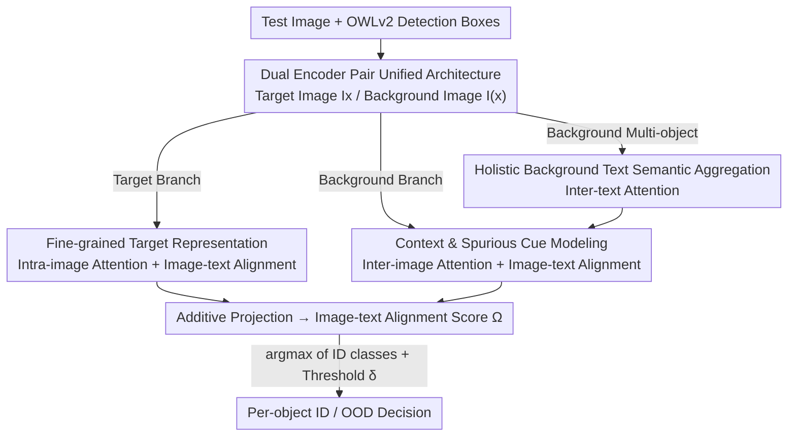

# UNI-OOD: Unified Object- and Image-level Out-of-Distribution Detection via Cross-Context Attentive Vision-Language Modeling

**Conference**: CVPR 2026  
**Performance**: [CVF Open Access](https://openaccess.thecvf.com/content/CVPR2026/html/Li_UNI-OOD_Unified_Object-_and_Image-level_Out-of-Distribution_Detection_via_Cross-Context_Attentive_CVPR_2026_paper.html)  
**Code**: To be confirmed  
**Area**: Multimodal VLM (OOD Detection / Reliable Deployment)  
**Keywords**: OOD Detection, Vision-Language Models, CLIP, Cross-Context Attention, Object-level Detection

## TL;DR
UNI-OOD employs two identical pairs of CLIP image-text encoders to model the "target object" and "background" respectively. By leveraging four types of cross-context attention (intra-image, inter-image, inter-text, and image-text alignment), it decouples fine-grained object evidence from spurious background associations. This approach marks the first single model to achieve SOTA performance simultaneously in both object-level and image-level OOD detection without requiring pre-knowledge of the task type during inference.

## Background & Motivation
**Background**: OOD (Out-of-Distribution) detection is a prerequisite for reliable model deployment, as it identifies inputs falling outside known semantic boundaries. Recently, Vision-Language Models (VLMs, particularly CLIP) have pushed image-level OOD detection to high performance through rich semantics and few-shot prompt learning (e.g., CoOp, LoCoOp, NegPrompt).

**Limitations of Prior Work**: Existing image-level methods largely assume a "single dominant object per image." However, real-world scenarios such as autonomous driving, robotics, and surveillance naturally contain multiple objects, each requiring independent OOD judgment. Thus, object-level OOD detection is a more practical formulation, with image-level detection being its special case. Traditionally, these two lines of research have been disjoint: image-level methods cannot handle multiple objects, while object-level methods mostly rely on fully trained CNN backbones (requiring full ID data and offering lower capacity than VLMs).

**Key Challenge**: RUNA, the only work introducing VLMs to object-level OOD, suffers from two major flaws: (1) it uses only the `[CLS]` output for both the target object and background, discarding patch-level fine-grained spatial information; (2) it applies global Gaussian blur to the entire background indiscriminately, ignoring the semantic diversity of background regions. Consequently, RUNA fails to utilize target details or distinguish between useful context and misleading spurious cues, even performing significantly worse than modern image-level methods on image-level tasks.

**Goal**: Develop a unified framework that achieves SOTA performance in both settings without needing the task type to be specified at inference time.

**Key Insight**: Treat the "target object" and its "background" as two complementary contexts for joint reasoning. For each object, treat it as the target and the rest of the image as the context, establishing fine-grained cross-context correspondences across visual and textual modalities.

**Core Idea**: Replace RUNA's coarse global representations with "Cross-Context Attention Modeling." This simultaneously mines fine-grained features within the target object, aligns image-text semantics, and explicitly models interactions between the target and background to obtain consistent OOD scores across different visual granularities.

## Method

### Overall Architecture
The backbone of UNI-OOD consists of **two identical pairs of CLIP image-text encoders** (Image Encoder 1/Text Encoder 1 for the target object; Image Encoder 2/Text Encoder 2 for the background), sharing the same architecture and weights but independently serving different contexts. For an image $I$, each object $x$ is treat sequentially as the "target": the target image $I_x$ is cropped via its bounding box and passed to Encoder 1, while the masked background image $I_{(x)}$ is passed to Encoder 2. The set of remaining objects in the background is denoted as $X^I_{(x)} = X^I \setminus \{x\}$.

The key to unification is **treating image-level detection as a special case of object-level detection**. Since image-level datasets (e.g., ImageNet-1k) provide only one object per image without bounding boxes, the authors use a pre-trained detector (OWLv2) during training to identify the sole object $x$. Thus, $|X^I|=1$ and the background contains no other objects ($X^I_{(x)}=\varnothing$). In this case, Text Encoder 2 is bypassed, but Image Encoder 2 still processes the background image normally. This allows both settings to share the same training/inference pipeline.

The data flow is as follows: The target branch produces fine-grained target embeddings $z^{img}_x$ via intra-image attention and image-text alignment. The background branch produces background embeddings $z^{img}_{(x)}$ via inter-image attention, inter-text attention, and image-text alignment. These are summed and projected into the final image representation $M^{img}(I_x, I_{(x)}) = P\cdot(z^{img}_x + z^{img}_{(x)})$, which is then compared with the target object's text embedding using cosine similarity $\Omega(I_x, t_x)$ to produce an alignment score. At inference, the maximum alignment score across all ID-class prompts is compared to a threshold $\delta$ to determine the ID/OOD status.

### Key Designs

**1. Dual Encoder Pairs + Unified Formalization: Treating Image-level as a Special Case**

The disconnect in RUNA arises because it lacks a unified representation for "single-object" and "multi-object" scenes. This design constructs a pair of inputs for every target object $x$—the target $I_x$ (cropped) and the background $I_{(x)}$ (masked)—and feeds them into two sets of encoders. For multi-object images, objects are processed iteratively. For single-object images, the unique object is detected by OWLv2 first, making the background empty and the text encoder redundant. This formalization ensures "image-level = object-level with set size 1," allowing a single model and training objective to cover both tasks.

**2. Fine-grained Target Representation: Restoring Patch-level Evidence via Intra-image Attention and Image-text Alignment**

To address RUNA's loss of detail, this design calculates two sets of complementary weights for each token (including `[CLS]` and $N$ patches) in the target image. The first set, $\beta^{img}_{i,x}$, comes from **intra-image attention**: it measures the `[CLS]` token's focus on each patch, averaged across layers $L$ and heads $H$:

$$\alpha^{img,l,h}_{i,0,intra} = \text{softmax}_i\!\left(\frac{1}{\sqrt{d^{img}_h}}\,(k^{img,l,h}_{i,x})^\top q^{img,l,h}_{0,x}\right)$$

resulting in $\beta^{img}_{i,x} = \frac{1}{LH}\sum_l\sum_h \alpha^{img,l,h}_{i,0,intra}$. The second set, $\mu_{i,x}=\max(\cos(Pz^{img,L}_{i,x}, M^{text}(t_x)), 0)$, comes from **image-text alignment**. These weights are multiplied and used to aggregate embeddings: patch embeddings are aggregated via a three-layer CNN to preserve spatial structure, then fused with the weighted `[CLS]` embedding via an MLP to obtain $z^{img}_x$. $\beta$ captures spatial importance, while $\mu$ captures semantic consistency.

**3. Background Context and Spurious Cue Modeling: Distinguishing Context via Inter-image Attention**

Instead of blurring the background, this design uses **inter-image attention**: the target encoder's `[CLS]` query attends to every token in the background encoder:

$$\alpha^{img,l,h}_{i,0,inter} = \text{softmax}_i\!\left(\frac{1}{\sqrt{d^{img}_h}}\,(k^{img,l,h}_{i,(x)})^\top q^{img,l,h}_{0,x}\right)$$

The averaged weights $\beta^{img}_{i,(x)}$ quantify the target's attention to background regions, identifying potential spurious cues or informative contexts. For object-level tasks, background image-text alignment $\mu_{i,(x)}$ is added; for image-level tasks, $\mu$ is omitted. The resulting $z^{img}_{(x)}$ is formed using the same CNN+MLP combiner structure as the target branch.

**4. Holistic Background Text Semantic Aggregation: Aggregating Multi-object Prompts via Inter-text Attention**

While background often contains multiple objects, CLIP text encoders are optimized for single-object prompts. The authors found that simple averaging or comma-separated strings fail to capture holistic semantic relationships. They propose **inter-text attention**: the `[EOT]` token of the target text $t_x$ attends to the `[EOT]` token of each background object $t_{x'}$, producing weights $w^{text}_{x',x}$ to aggregate embeddings into a holistic representation:

$$\tilde{M}^{text}(t_{(x)}) = \sum_{x'\in X^I_{(x)}} w^{text}_{x',x}\cdot M^{text}(t_{x'})$$

To solve the combinatorial explosion of background object combinations at inference, the authors use the same inter-text attention to aggregate all $\{M^{text}(t^c_{ID})\}$ prompts weighted by their relevance to the target $t_x$, turning enumeration into a single weighted aggregation.

### Loss & Training
In the few-shot setting, only ID samples are used (e.g., 10-shot for BDD-100k, 16-shot for ImageNet-1k). The standard CLIP contrastive loss is applied, treating each object as a separate instance to calculate image-to-text $L_{image}$ and text-to-image $L_{text}$ losses. The CLIP backbone is frozen; only the CNNs and MLPs within the combiner are trained. Inference identifies the most likely ID class $c^\star = \arg\max_{c\in C_{ID}} \Omega(I^{test}_x, t^c_{ID})$, and objects falling below a threshold $\delta$ are classified as OOD.

## Key Experimental Results

### Main Results
On object-level tasks (10-shot tuning, ID: BDD-100k / PASCAL-VOC, OOD: OpenImages / MS-COCO), UNI-OOD outperforms the previous SOTA (RUNA) across all 8 metrics:

| Setting (ID→OOD) | Metric | RUNA | Ours |
|---|---|---|---|
| BDD-100k → OpenImages | AUROC↑ / FPR95↓ | 97.05 / 8.57 | **98.52 / 3.68** |
| BDD-100k → MS-COCO | AUROC↑ / FPR95↓ | 94.10 / 15.23 | **95.91 / 11.32** |
| PASCAL-VOC → OpenImages | AUROC↑ / FPR95↓ | 94.13 / 22.35 | **96.25 / 14.30** |
| PASCAL-VOC → MS-COCO | AUROC↑ / FPR95↓ | 92.92 / 28.35 | **95.07 / 22.24** |

On image-level tasks (ID: ImageNet-1k, 16-shot), UNI-OOD achieves an average AUROC of 96.83 and FPR95 of 15.93, surpassing specialized methods like NegPrompt and DPM-T. RUNA significantly trails even when informed of the task type:

| Method | Avg AUROC↑ | Avg FPR95↓ |
|---|---|---|
| LoCoOp | 93.53 | 28.66 |
| DPM-T | 95.72 | 21.09 |
| NegPrompt | 94.81 | 23.03 |
| RUNA (needs task type) | 93.32 | 26.58 |
| **Ours** | **96.83** | **15.93** |

### Ablation Study
Representative results from BDD-100k→OpenImages (10-shot, AUROC↑ / FPR95↓):

| Configuration | AUROC↑ / FPR95↓ | Description |
|---|---|---|
| BG text w/ Comma concatenation | 93.21 / 12.72 | Naive concatenation causes major drop |
| BG text w/ Simple average | 95.05 / 8.60 | Averaging is insufficient |
| BG text w/ MLP aggregation | 97.20 / 4.63 | Performs worse than inter-text |
| w/o Inter-image attention (BG) | 96.02 / 6.21 | Loses spurious cue modeling |
| w/o Image-text alignment (BG) | 96.67 / 5.04 | Missing background semantic alignment |
| w/o Intra-image attention (Target)| 95.72 / 6.87 | Discards target details; significant drop |
| w/o Image-text alignment (Target) | 96.35 / 5.26 | Missing target semantic alignment |
| w/o CNNs (combiner) | 97.14 / 4.59 | Loses patch spatial structure |
| **Ours (Full)** | **98.52 / 3.68** | Complete model |

### Key Findings
- **Background text aggregation is the primary lever**: Switching from inter-text attention to comma concatenation or averaging causes the steepest performance drop (AUROC from 98.52 to 93.21), confirming that CLIP favors holistic descriptive semantics over mechanical listing.
- **Intra-image attention is critical for the target**: Removing it drops the AUROC to 95.72, proving that RUNA's reliance on `[CLS]` alone was indeed a bottleneck.
- **Background attention and alignment are interdependent**: Removing either degrades performance for both object- and image-level tasks, justifying the need to distinguish informative context from spurious cues.
- **CNNs in the combiner preserve spatial structure**: Their removal decreases AUROC from 98.52 to 97.14, showing that 2D spatial information is essential for fine-grained OOD discrimination.

## Highlights & Insights
- **Unified formalization of "image-level as object-level" is elegant**: By running OWLv2 on single-object images during training, the authors unify two historically disjoint tasks into a single framework, removing the unrealistic requirement of knowing the task type at inference.
- **Four classes of cross-context attention are purposeful and interpretable**: Intra-image (target details), inter-image (target-background cues), inter-text (holistic background semantics), and image-text alignment (visual-semantic grounding). Every module addresses a specific flaw.
- **Practical optimization for combinatorial labels**: Approximating exponential background object combinations with an ID-prompt aggregation conditioned on the target makes the approach computationally feasible for real-world deployment.
- **Sample-efficient fine-tuning**: By freezing the CLIP backbone and only training the combiner, the model achieves SOTA results with only 10/16 shots, demonstrating high efficiency.

## Limitations & Future Work
- **Strong dependency on OWLv2**: The framework relies on external bounding boxes. Missed or incorrect detections directly propagate to OOD results. A more systematic evaluation of robustness to detection quality is needed.
- **Computational overhead of per-object processing**: Images with many objects require multiple forward passes of the dual-encoder architecture. The inference latency compared to RUNA is not explicitly detailed in the main text.
- **Memory footprint of dual encoders**: Maintaining two pairs of encoders (even sharing weights) increases resource usage, posing a challenge for deployment on resource-constrained devices.
- **Semantic bias in inference approximation**: Using the entire ID set to approximate background objects during inference creates a distribution shift from the real background embeddings used during training. The robustness of this approximation under heavy label noise is untested.

## Related Work & Insights
- **vs RUNA**: Both are early attempts to use CLIP for object-level OOD. However, UNI-OOD fixes RUNA's reliance on global `[CLS]` tokens and coarse background blurring by introducing patch-level intra-image attention and structured context modeling.
- **vs Image-level VLM Methods (NegPrompt, DPM-T, etc.)**: These methods fail in multi-object scenes as they assume single objects. UNI-OOD treats image-level as a specialized case and paradoxically outperforms these specialized methods on their own ImageNet-1k benchmarks.
- **vs Traditional CNN Object-level Methods (VOS, WFS, etc.)**: Traditional methods require full ID training data and are limited by CNN capacity. UNI-OOD's 10-shot performance demonstrates the superior sample efficiency and representational power of VLMs.

## Rating
- Novelty: ⭐⭐⭐⭐⭐ First framework to truly unify object- and image-level OOD; well-conceived cross-context attention and formalization.
- Experimental Thoroughness: ⭐⭐⭐⭐ Extensive cross-dataset benchmarks and component-wise ablations; however, lack of explicit latency/FLOPs comparison in the main text.
- Writing Quality: ⭐⭐⭐⭐ Clear motivation and well-defined modules; math is rigorous, though the per-object flow requires careful reading.
- Value: ⭐⭐⭐⭐⭐ Directly addresses deployment needs for complex multi-object scenes (e.g., autonomous driving), offering a practical and powerful solution.

<!-- RELATED:START -->

## Related Papers

- [\[CVPR 2026\] Modeling Cross-vision Synergy for Unified Large Vision Model](modeling_cross-vision_synergy_for_unified_large_vision_model.md)
- [\[CVPR 2026\] Boosting Vision-Language Models Towards Cross-Domain Incremental Object Detection](boosting_vision-language_models_towards_cross-domain_incremental_object_detectio.md)
- [\[CVPR 2026\] TTL: Test-time Textual Learning for OOD Detection with Pretrained Vision-Language Models](ttl_test-time_textual_learning_for_ood_detection_with_pretrained_vision-language.md)
- [\[AAAI 2026\] Cross-modal Proxy Evolving for OOD Detection with Vision-Language Models](../../AAAI2026/multimodal_vlm/cross-modal_proxy_evolving_for_ood_detection_with_vision-lan.md)
- [\[CVPR 2026\] Activation Matters: Test-time Activated Negative Labels for OOD Detection with Vision-Language Models](activation_matters_test-time_activated_negative_labels_for_ood_detection_with_vi.md)

<!-- RELATED:END -->
