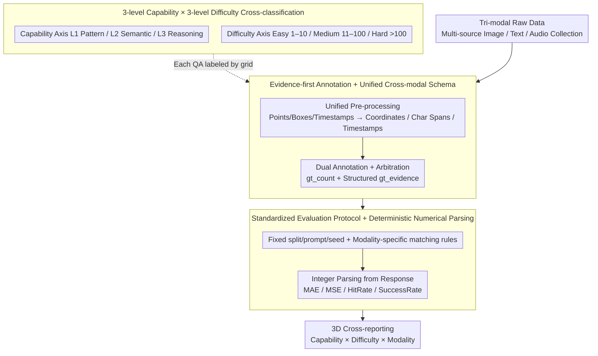

# UNICBench: UNIfied Counting Benchmark for MLLM

**Conference**: CVPR 2026  
**arXiv**: [2603.00595](https://arxiv.org/abs/2603.00595)  
**Code**: Public evaluation toolkit  
**Area**: Multimodal benchmark / MLLM evaluation  
**Keywords**: counting benchmark, multimodal LLM, image-text-audio, unified evaluation, stratified difficulty  

## TL;DR

Introducing UNICBench, the first unified cross-modal (Image/Text/Audio) multi-level counting benchmark, containing 14,301 QA pairs (5,508+5,888+2,905) categorized by three capability levels (Pattern/Semantic/Reasoning) × three difficulty levels (Easy/Medium/Hard). Systematic evaluation of 45 SOTA MLLMs reveals that basic counting tasks are approaching human level, while significant gaps remain in reasoning-level and difficult tasks.

## Background & Motivation

**Background**: Counting is a core cognitive ability of multimodal large models, related to number sense (a basic cognitive capability in humans and animals). While MLLMs have progressed rapidly in general VQA/reasoning benchmarks, they lack a benchmark for systematic cross-modal evaluation of "counting" as an independent capability.

**Limitations of Prior Work**: (1) Image counting dataset annotation formats are inconsistent (points/boxes/density maps), making them difficult to use directly for MLLM QA evaluation; (2) Text and audio counting data are extremely scarce—almost no public QA datasets exist for document deduplication counting or audio event counting; (3) Evaluation protocols are inconsistent—splits, prompts, seeds, and matching rules vary across works, making results incomparable; (4) High API costs and rate limits for closed-source models hinder fair cross-model comparison.

**Key Challenge**: Counting ability spans three levels: perceptual localization, semantic filtering, and rule-based reasoning. Existing benchmarks either cover only a single modality or fail to distinguish capability levels, making it impossible to systematically locate MLLM counting bottlenecks.

**Goal**: To establish a counting benchmark covering image/text/audio modalities with a unified QA format and evaluation protocol, capable of diagnosing capability shortcomings hierarchically.

**Key Insight**: Design a cross-classification system with three capability levels (Pattern/Semantic/Reasoning) and three difficulty levels (Easy/Medium/Hard), complemented by evidence-first GT and deterministic numerical parsing.

**Core Idea**: Decompose counting capability into three levels: perception counting → semantic filtering → rule-based reasoning. Evaluate uniformly across image/text/audio, using metrics like MAE/HitRate to hierarchically diagnose MLLM counting bottlenecks.

## Method

### Overall Architecture

UNICBench addresses the lack of a unified yardstick for "counting" in multimodal large models—where image, text, and audio modalities each have their own annotation formats and evaluation protocols, making horizontal comparisons impossible. It standardizes all tri-modal counting problems into a unified "Question—Evidence—Answer" structure: each problem includes an input (an image, a document, or an audio clip), a natural language question, an integer answer, and a traceable piece of evidence. This unified corpus is then stratified by two structures: first, each problem is cross-labeled by "counting capability required" and "scene difficulty"; second, a fixed evaluation protocol is established (standardizing splits, prompts, and seeds with modality-specific answer matching rules). Finally, results are reported across the "Capability × Difficulty × Modality" dimensions for direct performance diagnosis.

### Key Designs

**1. Capability × Difficulty Cross-classification: Localizing "Incorrect Counting"**

Reporting only an overall accuracy cannot explain whether a model fails due to poor perception or calculation. UNICBench slices counting capability into three levels along an increasing difficulty gradient: Pattern (L1) is direct perceptual counting where the answer is the size of the instance set $y=|E|$, e.g., "How many people are in the image?"; Semantic (L2) requires filtering by attributes or deduplication before counting, $y=|\{e \in E \mid P(e)\}|$, e.g., "How many people are wearing red clothes?"; Reasoning (L3) involves combinatorial counting according to rules, $y=g(|S_1|,\ldots)$, e.g., "How many folders were modified in 2022?". Difficulty levels are mapped to Easy (1–10), Medium (11–100), and Hard (>100) based on objective measures (target density, occlusion, repetition rate). This cross-labeling refines diagnosis to determine if the perception layer fails in dense scenes or if the reasoning layer fails even in simple scenes.

**2. Evidence-first Annotation + Unified Cross-modal Schema: Making Every Answer Traceable**

Meaningful cross-modal comparison requires that ground truth across the three modalities is the same type of data. UNICBench stores not just a `gt_count` for each question but also a structured `gt_evidence`—coordinates for images, character-level spans for text, and timestamps for audio. This logs the reasoning for the count, allowing answers to be verified individually. Question templates are also handled hierarchically: L1 uses deterministic templates to suppress linguistic variation, while L2/L3 allow free-form text with explicitly stated filtering rules to avoid ambiguity. Quality control involves independent double annotation plus multi-stage arbitration to achieve 100% consistency. This unified schema ensures ground truth is verifiable and allows "image counts" to be compared directly with "audio counts."

**3. Standardized Evaluation Protocol + Deterministic Numerical Parsing: Eliminating Incomparability**

Inconsistent splits, prompts, seeds, and matching rules in previous works made scores impossible to align. UNICBench standardizes these: splits, prompts, and random seeds are fixed, and matching rules are customized by modality (exact matching for numerical classes, $\epsilon$-tolerance for continuous quantities). Since model outputs are natural language, a deterministic numerical parser is employed to stably extract the integer from the response, preventing misjudgment due to formatting. Finally, a set of complementary metrics is reported—MAE and MSE to measure numerical deviation, SuccessRate to measure the model's ability to return parsable numbers, and HitRate@100%/@90%/@80% to measure hits within different error tolerances, evaluating both accuracy and robustness.

### Metric Definitions

UNICBench is an evaluation benchmark and does not involve model training. Core metrics are defined as: $MAE = \frac{1}{N}\sum|y_i - \hat{y}_i|$, $MSE = \frac{1}{N}\sum(y_i - \hat{y}_i)^2$ to measure deviation from ground truth; HitRate@X% is the accuracy within an X% error margin; SuccessRate is the ratio of models successfully returning a parsable number.

## Key Experimental Results

### Main Results (Top-10 Models in Image Modality)

| Model | Overall MAE↓ | Easy MAE↓ | Hard MAE↓ | Pattern MAE↓ | Reasoning MAE↓ |
|------|-------------|----------|----------|-------------|---------------|
| GPT-5-mini | 29.8 | 2.1 | 155.0 | 25.4 | 5.3 |
| o4-mini | 42.9 | 2.2 | 239.1 | 39.1 | 4.1 |
| GPT-4o | 43.2 | 2.4 | 238.4 | 41.7 | 5.4 |
| GPT-o3 | 49.0 | 2.8 | 277.1 | 44.3 | 4.4 |
| GPT-5 | 54.1 | 2.5 | 312.4 | 55.1 | 5.9 |
| Claude-Sonnet-4 | 78.1 | 5.4 | 444.6 | 68.8 | 4.4 |
| Gemini-2.5-Pro | 90.0 | 4.3 | 504.9 | 71.1 | 4.6 |
| Gemini-2.5-Flash | 140.5 | 12.0 | 694.2 | 131.4 | 6.7 |
| GLM-4.1V-9B | 97.9 | 3.0 | 542.2 | 90.0 | 3.1 |
| GPT-4o-mini | 73.3 | 2.3 | 424.6 | 72.7 | 5.3 |

### Cross-modal/Cross-difficulty Analysis

| Dimension | Finding |
|------|------|
| Easy vs Hard | Easy MAE 2-5, Hard MAE 100-700, a gap of over 100x |
| Pattern vs Reasoning | Image Reasoning MAE is low (3-7) but sample size is small (4.6%); high Pattern MAE comes from high-density scenes |
| Text Modality | Reasoning has the highest ratio (43.7%); models generally perform poorly on deduplication/cross-paragraph aggregation |
| Audio Modality | Ambient sound event density is low (1.56/sample); meeting speech density is extremely high (81.51/sample) |
| Long-tail Distribution | GT count distribution is heavily right-skewed/long-tailed; model error explodes in high-count regions |

### Key Findings

- On simple counting tasks (L1+Easy), models converge, with an Easy MAE gap of only 2-12.
- Large performance gaps exist in the Hard partition—the best (GPT-5-mini 155) and worst (Gemini-2.5-Flash 694) differ by 4.5x.
- Reasoning tasks in the text modality (deduplicating citations, cross-paragraph statistics) are currently the biggest shortcoming for MLLMs.
- Open-source models perform surprisingly well on Reasoning (GLM-4.1V MAE 3.1), but show significant gaps in Pattern.

## Highlights & Insights

- First unified counting benchmark across three modalities—evaluating "counting" as an independent core cognitive capability.
- 3-level Capability × 3-level Difficulty cross-classification enables precise diagnosis, identifying specific failure points.
- Evidence-first GT design ensures every answer is traceable and verifiable.
- Long-tail distribution analysis reveals systematic failures in high-count scenarios, indicating cognitive blind spots rather than random errors.
- Extensive evaluation of 45 models provides statistically significant and broad conclusions.

## Limitations & Future Work

- Audio counting data volume is relatively small (2,069 samples vs. 5,300 for image), limiting the robustness of audio-dimension findings.
- High evaluation costs for closed-source APIs (GPT-5 level) restrict replication and expansion.
- Cross-modal joint counting (e.g., using both vision and audio in video) is not yet addressed.
- Reasoning in the image modality accounts for only 4.6%, resulting in a small sample size for that level's conclusions.
- The impact of enhancement strategies like few-shot or chain-of-thought on counting performance has not been explored.

## Related Work & Insights

- **vs MMBench/MMMU**: General benchmarks do not systematically evaluate counting; UNICBench fills the gap for deep evaluation of this specific capability.
- **vs FSC-147/ShanghaiTech**: Traditional datasets use density maps or point annotations; UNICBench unifies them into QA format for MLLMs.
- **vs DocVQA/ChartQA**: These involve counting but not as a core capability; UNICBench focuses on counting and provides hierarchical diagnosis.
- The hierarchical evaluation paradigm (Capability × Difficulty × Modality) can be extended to benchmark other specific capabilities like spatial reasoning or temporal understanding.
- Systematic failures under long-tail distributions suggest that MLLMs may lack true "counting" ability and rely more on pattern matching.

## Rating

- Novelty: ⭐⭐⭐⭐ First unified cross-modal counting benchmark with a rational classification system.
- Experimental Thoroughness: ⭐⭐⭐⭐⭐ Comprehensive evaluation of 45 models with three-dimensional cross-analysis.
- Writing Quality: ⭐⭐⭐⭐ Clear classification system and rich visualizations.
- Value: ⭐⭐⭐⭐ Reveals systematic flaws in MLLM counting capabilities; the benchmark has long-term utility.

<!-- RELATED:START -->

## Related Papers

- [\[CVPR 2026\] CountGD++: Generalized Prompting for Open-World Counting](countgd_generalized_prompting_for_open-world_counting.md)
- [\[CVPR 2026\] Understanding Counting Mechanisms in Large Language and Vision-Language Models](understanding_counting_mechanisms_in_large_language_and_vision-language_models.md)
- [\[CVPR 2026\] CrossHOI-Bench: A Unified Benchmark for HOI Evaluation across Vision-Language Models and HOI-Specific Methods](crosshoi-bench_a_unified_benchmark_for_hoi_evaluation_across_vision-language_mod.md)
- [\[CVPR 2026\] TUNA: Taming Unified Visual Representations for Native Unified Multimodal Models](tuna_taming_unified_visual_representations_for_native_unified_multimodal_models.md)
- [\[CVPR 2026\] Rosetta Stone for Unified MLLMs: A Unified Tokenizer to Decipher Understanding and Generation](rosetta_stone_for_unified_mllms_a_unified_tokenizer_to_decipher_understanding_an.md)

<!-- RELATED:END -->
