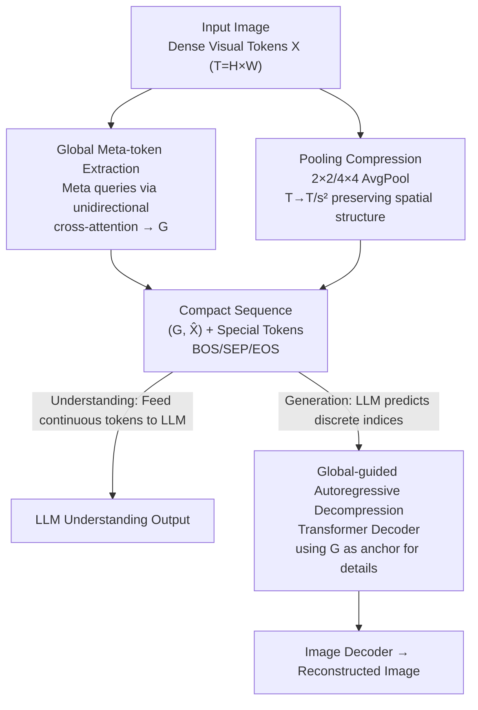

# UniCompress: Token Compression for Unified Vision-Language Understanding and Generation

**Conference**: CVPR 2026  
**Paper**: [CVF Open Access](https://openaccess.thecvf.com/content/CVPR2026/html/Wang_UniCompress_Token_Compression_for_Unified_Vision-Language_Understanding_and_Generation_CVPR_2026_paper.html)  
**Code**: TBD  
**Area**: Multimodal VLM / Visual Token Compression  
**Keywords**: Unified Multimodal Models, Visual Token Compression, Global Meta-tokens, Autoregressive Decompression, Plug-and-play

## TL;DR
UniCompress wraps off-the-shelf discrete tokenizers with lightweight "global meta-token extraction + average pooling compression + global-guided autoregressive decompression" modules. It reduces the visual token count of unified understanding-generation models by 4×, maintaining understanding performance with only minor generation degradation, all without retraining the language model.

## Background & Motivation

**Background**: Current multimodal research is moving toward "unified models"—using a single autoregressive framework to encode images via discrete tokenizers into visual tokens, which are concatenated with text tokens into a single sequence. A shared LLM backbone handles both understanding (captioning, VQA) and generation (image synthesis, editing). Architecture designs like UniTok, VILA-U, and VARGPT represent this trend.

**Limitations of Prior Work**: The critical bottleneck is **token efficiency**. Codebook-based tokenizers like VQ-VAE/VQGAN typically downsample a 512×512 image by 16× into $32 \times 32 = 1024$ tokens. Unified models require feeding and generating these long sequences, causing memory, training costs, and inference latency to collapse, making them unsuitable for resource-constrained scenarios like embodied AI. Simply sharing a tokenizer saves engineering complexity but does not reduce sequence length.

**Key Challenge**: While simple downsampling or uniform pruning works for understanding, it is **disastrous for generation**, with quality dropping by over 15%. This is because image generation relies on fine-grained, spatially consistent tokens for detail reconstruction, whereas understanding only requires coarse-grained semantics. Understanding and generation have fundamentally different token requirements.

**Second Constraint**: Integrating a more efficient tokenizer (e.g., the 1D tokenizer TiTok) usually requires retraining the downstream LLM from scratch at a high cost. Furthermore, 1D tokenizers lose spatial information, leading to poor generation. Thus, an ideal solution must be **modular and plug-and-play**, adaptable to any existing tokenizer without expensive LLM retraining.

**Key Insight**: Utilize "a few learnable global meta-tokens to carry scene-level semantics + pooling compression to retain local evidence + global tokens acting as semantic anchors during decompression to recover details autoregressively." This modular approach compresses visual sequences for both paths without modifying the LLM.

## Method

### Overall Architecture
UniCompress observes that compression harms generation because removing local tokens loses spatial information needed for reconstruction. It compensates by **separately extracting a set of "global meta-tokens" as scene-level constraints**, using them as anchors during decompression to recover lost local textures. The system adds three lightweight modules to the visual tokenizer while **leaving the LLM untouched**: (1) Global Token Extractor—uses unidirectional cross-attention to summarize the token field into a few meta-tokens; (2) Pooling Compressor—performs $2 \times 2$ or $4 \times 4$ non-overlapping average pooling; (3) Autoregressive Decompressor—a Transformer decoder that reconstructs the dense token grid from compact representations during generation.

Training follows two stages: First, the LLM is frozen while the "tokenizer + three modules" stack is trained using reconstruction loss to map dense sequences $X$ to $(G, \hat{X}^{cont})$ and back. Second, the entire compressed tokenizer is frozen, and the LLM is lightly fine-tuned to adapt to the compact sequences. During inference, understanding tasks project continuous compressed tokens into the LLM; generation tasks predict discrete indices for global and compressed local tokens, followed by codebook dequantization and decompression.

### Key Designs

**1. Global Meta-token Extraction: Concentrating Scene Semantics into Anchor Points**

Standard compression harms generation because cutting local tokens loses the "overall look" of the image. UniCompress addresses this by maintaining a separate stream for scene-level semantics. Given a continuous sequence $X \in \mathbb{R}^{T\times d}$ ($T=H\times W$), it introduces learnable meta-query tokens $Q \in \mathbb{R}^{N_g\times d}$ and extracts global context via **unidirectional** cross-attention:

$$G = \mathrm{MHA}(QW_Q,\ XW_K,\ XW_V),\qquad G \leftarrow \mathrm{LN}(Q+G)$$

Since $N_g \ll T$ (typically $N_g=4$), the overhead is minimal while providing strong global guidance for layout and relationships. The "unidirectional" nature prevents meta-tokens from polluting local tokens. Ablations show this query-based extraction significantly outperforms CLS tokens or global average pooling for generation (FID/CLIP).

**2. Average Pooling Compression + Dual Representation**

To shorten sequences, UniCompress applies **fixed-size average pooling** (e.g., $s=2$) to the $H \times W$ grid, reducing spatial redundancy while preserving coarse structure:

$$\hat{X}^{cont} = \mathrm{AvgPool}(X, s),\qquad \tilde{T} = T/s^2$$

Average pooling is chosen over top-k pruning or strided convolutions because it better preserves spatial layouts critical for generation. The system supports **dual representations**: understanding tasks use continuous features $\{G, \hat{X}^{cont}\}$, while generation tasks use the original codebook to quantize tokens into discrete indices $\hat{Z}^{(g)}$ and $\hat{Z}^{(x)}$.

**3. Global-guided Autoregressive Decompression: Recovering Details**

During generation, the LLM outputs discrete indices for global and compressed local tokens, which are dequantized to $\hat{G}$ and $\hat{X}^{deq}$. An autoregressive Transformer decoder $f_{dec}$ then predicts the original dense tokens $X$ by attending to previously generated dense tokens and cross-attending to $(\hat{G}, \hat{X}^{deq})$:

$$x_t = f_{dec}(X^{dense}_{<t},\ \hat{X}^{deq},\ \hat{G})$$

The compressed tokens provide local evidence, while global tokens act as semantic anchors. Ablations show that removing global tokens collapses long-range consistency, and replacing the autoregressive decompressor with a naive one results in over-smoothed textures.

**4. Two-stage Training Strategy**

- **Stage 1 (Tokenizer-side)**: Freeze the LLM and train the extractor, compressor, and decompressor using a reconstruction loss: $\mathcal{L}_{recon} = \mathcal{L}_{reg} + \lambda_{cb}\mathcal{L}_{cb}$.
- **Stage 2 (LLM-side)**: Freeze the tokenizer modules and fine-tune the LLM on compact sequences. Since the interface uses standard visual indices, UniCompress integrates into diverse backbones (e.g., UniFork, OpenUni) without architectural changes.

## Key Experimental Results

### Main Results: Minimal Understanding Loss
The compressed versions ($s=2$, 4× reduction) were compared across 6 backbones. Understanding performance (selected):

| Backbone | GQA | MME Cog. | POPE | MM-Bench |
|----------|-----|----------|------|----------|
| UNITOK | 55.71 | 251.79 | 82.66 | 40.34 |
| UNITOK-COMPRESSED | 53.07 | 235.00 | 79.36 | **42.14** |
| VARGPT | 58.12 | 269.30 | 88.04 | 44.22 |
| VARGPT-COMPRESSED | 55.90 | 265.83 | 84.99 | 41.15 |

Losses in understanding are $\le 3$ pt, with some backbones even improving on MM-Bench.

### Generation Results: Slight FID Increase
Generation on MJHQ-30K (FID $\downarrow$, CLIP $\uparrow$):

| Backbone | FID(↓) | CLIP(↑) | Compressed FID | Compressed CLIP |
|----------|--------|---------|----------------|-----------------|
| VILA-U | 14.80 | 29.8 | **16.37** | **28.9** |
| OPENUNI | 16.45 | 26.7 | 24.29 | 22.3 |

Lightweight backbones show minimal degradation, though diffusion-head architectures (OpenUni) exhibit higher sensitivity to token reduction.

### Key Findings
- **Asymmetric Robustness**: Understanding is robust to compression (GQA 55.71 $\rightarrow$ 49.00 at 16×), but generation is highly sensitive, dropping CLIP from 30.5 to ~11, justifying the 4× ($s=2$) "sweet spot."
- **Meta-tokens are Essential**: Query-based extraction significantly leads in generation quality compared to CLS tokens.
- **Efficiency Gain**: Generation inference speed increased by >40% (UniTok: 32.25 min $\rightarrow$ 18.96 min), with up to 41.8% reduction in latency.

## Highlights & Insights
- The **"Compress + Global Anchor + Autoregressive Reconstruction"** paradigm effectively turns lossy compression into a "guided restorable" process.
- **Plug-and-play non-retraining** is highly practical, allowing integration into various unified models (shared tokenizers, diffusion heads, etc.) with minimal cost.
- **Dual Representation** ensures that once compressed, the tokens are shared across both understanding and generation paths.

## Limitations & Future Work
- **Inconsistent generation degradation**: Performance varies significantly across different generation heads (e.g., Diffusion vs. Autoregressive).
- **Fixed Compression Ratio**: Uses a static $s=2$; content-adaptive compression ratios remain an area for exploration.
- **CLIP Alignment**: There is a noticeable drop in CLIP scores, indicating some loss in fine-grained text-to-image alignment.

## Related Work & Insights
- **vs. Understanding Pruning (FastV)**: Pruning methods are often task-specific and inference-only, while UniCompress operates on both paths.
- **vs. 1D Tokenizers (TiTok)**: TiTok loses spatial information and requires LLM retraining; UniCompress preserves spatiality and is modular.
- **vs. UniTok/VILA-U**: These models solve "unification" but not the "token length" problem; UniCompress is orthogonal and improves efficiency.

## Rating
- Novelty: ⭐⭐⭐⭐
- Experimental Thoroughness: ⭐⭐⭐⭐
- Writing Quality: ⭐⭐⭐⭐
- Value: ⭐⭐⭐⭐

## Related Papers

- [\[CVPR 2026\] Rosetta Stone for Unified MLLMs: A Unified Tokenizer to Decipher Understanding and Generation](rosetta_stone_for_unified_mllms_a_unified_tokenizer_to_decipher_understanding_an.md)
- [\[CVPR 2026\] EvoComp: Learning Visual Token Compression for Multimodal Large Language Models via Semantic-Guided Evolutionary Labeling](evocomp_learning_visual_token_compression_for_multimodal_large_language_models_v.md)
- [\[CVPR 2026\] OneCAT: Decoder-Only Auto-Regressive Model for Unified Understanding and Generation](onecat_decoder-only_auto-regressive_model_for_unified_understanding_and_generati.md)
- [\[CVPR 2026\] HBridge: H-Shape Bridging of Heterogeneous Experts for Unified Multimodal Understanding and Generation](hbridge_h-shape_bridging_of_heterogeneous_experts_for_unified_multimodal_underst.md)
- [\[CVPR 2026\] Unified Personalized Understanding, Generating and Editing](unified_personalized_understanding_generating_and_editing.md)

<!-- RELATED:END -->

<!-- RELATED:START -->

## Related Papers

- [\[CVPR 2026\] Rosetta Stone for Unified MLLMs: A Unified Tokenizer to Decipher Understanding and Generation](rosetta_stone_for_unified_mllms_a_unified_tokenizer_to_decipher_understanding_an.md)
- [\[CVPR 2026\] ApET: Approximation-Error Guided Token Compression for Efficient VLMs](apet_approximation-error_guided_token_compression_for_efficient_vlms.md)
- [\[CVPR 2026\] OmniZip: Audio-Guided Dynamic Token Compression for Fast Omnimodal Large Language Models](omnizip_audio-guided_dynamic_token_compression_for_fast_omnimodal_large_language.md)
- [\[CVPR 2026\] Unified Personalized Understanding, Generating and Editing](unified_personalized_understanding_generating_and_editing.md)
- [\[CVPR 2026\] DuetSVG: Unified Multimodal SVG Generation with Internal Visual Guidance](duetsvg_unified_multimodal_svg_generation_with_internal_visual_guidance.md)

<!-- RELATED:END -->
