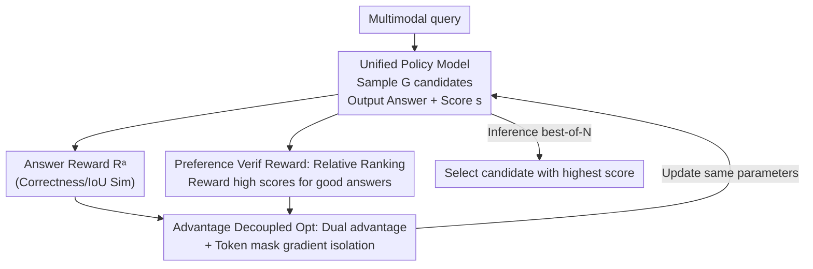

# Unified Generation and Self-Verification for Vision-Language Models via Advantage Decoupled Preference Optimization

**Conference**: CVPR 2026  
**Paper**: [CVF Open Access](https://openaccess.thecvf.com/content/CVPR2026/html/Qiu_Unified_Generation_and_Self-Verification_for_Vision-Language_Models_via_Advantage_Decoupled_CVPR_2026_paper.html)  
**Code**: https://github.com/ZJUSCL/ADPO  
**Area**: Multimodal VLM  
**Keywords**: Test-time scaling, self-verification, preference optimization, GRPO, best-of-N

## TL;DR
ADPO employs a reinforcement learning objective to enable the **same VLM to both generate answers and provide self-verification scores**. By using a "preference verification reward" to address class imbalance and "advantage decoupled optimization" to prevent reward hacking, this single-model best-of-N selection outperforms traditional dual-model "generator + verifier" setups across mathematics, visual grounding, and mobile agent tasks, while reducing inference latency by up to $53.5\%$.

## Background & Motivation
**Background**: Test-time scaling is a primary method for enhancing the reliability of large models, following two paths: serial scaling (generating more thinking tokens, e.g., DeepSeek-R1, o1) and parallel scaling (sampling multiple candidates and selecting the best). While serial scaling is effective for math and code, multiple studies have found that "thinking longer" yields negligible gains in multimodal tasks like image classification or spatial understanding. Consequently, parallel scaling (best-of-N) has emerged as a more robust direction for multimodal models.

**Limitations of Prior Work**: The bottleneck for best-of-N is "how to select the correct answer from N candidates." Current mainstream approaches deploy **two independent models**: a generator to produce candidates and a verifier (reward model) for scoring. This introduces two major drawbacks: training requires two sets of data and two models, doubling resources; and deployment requires running both models simultaneously, increasing computational overhead. Conversely, training only the generator (using majority voting) or only the verifier (using a base model for generation) yields significantly worse performance.

**Key Challenge**: Can a **single policy model** perform both generation and self-verification? While efficient, this approach faces two major pitfalls. First is **class imbalance**: when a model uses binary rewards to judge its own correctness, it becomes increasingly accurate during training. Positive samples (correct answers) can exceed $80\%$, causing verification scores to collapse into "always scoring 1," resulting in vanishing gradients and zero discriminative power (Fig. 2 shows collapse within 17 steps). Second is **reward hacking**: if answer rewards and verification rewards are simply summed, the model learns to "deliberately generate a clearly wrong answer and then assign it a very low verification score" to achieve a high total reward, severely degrading generation quality.

**Goal / Core Idea**: To simultaneously learn generation and self-verification within a unified GRPO framework. The two pitfalls are addressed via: **preference verification rewards** (transforming verification from absolute correctness to relative intra-group ranking) to resist class imbalance, and **advantage decoupled optimization** (calculating advantages separately by reward type and using token masks to isolate gradients) to prevent reward hacking.

## Method

### Overall Architecture
ADPO (Advantage Decoupled Preference Optimization) extends GRPO into a unified paradigm where a single policy model outputs both answers and verification scores. For each multimodal query, the model reasons within `<think></think>`, provides an answer in `<answer></answer>`, and acts as a "correctness evaluation assistant" to output a self-verification score $s \in [0,1]$ in `<score></score>`. During training, $G=8$ candidate rollouts are sampled per query, receiving two types of rewards: an **answer reward** $R^a$ measuring quality and a **preference verification reward** $R^p$ measuring the rationality of the score ranking. These rewards are normalized within the group to calculate individual advantages. Mutually exclusive token masks then direct gradients to "generation tokens" and "verification tokens" respectively. During inference, N candidates are sampled via batch decoding, and the candidate with the **highest self-verification score** is selected as the final output.

### Key Designs

**1. Unified Generation-Verification Strategy: No external verifier for best-of-N**

Traditional best-of-N relies either on majority voting (ignoring quality, just counting) or an external reward model (expensive to train and deploy). ADPO enables the same policy model to output a self-verification score $s$ following the answer. During inference, it simply selects the candidate with the highest score. This allows verification and generation to share the same weights and multimodal representations without maintaining separate models. Since the score is generated concurrently, no independent verifier pass is required. Table 7 shows that on MathVista best-of-8, ADPO achieves $65.0\%$ accuracy with $2.6s$ latency, compared to $60.8\%/5.6s$ for "GRPO as generator + GRPO as judge."

**2. Preference Verification Reward: Handling class imbalance via relative ranking**

Naive self-verification rewards are binary: given thresholds $\tau_s, \tau_a$, a reward $R^b=1$ is given if $(s-\tau_s)(R^a-\tau_a)>0$. As the model improves, positive samples overwhelm negatives, and the model can simply assign high scores to be "correct," leading to score collapse and vanishing gradients.

ADPO reformulates verification as a **ranking problem**. Instead of using fixed thresholds, it adaptively partitions positive and negative sets within a group, rewarding the model for "scoring better answers higher." For sample $i$, the preference verification reward is:

$$R^p_i = \frac{1}{\max(|C_i|,1)} \sum_{j\in C_i} \mathbb{1}\big[(s_i-s_j)(R^a_i-R^a_j)>0\big]$$

This represents the "ranking hit rate" within the comparison set $C_i$. For discrete tasks (math, agent), $C_i$ is defined by correctness. For continuous tasks (visual grounding via IoU), a margin $\gamma > 0$ is introduced to identify negative samples. As long as quality differences exist within a group, gradients remain dense, even under extreme class imbalance.

**3. Advantage Decoupled Optimization: Preventing reward hacking via dual advantages**

Simply summing rewards ($R_{total}=R^a+R^p$) leads to conflict, as generation and verification are distinct objectives. The model may exploit the objective by **deliberately providing a wrong answer paired with a very low verification score**, as "predicting an error correctly" satisfies the ranking reward.

ADPO solves this by **decoupling advantages by reward type + token-level masks**. Advantages $\hat{A}^{(a)}$ (from answer rewards) and $\hat{A}^{(p)}$ (from preference rewards) are calculated separately. Two disjoint token masks are defined: $M^a$ for answer and reasoning tokens, and $M^p$ for verification tokens. The unified objective is:

$$\mathcal{J}(\theta) = M^a \odot \mathcal{J}_\theta(\hat{A}^{(a)}) + M^p \odot \mathcal{J}_\theta(\hat{A}^{(p)})$$

where $\odot$ denotes element-wise multiplication. Consequently, answer quality is driven **only** by $\hat{A}^{(a)}$, and score calibration is driven **only** by $\hat{A}^{(p)}$. The model can no longer compensate for a wrong answer by lowering its verification score. Ablations show that decoupling improves best@8 by $+2.8\%$ and AUC by $+34.1\%$ on GUI agents.

### Loss & Training
The framework is based on the GRPO PPO-style clipped objective. $R^a$ is task-dependent: discrete tasks use binary matching $R^a_{discrete} \in \{0,1\}$, while continuous tasks use similarity $R^a_{continuous} \in [0,1]$. Hyperparameters: learning rate $1\times10^{-6}$, batch size 128, group size $G=8$, clipping $\varepsilon=0.2$, KL coefficient $\beta=0.01$. The model is trained on Qwen2-VL-7B (Math) or Qwen2.5-VL-7B (Grounding/Agent) for $1200$--$8000$ steps.

## Key Experimental Results

### Main Results
Performance was evaluated across five benchmarks: MathVista (in-domain math), MMMU (OOD math), ReasonSeg (visual grounding), AndroidControl, and GUI Odyssey (mobile agents). ADPO gains over GRPO (majority voting) at equivalent sampling budgets:

| Task | Metric | ADPO best-of-N | vs GRPO(majority) | Key Observation |
|--------|------|------|----------|------|
| MathVista | Acc % | 64.8/65.0/65.3 (N=4/8/12) | +1.4/+2.1/+1.9 | Pass@1 remains stable; best-of-N gains are consistent. |
| MMMU | Acc % | 50.8/52.1/52.3 | +1.4/+1.0/+0.6 | Sustained gains in OOD scenarios. |
| ReasonSeg | cIoU | 61.1/61.2/61.6 | +1.7/+1.6/+2.2 | +3.6 to +4.0 over base majority voting. |
| AndroidControl | SR % | 72.7/72.7/72.9 | +1.7/+1.9/+1.8 | +14 to +16.7 over base. |

Ours **pass@1 generation quality is nearly identical to pure GRPO**, but ADPO's reliable self-verification allows it to significantly outperform other methods as N increases.

### Ablation Study
| Configuration | Key Metric | Insight |
|------|---------|------|
| Preference vs. Binary | AUC +1.3% to +11.8% | Ranking supervision resists collapse; scores remain discriminative. |
| Decoupled vs. Entangled | Agent AUC +34.1%; best@8 +2.8% | Gradient isolation effectively stops reward hacking. |
| Margin $\gamma$ (ReasonSeg) | Optimal at $\gamma=0.1$ | Balanced discriminative power and signal density. |
| Efficiency (MathVista) | ADPO 2.6s vs GRPO-judge 5.6s | Higher accuracy with nearly 50% lower latency. |

### Key Findings
- **Decoupled optimization is most critical for agent tasks**, where long sequences and rewards are highly susceptible to hacking.
- **Value of preference rewards increases with class imbalance**: while binary rewards collapse as the model improves, preference rewards maintain dense gradients.
- **The paradigm provides "free" best-of-N gains**: verification is a byproduct of generation, requiring almost zero additional inference cost while eliminating external verifiers.

## Highlights & Insights
- **Reformulating verification as ranking is pivotal**: Absolute thresholds inevitably collapse under imbalance; relative ranking ensures gradients persist as long as quality variance exists.
- **Token-level masks are a clean solution to reward hacking**: Instead of complex reward engineering, physically isolating gradients for conflicting objectives is simple and effective.
- **Unified models are deployment-friendly**: Reducing latency by half and eliminating independent reward models represents a significant practical advantage.

## Limitations & Future Work
- **Scores are rankings, not calibrated probabilities**: Scores cannot be used directly as "absolute probability of correctness" without further calibration.
- **Limited to 7B base models**: It remains unverified if smaller models can learn reliable verification or if the laws scale to much larger models.
- **Manual margin tuning**: Continuous tasks rely on $\gamma$, which currently requires manual adjustment per task.
- **Modest absolute gains**: In math and grounding, gains are around $+1$--$2$ points; the primary value lies in efficiency and the removal of external components.

## Related Work & Insights
Compared to **dual-model "Generator + Verifier"** (e.g., MM-Verifier), ADPO uses half the resources and achieves higher accuracy (MathVista best-of-8: $65.0\%$ vs. $62.5\%$). Compared to **pure GRPO + Majority Voting**, ADPO identifies correct answers even when they are in the minority. Unlike **serial scaling** (DeepSeek-R1), ADPO relies on parallel sampling, which is currently more effective for multimodal tasks.

## Rating
- Novelty: ⭐⭐⭐⭐ (Ranking rewards + decoupled masks effectively address unified verification pitfalls.)
- Experimental Thoroughness: ⭐⭐⭐⭐ (Broad coverage across domains and thorough ablations, though limited base model variety.)
- Writing Quality: ⭐⭐⭐⭐ (Clear logical flow between challenges and mechanisms.)
- Value: ⭐⭐⭐⭐ (Practical utility for deploying best-of-N in real-world VLM systems.)

<!-- RELATED:START -->

## Related Papers

- [\[CVPR 2026\] Dynamics-Aware Preference Optimization for Vision-Language Models](dynamics-aware_preference_optimization_for_vision-language_models.md)
- [\[CVPR 2026\] Self-Consistency for LLM-Based Motion Trajectory Generation and Verification](self-consistency_for_llm-based_motion_trajectory_generation_and_verification.md)
- [\[ICLR 2026\] Uni-DPO: A Unified Paradigm for Dynamic Preference Optimization of LLMs](../../ICLR2026/multimodal_vlm/uni-dpo_a_unified_paradigm_for_dynamic_preference_optimization_of_llms.md)
- [\[CVPR 2026\] VisPlay: Self-Evolving Vision-Language Models](visplay_self-evolving_vision-language_models.md)
- [\[CVPR 2026\] HOG-Layout: Hierarchical 3D Scene Generation, Optimization and Editing via Vision-Language Models](hog_layout_hierarchical_3d_scene_generation_optimization_and_editing.md)

<!-- RELATED:END -->
