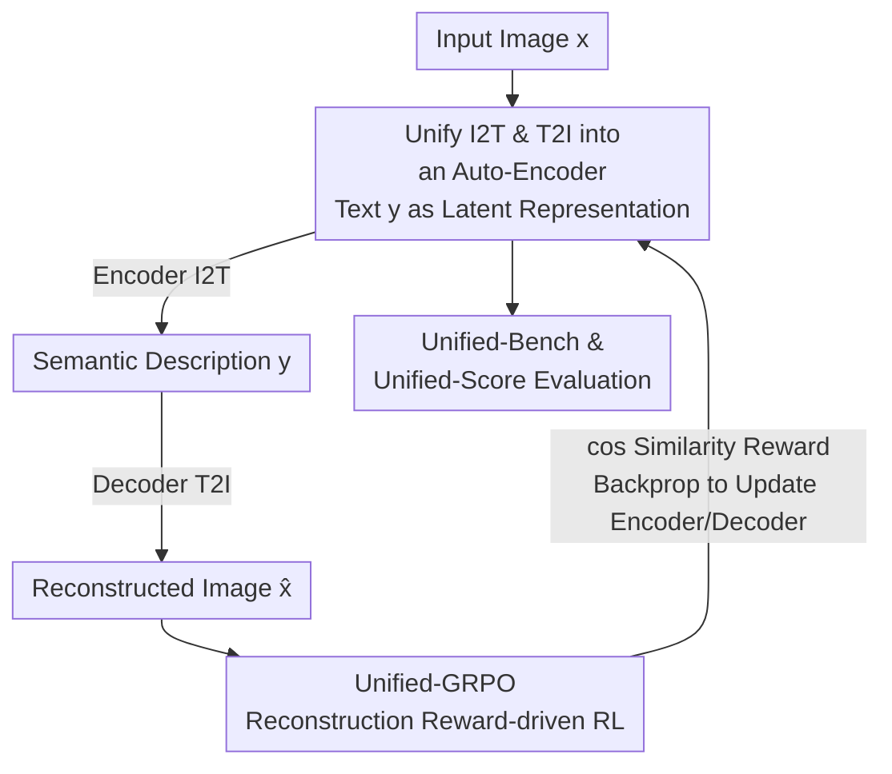

# Unified Multimodal Models as Auto-Encoders

**Conference**: CVPR 2026  
**Paper**: [CVF Open Access](https://openaccess.thecvf.com/content/CVPR2026/html/Yan_Unified_Multimodal_Models_as_Auto-Encoders_CVPR_2026_paper.html)  
**Code**: TBD  
**Area**: Multimodal VLMs  
**Keywords**: Unified Multimodal Models, Auto-Encoder Perspective, Reconstruction Reinforcement Learning, GRPO, Understanding-Generation Synergy

## TL;DR
This paper reimagines image-to-text understanding (I2T) and text-to-image generation (T2I) as an **Auto-Encoder (AE)**, where text serves as the intermediate latent representation, the understanding module acts as the encoder, and the generation module acts as the decoder. Utilizing the similarity between the reconstructed and original images as a reinforcement learning reward (Unified-GRPO) to **simultaneously** optimize both ends, the approach enables mutual reinforcement between understanding and generation. This raises GenEval from 0.73 to 0.86 and boosts small object detection from 0.05 to 0.45.

## Background & Motivation

**Background**: Unified Multimodal Models (UMMs) capable of performing both "understanding" and "generation" have recently gained significant popularity. The common approach is to couple an understanding module with a generation module, either by sharing an autoregressive backbone (e.g., Janus-Pro) or by using an LLM to provide linguistic priors to a diffusion generator (MM-DiT) (e.g., UniWorld, MetaQuery).

**Limitations of Prior Work**: Directly coupling the two often leads to suboptimal results. Multiple studies have shown that **training with diffusion generation objectives impairs understanding performance and learned representations, and vice versa**—the optimization objectives of the two tasks conflict, making joint training highly fragile. Consequently, another line of work simply "decouples" the two, training understanding and generation separately.

**Key Challenge**: Although decoupling ensures stability, **it forfeits the opportunity for cross-task mutual facilitation**. The authors sharply point out that if the two massive modules are merely laid side-by-side without any verifiable mutual benefit, the so-called "unification" degenerates into a superficial concatenation of two independent components. The root of the problem lies in always treating I2T and T2I as isolated tasks, lacking a shared, **optimizable** objective that binds them together.

**Goal**: To establish a principled, optimizable "bridge" that enables understanding and generation to actively reinforce each other during training, rather than mutually degrading.

**Key Insight**: The authors shift the conceptual perspective, viewing I2T and T2I as an **Auto-Encoder (AE)**. Text serves as the intermediate latent representation: the encoder extracts semantic descriptions from the input image (I2T), and the decoder reconstructs the image from these descriptions (T2I). This perspective inherently provides a simple yet powerful criterion: **if the encoder truly "understands" the image, it should compress all key visual structures into the text; if the decoder truly "comprehends" the text, it should faithfully reconstruct those structures**. Thus, "reconstruction quality" becomes a proxy objective for simultaneously strengthening both ends.

**Core Idea**: Using "reconstruction similarity" as a reinforcement learning reward, the understanding module (encoder) and the generation module (decoder) are bound into an auto-encoder closed loop for joint optimization. High reconstruction quality indicates comprehensive understanding and faithful generation, establishing a self-evolving positive feedback loop.

## Method

### Overall Architecture

The entire methodology revolves around a single core sentence: **given an input image $x$, a UMM first generates a semantic description $y$ (I2T), then reconstructs $\hat{x}$ from $y$ (T2I), and finally utilizes reinforcement learning to maximize the semantic similarity between $x$ and $\hat{x}$.** This "image $\rightarrow$ text $\rightarrow$ image" reconstruction pipeline constitutes a closed auto-encoding loop: text $y$ is the compressed latent representation, and the reconstruction error backpropagates to force the encoder to describe more comprehensively and the decoder to reconstruct more accurately.

The authors term this training paradigm **Unified-GRPO** and demonstrate its applicability to two mainstream UMM architectures:

- **UMM-1**: An autoregressive LLM is responsible for understanding and providing linguistic priors to a diffusion generator (MM-DiT) (e.g., UniWorld, MetaQuery style). During training, only the LLM is updated, while the diffusion decoder is frozen and treated as part of the reward environment.
- **UMM-2**: A single autoregressive model performs both understanding and generation within a shared token space (e.g., Janus-Pro, X-Omni style). Since encoding and decoding reside in the same AR model, it can self-co-evolve within a single token space.

Finally, the authors introduce a dedicated benchmark, **Unified-Bench**, to evaluate the "degree of unification," directly verifying whether the extracted semantics are faithful enough to reconstruct the image using reconstruction similarity (Unified-Score). The overall flowchart is as follows:

### Key Designs

**1. Unifying I2T and T2I as an Auto-Encoder: Text as the Intermediate Latent Representation**

This is the conceptual cornerstone of the paper, addressing the core limitation of treating understanding and generation as isolated tasks with no joint optimizable objective. The authors argue that image-to-text (encoding) and text-to-image (decoding) are fundamentally two halves of an auto-encoder, with text $y$ acting as the latent code. The criterion is "faithful reconstruction"—a good encoder should compress **all essential structures** of the image into text, and a good decoder should **faithfully restore** those structures. While seemingly a conceptual rephrasing, its value lies in providing a **jointly beneficial paradigm**: instead of optimizing I2T and T2I with conflicting losses, optimizing "reconstruction similarity" naturally aligns both ends toward a single goal. Consequently, reconstruction quality serves as a proxy to elevate both components, transforming "unification" from a conceptual buzzword into a calculable and optimizable metric.

**2. Unified-GRPO: Reconstruction Reward-Driven Co-Optimization of Dual Modules**

With the AE perspective established, a training algorithm is required to backpropagate reconstruction errors and optimize both ends. This is addressed by Unified-GRPO, which extends GRPO (already validated on LLMs) to UMMs. For **UMM-1**: the autoregressive LLM $\pi_\phi$ is the trained policy, while the frozen diffusion generator $p_\theta$ acts as the reward environment alongside a CLIP encoder. Given an input image $x$, a group of $G$ captions $\{y^{(i)}\}_{i=1}^{G}$ is sampled from the old policy $\pi_{\phi_{old}}$. For each $y^{(i)}$, the final hidden state $h_T^{(i)}$ is projected into diffusion conditioning $c^{(i)} = g(h_T^{(i)})$, based on which the reconstructed image is synthesized: $\tilde{x}^{(i)} \sim p_\theta(\cdot \mid c^{(i)})$. The LLM is then updated using the GRPO objective with the token ratio $r_t^{(i)}(\phi) = \pi_\phi(y_t^{(i)} \mid x, y_{<t}^{(i)}) / \pi_{\phi_{old}}(y_t^{(i)} \mid x, y_{<t}^{(i)})$, forcing the LLM to output latent representations that yield optimal diffusion reconstruction. For **UMM-2**: the decoder $D_\phi$ is inherently autoregressive, making the pipeline isomorphic: $x \xrightarrow{\pi_\phi} y \xrightarrow{\pi_\phi} \tilde{x}$ with reconstruction reward $R(x,\tilde{x}) = \cos(f_{CLIP}(x), f_{CLIP}(\tilde{x}))$, allowing the same AR model to co-evolve understanding and generation within the shared token space. The key distinction between this and works like T2I-R1 or AR-GRPO (which use RL for AR image generation) is that the reward is not an external aesthetic or alignment score, but the **similarity between the input and reconstructed images**. Thus, it jointly optimizes both understanding and generation, establishing a self-reinforcing loop: more comprehensive encoding $\rightarrow$ more faithful generation $\rightarrow$ forcing finer encoding.

**3. Unified-Bench & Unified-Score: Direct Measurement of Unification via Reconstruction Similarity**

To fill the evaluation gap where existing benchmarks assess either image realism or caption fidelity but fail to evaluate system-wide unification, the authors introduce Unified-Bench. The core metric, **Unified-Score**, represents reconstruction similarity: starting with 100 diverse source images, the model first generates captions, synthesizes images from its own captions, and then evaluates the similarity between the reconstructed and source images across four visual backbones (CLIP, LongCLIP, DINO-v2, DINO-v3) to compute a comprehensive score (Protocol-1). This simultaneously evaluates whether the extracted semantics support faithful reconstruction and whether the reconstruction validates understanding completeness, corresponding to the two halves of the closed loop. Additionally, Protocol-2 utilizes four commercial LLMs (Claude-4.1, GPT-4o, Grok-4, o4-mini) as judges to evaluate the **pairwise winning rate** of the model's captions relative to baselines regarding their friendliness to reconstruction. This benchmark converts the diagnostic of "genuine unification" into a quantifiable metric.

### Loss & Training
Training is conducted via a GRPO-style post-training phase. The core reward is the cosine similarity between the input image and the reconstructed image in the CLIP feature space: $R(x,\tilde{x}) = \cos(f_{CLIP}(x), f_{CLIP}(\tilde{x}))$. UMM-1 updates only the LLM encoder while freezing the diffusion decoder, whereas UMM-2 updates the single AR model end-to-end. At each step, a candidate set of captions is sampled for each image, and the policy is updated based on the intra-group relative advantage of GRPO. ⚠️ Note that the GRPO objective equation is referenced as Eq.(??) in the main text due to PDF parsing issues; please refer to the original paper for specific KL/clipping terms.

## Key Experimental Results

UniWorld is selected as the main backbone (as it exhibits stronger generation and understanding capabilities than Janus), spanning three categories of benchmarks: understanding, generation, and unification.

### Main Results

Unified-GRPO is applied to two representative UMMs, UniWorld and Janus-Pro, with comprehensive comparisons across understanding (MMB/MMMU), generation (GenEval/DPGBench), and unification (Unified-Score):

| Model | MMB | MMMU | GenEval | DPGBench | Unified-Score |
|------|-----|------|---------|----------|---------------|
| UniWorld | 83.5 | 58.6 | 84.0 | 81.2 | 79.0 |
| UniWorld + Ours | 84.8 | 58.2 | 89.0 (+5%) | 86.4 (+5.2%) | 86.1 (+7.1%) |
| Janus-Pro | 79.2 | 41.0 | 80.0 | 84.2 | 82.8 |
| Janus-Pro + Ours | 80.3 | 41.6 | 84.3 (+4.3%) | 88.9 (+4.7%) | 89.1 (+6.3%) |

The gains are most pronounced in generation and unification (the two areas directly optimized by the reconstruction reward, with increases of 4–5% and 6%+ respectively), while understanding shows moderate improvements—which the authors attribute to current generation models' limited capabilities, where imperfect reconstruction injects negative feedback into the encoder.

GenEval Text-to-Image main results (overall UAE score is 0.86 without LLM rewriting, and 0.89 with rewriting, achieving state-of-the-art among unified models):

| Method | Counting | Colors | Color attr. | Overall |
|------|----------|--------|-------------|---------|
| Janus-Pro | 0.59 | 0.90 | 0.79 | 0.80 |
| OmniGen2 | 0.64 | 0.88 | 0.76 | 0.80 |
| BAGEL | 0.81 | 0.88 | 0.63 | 0.82 |
| BAGEL† (w/ rewriting) | 0.84 | 0.95 | 0.77 | 0.88 |
| **UAE** | **0.84** | 0.90 | **0.79** | 0.86 |
| **UAE†** (w/ rewriting) | 0.82 | 0.95 | **0.84** | **0.89** |

On the more challenging GenEval++ benchmark (requiring $\ge 3$ objects with multiple attributes and spatial relations), UAE achieves an overall score of 0.475, significantly outperforming the runner-up BAGEL's 0.371, particularly in subcategories requiring multi-constraint satisfaction such as Color/Count (0.550) and Pos/Count (0.450).

### Ablation Study

Unified-Bench Protocol-1 (Unification degree / reconstruction similarity) horizontal comparison, where UAE's overall score surpasses GPT-4o-Image:

| Method | CLIP | LongCLIP | DINO-v2 | DINO-v3 | Overall |
|------|------|----------|---------|---------|---------|
| GPT-4o-Image | 90.42 | **94.37** | 81.74 | 77.27 | 85.95 |
| BAGEL | 88.97 | 93.35 | 78.55 | 73.05 | 83.48 |
| Janus-Pro | 88.72 | 93.45 | 78.30 | 70.61 | 82.77 |
| UniWorld-V1 | 85.49 | 91.53 | 72.12 | 66.83 | 78.99 |
| **UAE** | **90.50** | 94.35 | **81.98** | **77.54** | **86.09** |

Fine-grained perception (MMT-Bench, Qwen-3B baseline vs. Ours), providing the strongest evidence of "generation aiding understanding":

| Subtask | Qwen-2.5-VL-3B | Ours (Qwen-3B) | Gain |
|--------|----------------|----------------|------|
| Fine-grained Perception Overall | 32.5 | 56.9 | +24.4 |
| Small Object Detection | 0.05 | 0.45 | +40 |
| Person Re-ID | 0.15 | 0.75 | +60 |
| Transparent Object Det. | 0.15 | 0.45 | +30 |
| Salient Obj. Detection RGBD | 0.25 | 0.45 | +20 |

### Key Findings
- **Generation facilitates understanding**: Following reconstruction RL training, the 3B understanding model shows significant improvements in fine-grained perception tasks, such as small object detection (0.05 $\rightarrow$ 0.45) and person re-identification (0.15 $\rightarrow$ 0.75). To achieve higher reconstruction similarity, the encoder is driven to extract finer and more comprehensive semantics.
- **Unification degree surpasses GPT-4o-Image**: UAE achieves a Unified-Score of 86.09, marginally outperforming GPT-4o-Image's 85.95 and ranking first across three backbones: CLIP, DINO-v2, and DINO-v3. This suggests that layout-level and texture-level semantics are successfully preserved.
- **An interpretable trade-off exists**: Performance degrades in OCR-heavy scenarios (on MMT-Bench high-level tasks: OCR $-6.2$, DU $-11.6$, IR $-6.2$). The reconstruction reward prioritizes global semantic recovery, which can be disadvantageous for dense character recognition tasks requiring verbatim precision.
- **Architectural versatility**: The same method consistently yields improvements across both UMM-1 (LLM+DiT) and UMM-2 (pure AR) architectures, demonstrating that the Auto-Encoder perspective is independent of the specific generator formulation.

## Highlights & Insights
- **Translating "unification" from a slogan into an optimizable metric**: Using reconstruction similarity as a reward is a clever design—it prevents I2T and T2I from being trained in isolation, aligning them toward a shared objective and resolving the longstanding issue of mutual degradation during joint training.
- **Reconstruction as a proxy for understanding**: Operationalizing the assessment of comprehension as "faithfulness of reconstruction" provides a highly transferable criterion. In theory, any encoder-decoder task (speech, video, 3D) can adopt this self-supervised RL reward to motivate more exhaustive encoding.
- **Transparent reporting of negative trade-offs**: The authors do not hide the performance drops in OCR-heavy scenarios but rather analyze them as interpretable evidence of the reconstruction reward favoring global semantics. This consistent analysis is more compelling than merely reporting SOTA improvements.
- **Custom benchmark filling an evaluation gap**: Unified-Bench measures the "degree of unification" directly via closed-loop reconstruction, which is more aligned with the objective than independently evaluating image realism or caption fidelity, making it highly reusable for future unification models.

## Limitations & Future Work
- **Bounded by generator capacity limit**: The authors explicitly acknowledge that the gains on the understanding side are constrained by the current generator's imperfect reconstruction, which can inject negative feedback into the encoder. A stronger generator would raise the performance ceiling of this loop.
- **Degradation in OCR / document / text-image retrieval tasks**: Because the reconstruction reward favors global semantic coherence over verbatim precision, it is disadvantageous for dense text recognition scenes. Caution or specialized task constraints may be necessary in practice.
- **Reward dependency on CLIP features**: The similarity metric relies on CLIP cosine similarity, which might inherit CLIP's inherent semantic biases (such as sensitivity to texture/layout but insensitivity to precise counting or text elements). Employing stronger similarity metrics or multi-backbone ensembles could mitigate this trade-off.
- **GRPO objective formula is missing in the public version** (referenced as Eq.(??)); implementation efforts must verify clipping and KL details against the official repository. ⚠️ Subject to the original text.

## Related Work & Insights
- **vs. Decoupled UMMs (e.g., works training understanding/generation separately)**: These approaches train the two ends separately to avoid mutual damage, sacrificing cross-task synergy. This work does the opposite, using a closed-loop reconstruction to share a single objective and facilitate mutual improvement, demonstrating that unification can indeed yield verifiable gains.
- **vs. T2I-R1 / AR-GRPO**: These works also use RL to improve autoregressive image generation, but their rewards come from external alignment/aesthetic signals, optimizing only the generation side. In contrast, this work's reward is the similarity between the input and reconstructed images, allowing for the **simultaneous** optimization of both understanding and generation.
- **vs. UMM backbones like Janus-Pro / UniWorld**: This work does not propose a new architecture but rather a **general post-training framework** that can be directly applied to existing UMMs to boost performance, acting as a complementary rather than competing method.

## Rating
- Novelty: ⭐⭐⭐⭐⭐ Reconceptualizing unified multimodality as an Auto-Encoder and optimizing with reconstruction RL is a fresh and practical approach that resolves the persistent training mutual-degradation challenge.
- Experimental Thoroughness: ⭐⭐⭐⭐ Covers understanding, generation, and unification benchmarks, evaluates two architectures, and introduces a custom benchmark, showcasing a complete chain of evidence. Note that the small understanding gain and OCR trade-off are honestly analyzed, leaving room for future improvements.
- Writing Quality: ⭐⭐⭐⭐ Clear motivation and straightforward criteria, though the missing equations in the public version are a minor downside.
- Value: ⭐⭐⭐⭐⭐ A general post-training framework that can be applied out-of-the-box to enhance existing UMMs. The "reconstruction as a proxy for understanding" concept is highly transferable to other encoder-decoder tasks.

<!-- RELATED:START -->

## Related Papers

- [\[CVPR 2026\] OneCAT: Decoder-Only Auto-Regressive Model for Unified Understanding and Generation](onecat_decoder-only_auto-regressive_model_for_unified_understanding_and_generati.md)
- [\[CVPR 2026\] TUNA: Taming Unified Visual Representations for Native Unified Multimodal Models](tuna_taming_unified_visual_representations_for_native_unified_multimodal_models.md)
- [\[ICLR 2026\] Reconstruction Alignment Improves Unified Multimodal Models](../../ICLR2026/multimodal_vlm/reconstruction_alignment_improves_unified_multimodal_models.md)
- [\[CVPR 2026\] Foundation Encoders Are All You Need for Preference-Aware Personalization](foundation_encoders_are_all_you_need_for_preference-aware_personalization.md)
- [\[CVPR 2026\] DuetSVG: Unified Multimodal SVG Generation with Internal Visual Guidance](duetsvg_unified_multimodal_svg_generation_with_internal_visual_guidance.md)

<!-- RELATED:END -->
