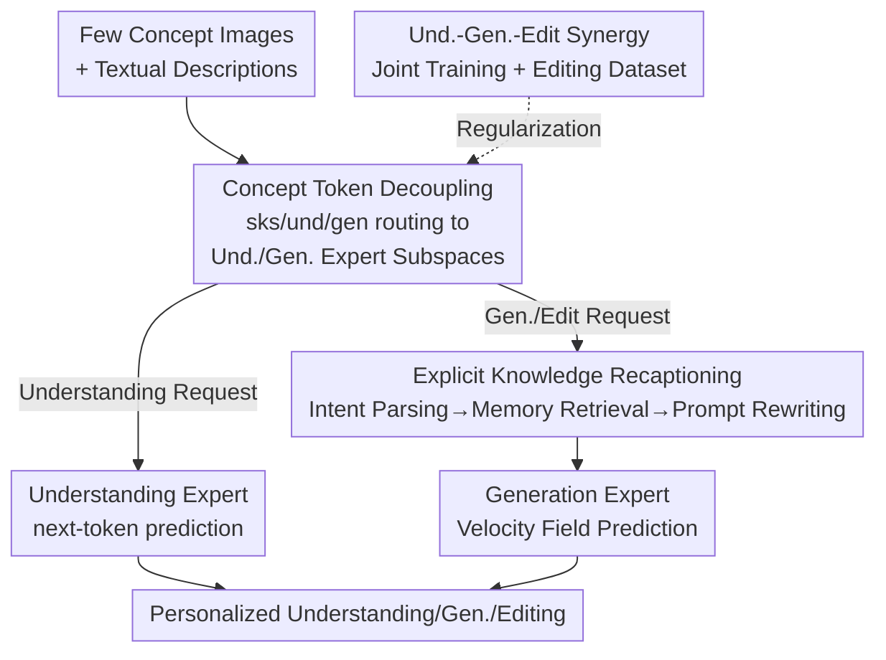

# Unified Personalized Understanding, Generating and Editing

**Conference**: CVPR 2026  
**Paper**: [CVF Open Access](https://openaccess.thecvf.com/content/CVPR2026/html/Zhong_Unified_Personalized_Understanding_Generating_and_Editing_CVPR_2026_paper.html)  
**Area**: Multimodal VLM  
**Keywords**: Personalization, Unified Multimodal Model, Concept Token Decoupling, Knowledge Recaptioning, Personalized Image Editing  

## TL;DR
OmniPersona achieves "personalized understanding, generation, and editing" within a single unified Large Multimodal Model (LMM). By using structurally decoupled concept tokens, the model routes the same concept to different expert subspaces according to the task to reduce mutual interference. It further employs an inference-time "explicit knowledge recaptioning" mechanism to extract concept attributes through QA before feeding them into generation. This framework integrates personalized image editing into a unified model for the first time and introduces the OmniPBench evaluation benchmark.

## Background & Motivation
**Background**: Unified LMMs (e.g., Chameleon, Janus, Bagel, Show-o) can perform both understanding (VQA, dialogue) and generation (text-to-image) within a single network, demonstrating strong general capabilities. However, they act as "one-size-fits-all" general assistants and do not recognize user-specific concepts. For instance, if a user names a dog `<maeve>`, the model cannot consistently treat it as the same dog across understanding, generation, and editing tasks.

**Limitations of Prior Work**: Existing personalization methods primarily follow two paths. First, Retrieval-Augmented Generation (RAG) inserts attribute descriptions as external context, which is inefficient and merely "attached" to the pipeline without being truly integrated. Second, learning soft prompts to encode concepts into latent space (e.g., MyVLM, Yo'LLaVA) often couples understanding and generation into a single set of tokens or relies on complex multi-stage training, leading to cross-task interference, blurred personalized knowledge, or misalignment.

**Key Challenge**: The authors identify three main issues. (i) **Representation Coupling Conflict**: In unified models, understanding and generation share the same parameter space. Requiring a single set of concept representations to support understanding, generation, and editing leads to inherent gradient conflicts without structurally distinguishable "slots" for task-specific solution spaces. (ii) **Opaque Knowledge Latent Variables**: Concepts are compressed into black-box embeddings, making it impossible to verify what the model has "memorized." This is problematic for "Personalized Attribute Reasoning Generation" (PARG) tasks (e.g., generating `<wangkai>` at his home requires recalling that his home is by the sea), as the model confuses actual textual attribute usage with mere memorization of training images. (iii) **Personalized Editing Gap**: Prior work has not addressed personalized image editing, which is highly challenging as it requires precise localization and identity preservation while performing local/structural modifications. Existing benchmarks neither evaluate this nor study if adding editing data can enhance other personalization tasks.

**Goal / Core Idea**: To build an end-to-end framework covering personalized "understanding + generation + editing" in a single architecture. The three solutions target the three pain points: **Structurally Decoupled Concept Tokens** to resolve representation conflicts, **Explicit Knowledge Recaptioning** to externalize black-box knowledge into readable text before generation for transparency and PARG, and **Understanding-Generation-Editing Synergy** (including a custom editing dataset and OmniPBench) to prove that editing supervision can regularize and enhance the overall personalized representation.

## Method

### Overall Architecture
OmniPersona uses the unified multimodal model Bagel as its backbone. Given a few images and text descriptions of a concept, it assigns a set of learnable "Special Identifier" tokens (e.g., `<sks>`, with $N=32$). During training, these tokens are **routed to two expert branches**: the understanding expert and the generation expert, each receiving half. During inference, the model operates in two modes: pure understanding requests are handled directly by the understanding branch via next-token prediction; generation or editing requests first undergo an inference-time "knowledge recaptioning" process (recursively running the text mode to parse intent → retrieve concept memory → rewrite into a precise prompt), and are then passed to the generation branch for image synthesis via velocity field prediction. On the training side, the objectives for understanding (Cross-Entropy), generation (Rectified Flow MSE), and editing (MSE) are jointly optimized.

### Key Designs

**1. Concept Token Representation Decoupling: Task-Specific Slots for the Same Concept**

Addressing pain point (i), the authors no longer learn a single set of unified prompts. Instead, the identifier for each concept is split into multiple learnable tokens and **routed to task-specific expert subspaces**. The system prompt is organized as `"<sks> is <und_1>…<und_Nu> <gen_1>…<gen_Ng>."`, where `<sks>` and all `<und_i>` ($N_u=16$) enter the understanding expert, and all `<gen_j>` ($N_g=16$) enter the generation expert. Formally, the embedding matrices for the two sets are $P^{(und)}=[p_{sks}, p^{(und)}_1,\dots,p^{(und)}_{N_u}]$ and $P^{(gen)}=[p^{(gen)}_1,\dots,p^{(gen)}_{N_g}]$. During the forward pass, each expert only processes the part of the prompt and input routed to it: $H^{(und)}=F_{und}(P^{(und)}, X^{(und)})$ and $H^{(gen)}=F_{gen}(P^{(gen)}, X^{(gen)})$.

This is effective because it separates understanding and generation at the parameter level. The same concept is characterized by related but distinct tokens along different task pathways, preventing understanding tokens from being polluted by generation-specific gradients. T-SNE visualizations show that without decoupling, all embeddings share a transformer and clusters overlap severely (destructive interference); with decoupling, the two types of tokens separate into their respective subspaces with clear clusters.

**2. Explicit Knowledge Recaptioning: Extracting QA-based Knowledge for Generation**

Addressing pain point (ii), decoupling alone is insufficient as learned embeddings remain black boxes. The authors propose an inference-time explicit knowledge recaptioning mechanism that transforms implicit generation requests into "explicit, grounded, and faithful" prompts. The entire chain is executed recursively within the same UMM:

$$Q = \text{UMM}_{text}(T),\quad A = \text{UMM}_{text}(Q, P),\quad \hat{T} = \text{UMM}_{text}(A, T)$$

Stage 1 **Intent Parsing**: Rewrites the original request $T$ (e.g., "Generate a toy for `<sks>`") into an explicit information query $Q$ ("What is the toy of `<sks>`?"); Stage 2 **Memory Retrieval**: Uses $Q$ to retrieve a grounded answer $A$ ("The toy of `<sks>` is a black excavator") from learned token representations $P$; Stage 3 **Prompt Rewriting**: Integrates $A$ back into the context to get a refined prompt $\hat{T}$ ("Generate the black excavator of `<sks>`"). Finally, $I_{gen}=\text{UMM}_{gen}(\hat{T}, P)$ generates the image. This ensures output is grounded in explicitly retrieved knowledge, significantly improving PARG.

**3. Understanding-Generation-Editing Synergy: Regularizing Representations via Editing**

Addressing pain point (iii), the authors construct a personalized editing dataset $D_{edit}$ consisting of triplets $(I_{src}, E_{edit}, I_{tgt})$—source image, edit instruction, and target image. The target images are synthesized using inpainting models and manually verified. Three losses are jointly optimized: Cross-Entropy $L^{CE}_{text}$ for understanding, and Rectified Flow MSE for generation and editing. For a clean latent $x_0$ and noise $x_1$ with interpolation $x_t=(1-t)x_0+tx_1$, the image loss is $L^{MSE}_{image}=\mathbb{E}[\lVert g_\theta(x_t\mid c)-(x_0-x_1)\rVert_2^2]$, where the editing loss uses "source image + edit instruction" as the condition $c_{edit}$.

$$L_{total} = L^{CE}_{text} + \lambda_{image} L^{MSE}_{image} + \lambda_{edit} L^{MSE}_{edit}$$

The synergy works because the editing task's constraints are the most stringent (requiring localization, identity preservation, and instruction alignment), forcing concept tokens to learn decoupled representations that capture both invariant identity attributes and modifiable contextual attributes.

### Loss & Training
Each concept is assigned $N=32$ tokens (16 for understanding, 16 for generation). The model is trained using AdamW for 2000 steps with a batch size of 8. The backbone is Bagel (7B MoT), and training is conducted on H20 GPUs. The total loss is a weighted sum of the three components mentioned above. Notably, it requires only $\sim 10$ training images per concept.

## Key Experimental Results

### Main Results
Evaluation was conducted on the custom OmniPBench (based on 20 concepts from UnifyBench plus new editing data). Comparison with unified models is shown below:

| Method | Size/Tokens | Rec. | VQA-GPT | Gen CLIP-I | Face Sim. | PARG Score | Edit SEMA-C | Edit Avg. |
|------|-----------|-----------|---------|-------------|----------|-----------|-------------|-----------|
| Bagel+TP (Zero-shot) | 7B / Long-ctx | 0.788 | 0.542 | 0.697 | 0.309 | **0.813** | 0.297 | 0.432 |
| Yo'Chameleon | 7B / 32 (~1k imgs) | 0.764 | 0.507 | 0.697 | 0.224 | 0.266 | 0.108 | 0.234 |
| Unictoken | 1.3B / 32 (~10 imgs) | 0.790 | 0.523 | 0.750 | 0.334 | 0.359 | 0.155 | 0.184 |
| **OmniPersona** | 7B / 32 (~10 imgs) | **0.852** | **0.603** | **0.791** | **0.413** | 0.613 | **0.711** | **0.658** |

OmniPersona outperforms Unictoken by +7.8% in recognition and +13.1% in VQA. In generation, it achieves the highest CLIP-I and Face Similarity. In editing, its average score of 0.658 exceeds GPT-4o+IP by 17.9%.

### Ablation Study

| Configuration | Rec. | PARG Score | Gen CLIP-I | Edit Avg. |
|------|-----------|-----------|-------------|-----------|
| Ours (Full) | 0.852 | 0.613 | 0.791 | 0.658 |
| w/o Token Decoupling | 0.804 | — | 0.778 | 0.633 |
| w/o Knowledge Recaptioning | — | 0.312 | 0.765 | — |
| w/o Editing Data | 0.840 | — | 0.772 | 0.638 |

### Key Findings
- **Knowledge Recaptioning is crucial for PARG**: Removing it causes PARG scores to drop by 49.1% while identity preservation (CLIP-I) remains stable.
- **Token decoupling primarily benefits understanding**: Without it, recognition and VQA metrics drop significantly (-5.6% to -10.3%).
- **Intent parsing generalizes via in-context learning**: Increasing examples from 0 to 6 improves the PARG score by 106.7%.
- **Editing supervision provides bidirectional gains**: Adding editing data improves recognition, VQA, and Face Similarity.

## Highlights & Insights
- **"QA before Generation" makes knowledge auditable**: Recaptioning externalizes stored attributes into readable intermediate representations within the same UMM.
- **Personalized editing as a "gain"**: Instead of a separate task, editing acts as a regularization term that strengthens understanding and generation.
- **Task-specific expert routing**: Resolving cross-task gradient conflicts via structural "slots" is more efficient than multi-stage training.

## Limitations & Future Work
- **Data bias**: The editing dataset primarily uses "remove `<sks>`" templates, limiting coverage of complex structural edits like pose changes.
- **Information loss in "Internalized" knowledge**: While efficient, the learned tokens still trail behind long-context RAG (Bagel+TP) in PARG tasks.
- **Text alignment trade-offs**: DINO and CLIP-T scores are lower than some baselines, suggesting a trade-off where identity preservation is prioritized over prompt adherence.
- **LLM-as-judge bias**: Evaluation relies on LLM scoring without extensive human verification.

## Related Work & Insights
- **vs Yo'Chameleon**: OmniPersona uses structured decoupled tokens and significantly fewer training images ($\sim 10$ vs $\sim 1000$) while integrated editing.
- **vs Unictoken**: Replaces multi-stage mutual learning with task-expert routing, improving recognition and PARG performance.
- **vs RAG (RAP-MLLM)**: Performs "self-retrieval" internally without external libraries or increased inference-time retrieval overhead.

## Rating
- Novelty: ⭐⭐⭐⭐⭐ First to unify personalized editing in LMM with a clever "recaptioning + expert routing" design.
- Experimental Thoroughness: ⭐⭐⭐⭐ Comprehensive task coverage but lacks human evaluation for editing.
- Writing Quality: ⭐⭐⭐⭐ Clear mapping of problems to solutions.
- Value: ⭐⭐⭐⭐ Significant push for the "unified personalization" direction with a strong benchmark.

<!-- RELATED:START -->

## Related Papers

- [\[CVPR 2026\] UniCompress: Token Compression for Unified Vision-Language Understanding and Generation](unicompress_token_compression_for_unified_vision-language_understanding_and_gene.md)
- [\[CVPR 2026\] PersonaVLM: Long-Term Personalized Multimodal LLMs](personavlm_long_term_personalized_multimodal_llms.md)
- [\[CVPR 2026\] Rosetta Stone for Unified MLLMs: A Unified Tokenizer to Decipher Understanding and Generation](rosetta_stone_for_unified_mllms_a_unified_tokenizer_to_decipher_understanding_an.md)
- [\[CVPR 2026\] Personalized Image Descriptions from Attention Sequences](personalized_image_descriptions_from_attention_sequences.md)
- [\[CVPR 2026\] TUNA: Taming Unified Visual Representations for Native Unified Multimodal Models](tuna_taming_unified_visual_representations_for_native_unified_multimodal_models.md)

<!-- RELATED:END -->
