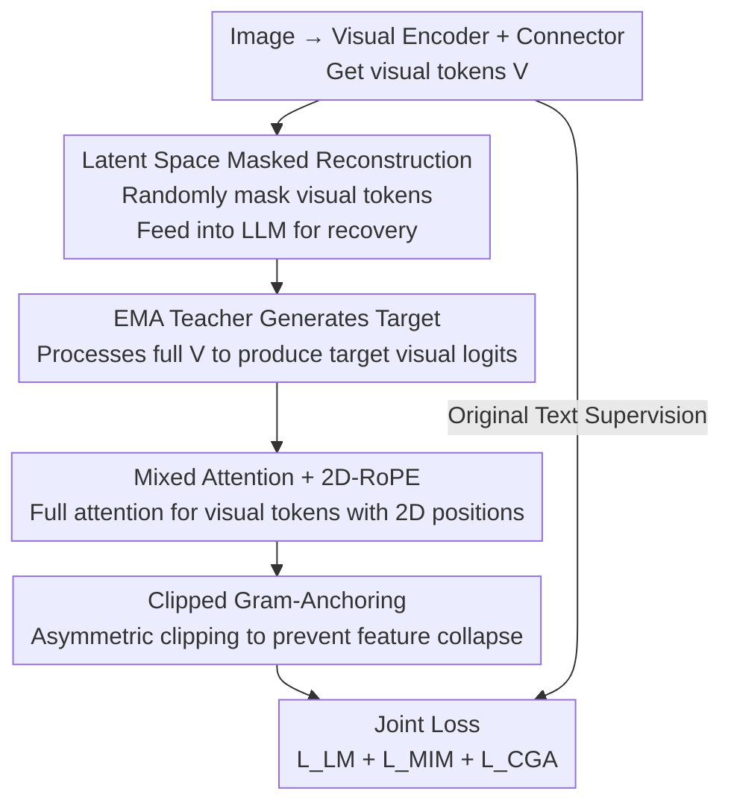

# Unleashing the Intrinsic Visual Representation Capability of Multimodal Large Language Models

**Conference**: CVPR 2026  
**Paper**: [CVF Open Access](https://openaccess.thecvf.com/content/CVPR2026/html/Li_Unleashing_the_Intrinsic_Visual_Representation_Capability_of_Multimodal_Large_Language_CVPR_2026_paper.html)  
**Code**: https://github.com/Fir-lat/LaVer  
**Area**: Multimodal VLM  
**Keywords**: Modal Imbalance, Masked Image Modeling, Visual Representation, Self-Supervised, Visual Hallucination

## TL;DR
Addressing the "modal imbalance" issue where MLLMs become more text-biased and visual representations homogenize in deeper layers, this paper proposes LaVer. It performs masked reconstruction of visual tokens within the LLM's latent semantic space (latent MIM) and utilizes Clipped Gram-Anchoring to prevent feature collapse. This provides direct supervision for visual representations, yielding significant improvements in dense visual tasks like OCR and vision-centric benchmarks (e.g., OCRBench +19.22%).

## Background & Motivation
**Background**: Mainstream MLLMs utilize a cascaded architecture consisting of a "visual encoder + connector (MLP) + pre-trained LLM." Images are encoded as a sequence of visual tokens prepended to text, and the entire model is trained using a single objective—next-text-token-prediction (cross-entropy on text responses).

**Limitations of Prior Work**: This paradigm causes systemic "modal imbalance": models rely excessively on text during multimodal tasks, often providing confident (but incorrect) answers even when visual input is missing or conflicts with text. Attention is disproportionately allocated to text tokens rather than visual tokens, leading to performance degradation and increased visual hallucinations.

**Key Challenge**: The root of the imbalance lies in the "asymmetry" of training supervision—text receives direct token-level supervision (cross-entropy), while vision only obtains indirect, weak supervision through implicit vision-to-text alignment. Under the dominance of the linguistically powerful LLM backbone, the model naturally tends to discard visual information that is not "useful for text output." The authors further empirically validate the phenomenon of **layer-wise homogenization of visual representations**: cosine similarity between deep-layer visual tokens increases sharply, and t-SNE visualizations show visual and text tokens remain separated, implying visual semantics are flattened during forward propagation.

**Goal**: To provide a **direct intrinsic supervision signal** for visual representations, ensuring that the MLLM retains discriminative visual structures in deeper layers rather than merely serving text generation.

**Key Insight**: Leveraging self-supervised Masked Image Modeling (MIM). Unlike approaches that mask raw pixels (MAE) or reconstruct fine-grained low-level signals—which are redundant and noisy for high-level semantic reasoning—the authors apply masking directly to **visual tokens in the input embedding space**. This forces the model to recover missing visual tokens within the **LLM's own latent semantic space**.

**Core Idea**: Inject direct visual supervision into the MLLM via a self-supervised task of "reconstructing masked visual tokens in the LLM latent space," coupled with an asymmetric regularization term to prevent the model from taking shortcuts by outputting uniform visual features.

## Method

### Overall Architecture
LaVer adds a **visual self-supervised branch** on top of the standard MLLM, trained jointly with the original language modeling objective. Given an image, the visual encoder and connector produce a sequence of visual tokens $V=\{v_1,\dots,v_N\}$. A portion of these tokens is randomly replaced with learnable `[MASK]` tokens and fed into the LLM to recover their visual representations in the latent space. Supervision is provided by an EMA teacher (student-teacher framework): the teacher processes the full, unmasked visual tokens to generate target visual logits, while the student predicts these outputs at the masked positions. To ensure the MIM learns discriminative features instead of collapsing into identical vectors, a Clipped Gram-Anchoring (CGA) regularizer is added. The final objective is the sum of "language modeling + MIM + CGA" losses.

### Key Designs

**1. Latent Visual Reconstruction: Direct visual supervision within the LLM semantic space**

This addresses the "indirect supervision and deep-layer homogenization" issue. Method: A binary mask $M\in\{0,1\}^N$ randomly selects visual positions with probability $r$. Selected positions are replaced by a learnable mask token $e_{[\text{MASK}]}$, such that $\tilde v_i = M_i\cdot e_{[\text{MASK}]} + (1-M_i)\cdot v_i$. The modified sequence passes through the LLM to obtain hidden states $\tilde H=F_\theta(\tilde V)$, which are projected into visual logits $\tilde Z=V_\psi(\tilde H)$ via a 3-layer MLP head. The supervision comes from an EMA teacher $\hat\Phi$ (exponential moving average of student parameters, $\hat\theta^{(t)}=\lambda\hat\theta^{(t-1)}+(1-\lambda)\theta^{(t)}$). The teacher processes the complete $V$ to output target logits $\hat Z$. The student matches the teacher's distribution only at the masked positions:

$$\mathcal{L}_{\text{MIM}} = -\sum_{i\in P_M}\mathrm{softmax}(\hat z_i/\tau_{\text{tea}})\cdot\log\mathrm{softmax}(\tilde z_i/\tau_{\text{stu}})$$

where $P_M$ is the set of masked positions and $\tau_{\text{tea}}, \tau_{\text{stu}}$ are temperatures. The key difference is "where to reconstruct": unlike prior works masking pixels or low-level signals, LaVer predicts visual tokens directly in the **LLM's high-level latent semantic space**, bypassing low-level noise and providing direct supervision for internal representations. To avoid interference with the original multimodal sequence, the authors **pack all masked visual tokens into an independent sequence** using diagonal block-wise bidirectional attention and block-wise 2D-RoPE to prevent information leakage between images.

**2. Spatial Awareness for Vision: Mixed Attention + 2D-RoPE**

MIM requires the model to rely on spatial context to recover missing tokens, meaning visual tokens must attend to the entire image. However, the LLM’s native causal attention and 1D RoPE are designed for sequential text and are ill-suited for visual modeling—causal masking prevents tokens from seeing "future" tokens, losing 2D structure. LaVer introduces **Mixed Attention**: bidirectional full attention among visual tokens while maintaining causal attention for text tokens. It also employs **2D-RoPE**, using the grid row-column coordinates of image patches as 2D position indices for visual tokens, while text tokens use identical indices to maintain compatibility. Ablations show Mixed Attention alone improves performance from 55.72 to 56.78 (SigLIP 2), providing a foundation for spatial awareness.

**3. Clipped Gram-Anchoring (CGA): Preventing the shortcut of "uniform visual features"**

Relying solely on MIM allows the model to "cheat" by outputting highly similar features for all visual tokens to minimize reconstruction loss, leading to feature collapse and loss of local structure. The root cause is that MIM only aligns distributions token-wise without constraining the structural diversity of the whole set. The authors first introduce Gram-Anchoring (GA), using the Gram matrix $G(Z)=\mathrm{Norm}(Z)\cdot\mathrm{Norm}(Z)^\top$ (after L2 normalization) to align the relative structure of student and teacher: $\mathcal{L}_{\text{GA}}=\|G(\tilde Z)-G(\hat Z)\|_F^2$. However, since GA is symmetric, it punishes any deviation—even when the student is **more discriminative** than the teacher ($G(\tilde Z)<G(\hat Z)$). Thus, the asymmetric CGA is proposed:

$$\mathcal{L}_{\text{CGA}} = \|\mathrm{Clip}(G(\tilde Z)-G(\hat Z))\|_F^2,\quad \mathrm{Clip}(\cdot)=\max(0,\cdot)$$

This element-wise clipping only penalizes the case where the student is "less discriminative" than the teacher, allowing for "more discriminative" directions. This prevents feature collapse while encouraging the student to learn better representations than the teacher. The final objective is $\mathcal{L}_{\text{LaVer}}=\mathcal{L}_{\text{LM}}+\omega_{\text{MIM}}\mathcal{L}_{\text{MIM}}+\omega_{\text{CGA}}\mathcal{L}_{\text{CGA}}$.

### Loss & Training
The model uses Qwen2.5-7B-Instruct as the LLM backbone, trained on 16 A100(80G) GPUs. It follows the three-stage pipeline of LLaVA-OneVision 1.5: Stage 1 aligns the connector with LLaVA-558K; Stage 2 applies LaVer for intrinsic visual modeling and knowledge injection using 800K samples from FineVision 23M; Stage 3 performs visual instruction tuning using 800K samples from LLaVA-OneVision 4M.

## Key Experimental Results

### Main Results
Across six visual encoding paradigms (fixed resolution SigLIP2/CLIP/DINOv2, native resolution AIMv2/Qwen-ViT, and encoder-free MLP+Qwen2.5), LaVer outperforms the baseline almost universally. Representative results on SigLIP 2 are shown below (%):

| Benchmark | Type | Baseline | Ours (LaVer) | Gain |
|-----------|------|----------|--------------|------|
| OCRB | OCR | 536 | 639 | ↑103 (19.22%) |
| MMVP | Vision-centric | 43.52 | 50.24 | ↑6.72 |
| RWQA | General VQA | 53.86 | 59.35 | ↑5.49 |
| CV-B2D | Vision-centric | 52.20 | 55.60 | ↑3.40 |
| AI2D | OCR | 86.51 | 89.09 | ↑2.58 |
| Hallu | Hallucination | 69.00 | 70.33 | ↑1.33 |
| Average | — | 55.72 | 57.87 | ↑2.15 |

Gains are particularly significant in dense visual tasks: on CLIP, ChartQA improves by +6.07 and MMVP by +12.00; on AIMv2/Qwen-ViT, TextVQA improves by +3.34/+7.02 respectively. Even the encoder-free architecture sees a +1.37 overall gain. In Reasoning Segmentation, LaVer-initialized models achieve zero-shot gIoU scores 1.36 (SigLIP 2) and 1.17 (CLIP) higher than the baseline.

### Ablation Study

| Configuration | SigLIP 2 | CLIP | Description |
|------|----------|------|------|
| Baseline | 55.72 | 50.58 | No components |
| + Mixed Attention | 56.78 | 51.40 | Partial spatial awareness |
| + 2D-RoPE | 55.57 | 50.59 | Ineffective alone |
| + Mixed Attn + 2D-RoPE | 56.43 | 51.99 | Spatial awareness combo |
| Full Spatial + LaVer | 57.87 | 53.24 | Full model |

| Loss Config | SigLIP 2 | CLIP | Description |
|----------|----------|------|------|
| Baseline | 55.72 | 50.58 | No MIM |
| w/ MIM | 53.76 | 49.71 | MIM alone drops (collapse) |
| w/ MIM + GA | 56.46 | 52.01 | Symmetric GA recovers/exceeds |
| w/ MIM + CGA | 57.87 | 53.24 | Asymmetric clipping is best |

### Key Findings
- **CGA is an essential safety valve**: Adding MIM alone results in a 1.96-point drop (55.72→53.76), confirming the "shortcut to homogeneous features." Symmetric GA recovers this to 56.46, while asymmetric CGA achieves 57.87, validating the design of only penalizing the "worsening" direction.
- **2D-RoPE requires Mixed Attention**: 2D-RoPE alone (55.57) provides no gain; it only works when combined with Mixed Attention, where visual tokens can perceive each other globally.
- **Good Scalability**: Advantages over the baseline are maintained or amplified as parameters scale (1.5B→7B) and data scales (800K→4M). Hyperparameters like mask ratio and EMA decay are robust within reasonable ranges.
- **Gains concentrated in dense tasks**: OCR and vision-centric tasks show the largest improvements, aligning with the motivation to better utilize visual information.

## Highlights & Insights
- **Moving MIM to the LLM Latent Semantic Space**: While traditional MIM works on pixels or low-level features, this paper identifies that high-level reasoning is better served by reconstructing tokens in the internal semantic space. This "self-supervision of internal representation" is a clever entry point.
- **Asymmetric Clipping as a Reusable Trick**: The essence of CGA is "punish decay, ignore improvement." Using $\max(0,\cdot)$ to convert symmetric constraints to unidirectional ones is a strategy applicable to any distillation or self-supervised scenario where the student should not be restricted by the teacher's level.
- **Diagnostic-Driven Design**: The authors first quantify "layer-wise homogenization" through cosine similarity, t-SNE, and attention maps before proposing the solution, ensuring the motivation is grounded in empirical evidence.

## Limitations & Future Work
- **Training Overhead**: The EMA teacher, visual head, and independent reconstruction sequences increase memory and compute requirements (16×A100); cost-effectiveness is not fully discussed.
- **Moderate General Gains**: Improvements on many general benchmarks are within the 1-2 point range (average +2.15); significant gains are localized to OCR/vision-centric tasks.
- **Component Coupling**: 2D-RoPE is ineffective without Mixed Attention, indicating interdependency. Hyperparameters may require re-tuning for new architectures.
- **Scaling Limit**: Scaling experiments stopped at 7B; whether the homogenization problem and the solution's effectiveness persist at 70B+ remains to be verified.

## Related Work & Insights
- **vs. MAE / Pixel-level MIM**: MAE reconstructs in pixel space; LaVer reconstructs in the LLM's latent semantic space, avoiding low-level redundancy and better suiting multimodal reasoning.
- **vs. iBOT / JEPA**: The work adopts the student-teacher EMA paradigm of iBOT and the "latent space prediction" idea of JEPA but applies them inside the MLLM and introduces CGA to handle MLLM-specific feature collapse.
- **vs. Inference-time De-biasing**: Methods like visual contrastive decoding mitigate imbalance at inference; LaVer addresses the root cause during training by strengthening visual representations.

## Rating
- Novelty: ⭐⭐⭐⭐ The combination of latent MIM and asymmetric CGA is novel and well-motivated.
- Experimental Thoroughness: ⭐⭐⭐⭐⭐ Comprehensive evaluation across 6 encoders, 17 benchmarks, reasoning segmentation, and scaling factors.
- Writing Quality: ⭐⭐⭐⭐ Clear logic with good visualizations; notations are slightly dense but readable.
- Value: ⭐⭐⭐⭐ A practical training framework that improves dense visual performance without architectural changes.

<!-- RELATED:START -->

## Related Papers

- [\[CVPR 2026\] Predictive Regularization Against Visual Representation Degradation in Multimodal Large Language Models](predictive_regularization_against_visual_representation_degradation_in_multimoda.md)
- [\[CVPR 2026\] Taxonomy-Aware Representation Alignment for Hierarchical Visual Recognition with Large Multimodal Models](taxonomy-aware_representation_alignment_for_hierarchical_visual_recognition_with.md)
- [\[CVPR 2026\] Prototype-as-Prompt: Multimodal Sentiment Prototypes Endowing Large Language Models the Capability to Perform Multimodal Sentiment Analysis](prototype-as-prompt_multimodal_sentiment_prototypes_endowing_large_language_mode.md)
- [\[ACL 2026\] TRACE: Unleashing Spatial Reasoning in Multimodal Large Language Models via Textual Representation Guided Reasoning](../../ACL2026/multimodal_vlm/unleashing_spatial_reasoning_in_multimodal_large_language_models_via_textual_rep.md)
- [\[ECCV 2024\] NavGPT-2: Unleashing Navigational Reasoning Capability for Large Vision-Language Models](../../ECCV2024/multimodal_vlm/navgpt-2_unleashing_navigational_reasoning_capability_for_large_vision-language_.md)

<!-- RELATED:END -->
