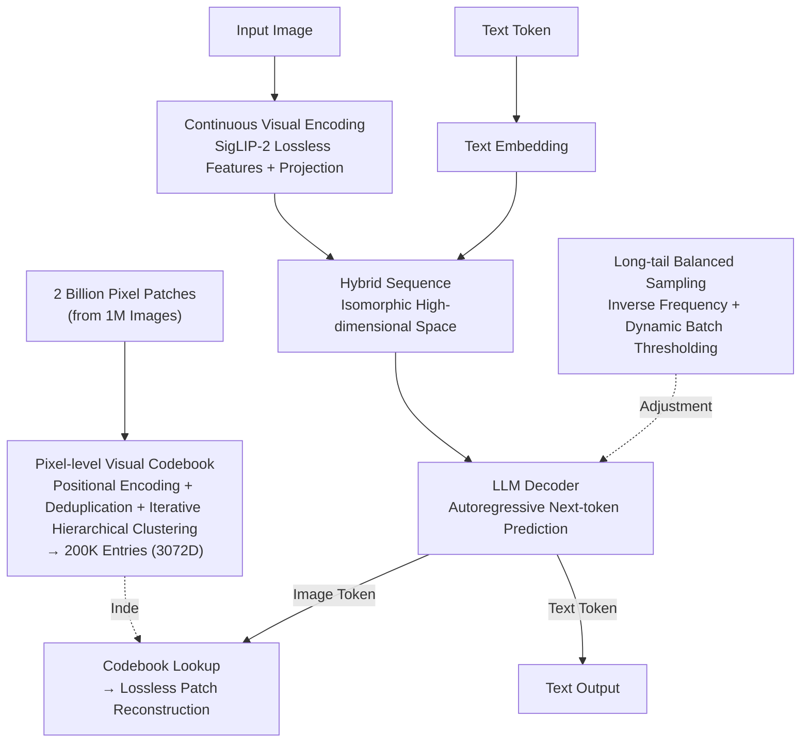

# UVU: Improving Multimodal Understanding via Vision-Language Unified Autoregressive Paradigm

**Conference**: CVPR 2026  
**Paper**: [CVF Open Access](https://openaccess.thecvf.com/content/CVPR2026/html/Kan_UVU_Improving_Multimodal_Understanding_via_Vision-Language_Unified_Autoregressive_Paradigm_CVPR_2026_paper.html)  
**Code**: To be confirmed  
**Area**: Multimodal VLM  
**Keywords**: Visual Supervision, Unified Autoregressive, Pixel-level Visual Codebook, Continuous Visual Encoding, Pre-training

## TL;DR
UVU shifts visual supervision from a "post-training auxiliary constraint" to the "main driver of pre-training." It abandons Vector Quantization (VQ), uses continuous visual encoding for lossless input images, and constructs a 200,000-entry **pixel-level visual codebook** through large-scale iterative hierarchical clustering. This allows the LLM to generate pixel-level image tokens similarly to text tokens during autoregressive next-token prediction. Consequently, fine-grained visual perception is embedded into the model's perception backbone without relying on external decoders. The 3B model significantly outperforms same-class models like Qwen2.5-VL across 12 understanding benchmarks.

## Background & Motivation

**Background**: Multimodal Large Language Models (MLLMs) have advanced rapidly, yet their visual representations rely almost entirely on **textual supervision**. After the image encoder is integrated into the LLM, training signals primarily derive from "predicting the next text token." This text-centric supervision is sparse and fails to provide direct guidance for the fine-grained local structures within images.

**Limitations of Prior Work**: To compensate for visual supervision, existing works (vision-language alignment, reconstructing/predicting image features with vision tokenizers, DiT-based image feature prediction, etc.) almost exclusively place visual supervision in the **post-training** stage. However, by this point, the vision backbone has already been **solidified** by textual supervision during large-scale pre-training. Subsequent visual signals act only as "fine-tuning constraints" or "alignment targets," failing to fundamentally reshape perceptual features, thus yielding limited effectiveness. The question of whether visual supervision can be integrated into pre-training to shape visual representation from the start remains largely unexplored.

**Key Challenge**: A straightforward approach is to use VQ visual tokens (e.g., VQVAE) as discrete supervision targets and supervise these tokens at the MLLM output. However, the authors' empirical tests reveal three major flaws in the AR+VQ paradigm: (i) **Information loss due to discretization**: Continuous visual features are quantized into symbols, losing high-level semantic details. (ii) **Gradient orthogonality due to dimensional misalignment**: Image reconstruction tokens reside in a post-VQ low-dimensional space, while language tokens are in a high-dimensional semantic space. Consequently, image loss gradients (targeting low-dimensional reconstruction) and text loss gradients (targeting high-dimensional semantic consistency) conflict in direction. The authors quantify this using $\cos\theta=\frac{\nabla_i\cdot\nabla_t}{\|\nabla_i\|\|\nabla_t\|}$ and find that $\theta\ge 90^\circ$ throughout AR+VQ training, meaning optimization paths clash and degrade understanding. (iii) **Externalized reconstruction capability**: The model relies on an external visual decoder and fails to internalize generative capabilities.

**Key Insight**: The authors observe an overlooked symmetry—**pixel-level image patches and text tokens coexist in the same original high-dimensional space and possess natural "input symmetry"**. Therefore, it is unnecessary to compress images into a low-dimensional VQ space for supervision. Providing images with a "vocabulary" directly in the high-dimensional space allows them to participate in autoregression on equal footing with text tokens, resolving dimensional misalignment at the source.

**Core Idea**: Replace "VQ discrete tokens" with a "visual codebook obtained via clustering in high-dimensional pixel space." This turns visual supervision into next-token prediction isomorphic to textual supervision, reshaping the perception backbone starting from the pre-training phase and solving the problems of information loss, gradient orthogonality, and external decoders.

## Method

### Overall Architecture
UVU aims to address how to inject visual supervision into MLLMs during pre-training without losing information, conflicting with text, or requiring external components. Its approach involves two steps: **first, offline construction of a "pixel-level visual codebook" as a visual vocabulary**, then integrating this vocabulary into the LLM, enabling the model to generate both text tokens and pixel-level image tokens within the same autoregressive loop.

Specifically: input images are processed via SigLIP-2 for **continuous** visual encoding (non-quantized, lossless), then concatenated with text embeddings via a projection layer to form a hybrid sequence fed into the LLM decoder for next-token prediction. Visual tokens output by the model are mapped back to their corresponding $32\times32\times3$ image patches via the pixel-level codebook, enabling lossless image reconstruction **without an external decoder**. The training loss jointly supervises both image and text tokens, with an additional layer of long-tail balanced sampling to ensure balanced learning across modalities.

### Key Designs

**1. Pixel-level Visual Codebook: Creating a Lossless "Visual Vocabulary" in High-dimensional Pixel Space**

This is the foundation UVU uses to bypass VQ. The problem is clear: VQ compresses images into a low-dimensional discrete space, losing information and misaligning with the high-dimensional space of text. The authors do the opposite—since a $32\times32\times3$ pixel patch flattened is a 3072-dimensional vector living in the same original high-dimensional space as text tokens, they **cluster directly in this high-dimensional space**, using cluster centers as codewords and creating a codebook size of 200,000. This is based on natural image manifold theory: natural images occupy a very small low-dimensional manifold within high-dimensional pixel space. Among all possible pixel combinations, visually lossless natural patches represent only a tiny fraction; thus, 200,000 codewords are sufficient to cover perceptual details for high-resolution images (above 512×512).

To quantify codebook quality, the authors define two metrics. **Pixel Space Coverage (PSC)** measures the codebook's effective span on the natural image manifold, defined as the minimum of maximum intra-cluster distances divided by active clusters: $\text{PSC}=\frac{\min_k(\max_{p_i\in S_k}\|p_i-c_k\|_2)}{K_{active}}$, where $S_k$ is the set of samples in the $k$-th cluster and $K_{active}$ is the number of non-empty clusters. **Pixel Representation Precision (PRP)** measures the fidelity of patch reconstruction using the nearest codeword, calculated as the complement of normalized MSE: $\text{PRP}=1-\frac{1}{M}\sum_m \frac{\|\hat p_m-p_m\|_2^2}{\sigma_{max}^2}$. The optimization goal is $\max_C(\text{PSC}+\text{PRP})$. With these metrics, codebook quality is controllable across the complementary dimensions of "wide coverage" and "accurate reconstruction," distinguishing it from simple K-means. (Note: Refer to the original paper for the precise definition of PSC.)

**2. Large-scale Iterative Hierarchical Clustering: Enabling Robust Codebook Construction from 2 Billion Patches**

Simply having an objective is not enough; the difficulty lies in clustering 2 billion patches (from 1 million images) while saving memory and preserving structure. Simple L2 distance clustering has two pitfalls: it fails to distinguish patches with similar color distributions but different spatial layouts (losing structural continuity), and raw pixel vectors lack spatial inductive bias, leading to a codebook of isolated textures rather than perceptual units. The solution involves adding **sinusoidal positional encoding** $p_i[j]\mathrel{+}=\sin(10000^{2j/d})$ (even dims) / $\cos(\cdot)$ (odd dims) to the 3072-dimensional features to inject spatial information before clustering.

The clustering process is "Deduplication + Hierarchical Sampling + Iterative Filtering": 200,000 centers are randomly initialized, and features are assigned to the nearest center. Intra-cluster distances are calculated (to 5 decimal places), and samples with duplicate distances are discarded to prevent catastrophic drift caused by repetitive patches, followed by initial K-means. During iteration, 20 million patches are sampled per round and assigned to centers. Long-tail clusters with $|S_k|<\delta$ are filtered (caching their centers and features). A global distance dictionary is maintained for remaining clusters, and hierarchical sampling ensures uniform training samples. Once the cache reaches $\alpha$, cached features are re-clustered to update centers $c_k^{(t+1)}=\frac{1}{|S_k^{(t)}|}\sum_{p_i\in S_k^{(t)}}p_i$ until convergence. The algorithm uses Faiss for distributed streaming and includes an incremental interface for continuous refinement. This step improves PRP from 70.14% (standard K-means) to 95.63% and RefCOCO performance from 81.0 to 91.8.

**3. Vision-Language Unified Autoregressive + Long-tail Balancing: True Co-learning of Image and Text Tokens**

With the codebook, UVU merges its entries into the LLM vocabulary for unified autoregression. Input images undergo SigLIP-2 continuous encoding and projection to be losslessly concatenated into text embedding sequences (no input quantization or external decoders). The LLM decoder performs next-token prediction on the hybrid sequence, generating image and text tokens simultaneously. Image tokens are mapped back to pixel patches via the codebook for reconstruction. The joint training loss is: $L=0.5\,L_{image}+L_{text}$, where $L_{image}=-\sum_i\log P(t_i^{image}\mid t_{<i})$ and $L_{text}=-\sum_i\log P(t_i^{text}\mid t_{<i})$. Since image tokens now share the high-dimensional space with text, the gradient angle is reduced to $\theta<90^\circ$, transforming supervision from "conflict" to "synergy."

The authors found that image token IDs exhibit a strong long-tail distribution, where high-frequency IDs mostly correspond to low-entropy background regions, causing training redundancy. They use **inverse frequency sampling** to balance learning probabilities $p_k=\frac{1/f_k}{\sum_j 1/f_j}$ ($f_k$ is the frequency of the $k$-th token ID), followed by **secondary random dynamic sampling** on each batch $\text{Image token ID}_b\sim\text{Uniform}(\{k\mid p_k>\tau_b\})$, using a batch-level threshold $\tau_b$ to dynamically balance token counts. Notably, in the SFT stage, the **image token loss is disabled**, allowing the model to focus on precise instruction following—visual supervision tasks are completed during pre-training, echoing the core theme of shifting visual supervision earlier.

### Loss & Training
The entire process uses 1.04 trillion tokens from open-source sets like LLaVA-OneVision, FineVision, Cauldron, Cambrian-7M, and proprietary data, covering text-only, image-text, and interleaved content. Language backbone: Qwen2.5-3B-Instruct; Vision encoder: SigLIP2-so400m-patch16-naflex. The codebook is clustered from 2 billion patches into 200,000 entries. Training uses per-GPU batch=1, sequence length 32K, AdamW, learning rate 2e-5, and 0.01 warmup. Image-text tokens are jointly supervised (weights 0.5/1.0) with long-tail balanced sampling during pre-training; image token supervision is stopped during SFT.

## Key Experimental Results

### Main Results
On 12 vision-centric multimodal understanding benchmarks, the 3B UVU outperforms same-class or larger models (partial list):

| Model | Params | MMStar | RefCOCO | LISA | CVB3D | BLINK | HallusionB |
|------|------|--------|---------|------|-------|--------|------------|
| Qwen2.5-VL (Text-only Sup.) | 3B | 52.8 | 84.1 | 57.4 | 71.9 | 46.9 | 64.5 |
| InternVL2 | 2B | 49.8 | 77.8 | 46.3 | 61.3 | 42.8 | 38.0 |
| LLaVA-OV | 7B | 56.7 | 78.1 | 47.4 | 63.4 | 46.1 | 47.5 |
| LLaVA-v1.5 | 13B | 34.3 | 73.5 | 40.4 | 53.3 | 40.9 | 24.5 |
| UVU* (No Visual Sup.) | 3B | 52.9 | 85.6 | 59.6 | 67.8 | 46.1 | 59.2 |
| **UVU (Ours)** | 3B | **55.0** | **91.8** | **71.7** | **76.6** | **52.8** | **66.6** |

The largest gains are in perception-heavy tasks (RefCOCO, LISA, CVBench, BLINK): RefCOCO (91.8) is 7.7 points higher than Qwen2.5-VL, and LISA-Grounding (71.7) is 14.3 points higher, confirming that "shifting visual supervision forward" directly strengthens perception.

### Ablation Study

Comparison of visual supervision methods (same data/settings):

| Configuration | MMStar | RefCOCO | MMB | Remarks |
|------|--------|---------|-----|------|
| No visual supervision | 52.9 | 85.6 | 74.3 | Text-only supervision baseline |
| AR+VQ | 46.5 | 79.6 | 68.2 | Performance drop across the board (discretization + gradient orthogonality) |
| **UVU** | **55.0** | **91.8** | **76.1** | Visual supervision truly aids understanding |

Ablation of codebook scale & construction:

| Dimension | Config | RefCOCO | MMB | PSC | PRP(%) |
|------|------|---------|-----|-----|--------|
| Codebook Scale | 50K | 88.7 | 74.7 | 0.336 | 86.42 |
| Codebook Scale | 100K | 90.1 | 75.2 | 0.344 | 91.26 |
| Codebook Scale | **200K** | 91.8 | 76.1 | 0.341 | 95.63 |
| Codebook Scale | 500K | 91.7 | 76.4 | 0.337 | 96.04 |
| Construction | Pure K-means | 81.0 | 66.3 | 0.014 | 70.14 |
| Construction | +Pos. Encoding | 86.9 | 71.1 | 0.133 | 82.84 |
| Construction | +Iter. Hier. Clustering | 91.8 | 76.1 | 0.341 | 95.63 |

### Key Findings
- **AR+VQ is detrimental, not just unhelpful**: Adding VQ visual supervision caused MMStar to drop from 52.9 to 46.5 and RefCOCO to drop to 79.6—worse than using no visual supervision at all. This confirms the destructiveness of information loss and gradient orthogonality. UVU achieved the highest scores in all three categories with the same supervision placement; the difference lies in the "how."
- **Codebook quality depends on construction, not just scale**: Positional encoding + iterative hierarchical clustering raised PRP from 70.14% to 95.63% and PSC from 0.014 to 0.341, leading to a +10.8 gain in RefCOCO. Increasing scale from 200K to 500K only slightly increased PRP and slightly decreased RefCOCO, leading to the selection of 200K.
- **Gradient angle provides direct mechanistic evidence**: AR+VQ maintained $\theta\ge90^\circ$ throughout, while UVU maintained $\theta<90^\circ$, explaining from an optimization dynamics perspective why UVU's visual supervision is synergistic.

## Highlights & Insights
- **The "input symmetry" observation is elegant**: Flattening pixel patches into 3072D vectors and treating them as residents of the same high-dimensional space as text tokens elegantly solves VQ discretization, gradient misalignment, and external decoder issues simultaneously.
- **Formulated optimizable metrics for the codebook (PSC/PRP)**: While many works simply state they used a clustered codebook, UVU formalizes coverage and reconstruction precision as optimizable objectives, turning codebook quality from an empirical guess into an ablatable engineering metric.
- **"Disposable" visual supervision curriculum**: Using image token loss during pre-training to shape the perception backbone and then disabling it during SFT to favor instruction following demonstrates that visual supervision is a means, not the end.
- **Internalized reconstruction**: The model can map image tokens back to pixel patches for lossless reconstruction, eliminating the need for external decoders (like DiT) used in AR+VQ paradigms, resulting in a cleaner and more efficient structure.

## Limitations & Future Work
- **High codebook construction cost**: 2 billion patches and distributed iterative clustering via Faiss are required to create the 200,000-entry codebook, imposing high barriers to entry and computational costs.
- **Focus limited to understanding**: While UVU possesses inherent image generation capabilities, this paper focuses entirely on multimodal understanding. The authors list "incorporating image generation data" as future work; its performance in a unified generation-understanding setting remains unverified.
- **Assumption-dependent metrics**: The definition of PSC and related natural image manifold derivations rely on strong assumptions, and its adequacy for higher resolutions or more specific tasks needs further verification.
- **Minor editing flaws**: The term "PixelUnd" appears in the ablation text, likely a remnant of an earlier name for the method.

## Related Work & Insights
- **vs. AR+VQ (VQVAE-based unified autoregression)**: These models discretize images into low-dimensional VQ tokens for supervision. UVU clusters in high-dimensional pixel space for continuous, lossless codebooks. By keeping image and text tokens in the same high-dimensional space, gradients shift from orthogonal ($\ge90^\circ$) to synergistic ($<90^\circ$).
- **vs. Post-training visual supervision (Alignment / DiT feature prediction / MIM)**: These methods apply visual signals after the backbone is fixed, acting only as auxiliary constraints. UVU moves supervision to pre-training to "reshape" rather than "fine-tune" the perception backbone.
- **vs. Text-only supervised MLLMs (Qwen2.5-VL, LLaVA-OV, etc.)**: With the same backbone and data, UVU creates a significant performance gap in perception-heavy tasks (RefCOCO/LISA/BLINK), indicating that "visual sparsity" in text-only supervision is a bottleneck for same-class models.

## Rating
- Novelty: ⭐⭐⭐⭐⭐ The "input symmetry + high-dimensional pixel codebook + pre-training supervision shift" combination fundamentally reconfigures unified autoregressive visual supervision.
- Experimental Thoroughness: ⭐⭐⭐⭐ 12 benchmarks, critical ablations, and gradient mechanism evidence are thorough; however, it lacks generation-side validation and explicit construction cost figures.
- Writing Quality: ⭐⭐⭐⭐ Clear logic from motivation to execution; minor naming inconsistencies and some leap in metric derivations.
- Value: ⭐⭐⭐⭐⭐ A 3B model outperforming larger models by turning visual supervision into a synergistic pre-training driver provides significant methodological insights for unified MLLM training paradigms.

<!-- RELATED:START -->

## Related Papers

- [\[ICLR 2026\] ORION: Decoupling and Alignment for Unified Autoregressive Understanding and Generation](../../ICLR2026/multimodal_vlm/orion_decoupling_and_alignment_for_unified_autoregressive_understanding_and_gene.md)
- [\[CVPR 2026\] AutoTraces: Autoregressive Trajectory Forecasting via Multimodal Large Language Models](autotraces_autoregressive_trajectory_forecasting_via_multimodal_large_language_m.md)
- [\[CVPR 2026\] Diffusion Guided Chain-of-Vision for Large Autoregressive Vision Models](diffusion_guided_chain-of-vision_for_large_autoregressive_vision_models.md)
- [\[CVPR 2026\] Rosetta Stone for Unified MLLMs: A Unified Tokenizer to Decipher Understanding and Generation](rosetta_stone_for_unified_mllms_a_unified_tokenizer_to_decipher_understanding_an.md)
- [\[CVPR 2026\] Unified Personalized Understanding, Generating and Editing](unified_personalized_understanding_generating_and_editing.md)

<!-- RELATED:END -->
