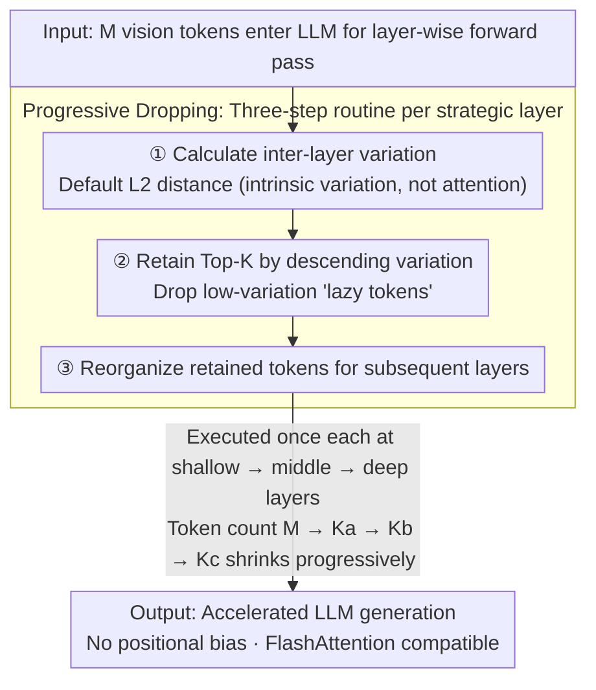

# Variation-Aware Vision Token Dropping for Faster Large Vision-Language Models

**Conference**: CVPR2026  
**arXiv**: [2509.01552](https://arxiv.org/abs/2509.01552)  
**Code**: [xuyang-liu16/V2Drop](https://github.com/xuyang-liu16/V2Drop)  
**Area**: Multimodal VLM  
**Keywords**: token compression, vision token pruning, LVLM acceleration, variation-aware, training-free inference acceleration, FlashAttention compatibility

## TL;DR

V2Drop is proposed, which for the first time adopts a perspective of token variation. By progressively dropping "lazy" vision tokens with minimal variation within the LLM, it achieves training-free, position-bias-free LVLM inference acceleration compatible with efficient operators. It retains 94.0% and 98.6% of original performance in image and video understanding tasks respectively, while reducing LLM generation latency by 31.5% and 74.2%.

## Background & Motivation

1.  **Explosion of Vision Tokens**: High-resolution image and long-video understanding lead to a sharp increase in vision tokens, imposing quadratic computational complexity on LVLM inference and severely restricting deployment efficiency.
2.  **Positional Bias of Attention-Guided Methods**: Existing Inner-LLM token compression methods (e.g., FastV, SparseVLM, PDrop) rely on attention weights to assess token importance. These systematically favor tokens at the end of the sequence regardless of semantic content, leading to the loss of important information and retention of irrelevant tokens, which exacerbates multimodal hallucinations.
3.  **Incompatibility with Efficient Operators**: Attention-guided methods require explicit computation of attention weights, which conflicts with efficient operators like FlashAttention. This can result in peak VRAM exceeding the uncompressed model (e.g., SparseVLM's VRAM increases by 54.8% on MVBench), defeating the purpose of acceleration.
4.  **External Signals vs. Intrinsic Attributes**: Relying on external signals like attention is indirect and unreliable. Can token importance be judged directly through its own behavior patterns within the model? This fundamental question remains unexplored.
5.  **Training Overhead Limits Scalability**: Some token compression methods are training-aware, making them difficult to apply as plug-and-play solutions across different models, which limits versatility and scalability.
6.  **Long-Sequence Bottleneck in Video Understanding**: VideoLLMs process increasingly long sequences (e.g., multi-hour frame-level understanding). Existing methods either provide insufficient compression or over-retain late-frame tokens due to positional bias, ignoring early critical information. A position-agnostic efficient compression scheme is urgently needed.

## Method

### Overall Architecture

V2Drop aims to address the issue of excessive vision tokens in LVLMs that slow down inference due to quadratic complexity. Instead of relying on attention weights, it observes "how much" each vision token's representation changes between adjacent LLM layers. Large variations correspond to task-relevant regions, while small variations indicate "lazy tokens" that are mostly irrelevant. Consequently, it retains top-K tokens by variation at shallow, middle, and deep stages of the LLM, progressively dropping lazy tokens. This process requires no training, does not touch attention, and is naturally free of positional bias and compatible with FlashAttention.

### Key Designs

**1. Variation Perspective: Judging importance via intrinsic inter-layer behavior rather than external attention**

Mainstream methods rely on attention weights, which are indirect signals with systematic bias toward the sequence end and conflict with FlashAttention. V2Drop observes an intrinsic property: the variation of token representations across LLM layers. Analysis reveals that the rule "High Variation $\leftrightarrow$ Task Relevant, Low Variation $\leftrightarrow$ Task Irrelevant" holds across different questions and spatial positions. It avoids positional bias and eliminates the need for attention computation. The paper also provides the Variation-Impact theorem using a first-order Taylor expansion: under smoothness assumptions, a token's variation is proportional to its impact on the output, $\|\Delta f_j\| \approx \|J_j\|_{\text{op}}\cdot\|\Delta x_j^{(t)}\|$, providing a theoretical basis for variation-based pruning.

**2. Variation Metrics: Default L2 distance for optimal performance-efficiency trade-off**

To quantify "how much" change occurs, V2Drop evaluates three metrics for the same token between adjacent layers: L1 for sparse changes, L2 for overall magnitude, and Cosine for directional changes. L2 is chosen as the default for the best balance: $\text{Var}(\mathbf{f}_i^{(l-1)}, \mathbf{f}_i^{(l)}) = \|\mathbf{f}_i^{(l)} - \mathbf{f}_i^{(l-1)}\|_2$.

**3. Progressive Dropping: Gradually shrinking token count at three strategic stages**

Dropping too many tokens at once can cause information loss. V2Drop prunes tokens at three strategic positions (shallow, middle, deep). Each involves a three-step routine: calculate variation $\rightarrow$ retain Top-K high-variation tokens $\rightarrow$ reorganize for subsequent layers. The token count follows a schedule of $M \rightarrow K_a \rightarrow K_b \rightarrow K_c$. The total cost for the three stages is approximately 21M FLOPs, representing only 0.002% of a full forward pass, with throughput nearly identical to random dropping (9.01 vs 9.08 items/s), ensuring true plug-and-play capability.

## Key Experimental Results

### Main Results: Comparison of different compression rates on LLaVA-1.5-7B

| Method | Retained Tokens | GQA | SQA | TextVQA | POPE | MME | MMBench | Avg% |
| :--- | :--- | :--- | :--- | :--- | :--- | :--- | :--- | :--- |
| Original | 576 (100%) | 61.9 | 69.5 | 58.2 | 85.9 | 1862 | 64.6 | 100% |
| FastV | 192 (↓67%) | 52.7 | 67.3 | 52.5 | 64.8 | 1612 | 61.2 | 88.2% |
| SparseVLM | 192 (↓67%) | 57.6 | 69.1 | 56.1 | 83.6 | 1721 | 62.5 | 95.9% |
| PDrop | 192 (↓67%) | 57.1 | 68.8 | 56.1 | 82.3 | 1766 | 63.2 | 96.0% |
| **V2Drop** | **192 (↓67%)** | **58.5** | **69.3** | **55.6** | **85.1** | **1826** | **63.7** | **97.6%** |
| FastV | 128 (↓78%) | 49.6 | 60.2 | 50.6 | 59.6 | 1490 | 56.1 | 81.7% |
| **V2Drop** | **128 (↓78%)** | **56.3** | **68.8** | **53.8** | **80.9** | **1712** | **61.8** | **94.0%** |

At a 67% compression rate, V2Drop retains 97.6% of performance, outperforming the runner-up PDrop by 1.6%. At 78% compression, it still maintains 94.0%.

### Efficiency Comparison: Inference Latency and VRAM (LLaVA-1.5-7B / LLaVA-OV-7B)

| Method | LLM Latency Reduction | Total Latency Reduction | Peak VRAM Change | Throughput Gain | Performance Retention |
| :--- | :--- | :--- | :--- | :--- | :--- |
| FastV (Image) | ↓26.5% | ↓17.6% | ↑3.7% | 1.21× | 86.8% |
| SparseVLM (Image) | ↓28.0% | ↓18.6% | **↑23.5%** | 1.23× | 92.9% |
| **V2Drop (Image)** | **↓31.5%** | **↓20.8%** | **↓3.3%** | **1.26×** | **95.7%** |
| SparseVLM (Video) | ↓34.4% | ↓20.0% | **↑54.8%** | 1.06× | 99.1% |
| **V2Drop (Video)** | **↓74.2%** | **↓46.5%** | **↓7.8%** | **1.38×** | **99.1%** |

V2Drop is the only method that reduces both latency and VRAM. While SparseVLM provides comparable performance, its VRAM increases by 54.8%.

## Highlights & Insights

-   **High Originality**: For the first time, token importance is examined from the perspective of variation, opening a new compression paradigm distinct from attention guidance.
-   **Theoretical and Empirical Unity**: The Variation-Impact theorem provides rigorous theoretical backing, while experiments provide comprehensive validation (6 image benchmarks + 2 video benchmarks + 3 models).
-   **True Plug-and-Play**: No training required, no architectural changes, FlashAttention compatible, and a computational overhead of only 0.002%.
-   **Fundamental Solution to Positional Bias**: Based on intrinsic attributes rather than external signals, naturally avoiding the positional bias flaws of attention-based methods.
-   **Strong Advantages in Video Scenarios**: In video understanding, retaining only 25% of tokens achieves 98.6% of original performance, far exceeding similar methods, particularly for long videos.

## Limitations & Future Work

-   Pruning layer positions and retention ratios need to be preset, lacking an adaptive mechanism to dynamically adjust compression rates based on input content.
-   The choice between the three variation metrics (L1/L2/Cosine) is empirical; more complex variation measurements have not been explored.
-   Validated only on 7B-class models; applicability to 70B+ large models and newer architectures (e.g., MoE) remains unknown.
-   Theoretical analysis is based on first-order Taylor approximation and smoothness assumptions, which might not hold perfectly in extreme layers of deep networks.
-   The combined effect with Pre-LLM compression methods has not been explored; there may be complementary potential.

## Related Work & Insights

-   **vs. FastV (ECCV'24)**: FastV uses one-time dropping + attention guidance, leading to severe positional bias (POPE: 59.6 vs. V2Drop: 80.9) and increased VRAM; V2Drop uses progressive dropping + variation guidance, outperforming it across the board.
-   **vs. SparseVLM (ICML'25)**: SparseVLM is also progressive but relies on attention + token merging, causing VRAM to surge by 54.8% in video scenarios; V2Drop achieves similar performance while reducing VRAM.
-   **vs. PDrop (CVPR'25)**: PDrop uses attention-guided progressive dropping; V2Drop consistently outperforms PDrop at all compression rates and maintains FlashAttention compatibility.
-   **vs. ToMe (ICLR'23)**: ToMe uses token merging; performance drops sharply under aggressive compression (69.7% with 64 tokens), while V2Drop maintains 86.9% under equivalent ratios.
-   **vs. Pre-LLM methods (e.g., LLaVA-PruMerge)**: Pre-LLM methods compress before the LLM and may lose contextual information processed by the LLM; V2Drop prunes within the LLM, using layer-wise information for higher precision.

## Rating

-   Novelty: ⭐⭐⭐⭐ — The variation perspective is a fresh entry point, though the core operations (L2 distance + Top-K) are relatively simple.
-   Experimental Thoroughness: ⭐⭐⭐⭐⭐ — Comprehensive across models, benchmarks, compression rates, efficiency analyses, visualizations, and ablations.
-   Writing Quality: ⭐⭐⭐⭐⭐ — Clear motivation, precise problem definition, rigorous theoretical derivation, and intuitive charts.
-   Value: ⭐⭐⭐⭐ — Highly practical with insights for the community, though the simplicity of the method suggests limited headroom for further gains.

<!-- RELATED:START -->

## Related Papers

- [\[CVPR 2026\] On Token's Dilemma: Dynamic MoE with Drift-Aware Token Assignment for Continual Learning of Large Vision Language Models](on_tokens_dilemma_dynamic_moe_with_drift-aware_token_assignment_for_continual_le.md)
- [\[CVPR 2026\] TransPrune: Token Transition Pruning for Efficient Large Vision-Language Model](transprune_token_transition_pruning_for_efficient_large_vision-language_model.md)
- [\[CVPR 2026\] Dynamic Token Reweighting for Robust Vision-Language Models](dynamic_token_reweighting_for_robust_vision-language_models.md)
- [\[CVPR 2026\] HAWK: Head Importance-Aware Visual Token Pruning in Multimodal Models](hawk_head_importance-aware_visual_token_pruning_in_multimodal_models.md)
- [\[CVPR 2026\] Uncertainty-Aware Knowledge Distillation for Multimodal Large Language Models](uncertainty-aware_knowledge_distillation_for_multimodal_large_language_models.md)

<!-- RELATED:END -->
