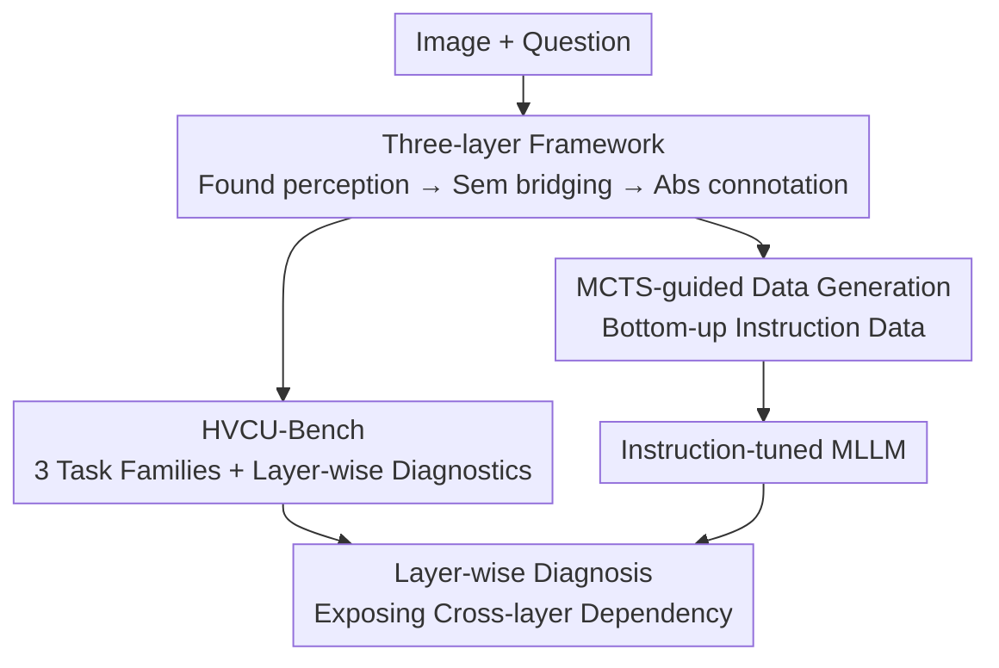

# VCU-Bridge: Hierarchical Visual Connotation Understanding via Semantic Bridging

**Conference**: CVPR 2026  
**Code**: [vcu-bridge.github.io](https://vcu-bridge.github.io)  
**Paper**: [CVF Open Access](https://openaccess.thecvf.com/content/CVPR2026/html/Zhong_VCU-Bridge_Hierarchical_Visual_Connotation_Understanding_via_Semantic_Bridging_CVPR_2026_paper.html)  
**Area**: Multi-modal VLM / Benchmark / Instruction Tuning  
**Keywords**: Hierarchical visual understanding, Semantic bridging, Visual connotation, MCTS data generation, MLLM diagnosis

## TL;DR
VCU-Bridge proposes a three-layer progressive visual connotation understanding framework ("Foundational Perception → Semantic Bridging → Abstract Connotation") along with HVCU-Bench for layer-wise diagnosis. The study finds that MLLM performance consistently declines as the reasoning hierarchy ascends. By utilizing MCTS-guided instruction tuning data to strengthen low-level perception, the approach achieves improvements on this benchmark and an average gain of +2.53% on general benchmarks (+7.26% on MMStar).

## Background & Motivation
**Background**: MLLMs have achieved impressive scores on various benchmarks, yet their processing paradigm remains distinct from how humans integrate visual information.

**Limitations of Prior Work**: Humans naturally bridge **details** and **high-level concepts** (inferring meaning from details), whereas models tend to process the two in isolation. Existing evaluation protocols often **decouple** low-level perception and high-level reasoning, ignoring their semantic and causal dependencies. This results in undiagnosable performance where the actual bottleneck level remains hidden.

**Key Challenge**: Visual connotation understanding is inherently **bottom-up**; abstract conclusions must be built upon the perception of concrete clues. However, existing benchmarks score levels separately, failing to expose cross-layer dependencies such as "high-level errors caused by low-level misperception."

**Goal**: To construct a framework and benchmark for visual connotation understanding that explicitly models the "evidence → inference" chain for layer-wise diagnosis, and to verify whether strengthening the bottom layer can drive improvements at higher levels.

**Core Idea**: Operationalize visual connotation understanding into a human-like three-layer hierarchy (Foundational Perception → Semantic Bridging → Abstract Connotation) with an explicit "concrete clues → abstract conclusion" evidence chain, allowing failures to be traced back to specific levels.

## Method

### Overall Architecture
VCU-Bridge is a trinity of "framework + benchmark + data generation." The framework defines three-layer progressive reasoning; HVCU-Bench organizes task families according to these layers and utilizes layer-wise metrics for diagnosis; finally, an MCTS-guided data generation pipeline produces instruction tuning data to reinforce the bottom layer and observe the driving effect on higher levels.

### Key Designs

**1. Three-layer Visual Connotation Framework: Explicitly splitting "see details → understand meaning" into traceable evidence chains**

The framework divides the understanding process into three progressive layers: **Foundational Perception** (identifying concrete elements, e.g., recurring musical instruments in a comic); **Semantic Bridging** (linking perceived details with context/dialogue for intermediate inference); and **Abstract Connotation** (deriving deep meanings or emotions). Explicit "evidence → inference" trajectories exist between these layers. This distinguishes it from "isolated layer evaluation" by surfacing cross-layer causal dependencies, making it possible to pinpoint why high-level reasoning fails.

**2. HVCU-Bench: Hierarchical benchmark with layer-wise diagnosis, exposing "higher is worse" degradation**

Built on the proposed framework, HVCU-Bench includes three task families (corresponding to the three layers) and is evaluated using metrics that capture both layer-specific performance and cross-layer dependencies. Comprehensive experiments reveal a consistent phenomenon: **performance declines as reasoning progresses to higher levels**. While perception is relatively stable, scores drop significantly at the connotation layer, and strong inter-layer dependencies exist (weak bottom layers directly drag down top layers). This upgrades the benchmark from a "total score report" to a diagnostic tool.

**3. MCTS-guided Bottom-up Instruction Data Generation: Strengthening the bottom to drive the top**

To verify if "strengthening the bottom layer can improve the top layer," this work uses **Monte Carlo Tree Search (MCTS)** to guide an instruction tuning data generation pipeline, systematically creating training data that reinforces low-level perception. Results show that reinforcing bottom-up capabilities leads to measurable gains at higher levels. Interestingly, these improvements spill over to **general benchmarks**, yielding an average Gain of +2.53%, with MMStar increasing by +7.26% and significant improvements in sub-tasks like Affective Reasoning. This proves that a "hierarchical thinking mode" is an effective lever for MLLM capability rather than just a benchmark-specific optimization.

## Key Experimental Results

### Main Results

| Evaluation | Phenomenon/Gain | Explanation |
|------|----------|------|
| HVCU-Bench Layer-wise | Perception→Bridging→Connotation performance drops monotonically | High-level is a universal bottleneck; strong inter-layer dependency |
| General Benchmarks (Avg) | +2.53% | Strengthening the bottom layer spills over to general capabilities |
| MMStar | +7.26% | Most significant gain observed |
| MMMU / Affective Reasoning | +Multiple percentage points | Hierarchical training is generally beneficial |

### Ablation Study

| Configuration | Effect | Explanation |
|------|------|------|
| Strengthening bottom (MCTS data) | Measurable top-layer improvement | Bottom-up approach is effective |
| Top-layer data only | Limited improvement | Difficult to improve high-level independently without bottom-layer support |
| Scaling hierarchical supervision | Continuous gains (e.g., +1.75%/+6.17%) | Scaling bottom-up data is effective |

### Key Findings
- **Universal Hierarchical Degradation**: All models show a monotonic drop in scores from "perception → connotation," indicating the bottleneck for MLLMs is not visibility but the ability to bridge details into meaning.
- **Strong Inter-layer Dependency**: Low-level performance heavily influences high-level results, validating the existence of the "evidence → inference" chain.
- **Bottom-layer Reinforcement Spillover**: Strengthening the bottom layer drives general benchmarks (MMStar +7.26%), suggesting that hierarchical thinking is a paradigm-level, transferable gain.

## Highlights & Insights
- **Explicitly modeling the "evidence → inference" chain** is the most valuable design: it transforms evaluation from undiagnosable scores to locatable bottlenecks, assisting in the understanding of MLLM failures.
- The discovery that **bottom-layer reinforcement spills over to general capabilities** is counter-intuitive and practical—it suggests prioritizing foundational perception over merely stacking high-level reasoning data.
- The paradigm of a three-layer framework + MCTS bottom-up data generation can be transferred to any multi-modal task requiring "perception-supported reasoning" (e.g., chart understanding, metaphor interpretation, sentiment analysis).

## Limitations & Future Work
- The boundaries between the three layers and "semantic bridging" involve some subjectivity; hierarchical granularity may need redefinition for different tasks.
- The cost, scalability, and quality control of the MCTS data generation pipeline are summarized briefly; reproduction depends on the project page details.
- High-level labels like connotation and emotion possess inherent annotation subjectivity, where the evaluation ceiling is constrained by human consensus.

## Related Work & Insights
- **vs Decoupled perception/reasoning protocols (e.g., general VQA benchmarks)**: VCU-Bridge explicitly models inter-layer dependencies, providing diagnosable results that identify bottleneck layers.
- **vs Direct stacking of high-level reasoning instructions**: This paper proves that bottom-up reinforcement is more effective and spills over to general capabilities.
- **vs General benchmarks (e.g., MMStar, MMMU)**: HVCU-Bench focuses specifically on hierarchical connotation understanding, acting as a "diagnostic microscope" for these broader benchmarks.

## Rating
- Novelty: ⭐⭐⭐⭐ Combination of hierarchical connotation framework + explicit evidence chain + MCTS bottom-up data is novel.
- Experimental Thoroughness: ⭐⭐⭐⭐ Sufficiently validated through layer-wise diagnosis and general benchmark spillovers.
- Writing Quality: ⭐⭐⭐⭐ Clear chain of logic spanning Framework—Benchmark—Data—Findings.
- Value: ⭐⭐⭐⭐ Provides a diagnosable hierarchical evaluation and a practical "bottom-layer reinforcement" paradigm.

<!-- RELATED:START -->

## Related Papers

- [\[CVPR 2026\] HBridge: H-Shape Bridging of Heterogeneous Experts for Unified Multimodal Understanding and Generation](hbridge_h-shape_bridging_of_heterogeneous_experts_for_unified_multimodal_underst.md)
- [\[CVPR 2026\] HiSpatial: Taming Hierarchical 3D Spatial Understanding in Vision-Language Models](hispatial_taming_hierarchical_3d_spatial_understanding_in_vision-language_models.md)
- [\[ACL 2026\] SlideAgent: Hierarchical Agentic Framework for Multi-Page Visual Document Understanding](../../ACL2026/multimodal_vlm/slideagent_hierarchical_agentic_framework_for_multi-page_visual_document_underst.md)
- [\[CVPR 2026\] Taxonomy-Aware Representation Alignment for Hierarchical Visual Recognition with Large Multimodal Models](taxonomy-aware_representation_alignment_for_hierarchical_visual_recognition_with.md)
- [\[CVPR 2026\] CodeMMR: Bridging Natural Language, Code, and Image for Unified Retrieval](codemmr_bridging_natural_language_code_and_image_for_unified_retrieval.md)

<!-- RELATED:END -->
