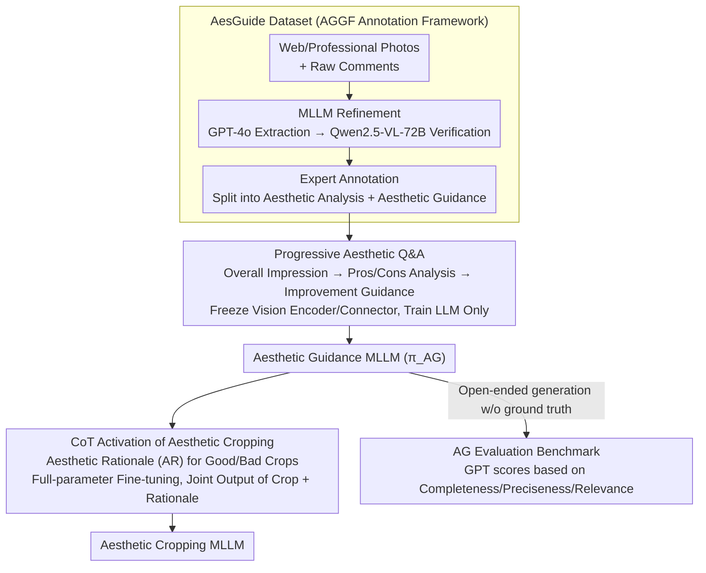

# Venus: Benchmarking and Empowering Multimodal Large Language Models for Aesthetic Guidance and Cropping

**Conference**: CVPR 2026  
**arXiv**: [2602.23980](https://arxiv.org/abs/2602.23980)  
**Code**: [https://github.com/PKU-ICST-MIPL/Venus_CVPR2026](https://github.com/PKU-ICST-MIPL/Venus_CVPR2026)  
**Area**: Multimodal VLM  
**Keywords**: Aesthetic Guidance, Image Cropping, MLLM, Aesthetic Evaluation, CoT Reasoning

## TL;DR
This paper defines the new task of Aesthetic Guidance (AG) and constructs the AesGuide benchmark (10,748 images with aesthetic scores, analysis, and guidance annotations). It proposes Venus, a two-stage framework that first empowers MLLMs with aesthetic guidance capabilities through progressive aesthetic Q&A, and then activates aesthetic cropping capabilities via CoT reasoning, achieving SOTA performance on both tasks.

## Background & Motivation
**Background**: Computational aesthetics has evolved from perception-level tasks such as aesthetic scoring and description to higher-level understanding. However, "aesthetic guidance"—the ability to identify aesthetic issues and provide actionable photography suggestions—is a critical capability that has not yet been systematically studied.

**Limitations of Prior Work**: (a) General MLLMs (e.g., GPT-4o) and aesthetic-specific MLLMs (e.g., AesExpert) tend to provide overly positive evaluations of photographs, failing to identify specific problems or offer actionable advice; (b) While aesthetic cropping models can perform cropping, they lack interpretability and interactivity, failing to explain the rationale behind a crop or adapt to user preferences.

**Key Challenge**: Existing aesthetic datasets primarily annotate "what makes a photo good," lacking instructional annotations regarding "what is wrong" and "how to improve." Furthermore, the aesthetic reasoning process of current MLLMs is not aligned with human cognition.

**Goal**: (a) To construct the first aesthetic guidance dataset and benchmark; (b) To empower MLLMs with aesthetic guidance capabilities; (c) To leverage aesthetic guidance capabilities to activate intelligent cropping.

**Key Insight**: Aesthetic guidance follows a human cognitive process of "overall impression → analysis of pros and cons → proposing improvements." MLLMs can be trained to simulate this process using Q&A tasks of progressive complexity.

**Core Idea**: Through building aesthetic guidance capabilities (via progressive Q&A) and activating aesthetic cropping (via CoT reasoning rationales), the MLLM's aesthetic understanding and creative capabilities are realized in two stages.

## Method

### Overall Architecture
The pain point Venus aims to solve is that existing MLLMs only provide vague, positive feedback when presented with an image, failing to articulate issues or provide actionable shooting advice. Venus decomposes this problem into a two-stage progressive training process. In Stage 1, the model is trained on the self-built AesGuide dataset to answer aesthetic questions in an increasing order of depth: "Scoring → Analysis → Guidance." This establishes the foundational "aesthetic guidance" comprehension capability. In Stage 2, this comprehension is transferred to cropping tasks. Each cropping box in the training data is paired with an aesthetic rationale (AR), forcing the model to explain "why this region was cropped" while simultaneously outputting coordinates. The former stage teaches the model to "understand beauty," while the latter enables it to "create beauty," both sharing a unified aesthetic cognitive framework. The foundation for this process is data: AesGuide is first processed via the AGGF annotation framework to refine noisy comments into high-quality "aesthetic analysis + aesthetic guidance" annotations. Finally, a GPT-based scorer is used on the AG benchmark to evaluate the model's performance.

### Key Designs

**1. AesGuide Dataset: Supplementing "What's Good" with "What's Wrong + How to Fix"**

Most existing aesthetic datasets only annotate what is good about a photo, lacking guidance on problems and adjustments. AesGuide collects 10,748 photos from online platforms and professional photographers. It utilizes a two-stage annotation process to combat noise and inconsistent styles in online comments: first, MLLM refinement (GPT-4o organizes raw comments into structured analysis, verified by Qwen2.5-VL-72B), followed by human expert review (20 photography experts revise content and explicitly split it into "aesthetic analysis" and "aesthetic guidance"). This leverages MLLM throughput for drafting while ensuring the quality and consistency of subjective annotations via experts.

**2. Progressive Aesthetic Q&A: Layered Difficulty Following Human Cognition**

Humans appreciate photos by forming an impression, analyzing details, and then deciding on improvements. Venus designs training questions into three progressive layers. The first layer asks for an overall impression to establish perceptual judgment. The second layer demands detailed analysis (e.g., composition issues, lighting suitability) to ground feelings in specific aesthetic elements. The third layer requires actionable guidance (e.g., how to adjust angles or lighting). Training the model through this "perception → analysis → suggestion" pipeline aligns better with aesthetic reasoning than providing direct answers.

**3. CoT Activation for Aesthetic Cropping: Forcing Understanding via Rationales**

Models that only learn cropping coordinates cannot explain their compositional logic, making them neither interpretable nor interactive. Venus pairs each cropping box with an aesthetic rationale (AR). GPT-4o explains why a specific crop is good or bad based on the defined region, and Qwen2.5-VL-72B verifies consistency with the image. Crucially, generating rationales for both good and bad crops allows the model to learn "what makes a good crop" through contrast, rather than just regressing coordinates.

**4. AG Evaluation Benchmark: GPT-based Scoring across Three Dimensions**

Aesthetic guidance is an open-ended generation task without unique ground truths. The benchmark tasks GPT-4 with scoring model responses using human gold-standard annotations as references across three dimensions (0–2 scale): Completeness (coverage of issues/advice), Preciseness (accuracy of judgment), and Relevance (topical alignment). Cross-validation with 10 experts on a 100-sample subset confirmed high correlation between GPT scores and expert judgment.

### Loss & Training
Both stages utilize standard instruction fine-tuning, with the objective being the negative log-likelihood of next-token prediction:

$$\mathcal{L} = -\mathbb{E}\sum_t \log\pi_\theta(y_t \mid x, q, y_{<t})$$

where $x$ is the image and $q$ is the question. Stage 1 freezes the vision encoder and connector while training only the LLM. Stage 2 involves full-parameter fine-tuning of the aesthetic guidance MLLM to activate cropping capabilities.

## Key Experimental Results

### Main Results: Aesthetic Guidance Evaluation (AesGuide Benchmark)

| Model | Completeness | Preciseness | Relevance | Mean | Expert |
|------|-------------|-------------|-----------|------|--------|
| GPT-4o | 0.84 | 1.09 | 1.01 | 0.98 | 1.15 |
| AesExpert-7B | 0.33 | 0.56 | 0.51 | 0.47 | 0.56 |
| UNIAA-7B | 1.03 | 1.02 | 1.23 | 1.09 | 1.01 |
| InternVL 2.5-7B | 0.83 | 1.01 | 1.02 | 0.95 | 0.99 |
| **Venus-I (Ours)** | **1.27** | **1.33** | **1.81** | **1.47** | **1.50** |
| LLaVA-1.5-13B | 0.67 | 0.86 | 0.41 | 0.65 | 0.61 |
| **Venus-L-13B (Ours)** | **1.28** | **1.35** | **1.83** | **1.49** | **1.53** |

### Main Results: Aesthetic Cropping (FLMS Benchmark)

| Model | IoU%↑ | Disp↓ | Explainable | Interactive |
|------|-------|-------|--------|--------|
| CACNet | 72.8 | 0.062 | ✗ | ✗ |
| TransView | 71.5 | 0.068 | ✗ | ✗ |
| GPT-4o | 58.3 | 0.105 | ✓ | ✓ |
| **Venus-Q (Ours)** | **74.2** | **0.055** | ✓ | ✓ |

### Key Findings
- Venus outperforms GPT-4o by approximately 50% in Mean aesthetic guidance scores (1.47 vs 0.98), with the most significant gain in the Relevance dimension (+0.79).
- Aesthetic guidance capability directly benefits cropping; skipping Stage 1 leads to a significant drop in cropping performance.
- A user survey of 1,069 individuals showed that 91% desire aesthetic guidance features, validating the task's practical necessity.
- Venus is the only method that achieves SOTA cropping performance while maintaining interpretability and interactivity.
- Training with rationales for "bad crops" is more effective than using only "good crops."

## Highlights & Insights
- **Contribution of Task Definition**: Formally defining the "Aesthetic Guidance (AG)" task fills a critical gap in computational aesthetics, supported by a 91% user demand rate.
- **Two-Stage Capability Transmission**: The transmission path from AG capability to cropping capability is ingenious—making the model "understand beauty" as a prerequisite to "creating beauty." This paradigm is transferable to other "Understanding + Creation" dual tasks.
- **AGGF Annotation Framework**: The MLLM refinement plus expert review workflow balances efficiency and quality, offering a practical solution for large-scale subjective annotation.

## Limitations & Future Work
- AesGuide data primarily comes from online photography communities, which might favor specific aesthetic orientations.
- Cropping is limited to 2D reconstruction and does not yet involve 3D perspective adjustments or light modification.
- Evaluation depends on GPT as a scorer, which may have biases in highly subjective aesthetic judgments.
- Personalization remains unexplored; different users have different standards for a "good photo."

## Related Work & Insights
- **vs AesExpert**: AesExpert focuses on aesthetic perception and description (largely positive), whereas Venus focuses on aesthetic guidance (identifying problems and giving advice).
- **vs CACNet**: CACNet is a small, specialized cropping model with high IoU but no interpretability; Venus achieves competitive cropping while providing CoT rationales.

## Rating
- Novelty: ⭐⭐⭐⭐⭐ The AG task definition fills a gap; AesGuide is a pioneering dataset.
- Experimental Thoroughness: ⭐⭐⭐⭐⭐ Evaluation across 5 MLLMs, 2 tasks, and dual GPT+Expert assessment.
- Writing Quality: ⭐⭐⭐⭐ Clear framework diagrams; user surveys add strong evidence.
- Value: ⭐⭐⭐⭐⭐ High value for the community due to the dataset and benchmark, specifically targeting practical photography guidance.

<!-- RELATED:START -->

## Related Papers

- [\[CVPR 2026\] A3: Towards Advertising Aesthetic Assessment](a3_towards_advertising_aesthetic_assessment.md)
- [\[CVPR 2026\] Grounding Everything in Tokens for Multimodal Large Language Models](grounding_everything_in_tokens_for_multimodal_large_language_models.md)
- [\[CVPR 2026\] Multimodal Continual Instruction Tuning with Dynamic Gradient Guidance](multimodal_continual_instruction_tuning_with_dynamic_gradient_guidance.md)
- [\[CVPR 2026\] GraphVLM: Benchmarking Vision Language Models for Multimodal Graph Learning](graphvlm_benchmark_vlm_graph_learning.md)
- [\[CVPR 2026\] SVHalluc: Benchmarking Speech-Vision Hallucination in Audio-Visual Large Language Models](svhalluc_benchmarking_speech-vision_hallucination_in_audio-visual_large_language.md)

<!-- RELATED:END -->
