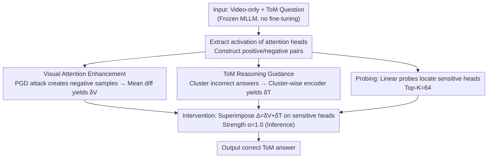

# Video-Only ToM: Enhancing Theory of Mind in Multimodal Large Language Models

**Conference**: CVPR 2026  
**arXiv**: [2603.24484](https://arxiv.org/abs/2603.24484)  
**Code**: None (Project page: [https://founce.github.io/VisionToM](https://founce.github.io/VisionToM))  
**Area**: Multimodal VLM / Theory of Mind  
**Keywords**: Theory of Mind, Multimodal Large Language Models, Attention Intervention, Visual Reasoning, Hallucination Mitigation

## TL;DR

VisionToM is a lightweight vision-based intervention framework that enhances Theory of Mind (ToM) reasoning in MLLMs by probing and intervening in attention heads sensitive to visual input and ToM logic. Without fine-tuning, the method significantly improves performance on the EgoToM benchmark by guiding the model to focus on visual evidence.

## Background & Motivation

1. **Background**: Theory of Mind (ToM) involves inferring mental states (desires, beliefs, intentions) to predict behavior. While LLMs show promise in text-based ToM, research on ToM reasoning based purely on visual information remains insufficient.

2. **Limitations of Prior Work**: (1) Most MLLMs perform poorly on vision-only ToM tasks, showing a massive gap compared to human baselines in Belief and Action reasoning; (2) Existing methods treat models as black boxes and rarely explore internal attention behavior; (3) The impact of hallucinations on ToM tasks has not been sufficiently studied from an interpretability perspective; (4) Most multimodal ToM benchmarks lack real-world ecological validity.

3. **Key Challenge**: MLLMs rely excessively on linguistic priors while ignoring visual evidence. When visual information conflicts with these priors, models tend to produce inferences based on linguistic patterns rather than visual facts, leading to hallucinations.

4. **Goal**: To enhance visual attention and ToM reasoning in MLLMs without fine-tuning by intervening in internal representations to reduce reliance on spurious linguistic priors.

5. **Key Insight**: Interpretability analysis reveals that MLLMs exhibit cross-task consistency in visual attention, while representations for ToM reasoning are task-divergent but intra-task consistent. This provides a basis for targeted intervention.

6. **Core Idea**: Use linear probes to locate attention heads sensitive to visual input and ToM reasoning, then calculate and inject intervention vectors to steer the model toward correct reasoning during inference.

## Method

### Overall Architecture

VisionToM solves the issue where MLLMs "hallucinate" in vision-only ToM tasks by favoring linguistic patterns over conflicting visual evidence. Instead of fine-tuning, the framework identifies specific attention heads responsible for "visual perception" and "mental state inference" and injects correction vectors during the forward pass. The pipeline consists of four steps: extracting activations from frozen heads to construct calibration pairs; identifying sensitive heads via linear probing; calculating visual and ToM-specific correction directions; and superimposing these vectors during inference. The backbone remains frozen throughout.

### Key Designs

**1. Visual Attention Enhancement: Reversing directions that ignore visual input**

The authors identify directions in the attention space that signify "ignoring visual evidence." PGD adversarial attacks ($\epsilon=16/255$, 300 steps) are used to perturb only visual input, creating negative samples. For each head, the mean activation difference provides the visual offset vector:

$$\{\delta_{V,l}^h\} = \frac{1}{S}\sum_{i=1}^{S}\left(X_{V,i,l}^{pos,h} - X_{V,i,l}^{neg,h}\right)$$

Applying this vector in reverse during inference steers the model to rely more on the actual visual scene.

**2. ToM Reasoning Guidance: Cluster-wise correction encoders**

Since ToM reasoning failures are diverse (e.g., wrong intentions vs. wrong beliefs), a simple average direction is insufficient. The framework clusters incorrect representations for each head and trains dedicated encoders $f_{h,c}$ to map negative samples to positive ones:

$$\delta_{h,c,i} = f_{h,c}\!\left(x_{T,i}^{neg,h}\right)$$

During inference, the model applies the encoder corresponding to the nearest cluster to provide a refined "remedy" for specific reasoning failures.

**3. Probing and Intervention Mechanism: Locating and intervening in Top-K heads**

Linear probes (logistic regression) identify "sensitive heads" that can distinguish positive from negative samples. Findings show visual heads are distributed across layers, while ToM heads are concentrated in middle layers. Intervention involves adding both visual and ToM vectors to the Top-K=64 heads:

$$T_{l+1} = T_l + \sum_{h=1}^{H}\left(Attn_l^h(P_l^h T_l) + \alpha \times \Delta\right)\cdot W_l^o$$

### Mechanism

Using LLaVA-Next-Video-7B on an EgoToM Goal question: **Offline Calibration** calculates $\delta_V$ via PGD and $\delta_T$ via cluster-wise encoders. **Inference** identifies 64 sensitive heads and superimposes these vectors. While the baseline suffers from linguistic bias (61.5% accuracy), VisionToM pulls the model toward visual evidence and correct logic, reaching 74.5%.

### Loss & Training

Probes use cross-entropy loss. Encoders minimize the squared error between corrected negative samples and positive targets:

$$L_{total} = \sum_h \sum_{c=1}^{k_h^*} \frac{1}{|C_{h,c}|} \sum_{i \in C_{h,c}} \left\|\left(x_{T,i}^{neg,h} + \delta_{h,c,i}\right) - x_{T,i}^{pos,h}\right\|^2$$

## Key Experimental Results

### Main Results

| Model | Task | Baseline | +VisionToM | Gain |
|--------|------|------|----------|------|
| LLaVA-Next-Video-7B | Goal | 61.5% | 74.5% | +13.0% |
| LLaVA-Next-Video-7B | Belief | 38.9% | 45.3% | +6.4% |
| Qwen2.5-VL-7B | Belief | 35.6% | 42.0% | +6.4% |
| Qwen2.5-VL-7B | Actions | 31.1% | 37.6% | +6.5% |
| Human Baseline | Goal/Belief/Actions | 88/72/78% | - | - |

### Ablation Study

| Configuration | Goal | Belief | Actions | Description |
|------|---------|------|------|------|
| LLaVA Baseline | 61.5% | 38.9% | 24.0% | No intervention |
| Vision Only (w/o $\delta_T$) | 73.2% | 39.2% | 25.3% | Large Goal gain |
| ToM Only (w/o $\delta_V$) | 72.6% | 45.3% | 29.0% | Large Belief/Actions gain |
| Reverse Intervention ($-\alpha\Delta$) | 50.6% | 20.6% | 10.1% | Performance crashes |

### Key Findings

- Visual intervention is most effective for Goal tasks (+11.7%), which depend heavily on visual cues.
- ToM intervention is critical for Belief and Action tasks requiring deeper cognitive logic.
- PGD attacks provide significantly more precise intervention directions than random noise.
- VisionToM also enhances open-ended generation, improving LLaVA-Next-Video's True∧Info score from 8.5% to 27.2%.

## Highlights & Insights

- Discovered a structural pattern in MLLMs: visual attention is task-generic while ToM reasoning is task-specific.
- Leveraged adversarial attacks (PGD) as a diagnostic tool rather than an attack to identify fragile attention directions.
- Clustering heterogenous reasoning failures allows for more precise "correction medications" than simple linear averaging.
- The framework is highly efficient, using only linear probes and two-layer MLPs while keeping the backbone frozen.

## Limitations & Future Work

- Evaluation is currently limited to the EgoToM benchmark; generalization to other ToM datasets is yet to be verified.
- Calibration depends on a predefined set; out-of-distribution scenarios may require new calibration.
- Despite gains, a significant gap remains compared to human baselines in Belief and Action tasks.

## Related Work & Insights

- **vs GridToM**: Unlike GridToM's binary probe coefficients, VisionToM handles the diversity of multi-choice reasoning errors via clustering.
- **vs ICT (CVPR'25)**: While ICT uses random noise, VisionToM uses PGD adversarial samples for more accurate direction estimation.

## Rating

- Novelty: ⭐⭐⭐⭐ Innovative combination of probing and intervention for ToM.
- Experimental Thoroughness: ⭐⭐⭐⭐ Solid results on two models, though limited to one benchmark.
- Writing Quality: ⭐⭐⭐⭐ Clear presentation with supportive visualization.
- Value: ⭐⭐⭐⭐ Provides an interpretable path to improving cognitive reasoning in VLMs.

<!-- RELATED:START -->

## Related Papers

- [\[ICML 2025\] From Black Boxes to Transparent Minds: Evaluating and Enhancing the Theory of Mind in Multimodal Large Language Models](../../ICML2025/multimodal_vlm/from_black_boxes_to_transparent_minds_evaluating_and_enhancing_the_theory_of_min.md)
- [\[CVPR 2026\] MindPower: Enabling Theory-of-Mind Reasoning in VLM-based Embodied Agents](mindpower_enabling_theoryofmind_reasoning_in_vlmba.md)
- [\[CVPR 2026\] Enhancing Video Vision Language Model with Hippocampal Sensing](enhancing_video_vision_language_model_with_hippocampal_sensing.md)
- [\[CVPR 2026\] DiG: Differential Grounding for Enhancing Fine-Grained Perception in Multimodal Large Language Models](dig_differential_grounding_for_enhancing_fine-grained_perception_in_multimodal_l.md)
- [\[CVPR 2026\] Predictive Regularization Against Visual Representation Degradation in Multimodal Large Language Models](predictive_regularization_against_visual_representation_degradation_in_multimoda.md)

<!-- RELATED:END -->
