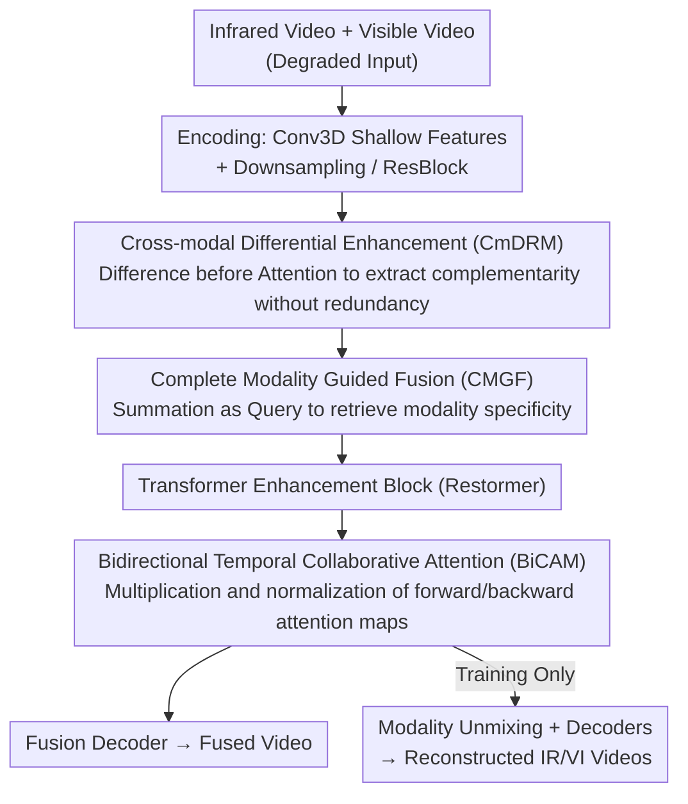

# VideoFusion: A Spatio-Temporal Collaborative Network for Multi-modal Video Fusion

**Conference**: CVPR2026  
**arXiv**: [2503.23359](https://arxiv.org/abs/2503.23359)  
**Code**: [https://github.com/Linfeng-Tang/VideoFusion](https://github.com/Linfeng-Tang/VideoFusion)  
**Area**: Multi-modal VLM  
**Keywords**: multi-modal video fusion, infrared-visible fusion, temporal consistency, cross-modal attention, video dataset

## TL;DR

Ours proposes VideoFusion, the first large-scale infrared-visible video fusion framework. By integrating Cross-modal Differential Representation Enhancement (CmDRM), Complete Modality Guided Fusion (CMGF), and Bidirectional Temporal Collaborative Attention Mechanisms (BiCAM), it jointly models cross-modal complementarity and temporal dynamics to generate spatio-temporally consistent high-quality fused videos. Additionally, the M3SVD dataset consisting of 220 videos/154,000 frames is constructed.

## Background & Motivation

### Limitations of Prior Work

Multi-sensor fusion (especially infrared and visible fusion) is a critical direction in computer vision with extensive applications in military detection, security monitoring, and assisted driving. However, existing research focuses almost entirely on **static image fusion**, neglecting the key fact that sensors in practical applications **usually collect continuous video sequences** rather than independent static frames.

This problem stems from two core bottlenecks:

**Data Scarcity**: Lack of large-scale, time-synchronized, and spatially aligned multi-modal video datasets. Existing video datasets (e.g., TNO with only 3 videos, INO with low resolution, HDO with poor imaging quality) are small in scale and limited in scenarios.

**Key Challenge**: Jointly modeling spatial and temporal dependencies within a unified framework is inherently challenging.

### Limitations of Naive Solutions

Applying image fusion methods frame-by-frame **ignores inter-frame complementarity**, leading to temporal incoherence and flickering artifacts. Contemporary video fusion works (e.g., TemCoCo, UniVF) rely on DCN or optical flow networks for inter-frame information compensation; however, unsupervised offset estimation in DCN is unstable, and optical flow networks are typically trained on single-mode visible light, making them difficult to generalize to multi-modal data.

### Goal

The authors address these issues from two dimensions: (1) constructing a large-scale benchmark dataset to fill the data gap; (2) proposing a spatio-temporal collaborative fusion network based on attention mechanisms to adaptively aggregate cross-modal and temporal complementary information.

## Method

### Overall Architecture

VideoFusion adopts an encoder-decoder architecture to process infrared videos $\{\tilde{V}_{ir}^i\}_{i=1}^T$ and visible videos $\{\tilde{V}_{vi}^i\}_{i=1}^T$, outputting high-quality fused videos $\{V_f^i\}_{i=1}^T$ along with de-degraded infrared/visible reconstruction videos.

Process Pipeline:

1.  **Encoding Phase**: Extracts shallow temporal features using 3D Convolution (Conv3D), followed by downsampling + Conv3D + ResBlock + CmDRM to extract multi-scale temporal features $\mathcal{F}_x^n$ ($n \in \{1,2,3\}$).
2.  **Fusion Phase**: Uses CMGF modules at three scales to aggregate cross-modal context, generating fused features $\mathcal{F}_f^n$.
3.  **Enhancement Phase**: Introduces a Transformer enhancement block based on Restormer.
4.  **Decoding Phase**: Establishes dynamic temporal dependencies through BiCAM, reconstructing the fused video via the fusion decoder. Simultaneously, it reconstructs infrared/visible videos through modality unmixing modules and independent decoders.

The three core modules (CmDRM, CMGF, BiCAM) function in the encoding, fusion, and decoding stages respectively, sequentially handling "complementary extraction," "scene assembly," and "temporal preservation." The decoding stage splits into "fusion" and "modality reconstruction" branches, where the latter provides feedback to the main path via scene fidelity loss during training only.

### Key Designs

**1. Cross-modal Differential Representation Enhancement Module (CmDRM): Extracting Complementarity via Difference-before-Attention**

Infrared and visible features contain both overlapping common information and unique components. Directly applying cross-modal attention results in redundant transportation of common information. CmDRM first calculates differential features $\mathcal{F}_d^t = \mathcal{F}_{ir}^t - \mathcal{F}_{vi}^t$ to explicitly isolate unique complementary information of the auxiliary modality. These differential features are projected into keys and values, while the primary modality features are projected into queries, selectively aggregating complementary information via cross-attention. A **learnable contribution measurement** using convolution and average pooling calculates a weight pair $(w, \tilde{w})$ to adaptively weight the original and differentially enhanced features, followed by refinement through Channel Attention (CA) and Spatial Attention (SA).

**2. Complete Modality Guided Fusion Module (CMGF): Retrieving Modality Specificity via Coarse Complete Features**

CmDRM enhances unimodal representations, but scene assembly requires more. Simply adding features $\mathcal{F}_c^t = \hat{\mathcal{F}}_{ir}^t + \hat{\mathcal{F}}_{vi}^t$ covers content but loses modality specificity. CMGF projects this "coarse complete feature" into a common query $q_c$ and uses it to retrieve modality-specific information from infrared and visible features (serving as keys/values). Two-way cross-attention with residual connections re-aggregates these into the final fused feature, using the "sum" as a coarse anchor to "fish back" details smoothed over by simple addition.

**3. Bidirectional Temporal Collaborative Attention (BiCAM): Accessing Long-range Context via Neighbors**

Conv3D alone is insufficient for mining inter-frame temporal cues. BiCAM establishes multi-head cross-attention for the current frame $\mathcal{F}_f^t$ with the previous frame $\mathcal{F}_f^{t-1}$ (forward) and the next frame $\mathcal{F}_f^{t+1}$ (backward). "Collaboration" occurs by element-wise multiplication of forward and backward attention maps before softmax:

$$\mathcal{A}_{co} = \text{softmax}(\mathcal{A}^{t-1} * \mathcal{A}^{t+1})$$

A position receives high weight only if both neighboring frames attend to it. By stacking $N$ BiCAM modules, each frame can access distant temporal context via neighboring frames as intermediaries, maintaining temporal consistency over long sequences.

### Loss & Training

Total loss consists of five components:

| Loss Item | Function | Formula Logic |
|:---|:---|:---|
| $\mathcal{L}_{int}$ (Intensity) | Preserve salient targets | L1 distance between fused Y channel and max of source maps |
| $\mathcal{L}_{grad}$ (Gradient) | Preserve texture details | L1 distance between Sobel gradients and max of source gradients |
| $\mathcal{L}_{color}$ (Color) | Maintain color consistency | L1 distance between CbCr channels and visible source |
| $\mathcal{L}_{sf}$ (Scene Fidelity)| Modal unmixing potential | Pixel + Gradient L1 between reconstructed IR/VI and ground truth |
| $\mathcal{L}_{var}$ (Variational) | Suppress temporal flickering | Alignment of inter-frame differences between fused/source videos |

Variational Consistency Loss $\mathcal{L}_{var}$ assumes that inter-frame changes in static backgrounds should approach zero, while those in dynamic objects should align with high-quality sources. Weights: $\lambda_{int}=15, \lambda_{grad}=1, \lambda_{color}=100, \lambda_{sf}=10, \lambda_{var}=100$.

Training config: AdamW optimizer, initial LR $1 \times 10^{-4}$ with cosine annealing to $1 \times 10^{-5}$, 20 epochs, $T=7$ frames during training, $T=25$ frames during testing, multi-scale channels $[32,64,128]$.

### M3SVD Dataset

Constructed a large-scale benchmark of 220 time-synchronized and spatially aligned IR-VI video pairs (153,797 frames). It covers challenges like day, night, camouflage, occlusion, low light, and overexposure across 100 scenes (parks, lakes, sports fields, intersections). Resolution: 640×480, 30 FPS.

## Key Experimental Results

### Main Results: Quantitative Comparison under Degradation (M3SVD)

| Method | EN↑ | MI↑ | SD↑ | SSIM↑ | VIF↑ | flowD↓ |
|:---|:---:|:---:|:---:|:---:|:---:|:---:|
| U2Fusion | 6.904 | 2.490 | 35.731 | 0.600 | 0.439 | 6.547 |
| LRRNet | 6.889 | 3.120 | 38.251 | 0.609 | 0.452 | 6.874 |
| DDFM | 6.750 | 2.656 | 32.000 | 0.609 | 0.448 | 6.778 |
| TC-MoA | 7.095 | 2.800 | 42.412 | 0.593 | 0.516 | 5.102 |
| TIMFusion | 7.063 | 3.015 | 50.824 | 0.580 | 0.409 | 5.890 |
| TemCoCo | 7.174 | 3.548 | 50.421 | 0.597 | 0.490 | 4.378 |
| **VideoFusion** | **7.167** | **4.008** | **52.465** | **0.632** | **0.526** | **3.294** |

VideoFusion achieves best performance on MI, SSIM, VIF, and flowD. Notably, flowD is reduced by ~25% compared to the runner-up TemCoCo (4.378 $\rightarrow$ 3.294).

### Ablation Study

| Config | EN↑ | MI↑ | SD↑ | SSIM↑ | VIF↑ | flowD↓ |
|:---|:---:|:---:|:---:|:---:|:---:|:---:|
| w/o BiCAM | 7.250 | 3.439 | 52.194 | 0.601 | 0.472 | 4.747 |
| w/o CmDRM | 6.953 | 3.557 | 48.439 | 0.612 | 0.510 | 3.728 |
| w/o CMGF | 7.046 | 2.099 | **61.403** | 0.366 | 0.233 | 7.029 |
| w/o $\mathcal{L}_{grad}$ | 7.208 | 3.702 | 52.239 | 0.615 | 0.500 | 3.669 |
| w/o $\mathcal{L}_{int}$ | 7.106 | 2.985 | 47.630 | 0.630 | 0.468 | 3.684 |
| w/o $\mathcal{L}_{var}$ | 7.211 | 3.432 | 52.245 | 0.599 | 0.480 | 6.056 |
| w/o $\mathcal{L}_{color}$ | 6.839 | 2.102 | 39.854 | 0.457 | 0.240 | 6.031 |
| **VideoFusion** | **7.167** | **4.008** | 52.465 | **0.632** | **0.526** | **3.294** |

### Key Findings

1.  **BiCAM is Core to Temporal Consistency**: Removing BiCAM degrades flowD from 3.294 to 4.747 (+44%) and impacts $\mathcal{L}_{var}$ convergence.
2.  **CMGF is Irreplaceable**: Replacing CMGF with simple addition causes SSIM to plummet to 0.366 and VIF to 0.233, resulting in severe artifacts.
3.  **$\mathcal{L}_{var}$ is Vital for Temporal Stability**: Its removal nearly doubles flowD (3.294 $\rightarrow$ 6.056).
4.  **$\mathcal{L}_{color}$ Targets Color Quality**: Its removal significantly drops SD (52.465 $\rightarrow$ 39.854) and VIF (0.526 $\rightarrow$ 0.240).
5.  **Computational Efficiency**: VideoFusion has only 6.743M parameters, 267.78G FLOPs, and an inference time of 0.067s/frame, comparable to image fusion methods.
6.  **Downstream Extension**: Object tracking experiments based on YOLO v11 show that VideoFusion results detect more targets with smoother trajectories.

## Highlights & Insights

1.  **"Differential-before-Attention" Paradigm**: CmDRM precisely extracts complementary rather than redundant information. This concept is generalizable to any multi-source information fusion scenario.
2.  **Elegant Collaborative Attention**: BiCAM achieves bidirectional temporal coupling with minimal computational overhead by multiplying and normalizing attention maps.
3.  **Variational Consistency Loss**: Formalizing the intuition that static backgrounds should have zero inter-frame change while dynamic objects align with sources effectively suppresses flickering.
4.  **Dataset Contribution**: M3SVD (220 videos/154k frames) far exceeds existing datasets and is poised to become a standard benchmark for multi-modal video fusion.
5.  **Modality Unmixing Design**: The "split-merge parallel" training strategy, where fusion and reconstruction tasks facilitate each other through $\mathcal{L}_{sf}$, is a valuable architectural insight.

## Limitations & Future Work

1.  **Limited Temporal Window**: Training uses $T=7$; although stacking BiCAM expands the receptive field, it may still be insufficient for large movements in long sequences.
2.  **Modality Generalization**: Generalization to other modality combinations (e.g., Depth+RGB, SAR+Optical) has not been verified.
3.  **Boundary Frame Handling**: The strategy of copying current frames for boundary neighbors might introduce bias.
4.  **Missing Semantic Evaluation**: While object tracking was verified, evaluations on downstream tasks like semantic segmentation or action recognition are missing.
5.  **Fixed Degradation Model**: Robustness to complex real-world degradations (e.g., rain, fog, motion blur) beyond the predefined Gaussian/stripe noise requires further validation.

## Related Work & Insights

-   **Image Fusion Baselines**: U2Fusion, LRRNet, DDFM, and TIMFusion serve as primary image-level comparison points.
-   **Video Fusion Antecedents**: TemCoCo is the strongest baseline but suffers from instability in DCN; RCVS uses frame-by-frame strategies with limited effectiveness.
-   **Video Restoration Inspiration**: BiCAM design is inspired by video deblurring (DSTNet) and denoising (MDIVDNet), adapting temporal cues to combat degradation.
-   **General Insight**: The paradigm of cross-modal differential enhancement + attention can be transferred to multi-modal large model feature projection.

## Rating

| Dimension | Score (1-5) | Description |
|:---|:---:|:---|
| Novelty | 4 | First systematic video fusion framework + large-scale dataset; differential enhancement and collaborative attention are novel. |
| Technical Depth | 4 | Multi-module design is rational and synergistic; loss functions have clear physical intuition. |
| Experimental Thoroughness | 4.5 | Comprehensive metrics across multiple datasets; includes temporal consistency and downstream tracking validation. |
| Writing Quality | 4 | Clear structure with rich visualizations. |
| Value | 4 | Open-source code/dataset with efficient inference, directly applicable to security and surveillance. |
| **Overall** | **4** | Fills a significant gap in multi-modal video fusion with solid design and outstanding dataset contributions. |

<!-- RELATED:START -->

## Related Papers

- [\[CVPR 2026\] LASAR: Towards Spatio-temporal Reasoning with Latent Cognitive Map](lasar_towards_spatio-temporal_reasoning_with_latent_cognitive_map.md)
- [\[CVPR 2026\] Multi-Modal Image Fusion via Intervention-Stable Feature Learning](multi-modal_image_fusion_via_intervention-stable_feature_learning.md)
- [\[CVPR 2026\] R4: Retrieval-Augmented Reasoning for Vision-Language Models in 4D Spatio-Temporal Space](r4_retrieval-augmented_reasoning_for_vision-language_models_in_4d_spatio-tempora.md)
- [\[CVPR 2026\] CoMP: Collaborative Multi-Mode Pruning for Vision-Language Models](comp_collaborative_multi-mode_pruning_for_vision-language_models.md)
- [\[CVPR 2026\] TimeLens: Rethinking Video Temporal Grounding with Multimodal LLMs](timelens_rethinking_video_temporal_grounding_with_multimodal_llms.md)

<!-- RELATED:END -->
