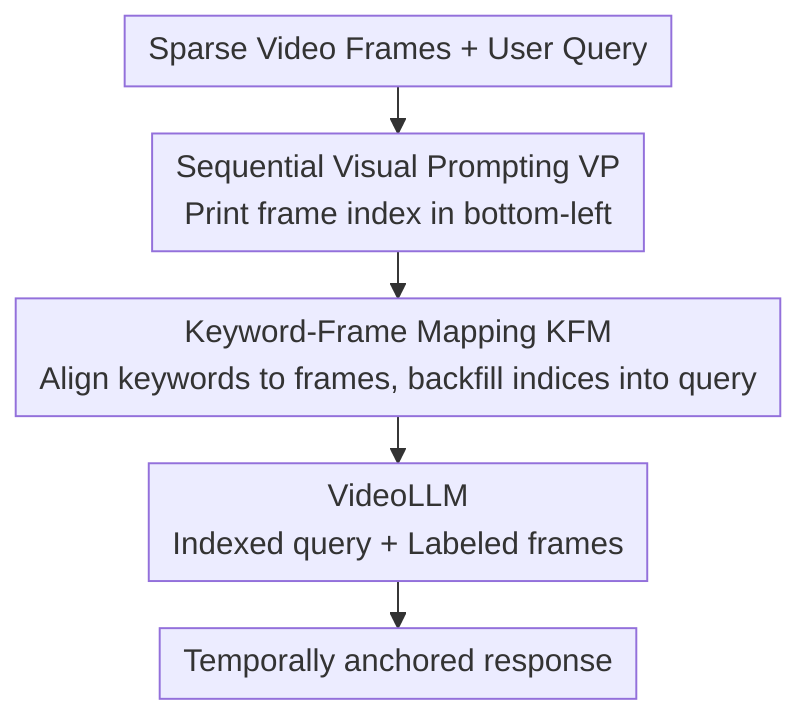

# ViKey: Enhancing Temporal Understanding in Videos via Visual Prompting

**Conference**: CVPR 2026  
**arXiv**: [2603.23186](https://arxiv.org/abs/2603.23186)  
**Code**: [https://github.com/MICV-yonsei/ViKey](https://github.com/MICV-yonsei/ViKey)  
**Area**: Multimodal VLM  
**Keywords**: Visual Prompting, Video Large Language Model, Temporal Understanding, Frame Indexing, Training-free

## TL;DR

ViKey significantly enhances the temporal reasoning capabilities of VideoLLMs under training-free conditions by overlaying sequential frame index visual prompts (VP) on video frames combined with a lightweight Keyword-Frame Mapping (KFM) module. It approaches dense frame performance using only 20% of the frames.

## Background & Motivation

VideoLLMs excel at multimodal video tasks, but high computational costs for processing dense frames make frame selection a standard practice. However, while improving efficiency, frame selection introduces a severe side effect: **disruption of temporal continuity**.

**Limitations of Prior Work**: When intermediate frames are removed, VideoLLMs lose the ability to infer the chronological order of events. For instance, in a video where a player crosses a line and a referee shows a red card, humans can infer causality from sparse frames, but a VideoLLM might incorrectly judge the referee as the one crossing the line.

**Key Challenge**: Frame selection leaves the model with discrete "snapshots" on a timeline, making it difficult to reconstruct temporally coherent event sequences. Existing solutions, such as enhancing temporal encoding or expanding context modules, are complex and require extensive training.

**Key Insight**: Visual Prompting (VP) has been proven effective for guiding spatial attention, but its potential for cross-frame temporal reasoning remains largely unexplored. The authors discovered that simply labeling each frame with a sequence number helps the model perceive temporal continuity.

## Method

### Overall Architecture

ViKey aims to solve the "temporal fragmentation" issue caused by frame selection, where sparse frames leave VideoLLMs without cues to judge event order. The core idea is that rather than modifying the model, it is better to provide a "temporal rope" within the input. The pipeline is lightweight: first, a frame index (VP) is printed on each frame's pixels, allowing the model to locate frames like looking up a dictionary; second, key concepts are extracted from the user's query and aligned to the most relevant frames via the KFM module, with indices rewritten into the query; finally, the indexed query and labeled frames are fed into the VideoLLM. The entire process requires no parameter updates, achieving temporal anchoring solely by modifying input.

### Key Designs

**1. Sequential Visual Prompting: Embedding the timeline into pixels for indexed frame retrieval**

Frame selection breaks temporal continuity, leaving the model with discrete snapshots. ViKey's approach is straightforward: overlaying a text index (e.g., "frame #01") in the bottom-left corner of each frame, with an adaptive font size $fontsize = \min(width, height)/s$. This explicitly writes the frame index—originally latent in positional embeddings—into the visual content. The model can then perform "reverse lookup" of frame content using indices. The authors validated this with three experiments: VP independently recovers frame order even when positional embeddings are degraded; frame-level reference tests show the model accurately retrieves specific frame content via indices; attention analysis reveals that VP increases the attention weights of image tokens in middle-to-high layers—meaning the indices change how the model "sees" the frames rather than being ignored as noise.

**2. Keyword-Frame Mapping (KFM): Assigning explicit temporal coordinates to query concepts**

While VP enables "index-based retrieval," the model still needs to know which frame to examine. KFM bridges this gap: it extracts salient keywords from the user query, calculates similarity between each keyword and each frame in a shared embedding space, selects the best-matching frames, and backfills their indices into the query. For example, the query "What is the player doing?" is rewritten as "In frame #03, what is the player doing?" This provides an explicit temporal anchor, preventing the model from searching aimlessly. VP provides indexing capability, while KFM provides text-to-frame alignment.

**3. Positional Bias Analysis and Optimization: High sensitivity of accuracy to index placement**

A subtle but critical detail is where to print the index. The authors systematically tested four corners (TL/TR/BL/BR). Results showed significant variance: the bottom corners (BL/BR) achieved 100% accuracy in reverse lookup, whereas the top-left (TL) only reached ~60%. The typical error for TL was an "off-by-one" mistake, where the model misaligned the index of the current frame with the content of the next. This occurs because all frame tokens are concatenated into a long sequence without explicit boundaries; top-placed indices are adjacent to the trailing tokens of the previous frame, leading to interference. Bottom-placed indices align more naturally with the current frame's concluding tokens. This justifies the default bottom-left placement—it fits the model's attention preference while avoiding off-by-one confusion.

### Loss & Training

ViKey is entirely training-free, requiring no modifications to model parameters. Both VP overlay and KFM rewriting occur on the input side during inference.

## Key Experimental Results

### Main Results

| Model + Setting | TempCompass | MVBench | VideoMME | LongVideoBench |
|----------|-------------|---------|----------|----------------|
| LLaVA-Video-7B (64 frames) | 74.68 | 82.50 | — | 56.42 |
| + ViKey (64 frames) | 77.83 | 87.00 | Gain | 58.66 |
| + ViKey (13 frames = 20%) | ~75 | ~83 | Close to 64f | ~56 |

Consistency gains across temporal reasoning subsets of TempCompass, MVBench, VideoMME, and LongVideoBench.

### Ablation Study

| Configuration | Lookup Accuracy | Reverse Lookup Accuracy | Description |
|------|-----------|-------------------|------|
| W/o VP | 12.43% | 18.57% | Extremely low baseline |
| VP (bottom-left) | 64.62% | 100.00% | Significant boost in frame-level referencing |
| VP (top-left) | 55.56% | 60.19% | Obvious positional bias |
| VP + KFM | Best | Best | Mutually complementary |

### Key Findings

- VP recovers 2.9-9.9 percentage points of temporal understanding even under extreme conditions where positional encoding is destroyed.
- VP increases the average attention weight assigned to image tokens by 11.65%, concentrated in middle-to-high layers (layers 4-6, 11-14, and after 21).
- 20% frames + ViKey approach the 100% dense frame baseline on certain datasets, demonstrating high efficiency.

## Highlights & Insights

- **Minimalist yet Effective**: Printing a sequence number on frames significantly improves temporal reasoning. This strategy of "modifying input instead of the model" is both elegant and practical. It can be integrated into any VideoLLM at zero cost.
- **Discovery of Positional Bias**: The finding that bottom VP far outperforms top VP reveals training biases in VideoLLMs—models exhibit stronger attention to the bottom region. This insight is instructive for all methods using VP.
- **Frame as Dictionary**: The metaphor of frame indices as keys and frame content as values provides a new paradigm for fine-grained temporal control in VideoLLMs.

## Limitations & Future Work

- KFM's keyword extraction relies on an external embedding model, which may become a bottleneck for extremely long videos.
- VP essentially occupies pixel space, potentially interfering with videos that already have subtitles or watermarks.
- Positional bias suggests the model might merely be "memorizing" text at specific locations rather than truly understanding temporal relationships.
- Future work: Adaptive VP size/position, joint optimization with frame selection strategies.

## Related Work & Insights

- **vs. Traditional Frame Selection**: Frame selection focuses on "which frames to keep," while ViKey focuses on "how to make kept frames more effective." They are complementary.
- **vs. Temporal Encoding Enhancement**: Unlike methods that require training (e.g., expanding context modules), ViKey is training-free with comparable performance.
- **vs. Spatial VP**: Previous VP methods guided attention spatially (e.g., circling objects). ViKey is the first to systematically explore VP's role in cross-frame temporal reasoning.

## Rating

- Novelty: ⭐⭐⭐⭐ Simple but insightful observation, first systematic exploration of VP for temporal reasoning.
- Experimental Thoroughness: ⭐⭐⭐⭐⭐ Three analysis experiments + four benchmarks + multiple models, very solid.
- Writing Quality: ⭐⭐⭐⭐⭐ Clear motivation, ingenious experimental design, deep analysis.
- Value: ⭐⭐⭐⭐ Training-free plug-and-play, high practical utility.

<!-- RELATED:START -->

## Related Papers

- [\[CVPR 2026\] IF-Bench: Benchmarking and Enhancing MLLMs for Infrared Images with Generative Visual Prompting](if-bench_benchmarking_and_enhancing_mllms_for_infrared_images_with_generative_vi.md)
- [\[CVPR 2026\] EgoSound: Benchmarking Sound Understanding in Egocentric Videos](egosound_benchmarking_sound_understanding_in_egocentric_videos.md)
- [\[CVPR 2026\] TempR1: Improving Temporal Understanding of MLLMs via Temporal-Aware Multi-Task Reinforcement Learning](tempr1_improving_temporal_understanding_of_mllms_via_temporal-aware_multi-task_r.md)
- [\[CVPR 2026\] GroundVTS: Visual Token Sampling in Multimodal Large Language Models for Video Temporal Grounding](groundvts_visual_token_sampling_in_multimodal_large_language_models_for_video_te.md)
- [\[CVPR 2026\] Flat-Pack Bench: Evaluating Spatio-Temporal Understanding in Large Vision-Language Models through Furniture Assembly](flat-pack_bench_evaluating_spatio-temporal_understanding_in_large_vision-languag.md)

<!-- RELATED:END -->
