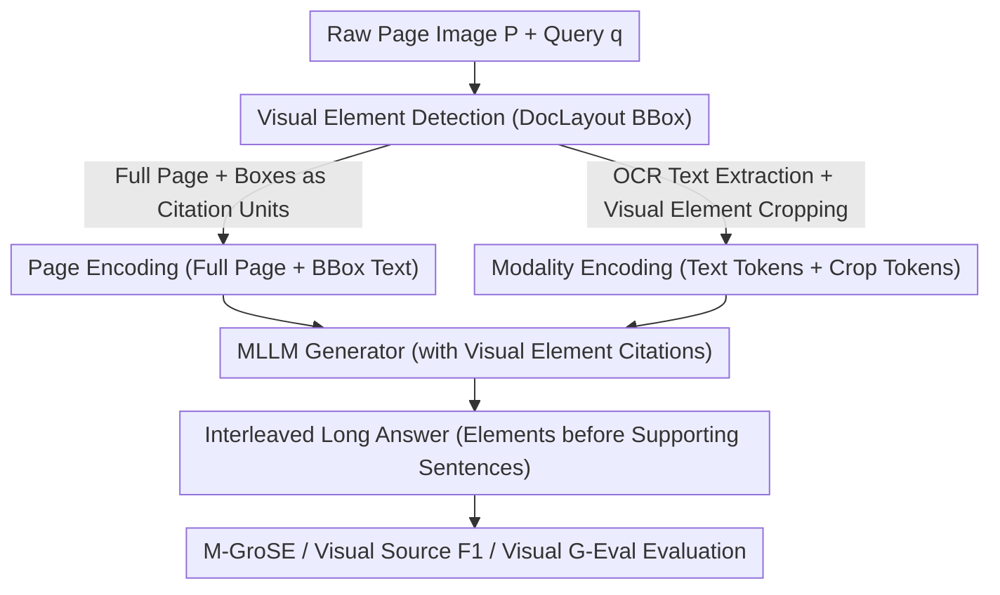

# VinQA: Visual Elements Interleaved Long-form Answer Generation for Real-World Multimodal Document QA

**Conference**: CVPR 2026  
**Paper**: [CVF Open Access](https://openaccess.thecvf.com/content/CVPR2026/html/Jang_VinQA_Visual_Elements_Interleaved_Long-form_Answer_Generation_for_Real-World_Multimodal_CVPR_2026_paper.html)  
**Keywords**: Multimodal Document QA, Visual Element Citation, Long-form Answer Generation, Multimodal RAG, Qwen2.5-VL

## TL;DR
VinQA proposes a "visual element interleaved long-form answer generation" task and dataset for real-world documents. Answers are no longer pure text but insert cited figures, tables, and charts **directly before the corresponding supporting text**. The work introduces two encoding methods for raw page images (Page and Modality Encoding) and a multimodal scoring framework, M-GroSE. Fine-tuning the open-source Qwen2.5-VL-7B on the VinQA training set improves the M-GroSE Avg from ~2.0 to ~3.34, significantly closing the gap with closed-source frontier models like GPT-4.1 and Claude 3.5.

## Background & Motivation
**Background**: Real-world documents are inherently multimodal, containing tables, charts, photos, and flowcharts arranged in various layouts. With the advent of MLLMs, document QA has followed two main paths: feeding the full page directly to the model (full-document) or using multimodal retrievers (like ColPali) to retrieve relevant pages for grounded generation (multimodal RAG).

**Limitations of Prior Work**: Regardless of the path, **generated answers are almost exclusively text-based**. For a question like "How to install a ThinkPad into a docking station," the ideal answer should interleave text instructions with corresponding step-by-step photos. Current methods rely solely on text, wasting the high-density information contained in visual elements. A few works attempting to insert images either focus on niche domains or **avoid the "dirty" work of detecting and citing visual regions from raw page images**, assuming visual elements are pre-cropped, which is far from real-world RAG scenarios.

**Key Challenge**: To enable models to provide true "interleaved text-image answers," two issues must be solved simultaneously: (1) **Locating** citable visual units within raw page pixels, and (2) **Placing** each cited visual element at the semantically correct position within long-form answers alongside faithful supporting text. Existing datasets and evaluations do not cover this complete pipeline.

**Goal**: Construct a dataset close to real-world multimodal RAG to teach models to generate "visual element interleaved long-form answers" while answering the systemic question: **Should raw page images be fed into MLLMs as full-page encodings or split-modality encodings?**

**Key Insight**: Define a new task for interleaved answer generation (placing visual elements before the sentences that cite them). Use a pipeline simulating multimodal RAG to automatically construct the VinQA dataset, and pair each of the two page-encoding methods with a visual citation mechanism. Evaluate performance using M-GroSE, Visual Source F1, and Visual G-Eval to cover text grounding, citation accuracy, and visual placement.

## Method

### Overall Architecture
The paper follows two main threads: **data construction** (the VinQA pipeline) and **model input strategies** (two encodings + citation mechanisms).

On the data side: The authors aggregate **raw documents** from six public document QA datasets (using only the documents, not their original Q&A pairs) and manually categorize them into seven domains (Academic Papers P, Web W, Textbooks T, Guidebooks G, Research Reports R, Financial Reports F, and Slides S). First, OCR and DocLayout detection "textualize" each page into a structured representation (assigning a caption and description to each visual element). Then, an LLM generates questions, retrieves context, and produces long answers based on this textualized context. Finally, the data undergoes three stages of validation: "textual, visual, and manual."

On the model side: Given a query $q$ and $n$ document page images $P=\{p_1,\dots,p_n\}$, the MLLM must produce a grounded long answer $A=\{x_1,\dots,x_k\}$, where certain text fragments $x_i$ are preceded by a visual element identification token. The two encoding methods determine how $P$ is processed and how visual elements are "cited."

### Key Designs

**1. VinQA Task and Data Construction: Turning Interleaved Answers into Learnable Supervision**

This design addresses the limitation where existing datasets provide only text answers and avoid detecting visual regions from raw pages. The task is strictly defined: every cited visual element must be **inserted directly above the text block that cites it**. The construction pipeline simulates real multimodal RAG: first textualizing pages (extracting text via OCR + detecting BBoxes for charts/tables/figures via DocLayout), then generating captions and descriptions for each element. Using ColPali for page embedding clustering, the LLM generates cross-page/cross-modality questions for each cluster. Finally, it generates long answers with visual citations. **Unanswerable samples** are constructed using hard negatives from low-ranking ColPali pages to simulate retrieval errors and teach the model to refuse to answer.

Quality is ensured via triple validation: textual (citation accuracy, factual consistency), visual (correct semantic alignment of cited elements), and manual (verifying BBoxes and hallucination checks). The test set undergoes additional textual validation with a separate LLM and manual filtering. Unlike works like MCiteBench that use "pre-cropped blocks," VinQA starts from **raw page images** and remains the only dataset to simultaneously support cross-page, cross-modality, unanswerability, and multi-document settings.

**2. Page Encoding: Processing Full Page Pixels with BBoxes as Citation Units**

This addresses how to allow models to cite visual regions while preserving layout information. Inspired by VisRAG, each page image $p_i$ is encoded as visual tokens, while a list of bounding boxes $\text{BBoxList}_i=\{b_i^{(1)},b_i^{(2)},\dots\}$ detected by DocLayout is provided as text tokens. The input format is:

$$\left\{\left(p_i,\ \text{BBoxList}_i\right)\right\}_{i=1}^{n}$$

Each BBox is assigned a unique identifier. During generation, the model refers to a specific region via this identifier. Pros: Zero loss of layout information. Cons: Higher cognitive load for the model, as it must **read text directly from pixels** (no explicit OCR) and align identifiers with page regions. Experiments show this method struggles before fine-tuning but catches up after.

**3. Modality Encoding: Splitting Text and Cropped Images for Independent Encoding**

To solve the difficulty of Page Encoding (reading text from pixels), this method takes the opposite approach: OCR extracts page text into text tokens, and BBoxes crop visual elements into visual tokens. The input is:

$$\left\{\left(t_i,\ \text{V}_i\right)\right\}_{i=1}^{n}$$

Where $t_i$ is the OCR text and $\text{V}_i=\{v_i^{(1)},v_i^{(2)},\dots\}$ is the set of cropped visual elements, each with a unique identifier. Cons: Loss of some layout information. Pros: Text and visual elements are **processed independently**, making it more robust for complex documents with dense text or heterogeneous elements—especially in "Table" and "Mixed" categories. A core finding is that Modality Encoding is stronger pre-fine-tuning, but the gap disappears post-fine-tuning.

**4. M-GroSE Multimodal Evaluation Framework: Expanding GroUSE to Image-Text Answers**

Quantifying the quality of interleaved answers requires more than text-based metrics. M-GroSE (Multimodal Grounded QA Scoring Evaluator) extends GroUSE. After textualizing both text and visual context, an LLM-judge (GPT-5-mini) evaluates answerable questions across three 1–5 scale dimensions: relevance, completeness, and faithfulness. For unanswerable questions, it reports Unanswerability F1. M-GroSE Avg is the mean of these four metrics.

Since these metrics are calculated on "textualized" content, two additional metrics are used: **Visual Source F1** (measuring citation accuracy against VinQA ground truth) and **Visual G-Eval** (using GPT-5 to evaluate the actual image-text pairs for Effectiveness, Position, and Faithfulness on a 1–5 scale). Together, they cover grounding, citation, and visual placement.

## Key Experimental Results

Implementation used Qwen2.5-VL-7B fine-tuned for 3 epochs on the VinQA training set (16×A100). Dataset size: Training set ~42.7k QA (39.7k answerable + 3k unanswerable); Test set 1,605 QA (1,206 answerable + 399 unanswerable).

### Main Results

Overall performance on the VinQA test set (M-GroSE Avg is the comprehensive score; Visual Source F1 is the citation accuracy):

| Model | Encoding | M-GroSE Avg | Visual Source F1 |
|------|------|-------------|------------------|
| GPT-4.1 | Modality | **3.63** | **0.72** |
| Claude 3.5 Sonnet | Page | 3.53 | 0.65 |
| GPT-4.1 | Page | 3.46 | 0.62 |
| Gemini 2.0 Flash | Modality | 3.43 | 0.61 |
| Qwen2.5-VL-7B (Original) | Page | 1.99 | 0.31 |
| Qwen2.5-VL-7B (Original) | Modality | 2.08 | 0.40 |
| **Qwen2.5-VL-7B (Ours)** | Page | 3.34 | 0.55 |
| **Qwen2.5-VL-7B (Ours)** | Modality | 3.33 | 0.58 |

While closed-source models still hold the top scores, fine-tuning on VinQA allows the open-source Qwen2.5-VL-7B to jump from ~2.0 to ~3.34 in M-GroSE Avg, significantly narrowing the gap with SOTA.

### Ablation Study

Visual G-Eval (average across all visual citations on 200 test instances, 1–5 scale):

| Encoding | Model | Effectiveness | Position | Faithfulness |
|------|------|---------------|----------|--------------|
| Page | Qwen2.5-VL-7B | 3.44 | 4.24 | 3.44 |
| Page | + VinQA | 3.94 | 4.77 | 3.85 |
| Modality | Qwen2.5-VL-7B | 4.00 | 4.57 | 4.01 |
| Modality | + VinQA | 4.17 | 4.74 | 4.23 |

### Key Findings
- **Modality is superior before fine-tuning, but the gap disappears after**: Table 3 shows Modality generally yields higher scores for base models (e.g., Gemini 2.0 Flash Modality is +0.57 higher than Page). However, for Qwen2.5-VL fine-tuned on VinQA, the two are nearly identical (3.34 vs 3.33), suggesting Page Encoding can catch up with sufficient data without explicit parsing.
- **Benefits are limited in long contexts**: Performance is consistent across 0–2.5k to ≥10k token ranges, but performance drops in ultra-long contexts (≥7.5k), indicating difficulty in integrating information faithfully in highly complex documents.
- **Fine-tuning addresses weak categories**: Categories like Figure (under Modality) and Figure+Table (under Page) saw the largest gains post-fine-tuning, showing that supervision signals specifically fix previous weaknesses.
- **Modality retains an "usage" advantage**: Even with equal M-GroSE scores, Visual G-Eval shows Modality remains superior in Effectiveness/Faithfulness, indicating better utilization and explanation of visual elements.

## Highlights & Insights
- **Task Definition as a Contribution**: Fixing the constraint that "visual elements must be inserted before the citing sentence" forces the model to learn "where to insert the image." This turns placement into a supervised and evaluatable objective, distinguishing it from works that only do text citations (e.g., VISA).
- **Recycling Raw Materials**: By aggregating raw documents from 6 datasets and generating new Q&A pairs via a RAG pipeline, the authors ensure diversity without the high cost of manual collection.
- **Clear Engineering Conclusions on Page vs. Modality**: For zero-shot use, Modality is safer. With fine-tuning, Page Encoding is preferred as it removes OCR/cropping overhead while matching performance.
- **Layered Evaluation Hierarchy**: M-GroSE handles grounding, Visual Source F1 handles citation hits, and Visual G-Eval handles visual placement. This methodology honestly addresses the fact that textual metrics cannot fully capture visual effectiveness.

## Limitations & Future Work
- The authors acknowledge that VinQA should be tested on models with test-time reasoning (long thought tokens), which were excluded here for fairness.
- Performance degradation in ultra-long contexts (≥7.5k tokens) remains an unsolved challenge for grounded multi-document QA.
- The standard relies on LLM/MLLM generated questions and answers, potentially inheriting biases from the generator. Certain domains like textbooks were excluded due to fuzzy document boundaries.
- Evaluation relies heavily on GPT-5/GPT-5-mini as judges, which may introduce systemic biases and limits reproducibility due to API costs.

## Related Work & Insights
- **vs VisRAG / VDocRAG**: These use Page Encoding for short-form grounded QA. VinQA extends this with a visual citation mechanism for interleaved long-form answers.
- **vs M-LongDoc**: Uses Modality Encoding for long-form answers but results in pure text. VinQA produces interleaved text-image outputs.
- **vs VISA**: VISA predicts BBoxes as evidence but does not interleave them into the answer with supporting text.
- **vs MCiteBench / MRAMG-Bench**: These use pre-extracted snippets. VinQA starts from raw page images across 7 domains and provides M-GroSE to specifically evaluate interleaved answers.

## Rating
- Novelty: ⭐⭐⭐⭐ New task (interleaved long-form answers) + dual encoding citation mechanisms + triple evaluation suite. Solid combination of existing components.
- Experimental Thoroughness: ⭐⭐⭐⭐ Covers closed/open models, both encodings, and fine-grained analysis of context length and visual types, though fine-tuning is only demonstrated on Qwen2.5-VL.
- Writing Quality: ⭐⭐⭐⭐ Clear task definition and construction pipeline. Data-rich tables. Custom metrics require careful reading.
- Value: ⭐⭐⭐⭐ High-quality dataset and evaluation framework with direct guidance for building document assistants and choosing system architectures.

<!-- RELATED:START -->

## Related Papers

- [\[CVPR 2026\] Towards Real-World Document Parsing via Realistic Scene Synthesis and Document-Aware Training](towards_real-world_document_parsing_via_realistic_scene_synthesis_and_document-a.md)
- [\[CVPR 2026\] VKG-QA: Visual Knowledge Graph-based Question Answer for Large Multimodal Models](vkg-qa_visual_knowledge_graph-based_question_answer_for_large_multimodal_models.md)
- [\[CVPR 2026\] DuoGen: Towards Autonomous Interleaved Multimodal Generation](duogen_towards_autonomous_interleaved_multimodal_generation.md)
- [\[AAAI 2026\] MAVIS: A Benchmark for Multimodal Source Attribution in Long-form Visual Question Answering](../../AAAI2026/multimodal_vlm/mavis_a_benchmark_for_multimodal_source_attribution_in_long-form_visual_question.md)
- [\[CVPR 2026\] MMSD3.0: A Multi-Image Benchmark for Real-World Multimodal Sarcasm Detection](mmsd30_a_multi-image_benchmark_for_real-world_multimodal_sarcasm_detection.md)

<!-- RELATED:END -->
