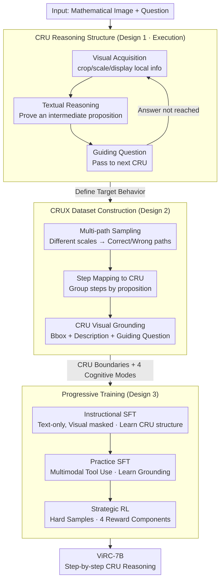

# ViRC: Enhancing Visual Interleaved Mathematical CoT with Reason Chunking

**Conference**: CVPR 2026 (Main Track)  
**arXiv**: [2512.14654](https://arxiv.org/abs/2512.14654)  
**Code**: [https://github.com/Leon-LihongWang/ViRC](https://github.com/Leon-LihongWang/ViRC)  
**Area**: Multimodal VLM / Mathematical Reasoning  
**Keywords**: Visual Mathematical Reasoning, Reason Chunking, Critical Reasoning Unit, Multimodal CoT, Progressive Training

## TL;DR
ViRC introduces the Reason Chunking mechanism, structuring multimodal mathematical CoT into a sequence of "Critical Reasoning Units (CRUs)." This simulates the process of human experts repeatedly examining images to prove intermediate propositions step-by-step. Supported by the CRUX dataset and a progressive training strategy (Instructional SFT → Practice SFT → Strategic RL), ViRC-7B achieves an average improvement of 18.8% across mathematical benchmarks.

## Background & Motivation

**Background**: Chain-of-Thought (CoT) has significantly enhanced the reasoning capabilities of LLMs. However, it faces unique challenges in the multimodal mathematical domain. Existing MLLMs typically read a static mathematical image only once before conducting pure text reasoning, ignoring the **dynamic visual acquisition** that should occur continuously during the reasoning process.

**Limitations of Prior Work**: This "look once and reason blindly" paradigm has three major flaws. First is **single visual acquisition**: the model performs long-chain reasoning after one glance without revisiting the image, whereas math problems often require re-examining specific parts (e.g., a specific edge or angle). Second is **reasoning chain breakage**: long-chain CoT easily deviates because it lacks "checkpoints" to verify intermediate conclusions. Third is explained by **Miller’s Law** in cognitive science: human working memory capacity is limited to $7 \pm 2$ chunks; an unsegmented, ultra-long reasoning chain exceeds cognitive load.

**Key Challenge**: Existing methods treat the entire problem-solving process as an undifferentiated long sequence. In contrast, human experts decompose it into several logical nodes, revisiting the image at each node to verify an intermediate proposition before proceeding.

**Core Idea**: This rhythm is explicitly introduced into the model via the **Reason Chunking mechanism**, which segments CoT reasoning into continuous **Critical Reasoning Units (CRUs)**. Each CRU maintains internal text coherence to prove an intermediate proposition, while visual information is re-integrated between CRUs to generate the next proposition.

## Method

### Overall Architecture
ViRC aims to solve the issue of models "reasoning blindly to the end after a single look" by transforming a long CoT into a series of short segments that can repeatedly revisit the image. When a problem is input, reasoning is organized into sequential units $[\mathrm{CRU}_1, \mathrm{CRU}_2, \dots, \mathrm{CRU}_K]$. Each $\mathrm{CRU}_k$ fetches local information from the image, performs textual derivation based on the previous unit's conclusion, and yields a clear intermediate proposition for the next unit. To enable the model to learn this rhythm, the authors constructed the **CRUX** dataset with CRU boundary annotations and implemented a three-stage progressive training strategy (from "learning concepts" to "refining strategies").

### Key Designs

**1. Critical Reasoning Unit: Establishing "See-Verify" Checkpoints for Long-Chain Reasoning**

Addressing single visual acquisition and reasoning chain breakage, ViRC breaks reasoning into CRUs. Each CRU proves one intermediate proposition through three steps: **Visual Acquisition**, using tools like `crop`, `scale`, or `display` to extract specific local information; **Textual Reasoning**, derivation using the new visual info and previous CRU results; and **Intermediate Verification**, explicitly stating the conclusion as input for the next CRU. Each CRU acts as a natural checkpoint; an error at any stage prevents the next CRU from connecting correctly, preventing error propagation. This explicitizes the human loop of "look → think → conclude → look again." By keeping the number of steps within $7 \pm 2$ (Miller’s Law), it fits within working memory. For example, to find an area, $\mathrm{CRU}_1$ crops the base/height and derives the triangle area; $\mathrm{CRU}_2$ revisits the image to identify a cutout circle and derive its area; $\mathrm{CRU}_3$ performs the final subtraction.

**2. CRUX Dataset: Learning "When to Chunk" and "What to Pass"**

To teach the model where to segment and how to transfer information, the researchers generated 100,000 samples with CRU boundaries using 54,000 problems from MINT-CoT. Each problem includes one correct path and two plausible incorrect paths to help the model identify wrong decompositions. The pipeline involves: **Multi-path Sampling** (solving at various scales to find correct/incorrect paths), **Step Mapping to CRU** (grouping fine-grained steps into semantically self-contained blocks), and **CRU Visual Grounding** (detecting focal objects to create image regions with descriptions and guidance questions). Paths are organized based on four human cognitive modes: Planning, Reflecting, Verifying, and Backtracking, implemented via tool calls (e.g., `display` for Verifying, `scale` for Backtracking).

**3. Progressive Training: Three Stages to Embed Chunking Capabilities**

To stabilize the learning of structured behavior, training is split into three stages using a 50k subset of CRUX. **Instructional SFT** uses **text-only** versions (masking visual feedback) to teach the CRU structure and tool syntax. **Practice SFT** uses the **full multimodal** version, executing tool calls and feeding back visual signals to train grounded reasoning. Finally, **Strategic RL** is performed on **hard samples**, sampling rollouts in groups. The reward function includes four components: answer correctness, multimodal consistency (judged by Qwen2.5-VL-72B), reasoning mode matching, and output format validity. This "concept → practice → refinement" sequence is more stable than direct RL.

## Key Experimental Results

### Main Results: Mathematical Reasoning Benchmarks

| Model | MathVerse (%) | MathVista (%) | GeoQA (%) | Average |
|------|---------------|---------------|-----------|------|
| LLaVA-1.5-7B | 23.4 | 38.1 | 42.6 | 34.7 |
| Math-LLaVA-7B | 28.9 | 43.5 | 48.2 | 40.2 |
| InternVL2-7B | 31.2 | 46.8 | 51.3 | 43.1 |
| **ViRC-7B** | **37.1** | **52.4** | **57.8** | **49.1** |

Average improvement of **+18.8%** over the baseline.

### Ablation Study

| Configuration | Avg Accuracy (%) | Description |
|------|---------------|------|
| Full ViRC | 49.1 | Complete method |
| w/o Reason Chunking | 41.3 | Standard long-chain CoT without CRU |
| w/o Visual Tools | 44.6 | No visual tools within CRUs |
| w/o Strategic RL | 46.2 | Two-stage SFT only |
| w/o Progressive Training | 43.8 | Three stages merged into one |

### Key Findings
- **Reason Chunking is the most critical contribution**: Performance drops by 7.8% without it.
- **Dynamic visual acquisition is effective**: Fetching image info via tools inside CRUs improves performance by 4.5% over one-time reading.
- **Progressive training significantly outperforms one-time training**: The three-stage approach yields a 5.3% higher gain.
- **Multi-path data in CRUX increases reasoning robustness.**

## Highlights & Insights
- **Practical Application of Cognitive Science**: Miller's Law directly guides the design of CRU granularity (5-7 steps).
- **"Reasoning about Reasoning"**: ViRC focuses on organizing reasoning correctly (meta-reasoning) rather than just performing it.
- **Natural Tool Integration**: Visual acquisition is embedded directly within the reasoning chain without external frameworks.
- **Significant Gains**: Consistent improvement across multiple benchmarks validates Reason Chunking as a general-purpose paradigm.

## Limitations & Future Work
- Construction of the CRUX dataset requires detailed CRU annotations, which is costly.
- CRU granularity is currently fixed; adaptive granularity may be superior.
- Validated only on mathematical reasoning; potential generalization to science or code reasoning remains to be explored.
- The scale of ViRC-7B is small; gains on larger models (70B+) might differ.
- Multiple visual acquisitions increase inference latency.

## Related Work & Insights
- **vs. Math-LLaVA**: Math-LLaVA provides data but does not change the reasoning structure. ViRC innovates at the structural level.
- **vs. LLaVA-CoT**: LLaVA-CoT performs long-chain CoT but lacks chunking. ViRC decomposes chains into structured units.
- **vs. R1-OneVision**: R1-OneVision uses RL for reasoning but lacks visual tools. ViRC integrates dynamic acquisition within CRUs.
- **Insight**: Reason Chunking is naturally suited for complex multi-step code generation (e.g., Requirements → Architecture → Implementation → Test).

## Rating
- Novelty: ⭐⭐⭐⭐⭐ Reason Chunking/CRU is a new reasoning paradigm with sound cognitive grounding.
- Experimental Thoroughness: ⭐⭐⭐⭐ Strong multi-benchmark results and ablations, though lacks large-scale model validation.
- Writing Quality: ⭐⭐⭐⭐ Complete logical flow from cognitive science to experiments.
- Value: ⭐⭐⭐⭐⭐ Provides a new paradigm; open-sources both dataset and code.

<!-- RELATED:START -->

## Related Papers

- [\[ACL 2026\] MathFlow: Enhancing the Perceptual Flow of MLLMs for Visual Mathematical Problems](../../ACL2026/multimodal_vlm/mathflow_enhancing_the_perceptual_flow_of_mllms_for_visual_mathematical_problems.md)
- [\[CVPR 2026\] Visual-Aware CoT: Achieving High-Fidelity Visual Consistency in Unified Models](visual-aware_cot_achieving_high-fidelity_visual_consistency_in_unified_models.md)
- [\[ICCV 2025\] LLaVA-CoT: Let Vision Language Models Reason Step-by-Step](../../ICCV2025/multimodal_vlm/llava-cot_let_vision_language_models_reason_step-by-step.md)
- [\[CVPR 2026\] Conan: Progressive Learning to Reason Like a Detective over Multi-Scale Visual Evidence](conan_progressive_learning_to_reason_like_a_detective_over_multi-scale_visual_ev.md)
- [\[CVPR 2026\] DuoGen: Towards Autonomous Interleaved Multimodal Generation](duogen_towards_autonomous_interleaved_multimodal_generation.md)

<!-- RELATED:END -->
