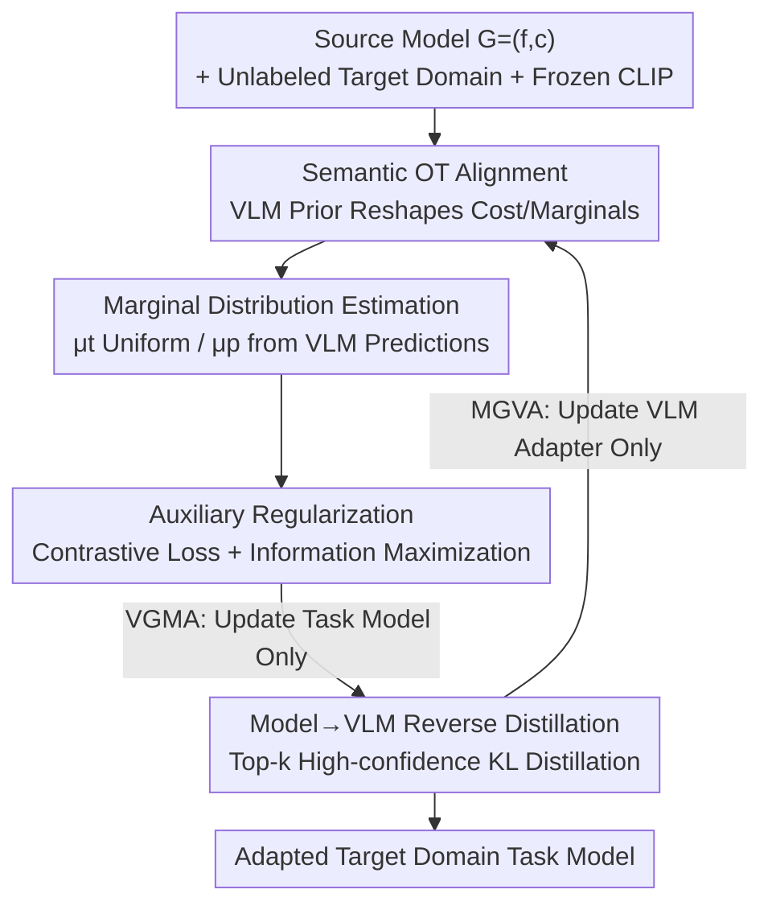

# Vision-Language Model Guided Source-Free Domain Adaptation via Optimal Transport

**Conference**: CVPR 2026  
**Paper**: [CVF Open Access](https://openaccess.thecvf.com/content/CVPR2026/html/Han_Vision-Language_Model_Guided_Source-Free_Domain_Adaptation_via_Optimal_Transport_CVPR_2026_paper.html)  
**Code**: https://github.com/TangXu-Group/VSFOT (Available)  
**Area**: Multimodal VLM / Source-Free Domain Adaptation / Optimal Transport  
**Keywords**: Source-Free Domain Adaptation, Vision-Language Models, Optimal Transport, Bidirectional Distillation, CLIP

## TL;DR
VSFOT liberates Source-Free Domain Adaptation (SFDA) from the self-training "dead loop" of generating pseudo-labels for itself. Instead, it utilizes a frozen CLIP as an external semantic prior to soft-align target features with source classifier prototypes via Optimal Transport (OT). Simultaneously, the task model fine-tunes CLIP through reverse distillation, forming a complementary bidirectional distillation framework that consistently outperforms existing SFDA methods across four benchmarks.

## Background & Motivation

**Background**: Unsupervised Domain Adaptation (UDA) leverages labeled source domains to improve performance on unlabeled target domains. However, in scenarios like healthcare, autonomous driving, or edge devices, source data is often inaccessible due to privacy, regulation, or storage constraints. Consequently, **Source-Free Domain Adaptation (SFDA)**, which provides only a "source-pretrained model + unlabeled target data," has become a more realistic alternative.

**Limitations of Prior Work**: Most SFDA methods essentially rely on **self-training**, where the model iteratively uses its own predictions as supervision, often supplemented by confidence thresholds, entropy minimization, or curriculum learning. This mechanism suffers from an inherent flaw: **confirmation bias**. If the model makes incorrect predictions on certain samples, self-training reinforces these errors as ground truth, leading to irreversible bias over time.

**Key Challenge**: Correcting these errors requires introducing a "reference system" external to the model. However, recent methods utilizing external semantic priors (e.g., VLMs) often adopt **hard semantic supervision**, directly using VLM predictions as pseudo-labels. When the domain gap is large, the VLM itself may produce errors, and hard labels inject this noise directly, degrading the adaptation performance.

**Goal**: To find a guidance mechanism that introduces external VLM priors without depending on fragile pseudo-labels, maintaining robustness under large domain shifts.

**Key Insight**: The authors reinterpret "aligning target features to source prototypes" as a **semantic Optimal Transport problem**. OT provides a soft alignment that avoids forcing every sample into a specific category, instead providing a probabilistic coupling matrix that naturally circumvents hard label noise. Combined with its geometric awareness, OT offers strong robustness for aligning complex distributions.

**Core Idea**: Use the semantic prior of the VLM to **reshape the OT cost matrix and marginal distributions** (rather than acting as pseudo-labels), ensuring the transport plan is semantically sound. Simultaneously, the task model distills its learned task-specific knowledge back into the VLM. These two components are optimized alternately, forming a mutually beneficial bidirectional distillation loop.

## Method

### Overall Architecture

Let the source model (task model) $G=(f,c)$ consist of a feature extractor $f$ and a classifier $c$, pre-trained on a labeled source domain $D_s$. The target domain $D_t=\{x_i^t\}_{i=1}^{N_t}$ is unlabeled, and neither source data nor target labels are accessible. An auxiliary VLM $V$ (implemented with CLIP) provides semantic priors. VSFOT alternates between two complementary stages:

- **VGMA (VLM-Guided Model Alignment)**: The VLM is frozen while only the task model is updated. The source classifier weights are treated as "prototypes" for each class. OT aligns target features to these prototypes, with the transport plan guided by the VLM's semantic prior. Contrastive loss and information maximization are used as auxiliary regularizations.
- **MGVA (Model-Guided VLM Adaptation)**: The task model is frozen while a lightweight adapter within the VLM is fine-tuned. High-confidence predictions from the task model serve as anchors to distill task-specific knowledge back into the VLM, making it more "aware" of the target domain for better guidance in the next iteration.

The two stages iterate alternately: the VLM refines distribution alignment, while the adapted task model enhances the VLM's task awareness, leading to mutual correction and co-evolution.

### Key Designs

**1. Semantic Optimal Transport Alignment: Shaping Transport Plans with VLM Priors**

To address the issue of hard pseudo-label self-training reinforcing errors, VSFOT reformulates adaptation as an OT problem. Target samples are the "source distribution" to be transported, and source classifier weights $w_j$ serve as "prototypes" for the target distribution. Following the JDOT approach, the transport cost is defined as a joint distance in feature and prediction spaces:

$$C_{i,j}^m = \alpha \cdot d(z_i^m, w_j) + L(q_i^m, y_j)$$

where $z_i^m=f(x_i^t)$ is the target feature, $q_i^m$ is the class probability, $d(\cdot,\cdot)$ is the cosine distance, $L(\cdot,\cdot)$ is the cross-entropy between distributions, and $\alpha=1/\max_{i,j}d(z_i^m,w_j)$ is a normalization factor. The alignment loss is the sum of the element-wise product of the transport plan $\Gamma^*$ and the cost matrix: $L_{\text{Align}}=\sum_i\sum_j \Gamma^*_{i,j}C_{i,j}^m$.

Crucially, if the transport plan is calculated using only $C^m$ (relying on the model's own predictions), large domain shifts result in biased couplings. The key innovation is **decoupling the cost used for calculating the transport plan from the cost used for optimizing the model**. The model is optimized using $C^m$, but the transport plan is solved using a VLM-guided cost $C^v$:

$$C_{i,j}^v = \alpha \cdot (1 - q_{i,j}^v) + L(q_i^m, y_j)$$

Here, $q_{i,j}^v$ is the VLM's predicted probability for sample $i$ belonging to class $j$. Even when the task model's predictions are uncertain, the OT plan maintains a stable reference from the VLM's semantic prior, guiding alignment toward cross-domain semantic consistency.

**2. Marginal Distribution Estimation: Rejecting the "Uniform Distribution" Assumption**

OT solves for a coupling within the marginal constraints $\Pi(\mu_t,\mu_p)$. During mini-batch training, class proportions fluctuate. Setting the prototype marginal $\mu_p$ to uniform introduces bias. VSFOT keeps the sample marginal $\mu_t$ uniform, but estimates the prototype marginal as $\mu_p(j)=\frac{1}{|B|}\sum_{i\in B}q_{i,j}^v$, reflecting the true probability mass assigned to each prototype by the VLM. Removing this estimation in favor of a uniform distribution causes significant performance drops, proving that accurate marginal estimation is vital for stability.

**3. Model→VLM Reverse Distillation: Injecting Task Knowledge into VLM**

While VLMs generalize well, they lack task-specific cues in the target domain. In the MGVA stage, the task model $G$ is frozen, and a lightweight adapter (two linear layers + ReLU) inserted into the VLM is fine-tuned. Distillation uses only the Top-k classes for each sample to form a sparse matrix $S^m_{i,c}=q^m_{i,c}\,[c\in\text{Top-k}]$, which is renormalized into $\tilde q_i^m$. The goal is to pull the VLM probability $q^v$ toward the task model's high-confidence predictions using KL divergence:

$$L_{\text{VLM}}=\frac{1}{|B|}\sum_{x_i\in B}text{KL}(\tilde q_i^m \,\|\, q_i^v)$$

This ensures the VLM becomes more "target-aware" without inheriting full-distribution noise.

**4. Bidirectional Distillation via Alternating Optimization**

The two stages form a feedback loop. In the VGMA phase, only the task model is optimized with $L_1=L_{\text{Align}}+L_{\text{Con}}+L_{\text{IM}}$. In the MGVA phase, only the VLM adapter is optimized with $L_2=L_{\text{VLM}}$. Here, $L_{\text{Con}}$ is a view-level contrastive loss, and $L_{\text{IM}}$ is information maximization to sharpen predictions while maintaining class balance. This allows the VLM and task model to correct each other and evolve together.

### Loss & Training

The alternating optimization uses $L_1$ for the task model and $L_2$ for the VLM adapter. Backbones include ResNet50 and ResNet101 initialized with ImageNet-1K. CLIP serves as the VLM. OT is solved via the Sinkhorn algorithm with an entropy regularization coefficient of 0.2.

## Key Experimental Results

### Main Results

Evaluations were conducted on Office-31, Office-Home, VisDA, and DomainNet-126. Comparisons include Source/CLIP baselines, representative SFDA methods, and VLM-based UDA methods.

| Dataset | Metric | VSFOT | Prev. SOTA (SFDA) | Gain |
|--------|------|-------|----------------|------|
| Office-31 | Avg Top-1 | 92.66 | 92.57 (ProDe) | +0.09% |
| Office-Home | Avg Top-1 | 85.34 | 84.20 (ProDe) | +1.14% |
| DomainNet-126 | Avg Top-1 | 82.63 | 80.08 (DIFO) | +2.55% |
| VisDA (→Real) | Top-1 | 90.57 | 91.04 (ProDe) | 2nd Place |

The most significant gain (+2.55%) was achieved on DomainNet-126, the most challenging benchmark. Notably, VSFOT's performance under the SFDA setting (no source data) even rivals or exceeds VLM-based UDA methods that **can** access source data (e.g., Office-Home 85.34 vs DAMP 78.24).

### Ablation Study

| Configuration | Office-Home | DomainNet-126 | Description |
|------|-------------|---------------|------|
| Source only | 59.92 | 60.60 | Initial source model |
| + $L_{\text{Align}}$ | 81.46 | 81.19 | OT semantic alignment is the main driver |
| + $L_{\text{VLM}}$ | 84.17 | 82.44 | Benefit of reverse distillation |
| + $L_{\text{Con}}$ + $L_{\text{IM}}$ | 85.34 | 82.63 | Auxiliary regularization gains |
| w/o Marginal Estimation | 73.62 | 64.34 | Performance drops with uniform marginals |
| w/o Prior Guidance | 74.13 | 64.19 | Regression to OT-only self-alignment |

### Key Findings
- **OT Semantic Alignment ($L_{\text{Align}}$) is the primary contributor**, significantly raising performance from 59.92 to 81.46 on Office-Home.
- **Marginal distribution estimation is a critical component**: Removing it results in a larger performance drop than removing the prior guidance itself (e.g., -18.29% on DomainNet).
- **Bidirectional distillation leads to convergence**: Both the task model and VLM improve and eventually converge to similar accuracy levels, confirming bidirectional knowledge flow.

## Highlights & Insights
- **Positioning VLM as a prior rather than a label**: Injecting VLM semantic knowledge into the OT cost matrix and marginals avoids noise propagation from hard pseudo-labels. The decoupling of transport cost from optimization cost is the most sophisticated design element.
- **Breaking the ceiling of unidirectional guidance**: Unlike previous VLM-guided methods, VSFOT allows the task model to feedback knowledge into CLIP, enhancing its target-domain awareness.
- **Transferable insight on marginal estimation**: For any OT-based distribution alignment task, assuming uniform marginals in mini-batches is often suboptimal. Estimating marginals via external reliable predictions significantly improves transport quality.

## Limitations & Future Work
- **Lack of an explicit error correction mechanism**: The authors acknowledge that performance on VisDA is limited by the accumulation of errors in a few easily confused classes.
- **Dependence on VLM prior quality**: The method assumes CLIP provides reasonable zero-shot predictions. In highly Out-of-Distribution (OOD) domains (e.g., medical or fine-grained remote sensing), unreliable VLM priors could contaminate the OT cost matrix.
- **Computational overhead**: The alternating optimization and Sinkhorn algorithm introduce additional costs compared to simple self-training SFDA.

## Related Work & Insights
- **vs DIFO / ProDe (VLM-based SFDA)**: These methods use VLM pseudo-labels for supervision. VSFOT incorporates VLM priors into the OT process without generating explicit labels and adds reverse distillation.
- **vs SHOT / NRC (Traditional SFDA)**: These lack external references and struggle with large domain shifts. VSFOT utilizes VLM as a semantic anchor to significantly raise the performance ceiling.
- **vs DAMP / PADCLIP (VLM-based UDA)**: Despite not having access to source data, VSFOT achieves comparable or superior results, highlighting its potential as a more efficient and private solution.

## Rating
- Novelty: ⭐⭐⭐⭐ The combination of VLM-shaped OT cost/marginals and bidirectional distillation is novel in the SFDA context.
- Experimental Thoroughness: ⭐⭐⭐⭐ Extensive benchmarks and multidimensional ablations provide solid evidence, though efficiency analysis is missing.
- Writing Quality: ⭐⭐⭐⭐ Clear motivation chain and well-structured presentation of formulas.
- Value: ⭐⭐⭐⭐ Provides a reusable paradigm for grounding source-free adaptation using foundation model priors without relying on pseudo-labels.

<!-- RELATED:START -->

## Related Papers

- [\[CVPR 2026\] SOTA: Self-adaptive Optimal Transport for Zero-Shot Classification with Multiple Foundation Models](sota_self-adaptive_optimal_transport_for_zero-shot_classification_with_multiple_.md)
- [\[CVPR 2026\] Mind the Discriminability Trap in Source-Free Cross-domain Few-shot Learning](mind_the_discriminability_trap_in_source-free_cross-domain_few-shot_learning.md)
- [\[CVPR 2026\] Addressing Exacerbated Attention Sink for Source-Free Cross-Domain Few-Shot Learning](addressing_exacerbated_attention_sink_for_source-free_cross-domain_few-shot_lear.md)
- [\[CVPR 2026\] Test-Time Distillation for Continual Model Adaptation](test-time_distillation_for_continual_model_adaptation.md)
- [\[CVPR 2026\] Generate, Analyze, and Refine: Training-Free Sound Source Localization via MLLM Meta-Reasoning](generate_analyze_and_refine_training-free_sound_source_localization_via_mllm_met.md)

<!-- RELATED:END -->
