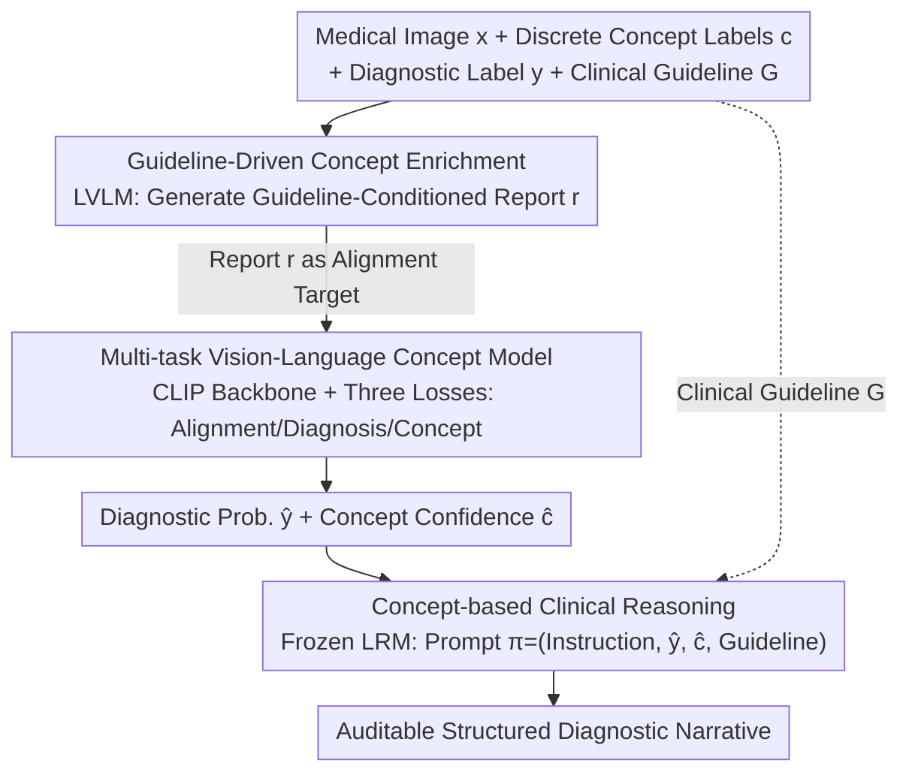

# Vision-Language Models Encode Clinical Guidelines for Concept-Based Medical Reasoning

**Conference**: CVPR 2026 Findings  
**arXiv**: [2603.08921](https://arxiv.org/abs/2603.08921)  
**Code**: None  
**Area**: Multimodal VLM  
**Keywords**: Concept Bottleneck Models, Medical Imaging, Explainable AI, Clinical Guidelines, CLIP

## TL;DR
The authors propose the MedCBR framework, which integrates clinical diagnostic guidelines (e.g., BI-RADS) into the training and inference processes of Concept Bottleneck Models (CBMs). By leveraging Large Vision-Language Models (LVLMs) to generate guideline-consistent reports for enhanced concept supervision, and combining multi-task CLIP training with Large Reasoning Models (LRMs) for structured clinical explanations, the method achieves AUROCs of 94.2% and 84.0% in ultrasound and mammography cancer detection.

## Background & Motivation
**Background**: Concept Bottleneck Models (CBMs) connect model predictions with human-understandable concepts via an interpretable intermediate concept layer. This is a dominant paradigm in explainable AI, particularly critical in medical imaging.

**Limitations of Prior Work**: Standard CBMs rely on discrete concept representations, ignoring broader clinical contexts such as diagnostic guidelines and expert heuristics, which results in decreased reliability for complex cases. Specific issues include: (a) noisy and incomplete concept annotations (inter-observer variability); (b) the inability of CBMs to capture experience-driven reasoning, such as cases that appear benign but require comprehensive evaluation within the context of clinical guidelines.

**Key Challenge**: CBMs necessitate complete and noise-free concept annotations and assume that diagnostic reasoning is a deterministic function of concept occurrence—however, medical diagnosis relies on contextual information and structured reasoning defined in clinical guidelines.

**Goal**: (a) Address noisy/incomplete concept annotations; (b) provide clinical context for the reasoning from concepts to diagnosis; (c) generate auditable explanations for model predictions.

**Key Insight**: Modeling diagnosis as reasoning over multiple evidence sources (rather than a direct function of concepts) and introducing clinical guidelines as a structured knowledge source.

**Core Idea**: Enriching concept representations through guideline-consistent reports generated by LVLMs + training with multi-task contrastive learning + generating explainable diagnostic narratives using Large Reasoning Models.

## Method

### Overall Architecture
The core problem MedCBR aims to solve is that standard CBMs treat diagnosis as a deterministic function of "concept occurrence," whereas real-world medical diagnosis involves contextual reasoning combined with clinical guidelines—a finding that appears benign might be classified as malignant after comprehensive evaluation under guidelines like BI-RADS. MedCBR's approach elevates clinical guidelines from "post-hoc explanations" to "structured knowledge sources throughout the training and inference pipeline." The pipeline connects three models in three steps: first, an LVLM translates sparse discrete concept labels into guideline-conditioned text reports to serve as denser supervision signals; second, a CLIP backbone is trained under multi-task objectives to simultaneously learn image-text alignment, concept prediction, and diagnostic classification; finally, a frozen Large Reasoning Model (LRM) consumes the predicted results and the guidelines to generate an auditable diagnostic narrative. Note that clinical guidelines $\mathcal{G}$ are not just present at a single step but are fed into both the beginning and end—constraining report generation by the LVLM and the reasoning of the LRM.

### Key Designs

**1. Guideline-Driven Concept Enrichment: Translating Discrete Labels into Guideline-Conditioned Reports**

A practical pain point in medical concept annotation is noise and incompleteness (inter-observer variability), and a binary concept vector $c$ only indicates "which findings are present," failing to describe their relationships or their meaning within a guideline framework. MedCBR allows the LVLM to view the image $x$, the positive concept set $c^+$, the diagnostic label $y$, and the clinical guideline $\mathcal{G}$ simultaneously to generate a structured report $r$. This report describes visual findings and maps them to diagnostic implications according to the guideline. Thus, sparse discrete supervision is replaced by continuous text carrying context and relational semantics, making the downstream alignment target more stable and closer to the logic of clinical interpretation.

**2. Multi-task Vision-Language Concept Model: Single CLIP Backbone for Alignment, Concept, and Diagnosis**

Good textual supervision is insufficient; visual representations must satisfy the conflicting requirements of being "semantically rich" and "clinically discriminative." Using CLIP as a backbone, MedCBR jointly optimizes three losses during a single training phase: a contrastive loss $\mathcal{L}_{CLIP}$ to align images with reports generated in the previous step, a diagnostic loss $\mathcal{L}_y$ for cancer classification directly on visual embeddings, and a concept loss $\mathcal{L}_c$ using $N_c$ lightweight adapters to predict each concept. The total objective is a weighted sum:

$$\mathcal{L} = \lambda\mathcal{L}_{CLIP} + \mu\mathcal{L}_y + \nu\mathcal{L}_c$$

Cross-modal consistency, concept-level interpretability, and diagnostic discriminative power are compressed into the same set of representations. This avoids the common degradation where "adding a concept bottleneck layer reduces discriminative power"—a phenomenon observed in the ablation study where "CLIP+CBL performs worse than pure CLIP, but recovers after adding guidelines and multi-task learning."

**3. Concept-Based Clinical Reasoning: Anchoring Frozen LRM Predictions to Verifiable Guidelines**

The previous steps yield numbers (cancer probability, concept counts/confidences), but clinicians require auditable reasoning. Instead of training a generator, MedCBR feeds a frozen LRM a structured prompt $\pi = (\mathcal{Q}, \hat{y}, \hat{c}, \mathcal{G})$, where $\mathcal{Q}$ is the task instruction, $\hat{y}$ is the predicted cancer probability, $\hat{c}$ is the concept prediction confidence, and $\mathcal{G}$ is the clinical guideline. The LRM then derives a diagnostic explanation. Crucially, every reasoning step is anchored to explicit guidelines $\mathcal{G}$ and actual model predictions, rather than allowing the model to hallucinate. This significantly reduces hallucination risk and allows the output to be checked against guidelines line-by-line.

### An Illustrative Example

Consider a breast ultrasound image. On the **training side**, an LVLM observes the image, its concept labels (e.g., "irregular margins," "posterior shadowing"), and the BI-RADS guidelines to write a report: "Mass with irregular margins and posterior shadowing, suggesting increased malignancy probability per BI-RADS"—this report becomes the text target for CLIP alignment. On the **inference side**, for a new image at test time, the multi-task CLIP provides a diagnostic probability $\hat{y}=0.87$ (malignant) and concept confidences $\hat{c}$ (e.g., "irregular margins" 0.9, "calcification" 0.3). These, along with the BI-RADS guidelines, are packaged into a prompt $\pi$ for the frozen LRM, which outputs: "High-confidence finding of irregular margins, classified as Category 4C per BI-RADS, biopsy recommended." This provides both the conclusion and verifiable concept evidence corresponding to guideline clauses.

## Key Experimental Results

### Main Results — Cancer Detection

| Method | BUS-BRA (AUROC) | CBIS-DDSM (AUROC) | CUB-200 (Acc.) |
|------|----------------|-------------------|----------------|
| CBM | 84.8 | 79.6 | 62.9 |
| CLIP ViT-L/14 | 93.5 | 82.4 | 85.7 |
| AdaCBM | 87.9 | 75.6 | 69.8 |
| Label-free CBM | 60.0 | 70.0 | 74.3 |
| **Ours** | **94.2** | **84.0** | **86.1** |

### Ablation Study — Component Contributions

| Configuration | BUS-BRA | CBIS-DDSM | CUB-200 |
|------|---------|-----------|---------|
| CLIP ViT | 93.5 | 82.4 | 85.7 |
| CLIP+CBL | 91.8 | 81.8 | 67.0 |
| CLIP+CBL+Guideline | 92.0 | 83.1 | 72.9 |
| CLIP+MTL | 93.6 | 83.2 | 82.3 |
| CLIP+MTL+Guideline (Ours) | **94.2** | **84.0** | **86.1** |

### Key Findings
- MedCBR outperforms all CBM variants and pure CLIP models across three datasets, indicating that the combination of guideline-driven concept enrichment and multi-task learning is optimal.
- Introducing a Concept Bottleneck Layer (CBL) alone decreases performance, but incorporating guidelines restores and improves it, suggesting that guideline information effectively compensates for the information loss inherent in bottleneck structures.
- The framework is also effective on CUB-200 bird classification (86.1%), validating its generalization capability beyond the medical domain.
- Concept-level detection performance is also superior, as multimodal supervision allows the model to capture both visual grounding and modality-specific features simultaneously.

## Highlights & Insights
- **Clinical Guidelines as Structured Knowledge Sources**: Unlike previous works that treat concepts or guidelines as extra context, MedCBR integrates guidelines into the entire pipeline from training to inference, ensuring concept-decision reasoning is constrained and verifiable.
- **LVLM-Driven Concept Enrichment**: The framework cleverly utilizes LVLMs to transform noisy or incomplete discrete annotations into high-quality structured reports, addressing the practical difficulty of concept annotation in medical data.
- **End-to-End Explainability Chain**: The path from image → concept → guideline → diagnostic explanation is fully auditable, satisfying stringent clinical transparency requirements.

## Limitations & Future Work
- Inference depends on an external frozen LRM, increasing deployment complexity and latency.
- The evaluation focused only on binary classification (benign/malignant) and did not test multi-class or fine-grained grading tasks.
- Guidelines are provided as fixed text inputs; dynamic retrieval or personalized guideline adaptation has not been explored.
- The concept set depends on manual definitions; extending to new diseases requires domain experts to redefine the concept system.
- The radiologist evaluation involved only 20 cases, limiting statistical power.

## Related Work & Insights
- **vs. AdaCBM**: AdaCBM uses learnable adapters to mitigate CLIP domain shift but lacks clinical knowledge; MedCBR provides stronger inductive bias through guideline-driven training.
- **vs. Label-free CBM**: Automatically generated concepts might miss clinically significant features or introduce spurious correlations; MedCBR constrains concept discovery using guidelines.
- **vs. Agent-based methods (MAGDA/MedRAX)**: These methods use guidelines or tools as reasoning aids but do not deeply integrate them into model training.

## Rating
- Novelty: ⭐⭐⭐⭐ Deeply integrating clinical guidelines into both training and inference for CBMs is a novel approach.
- Experimental Thoroughness: ⭐⭐⭐⭐ Multi-dataset validation includes ablations and clinical assessment, though the assessment sample size is small.
- Writing Quality: ⭐⭐⭐⭐ Clear framework, rigorous formulas, and strong clinical relevance.
- Value: ⭐⭐⭐⭐ Provides a practical paradigm for integrating guidelines in medical explainable AI.

<!-- RELATED:START -->

## Related Papers

- [\[CVPR 2026\] Medic-AD: Towards Medical Vision-Language Model's Clinical Intelligence](medic-ad_towards_medical_vision-language_models_clinical_intelligence.md)
- [\[CVPR 2026\] Concept-wise Attention for Fine-grained Concept Bottleneck Models](coat_cbm_concept_wise_attention.md)
- [\[AAAI 2026\] Concept-RuleNet: Grounded Multi-Agent Neurosymbolic Reasoning in Vision Language Models](../../AAAI2026/multimodal_vlm/concept-rulenet_grounded_multi-agent_neurosymbolic_reasoning.md)
- [\[ICML 2025\] MMedPO: Aligning Medical Vision-Language Models with Clinical-Aware Multimodal Preference Optimization](../../ICML2025/multimodal_vlm/mmedpo_aligning_medical_vision-language_models_with_clinical-aware_multimodal_pr.md)
- [\[CVPR 2026\] CLIP-Free, Label-Free, Unsupervised Concept Bottleneck Models](clip-free_label_free_unsupervised_concept_bottleneck_models.md)

<!-- RELATED:END -->
