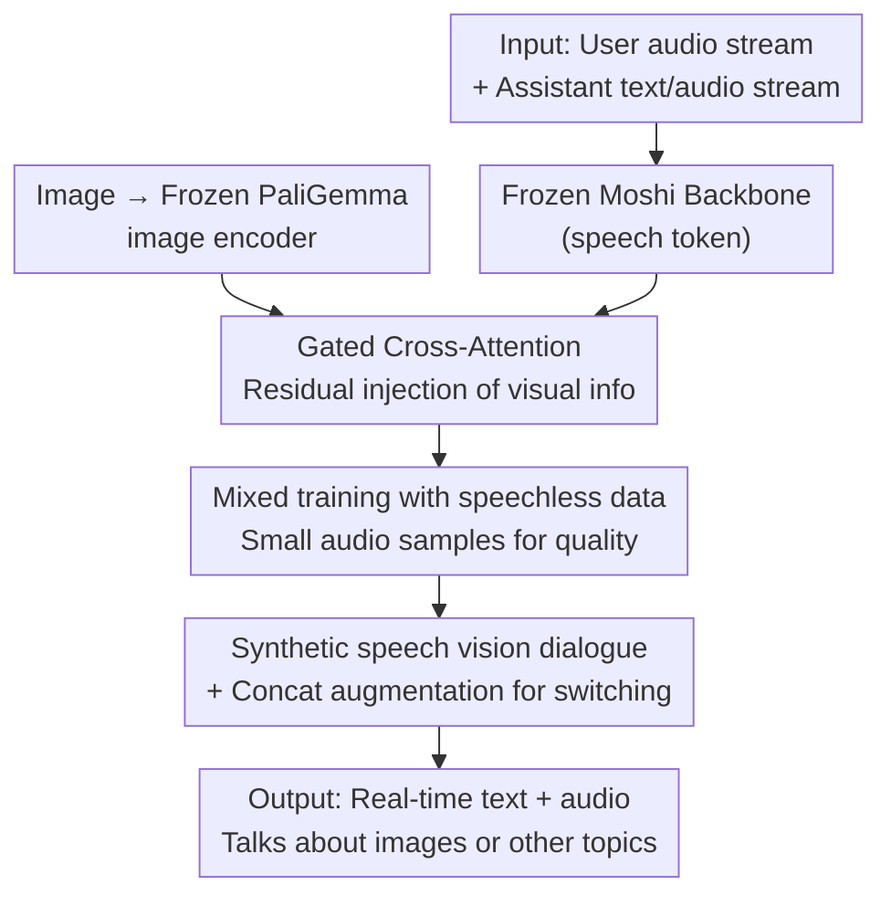

# Vision-Speech Models: Teaching Speech Models to Converse about Images

**Conference**: CVPR 2026  
**Paper**: [CVF Open Access](https://openaccess.thecvf.com/content/CVPR2026/html/Royer_Vision-Speech_Models_Teaching_Speech_Models_to_Converse_about_Images_CVPR_2026_paper.html)  
**Area**: Multimodal VLM / Speech Dialogue  
**Keywords**: Vision-Speech Models, Gated Cross-Attention, Parameter-Efficient Fine-Tuning, Full-duplex Dialogue, Synthetic Speech Dialogue

## TL;DR
This paper proposes MoshiVis, which uses a set of lightweight gated cross-attention adaptation modules to transform Moshi, a real-time full-duplex speech dialogue large model, into a Vision-Speech Model (VSM) capable of "seeing images and chatting via speech." By utilizing single-stage mixed fine-tuning with "speechless image-text data + a small amount of image-speech data," the training cost is compressed to one day on 8×H100, with an added inference latency of only about 7ms per step.

## Background & Motivation
**Background**: Vision-Language Models (VLMs) have matured significantly, leveraging massive image-text paired data to transfer the reasoning capabilities of LLMs to tasks such as Visual Question Answering (VQA) and image captioning. Correspondingly, the authors ask: can a **pre-trained speech model** similarly be equipped with "vision" to create a model capable of natural speech dialogue about images?

**Limitations of Prior Work**: Directly porting VLM methodologies to the speech domain faces three specific obstacles. First, image-speech paired data is extremely scarce, with public datasets consisting almost entirely of COCO-Captions transcriptions, far less abundant than image-text data. Second, speech dialogue requires real-time low latency; constrained by compute and VRAM, models cannot insert high-resolution images as a massive sequence of image tokens that fill the KV cache like VLMs do. Third, speech contains prosodic information (tone, emotion) that cannot be inferred from text; cascaded "Speech-to-Text → VLM → Text-to-Speech" systems lose this information and introduce significant latency and disconnected turn-taking.

**Key Challenge**: One approach is the mainstream VLM route of "directly inserting image tokens into the sequence," but this disturbs the pre-trained LLM, requires specialized RoPE handling, and involves multi-stage training, leading to data and compute explosions when scaling to three modalities (vision + language + audio). The other approach is cascaded ASR+TTS, which sacrifices real-time performance and prosody. Both paths conflict with the goal of "low cost + real-time + retaining speech characteristics."

**Goal**: To equip a real-time conversational speech LLM with vision capabilities without modifying the speech backbone or retraining on tri-modal data, enabling natural switching between "talking about images" and "talking about other topics."

**Key Insight**: The authors leverage a feature of Moshi—it **explicitly and jointly predicts a time-aligned text stream** while generating audio. Although the distribution of this text stream differs from standard text (containing padding tokens for alignment and being summed with audio tokens), the authors hypothesize that this text stream is sufficient to act as a "weakly supervised" channel, allowing visual understanding capabilities trained on pure image-text data to **permeate** through to the speech output.

**Core Idea**: Use a set of **gated cross-attention** adaptation modules that **freeze the backbone and train only the adapters** to inject image information into the speech token stream. Single-stage mixed supervision using "massive speechless image-text data + limited image-speech data" is employed for training, thereby reusing existing vision-language datasets at minimal cost.

## Method

### Overall Architecture
The overall structure of MoshiVis consists of a "ready-made image encoder + a frozen Moshi speech backbone + lightweight adaptation modules inserted into each Transformer block." On the vision side, an existing image encoder from the PaliGemma family (approx. 400M) encodes images into a sequence of image tokens. On the speech side, Moshi (approx. 7B) sums three time-aligned token streams—user audio, assistant audio, and assistant text—into "speech tokens" fed into the backbone Transformer. The output is then decoded back into text tokens and hierarchical audio codebooks by a small depth transformer. The innovation lies in inserting a layer of **gated cross-attention** between the self-attention and feed-forward layers of each backbone block. This allows speech tokens (acting as queries) to query image tokens (acting as keys/values), integrating visual information as residuals. During training, the entire image encoder and speech Transformer are frozen; only these ~206M adapter modules are trained. Training data is a mixture of "speechless image-text data + synthetic speech vision dialogues," enabling the model to see images while retaining real-time speech dialogue capabilities.

### Key Designs

**1. Gated Cross-Attention Adapter: "On-demand" Image Injection without Breaking the Speech Backbone**

The simplest approach would be adding a cross-attention layer to each block where speech tokens act as queries and image tokens act as keys/values, adding a calculated residual update back to the speech tokens. however, the authors found that blinding injecting visual information damages the model's original conversational ability, especially regarding topic switching—when a user stops talking about the image, the model is still interfered with by visual information. To address this, they added a **self-gating** mechanism after the cross-attention output: a two-layer MLP with a hidden dimension compressed to 1/8 followed by a sigmoid generates a gating value $g \in [0,1]$ to modulate the visual residue. The gated cross-attention is formulated as:

$$x \leftarrow x + \mathrm{MHA}_{\text{self}}(x, x)$$
$$y = \mathrm{MHA}_{\text{cross}}(x, x_{\text{img}}),\quad g = \sigma(\mathrm{MLP}_{\text{gate}}(y)),\quad x \leftarrow x + g \cdot y$$

where $x$ represents speech tokens and $x_{\text{img}}$ represents image tokens. The elegance of this design lies in its **exact degradation**: when $g=0$, the model reverts precisely to the original Moshi backbone (visual info completely off). Thus, injecting vision does not "pollute" the existing general conversation capability. The gate allows the model to decide "whether to look at the image now" based on context, providing robustness for topic switching.

**2. Cross-layer Shared QKV Projections + One-time Image KV Caching: Maintaining Real-time Latency**

Real-time dialogue is sensitive to compute and VRAM. Two strategies reduce costs: First, since image tokens are static over time, image KV projections for all blocks can be **pre-computed and cached once** at the start of a dialogue and reused. Second, they **share the same QKV projection weights across all Transformer blocks** for cross-attention (which showed negligible impact on downstream performance), further reducing VRAM for image embeddings. Combined with the frozen backbone, this results in only ~7ms additional latency per step compared to pure Moshi on an L4 GPU with 448px images (1024 tokens) and 8-bit quantization.

**3. "Speechless" Data Mixed Supervision: Teaching Speech Models via Text alone**

While image-speech data is scarce, image-text data is abundant. The key observation is that because Moshi predicts a text stream, the adapters can be trained using pure image-text ("speechless") data—even with distribution shifts (standard text vs. Moshi's text stream with padding tokens). They mix **$p_{\text{audio}}\%$ audio samples + $(100-p_{\text{audio}})\%$ speechless samples** per batch. Speechless samples place the entire dialogue in the text stream. Surprisingly, even with minimal audio samples, the model learns visual understanding from text signals while maintaining coherent speech output. Experiments show that with $p_{\text{audio}}=0\%$ (purely speechless) training, the model achieves 38.5% / 49.3% / 113 CIDEr on OCR-VQA / VQAv2 / COCO, far exceeding random; vocal quality is poor, but **adding just 1% audio samples restores quality to the backbone level**.

**4. Synthetic Speech Vision Dialogue + Concat Augmentation: Natural Multi-turn and Switching**

Existing visual dialogue data is mostly text-based and short. The authors designed a **fully synthetic** pipeline: text captions for an image are fed to two Mistral-Nemo models acting as "User" and "Assistant." They engage in 8–16 rounds of dialogue starting from general questions, with random instructions (asking about attributes, locations, or misleading non-existent objects). Open-source TTS converts this to audio. To train topic switching, they generate **general dialogues unrelated to any image**. During training, a visual dialogue has a $p_{\text{concat}}$ probability of being randomly concatenated with unrelated prefixes and suffixes to simulate real-world topic shifts.

### Loss & Training
The image encoder and speech Transformer are frozen, and only approximately 206M parameters in the adaptation modules (cross-attention + gating) are trained. The model is trained for 50k steps with a batch size of 64, taking about one day on 8×H100. Benchmarks swept $p_{\text{audio}}\in\{0,1,5,10,25,50,75,100\}\%$, identifying $p_{\text{audio}}=25\%$ as the optimal trade-off.

## Key Experimental Results

### Main Results
Evaluation was conducted on OCR-VQA, VQAv2, and COCO for both text and speech prompts, comparing against "stage 3 PaliGemma" (fine-tuned by **unfreezing** both vision encoder and LLM).

| Training Setting | Prompt Type | OCR-VQA Acc | VQAv2 Acc | COCO CIDEr |
|----------|----------|-------------|-----------|------------|
| $p_{\text{audio}}=0\%$ (Speechless) | Speech | 38.5% | 49.3% | 113 |
| Increased $p_{\text{audio}}$ (≈25%) | Speech | Near PaliGemma st. 3 | Near st. 3 | Near st. 3 |
| Dual task 10% Audio OCR samples | Speech | 60.7% | — | — |
| Dual task 0% Audio OCR samples | Speech | 36.8% | — | — |

Key Finding: Even without audio data, cross-attention allows the speech model to exceed random performance significantly. However, $p_{\text{audio}}=100\%$ (audio only) degrades text benchmarks, proving mixed supervision is superior. Replacing a small fraction of samples with audio in dual-task settings boosted speech evaluation from 36.8% to 60.7%, suggesting **knowledge transfer via the audio channel is stronger than via text**.

### Ablation Study
Ablation of gating and parameter sharing (OCR-VQA):

| Configuration | Text Eval | Speech Eval | Description |
|------|---------|---------|------|
| No Gate / No CA Sharing | 66.1 | 63.7 | Baseline |
| Gated (Not Shared) / KV Shared | 67.7 | 66.2 | Slightly Better |
| Gated (Not Shared) / QKV Shared | 68.2 | 64.7 | Default Config |
| Gated (Shared) / QKV Shared | 66.1 | 65.2 | Shared Gating Params |

Voice Quality (MOSNet vs. Audio Proportion):

| $p_{\text{audio}}$ | 0% | 1% | 5% | 10% | Moshi Backbone |
|--------------------|-----|-----|-----|-----|-----------|
| MOSNet | 2.78 | 3.59 | 3.47 | 3.56 | 3.34 |

### Key Findings
- **Gating/sharing configurations have similar effects on accuracy**: No single winner emerged, indicating robustness. The value of gating lies in topic-switching robustness.
- **Voice quality is sensitive to audio ratios but easily restored**: $p_{\text{audio}}=0\%$ yields a low MOSNet of 2.78, but 1% audio samples bring it to 3.59, exceeding the original Moshi (3.34).
- **Gating + Concat Augmentation improves switching robustness**: Both mechanisms significantly reduced performance drops when switching between visual and non-visual topics.
- **Real-time performance is met**: Only +7ms per step compared to the backbone.

## Highlights & Insights
- **"Gating at 0 = exact backbone degradation" is a clean design**: It structurally ensures vision injection does not pollute existing capabilities—a strategy transferable to any "modality addition to frozen backbones" scenario.
- **Using Moshi's internal text stream as a bridge is ingenious**: It allows borrowing the entire VLM ecosystem using "speechless" data, bypassing the scarcity of image-speech data.
- **The observation "Knowledge transfer via audio > via text" is counter-intuitive**: One might expect text to be a "cleaner" supervisor, but audio samples provide stronger transfer in speech models.
- **One-time KV caching + cross-layer QKV sharing** are generalizable efficiency tricks for injecting static conditional information into autoregressive stream models.

## Limitations & Future Work
- **Reliance on synthetic data**: Training dialogues are entirely synthetic (LLM + TTS). The authenticity and bias (e.g., hallucinations in captions) of synthetic data directly affect behaviors.
- **Evaluation is controlled/artificial**: Topic switching tests use "random unrelated prefixes," which may not reflect real open-ended dialogue.
- **Backbone Dependency**: The method relies on Moshi's "time-aligned text stream." Its effectiveness on speech models without explicit text streams remains unproven.
- **Video is preliminary**: Video support is demonstrated via KV input replacement at inference, lacking systematic evaluation.

## Related Work & Insights
- **vs. Token-insertion VLMs (e.g., PaliGemma/LLaVA)**: VLMs occupy KV cache and require LLM unfreezing (e.g., RoPE). This work avoids that to maintain real-time performance and low cost, at the trade-off of slightly lower visual accuracy.
- **vs. Cascaded ASR + VLM + TTS**: Cascades introduce latency and lose prosody; this work is end-to-end and full-duplex.
- **vs. From-scratch Multimodal Assistants**: These require complex multi-stage training; this work is a lightweight adaptation of an existing speech LLM.

## Rating
- Novelty: ⭐⭐⭐⭐ Combining gated cross-attention adapters with speechless supervision to build a Vision-Speech model is a practical and novel path.
- Experimental Thoroughness: ⭐⭐⭐⭐ Systematically covers audio ratios, dual-task transfer, ablation, and latency. Lacks human evaluation.
- Writing Quality: ⭐⭐⭐⭐⭐ Clear structure and data flow explanations.
- Value: ⭐⭐⭐⭐ The open-source code and low-cost reproducibility are highly valuable for the multimodal speech community.

<!-- RELATED:START -->

## Related Papers

- [\[NeurIPS 2025\] Watch and Listen: Understanding Audio-Visual-Speech Moments with Multimodal LLM](../../NeurIPS2025/multimodal_vlm/watch_and_listen_understanding_audio-visual-speech_moments_with_multimodal_llm.md)
- [\[ICML 2026\] Vision Language Models Cannot Reason About Physical Transformations](../../ICML2026/multimodal_vlm/vision_language_models_cannot_reason_about_physical_transformation.md)
- [\[CVPR 2026\] Beyond Layer-Wise Merging: Chain-of-Merging for Vision-Language Models](beyond_layer-wise_merging_chain-of-merging_for_vision-language_models.md)
- [\[ACL 2025\] I See What You Mean: Co-Speech Gestures for Reference Resolution in Multimodal Dialogue](../../ACL2025/multimodal_vlm/i_see_what_you_mean_co-speech_gestures_for_reference_resolution_in_multimodal_di.md)
- [\[CVPR 2026\] CASPA: Graph-Structured Concept Anchors for Modality-Agnostic Adaptation in Vision-Language Models](caspa_graph-structured_concept_anchors_for_modality-agnostic_adaptation_in_visio.md)

<!-- RELATED:END -->
## Related Papers

- [\[CVPR 2026\] BabyVLM-V2: Toward Developmentally Grounded Pretraining and Benchmarking of Vision Foundation Models](babyvlm-v2_toward_developmentally_grounded_pretraining_and_benchmarking_of_visio.md)
- [\[ACL 2026\] An Exploration of Mamba for Speech Self-Supervised Models](../../ACL2026/audio_speech/an_exploration_of_mamba_for_speech_self-supervised_models.md)
- [\[ACL 2026\] S2S-Arena: Evaluating Paralinguistic Instruction Following in Speech-to-Speech Models](../../ACL2026/audio_speech/s2s-arena_evaluating_paralinguistic_instruction_following_in_speech-to-speech_mo.md)
- [\[ICLR 2026\] ParaS2S: Benchmarking and Aligning Spoken Language Models for Paralinguistic-Aware Speech-to-Speech Interaction](../../ICLR2026/audio_speech/paras2s_benchmarking_and_aligning_spoken_language_models_for_paralinguistic-awar.md)
- [\[ACL 2026\] \[b\] = \[d\] − \[t\] + \[p\]: Self-supervised Speech Models Discover Phonological Vector Arithmetic](../../ACL2026/audio_speech/bd-tp_self-supervised_speech_models_discover_phonological_vector_arithmetic.md)

<!-- RELATED:END -->
