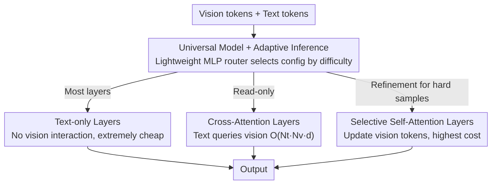

# VISion On Request: Enhanced VLLM Efficiency with Sparse, Dynamically Selected, Vision-Language Interactions

**Conference**: CVPR 2026  
**arXiv**: [2603.23495](https://arxiv.org/abs/2603.23495)  
**Code**: None (Based on LLaVA-OV)  
**Area**: Multimodal VLM  
**Keywords**: Large Vision-Language Model Efficiency, Visual Token Sparsification, Dynamic Computation Allocation, Cross-Attention, Self-Attention Selection

## TL;DR
VISOR proposes a new efficiency paradigm distinct from vision token compression—by sparsifying vision-language interaction layers within the LLM (utilizing minimal cross-attention and dynamically selected self-attention layers). It achieves 8.6-18$\times$ FLOPs savings while preserving full high-resolution vision tokens, significantly outperforming token compression methods particularly on difficult tasks requiring fine-grained understanding.

## Background & Motivation

1. **Background**: Large Vision-Language Models (LVLMs) typically concatenate massive vision tokens generated by vision encoders (e.g., CLIP/SigLIP) with text tokens for LLM processing. High-resolution images result in high token counts, leading to quadratic growth in computational costs. Existing efficiency optimization methods almost exclusively revolve around "token compression/pruning."

2. **Limitations of Prior Work**: Token compression methods (e.g., VisionZip, PyramidDrop, HiRED) perform well on simple tasks requiring **coarse-grained understanding** but suffer significant performance degradation on difficult tasks requiring **fine-grained reasoning** (e.g., DocVQA, ChartQA, InfoVQA). Compressing vision tokens inevitably creates information bottlenecks, losing critical detail.

3. **Key Challenge**: The contradiction between efficiency and fidelity—token compression improves efficiency by reducing the number of tokens but also permanently loses visual information. It remains an open question whether efficiency can be improved without discarding tokens.

4. **Goal**: (1) Significantly reduce LVLM inference costs without compressing or discarding vision tokens; (2) Implement task/sample-adaptive compute allocation, where simple tasks consume less computation and difficult tasks consume more.

5. **Key Insight**: Deep analysis of the LLaVA-OV model reveals three phenomena: (1) Image-text interaction is sparse across layers, showing a sawtooth distribution; (2) Visual features remain nearly static in simple tasks (CKA > 0.9) but are significantly refined in complex tasks (CKA drops to 0.6); (3) Different tasks have vastly different visual processing requirements.

6. **Core Idea**: Instead of compressing vision tokens, VISOR sparsifies the interaction between LLM layers and vision tokens—using sparse cross-attention layers to efficiently provide visual context and sparse, dynamically selected self-attention layers to refine visual representations when necessary.

## Method

### Overall Architecture
Based on the LLaVA-OV architecture, VISOR decouples standard full-sequence self-attention into three types: (1) **Text-only layers** (most layers)—processing only text tokens without touching vision tokens, resulting in minimal computation; (2) **Cross-attention layers**—text tokens query vision tokens without updating the visual representation ($O(N_t N_v d)$ cost, far lower than full attention); (3) **Self-attention layers**—processing full vision+text sequences to update vision tokens. While the cost is highest, these layers provide necessary visual feature refinement. Cross-attention layers are uniformly distributed, while the number and position of self-attention layers are determined dynamically based on the task.

### Key Designs

**1. Cross-Attention Layers: Reading visual information efficiently without rewriting it**

Analysis of LLaVA-OV reveals that image-text interactions are sparse in most layers. Simple tasks only need to refer back to the image at key points. Cross-attention layers are designed for this "read-only" scenario: in a set of uniformly distributed layers $\mathcal{L}_{CA}$, text tokens serve as queries while vision tokens serve as keys/values. The visual context is added to the text stream, while vision tokens $\mathbf{V}^{(0)}$ remain unchanged. To preserve spatial information, a kernel=7 1D depthwise separable convolution is used as conditional positional encoding. Computational savings arise from calculating attention only between text and vision rather than the full sequence: $O(N_t N_v d)$ vs $O((N_t + N_v)^2 d)$. When $N_v \gg N_t$ (common in high-res images), this cost is negligible.

**2. Selective Self-Attention Layers: Refining visual representations only when necessary**

While cross-attention suffices for simple tasks, CKA analysis shows that in difficult tasks (e.g., DocVQA), visual features are refined in stages (CKA drops from 0.9 to 0.6). Selective Self-Attention layers address this by running standard full-sequence self-attention on a few selected layers $\mathcal{L}_{SA}$, updating vision tokens from $\mathbf{V}^{(l-1)}$ to $\mathbf{V}^{(l)}$. These refined tokens are then read by subsequent cross-attention layers. This is the most expensive layer type but essential for fine-grained reasoning.

**3. Universal Model + Adaptive Inference: Sample-level dynamic computation**

VISOR integrates different compute budgets into a single model via three steps: (1) Pre-training the maximum configuration where $|L_{CA}| = |L_{SA}| = L/3$; (2) Systematically evaluating sub-networks to identify "feasible architectures"; (3) Universal fine-tuning where random feasible configurations are sampled at each step to ensure robustness across all levels. During inference, a lightweight MLP router predicts the optimal configuration for each sample based on a router token. The router is trained using offline pseudo-labels (the most efficient configuration reaching 99% of full-model accuracy for a given sample).

### Mechanism: Adaptive Computation Example

Consider a 27-layer backbone ($L/3 = 9$ cross-attention and 9 optional self-attention layers). For a simple sample ("What animal is in this image?"), the router identifies it as low difficulty, utilizing only 0–2 self-attention layers. Visual features require little refinement (CKA > 0.9), and the image is primarily "read" via cross-attention, saving maximum FLOPs. For a DocVQA document asking for a specific table value, the router identifies a high-difficulty sample and enables nearly all 9 self-attention layers. Vision tokens are refined to capture small text and structures, which are then processed by subsequent layers. Both samples utilize the same weights but different computational paths.

### Loss & Training
- Two-stage training: (1) Freeze the original model, fine-tuning new attention layers on 4M knowledge data; (2) Full model fine-tuning on 3.2M high-quality data.
- AdamW optimizer, no weight decay, batch size 128.
- Router trained with standard cross-entropy loss.

## Key Experimental Results

### Main Results

| Method | Simple Task Avg | Hard Task Avg | FLOPs Gain |
| :--- | :--- | :--- | :--- |
| LLaVA-OV (Baseline) | 61.5 | 57.1 | 1.0$\times$ |
| VisionZip† | 59.3 | 43.1 | 5.7$\times$ |
| M3 | 64.0 | 56.6 | 8.0$\times$ |
| HiRED | 59.3 | 39.0 | 5.0$\times$ |
| **Ours (VISOR)** | **63.6** | **58.4** | **8.6$\times$** |
| **Ours (VISOR-TR)** | **63.3** | **57.8** | **18$\times$** |

VISOR outperforms all token compression methods on hard tasks while achieving higher efficiency gains.

### Ablation Study

| SA Layers | CA Layers | Simple | Hard | Description |
| :--- | :--- | :--- | :--- | :--- |
| 0 | 6 | 63.3 | 51.8 | Cross-attention only |
| 2 | 8 | 63.5 | 56.2 | Minimal self-attention |
| 9 (L/3) | 9 (L/3) | 63.6 | 58.4 | Full configuration |

| Combination Method | FLOPs Gain | Simple | Hard |
| :--- | :--- | :--- | :--- |
| VISOR | 8.9$\times$ | 63.6 | 58.4 |
| VISOR-TR [2$\times$] | 17.8$\times$ | 63.3 | 57.8 |
| VISOR-TR [4$\times$] | 35.0$\times$ | 63.1 | 56.2 |
| VISOR + VisionZip | 37.0$\times$ | 63.3 | 55.3 |
| VISOR + VisPruner | 39.0$\times$ | 63.5 | 55.9 |

### Key Findings
- **Cross-attention alone (0 SA) surpasses many token compression methods** on simple tasks (63.3 vs VisionZip 57.3), but fails on hard tasks (51.8), validating the necessity of visual refinement.
- **Hard task accuracy is highly sensitive to SA layer count**: Increasing from 0 to 2 SA layers jumps hard task performance from 51.8 to 56.2.
- **Orthogonality**: VISOR can be combined with token compression (e.g., + VisPruner) to reach 39$\times$ FLOPs savings with minimal accuracy loss.
- **Adaptive routing effectiveness**: The universal model with routing achieves performance comparable to the best fixed configuration across all benchmarks.

## Highlights & Insights
- **Novelty**: Shifts the focus from "compressing vision tokens" to "sparsifying vision-language interaction," avoiding the information bottleneck problem entirely.
- **Analysis-Driven Design**: Architectural choices are systematically guided by CKA similarity, attention patterns, and layer-dropping experiments.
- **Universal Model Deployment**: Using offline pseudo-labels for routing allows a single model to support multiple compute budgets, enhancing practical utility.
- **Orthogonal Benefits**: The ability to combine with token compression allows for extreme efficiency scenarios (up to 39$\times$ savings).

## Limitations & Future Work
- Validated only on LLaVA-OV 0.5B and 1.5B; testing on larger models (7B+) is required.
- Routing strategy relies on offline pseudo-labels; end-to-end routing with reinforcement learning could be explored.
- Cross-attention layers are currently uniformly distributed; optimal layer positioning remains an open question.
- Performance on video understanding requiring temporal reasoning has not been tested.

## Related Work & Insights
- **vs VisionZip / PyramidDrop**: These methods suffer severe degradation on hard tasks (e.g., DocVQA dropping from 68.7 to 36.7), whereas VISOR maintains or improves baseline performance.
- **vs M3**: While M3 is a strong training-aware compression method, it still creates an information bottleneck. VISOR achieves higher accuracy with lower FLOPs.
- **vs SparseVLM**: SparseVLM uses text tokens to score and prune vision tokens; VISOR retains all tokens but sparsifies the interaction, representing a distinct technological path.

## Rating
- Novelty: ⭐⭐⭐⭐⭐ 
- Experimental Thoroughness: ⭐⭐⭐⭐⭐ 
- Writing Quality: ⭐⭐⭐⭐⭐ 
- Value: ⭐⭐⭐⭐⭐

<!-- RELATED:START -->

## Related Papers

- [\[CVPR 2026\] Sparse-LaViDa: Sparse Multimodal Discrete Diffusion Language Models](sparse-lavida_sparse_multimodal_discrete_diffusion_language_models.md)
- [\[CVPR 2026\] TIPSv2: Advancing Vision-Language Pretraining with Enhanced Patch-Text Alignment](tipsv2_patch_text_alignment.md)
- [\[CVPR 2026\] WeMMU: Enhanced Bridging of Vision-Language Models and Diffusion Models via Noisy Query Tokens](wemmu_enhanced_bridging_of_vision-language_models_and_diffusion_models_via_noisy.md)
- [\[ICML 2026\] RESTORE: Improving Visual Token Reduction via Distortion Correction for Enhanced MLLM Inference Efficiency](../../ICML2026/multimodal_vlm/improving_visual_token_reduction_via_rectifying_distortions_for_efficient_multim.md)
- [\[ICLR 2026\] Enhanced Continual Learning of Vision-Language Models with Model Fusion](../../ICLR2026/multimodal_vlm/enhanced_continual_learning_of_vision-language_models_with_model_fusion.md)

<!-- RELATED:END -->
