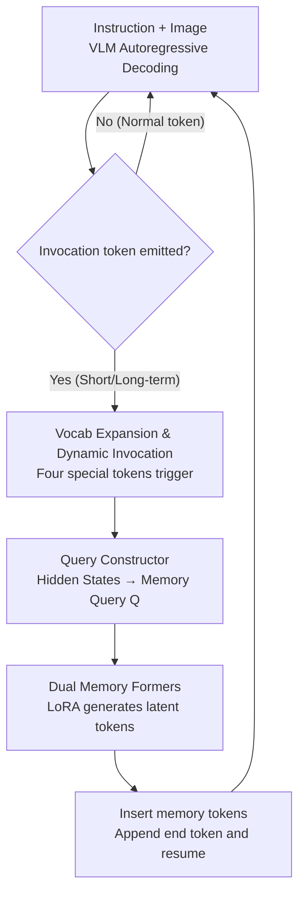

# VisMem: Latent Vision Memory Unlocks Potential of Vision-Language Models

**Conference**: CVPR 2026  
**Paper**: [CVF Open Access](https://openaccess.thecvf.com/content/CVPR2026/html/Yu_VisMem_Latent_Vision_Memory_Unlocks_Potential_of_Vision_Language_Models_CVPR_2026_paper.html)  
**Code**: https://github.com/YU-deep/VisMem.git  
**Area**: Multimodal VLM  
**Keywords**: Vision-Language Models, Latent Memory, Long-short-term Memory, Visual Processing Bottleneck, Reinforcement Learning

## TL;DR
VisMem equips Vision-Language Models (VLMs) with a "latent vision memory" system. Based on cognitive psychology, memory is bifurcated into "short-term/vision-led" and "long-term/semantic-led" types. These are dynamically triggered by special tokens during autoregressive generation to instantly generate latent memory vectors for context insertion. Trained via two-stage reinforcement learning, it achieves an average improvement of 11.0% across 12 benchmarks compared to the original model.

## Background & Motivation

**Background**: While VLMs excel in visual understanding, reasoning, and generation, they often struggle with "advanced visual tasks" requiring fine-grained perception, multi-step reasoning, or long-sequence generation.

**Limitations of Prior Work**: The authors characterize the root cause as a "visual processing bottleneck." In deep autoregressive decoding, models increasingly rely on accumulated **textual context**, gradually losing grounding on the **original visual evidence** while lacking reusable visual-semantic knowledge. This manifests as cumulative bias, confusion of visual entities, and hallucinations in long responses.

**Key Challenge**: Previous approaches to mitigate this bottleneck have significant drawbacks: (a) Direct training paradigms (SFT / Visual-RFT / Vision-R1) modify parameters, risking overfitting and **catastrophic forgetting**. (b) Image-level paradigms (bounding boxes, tool-assisted re-generation) enable "thinking with images" but are computationally expensive and rely on external tools. (c) Token-level paradigms only select from existing visual tokens, meaning they **do not generate new information** and merely "revisit the past." (d) Latent-space paradigms using continuous contexts are promising, but current methods either operate only in **language space** (Coconut / SoftCoT) or require massive human-annotated visual data (Mirage), failing to truly leverage "visual memory."

**Goal**: Enable the model to **proactively invoke visual memory** during generation to preserve perceptual details and reuse semantic knowledge without modifying the VLM backbone, relying on external tools, or increasing annotated data.

**Key Insight**: The authors adopt Dennis Norris's theory from cognitive psychology: human short-term and long-term memory are independent storage systems, where short-term memory is **vision-dominated** and long-term memory governs **abstract semantics**. This is translated into architectural principles: a short-term memory module for fine-grained perception of the current scene and a long-term memory module for generalized semantic knowledge, working together to complete the cognitive chain.

**Core Idea**: Implement "on-demand, instantly generated" latent vision memory tokens. Short-term memory encodes fine-grained perceptual evidence of the current image, while long-term memory synthesizes high-level semantic knowledge. Both are triggered by special tokens and inserted into the autoregressive flow, maintaining both perceptual fidelity and semantic consistency.

## Method

### Overall Architecture

Problem Formalization: A policy model $P$ (base VLM) processes an instruction-vision pair $(I, V)$ and generates the $i$-th output token autoregressively: $x_{t,i} \sim P(\cdot \mid s_t, x_{<i})$, where state $s_t$ includes text context and visual observations. VisMem attaches a vision memory system $M$ to the policy model. The joint optimization goal is $\max_{P, M} \mathbb{E}_{(I,V)\sim D,\ \omega\sim(P,M)}[S(\omega)]$, where $S(\cdot)$ is quantifiable performance (accuracy or reward model score).

The system is decoupled into two interlocking sub-problems: **Memory Invocation** ("where and how to trigger short/long-term memory") and **Memory Formation** ("what content the memory should contain"). During inference, the VLM decodes text normally. Upon emitting an "invocation token," the system pauses: a query constructor reads the current hidden states to generate a memory query, which is sent to the corresponding memory former to produce latent memory tokens. These are inserted back into the generation stream followed by an end token to resume decoding. This process does not modify base parameters or rely on external tools.

### Key Designs

**1. Vocabulary Expansion and Dynamic Memory Invocation: Letting the Model Decide When to Remember**

Pure text sequences lack the granularity for fine-grained visual perception, and models favor text context in long sequences. VisMem non-invasively expands the VLM vocabulary $V$ to $V^+ = V \cup \{\texttt{<ms\_I>}, \texttt{<ms\_E>}, \texttt{<ml\_I>}, \texttt{<ml\_E>}\}$, representing four memory operation tokens: superscript $s/l$ for short/long-term, $\texttt{<m\_I>}$ for start, and $\texttt{<m\_E>}$ for end. Embedding matrices are expanded from $\mathbb{R}^{|V|\times d}$ to $\mathbb{R}^{(|V|+4)\times d}$. Start tokens are initialized with separator embeddings plus small noise and updated during training, while end tokens act as structural markers. Memory formation is triggered when an invocation token appears:

$$x_{t,i} \to \begin{cases} \text{invocation}, & x_{t,i} \in \{\texttt{<ms\_I>}, \texttt{<ml\_I>}\} \\ \text{continue}, & \text{otherwise} \end{cases}$$

The generated latent memory is inserted after the invocation token, followed by the corresponding end token: $x_{t,i} \sim P(\cdot \mid s_t, x_{t,<i}, \{m_I, m_1, \dots, m_N, m_E\})$. This allows the timing of invocation to be "adaptive" based on the model's internal cognitive state.

**2. Query Constructor: Compressing Cognitive State into a Memory Query**

The query constructor $B$ is a lightweight transformer encoder with learnable initial queries $Q_{init} = \{q_1, \dots, q_K\}$. For each invocation, the hidden state sequence $\{h_1, \dots, h_z\}$ since the last invocation and visual hidden states $\{v_1, \dots, v_y\}$ form the multimodal state $H = \{v_1,\dots,v_y, h_1,\dots,h_z\} \in \mathbb{R}^{(y+z)\times d}$. Initial queries are appended to $H$, and the last $K$ output vectors are taken as the memory query:

$$Q = B([H, Q_{init}])[-K:] \in \mathbb{R}^{K\times d}$$

**Masked attention** is used to ensure $Q$ only extracts information from $H$ without contaminating original hidden states.

**3. Dual Memory Formers: Two LoRAs for Distinct Roles**

Implementing cognitive theory, two lightweight LoRA adapters are initialized: short-term former $F_s$ attached to the vision encoder, and long-term former $F_l$ attached to the final language model layers. Neither modifies **core parameters**. The query $Q$ and learnable tokens $M_{init}$ are appended to the target sequence $X$ to generate $N_{s/l}$ vectors:

$$M_{s/l} = F_{s/l}([X, Q, M_{init}])[-N_{s/l}:] \in \mathbb{R}^{N_{s/l}\times d}$$

Short-term path $M_s$ encodes **perceptual evidence**, aligned to the language space via the projector. Long-term path $M_l$ synthesizes high-level **visual semantics**.

**4. Loss & Training: Two-stage GRPO Reinforcement Learning**

**Stage 1: Memory Formation Optimization**: Freeze policy model $P$, update $B$ and $F_{s/l}$. Use random invocations at separators to gain initial capability, then expand. The goal is to maximize performance gain relative to the base trajectory: $\max_{F_{s/l}, B} \mathbb{E}[\Delta S(\omega)]$, where $\Delta S(\omega) = S(\omega) - S(\omega_{base})$.  
**Stage 2: Memory Invocation Optimization**: Freeze memory components and update partial policy parameters $\theta$. Two penalties are added:

$$\max_{\theta}\ \mathbb{E}_{\omega \sim P}[\Delta S(\omega) - \beta(p_{type} + p_{neg})]$$

$p_{type}$ penalizes selecting the wrong memory type, and $p_{neg}$ penalizes ineffective invocations with negative gains. This "content first, strategy second" approach ensures stable convergence.

## Key Experimental Results

### Main Results

Base: Qwen2.5-VL-7B, 8×H200 training, $K=8, N_s=8, N_l=16$. Comparative performance on 12 benchmarks:

| Method | Understanding Avg | Reasoning Avg | Generation Avg | Total Avg |
|------|---------|---------|---------|--------|
| Vanilla (Qwen2.5-VL-7B) | 59.3 | 46.6 | 57.7 | 54.5 |
| Vision-R1 (Top Direct Training) | 65.0 | 58.2 | 64.2 | 62.5 |
| VLM-R1 (Direct Training) | 64.6 | 56.7 | 61.9 | 61.3 |
| OpenThinkImg (Top Image-level) | 63.9 | 53.8 | 64.4 | 60.6 |
| Mirage (Latent-space) | 61.5 | 53.9 | 59.1 | 58.4 |
| **VisMem (Ours)** | **68.2** | **60.2** | **68.3** | **65.5** |

VisMem achieves an 11.0% overall Gain. It outperforms the strongest baseline (Vision-R1) by 3.0%. Significant gains are observed in tasks requiring fine-grained evidence, such as counting (+7.1%) and grounding (+13.1%).

### Compatibility & Generalization
Consistent gains across 9 backbones (3B to 38B); smaller models benefit more (e.g., Qwen2.5-VL-3B +18.5 on MV-Math). In continual learning, while SFT degrades by >10%, VisMem exhibits minimal forgetting across four stages.

### Ablation Study

| Configuration | MMVet | MuirBench | MV-Math | MultiTrust |
|------|-------|-----------|---------|-----------|
| Vanilla | 66.0 | 57.4 | 18.9 | 64.8 |
| Short-term memory only | 71.5 | 65.6 | 29.6 | 73.6 |
| Long-term memory only | 69.4 | 60.2 | 36.1 | 69.8 |
| **Full VisMem** | **75.1** | **69.8** | **41.4** | **77.0** |

### Key Findings
- **Complementarity**: Short-term memory is superior for multi-image understanding, while long-term memory excels in reasoning.
- **Selective Invocation**: Always invoking memory (100% frequency) is detrimental; adaptive invocation via Stage 2 training is crucial.
- **Low Latency**: Latent synthesis is significantly faster than image-level re-generation and comparable to token-level selection.

## Highlights & Insights
- **Theoretic Alignment**: Directly translates "dual-store" cognitive theory into architecture (Short-term $\to$ Vision LoRA, Long-term $\to$ Language LoRA).
- **Latent Synthesis**: Unlike token-level methods that "revisit old tokens," VisMem synthesizes **new continuous vectors**, capturing evidence not present in initial tokens.
- **Two-stage Decoupling**: Separation of "content formation" and "strategy scheduling" provides a template for other augmentation tasks (e.g., RAG, Tool-use).
- **Non-invasive**: Minimal modifications (4 tokens) make it easily portable across VLM families.

## Limitations & Future Work
- **RL Complexity**: The GRPO pipeline with multi-stage curricula and penalty terms is difficult to tune and reproduce.
- **Interpretability**: Latent vectors are not human-readable, making it hard to verify what "visual evidence" was actually stored.
- **Fixed Hyperparameters**: Memory length $N_s, N_l$ is fixed rather than dynamically allocated per-sample.
- **Evaluation Scope**: Largely focused on discriminative/short-answer benchmarks; longitudinal evaluation of long-sequence fidelity is needed.

## Related Work & Insights
- **vs. Direct Training**: VisMem avoids catastrophic forgetting by keeping the backbone frozen.
- **vs. Image-level**: VisMem avoids heavy computation costs and dependency on external tools by operating in latent space.
- **vs. Token-level**: VisMem generates new information via synthesis rather than just selection.
- **vs. Latent-space**: VisMem is the first to use internal short/long-term dual memory without requiring extra visual annotations.

## Rating
- Novelty: ⭐⭐⭐⭐⭐ 
- Experimental Thoroughness: ⭐⭐⭐⭐⭐ 
- Writing Quality: ⭐⭐⭐⭐ 
- Value: ⭐⭐⭐⭐⭐ 

<!-- RELATED:START -->

## Related Papers

- [\[CVPR 2026\] VisPlay: Self-Evolving Vision-Language Models](visplay_self-evolving_vision-language_models.md)
- [\[AAAI 2026\] OmniPT: Unleashing the Potential of Large Vision Language Models for Pedestrian Tracking and Understanding](../../AAAI2026/multimodal_vlm/omnipt_unleashing_the_potential_of_large_vision_language_models_for_pedestrian_t.md)
- [\[CVPR 2026\] TRivia: Self-supervised Fine-tuning of Vision-Language Models for Table Recognition](trivia_self-supervised_fine-tuning_of_vision-language_models_for_table_recogniti.md)
- [\[CVPR 2026\] MVLM: Template-Free Tracking via Vision-Language Margin Confidence and Memory-Gated Tracking](mvlm_template-free_tracking_via_vision-language_margin_confidence_and_memory-gat.md)
- [\[CVPR 2026\] SIMPACT: Simulation-Enabled Action Planning using Vision-Language Models](simpact_simulation-enabled_action_planning_using_vision-language_models.md)

<!-- RELATED:END -->
