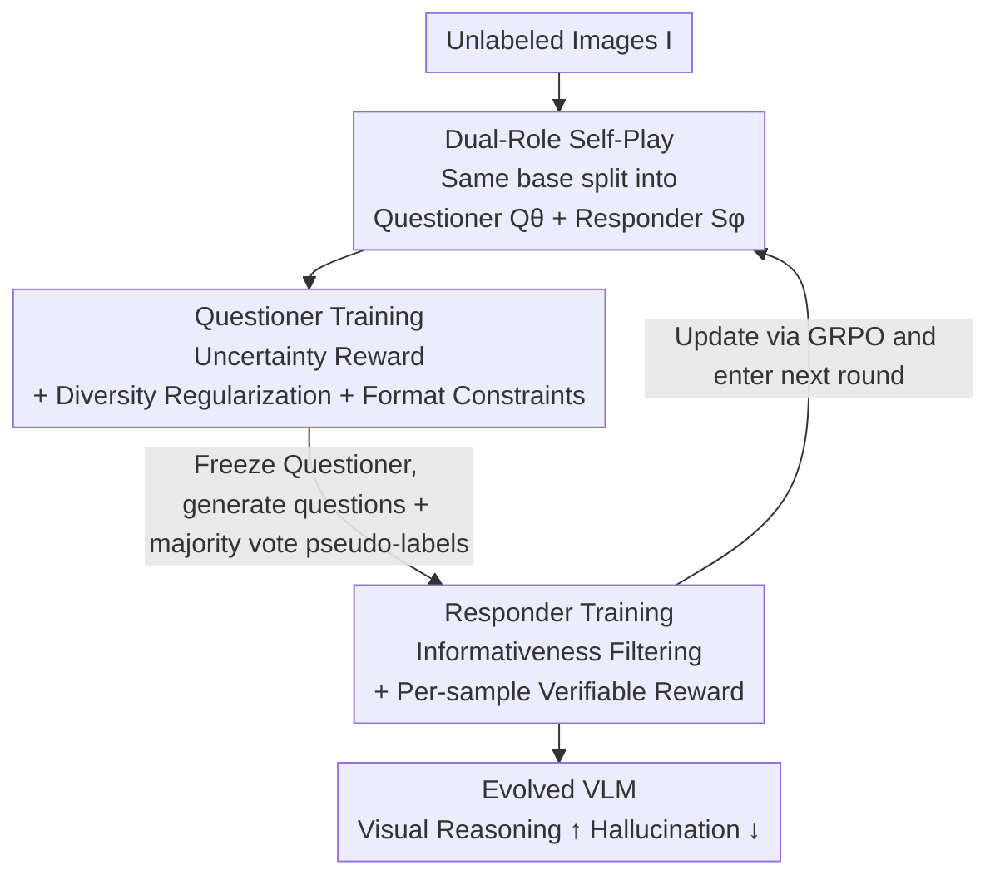

# VisPlay: Self-Evolving Vision-Language Models

**Conference**: CVPR 2026  
**Paper**: [CVF Open Access](https://openaccess.thecvf.com/content/CVPR2026/html/He_VisPlay_Self-Evolving_Vision-Language_Models_CVPR_2026_paper.html)  
**Code**: https://github.com/bruno686/VisPlay (Yes)  
**Area**: Multimodal VLM  
**Keywords**: Self-evolution, Vision-Language Models, Reinforcement Learning, GRPO, Self-play

## TL;DR
VisPlay enables a single base VLM to simultaneously act as both a "Questioner" and a "Responder." Using only unlabeled images, the system automatically scores questions based on the responder's answer uncertainty and generates pseudo-labels via majority voting. The two roles evolve alternately through self-play using GRPO. VisPlay achieves consistent performance gains across 8 visual reasoning benchmarks, nearly matching the performance of models trained with manual annotations using GRPO.

## Background & Motivation
**Background**: Post-training VLMs with Reinforcement Learning (RL) has become mainstream. Methods like R1-style RLVR (Reinforcement Learning from Verifiable Rewards) significantly enhance visual reasoning. However, these rewards typically originate from manually annotated "Image-Question-Answer" triplets or rely on hand-written rule-based verifiers for specific tasks.

**Limitations of Prior Work**: Manual annotation is expensive and difficult to scale, acting as a fundamental bottleneck for intelligence growth. Meanwhile, massive amounts of free, unlabeled images on the internet remain underutilized. If model progress is bounded by human labeling capacity, it may never surpass the signals provided by humans.

**Key Challenge**: The self-evolution paradigm has been proven feasible in text-only LLMs (where models generate questions, data, and improve themselves). However, transferring this to VLMs introduces an additional hurdle: VLM capabilities are heavily dependent on the visual modality. The text-world pipeline of "self-generating questions + code-based verification" does not hold for vision. Rule-based verifiers cannot determine the correctness of open-ended visual questions, and no off-the-shelf verifiable rewards exist.

**Goal**: To enable a VLM to autonomously become stronger using only raw images without any manual annotations. This decomposes into two sub-problems: (1) Without ground truth, how to assign a reasonable difficulty/quality reward to "self-generated questions"? (2) Without ground truth, how to provide a credible supervisory signal to the "Responder"?

**Key Insight**: The authors adopt a "self-play" approach, splitting a single VLM into two roles that compete and complement each other in a closed loop. The key observation is that **the response consistency of a responder over multiple samplings of the same question encodes the difficulty of that question**. High consistency implies the question is too easy; consistency near random implies it is too hard or chaotic. Questions in the intermediate "partially understood" zone provide the highest training value.

**Core Idea**: Use "Responder uncertainty" as the reward for the Questioner and "Responder majority voting" as pseudo-labels for the Responder. Let the Questioner and Responder evolve alternately using GRPO, enabling snowballing self-improvement without external supervision.

## Method

### Overall Architecture
VisPlay is a closed-loop self-evolution system that takes unlabeled images as input and outputs a VLM with enhanced visual reasoning. Two roles, both initialized from the **same** pre-trained base, are involved: the **image-conditioned Questioner** $Q_\theta$ receives an image and generates challenging yet answerable questions; the **multimodal Responder** $S_\phi$ receives the image and question to generate "silver-standard" answers. A self-evolution round consists of two alternating phases: first, the Responder is frozen to train the Questioner (using uncertainty as a difficulty reward); then, the Questioner is frozen to train the Responder (using questions from the Questioner + pseudo-labels from majority voting). Both phases are optimized using GRPO. After multiple iterations (up to Iter 3 in the paper), the Questioner produces increasingly difficult questions, forcing the Responder to become stronger, forming a "Difficulty↑ ↔ Capability↑" co-evolution.

### Key Designs

**1. Dual-Role Self-Play: Splitting one VLM into Questioner and Responder to generate training signals from unlabeled images**

The core pain point is that without manual labels, there is no inherent reward. VisPlay solves this by having the same base VLM play two roles: the Questioner $Q_\theta$ autoregressively samples a set of questions $\{x_i\}_{i=1}^G \sim Q_\theta(\cdot\mid I)$ for image $I$, and the Responder $S_\phi$ samples $m$ responses for each question. The roles alternate in "freezing one and training the other." When training the Questioner, the Responder acts as a fixed "referee." When training the Responder, the Questioner acts as a fixed "task generator." No image labels are needed, as supervisory signals emerge from the interaction. This is effective because both roles share the same visual understanding; questions that "confuse" the Responder are likely at the boundary of the model's capability. This endogenous difficulty alignment ensures questions are neither too simple nor nonsensical, extending self-play from game scenarios (like Vision-Zero) to arbitrary real-world images.

**2. Uncertainty Reward: Inferring question difficulty from response consistency to reward "optimal" questions**

The most difficult problem for the Questioner is determining if a question is "worth asking" without ground truth. VisPlay samples $m$ responses from the Responder for question $x$, computes the majority vote pseudo-label $\tilde{y}=\arg\max_y \hat{p}(y\mid x,I)$ where $\hat{p}(y\mid x,I)=\frac{1}{m}\sum_{j=1}^m \mathbb{1}\{y_j=y\}$, and defines confidence as $\text{conf}(x,I)=\hat{p}(\tilde{y}\mid x,I)$. Confidence near 1 suggests the question is too easy; confidence near 0.5 suggests high uncertainty and high Informativeness. The uncertainty reward is designed to peak at $c=0.5$ and decay linearly:

$$r_{\mathrm{unc}}(x,I) = 1 - \bigl|\,2c-1\,\bigr|,\quad c=\text{conf}(x,I)$$

This reward optimizes the Questioner to generate questions that push the Responder to its limits, providing high-information signals for self-evolution.

**3. Diversity Regularization + Format Constraints: Preventing collapse and filtering invalid outputs**

Rewarding only difficulty can cause the Questioner to collapse into repeating a specific type of question that yields high uncertainty. VisPlay applies BLEU-based clustering to questions for the same image to identify duplicates. For questions in a cluster $C_k^{(I)}$, a redundancy penalty is applied: $r_{\mathrm{div}}(x_i,I)=\lambda\,\frac{|C_k^{(I)}|}{G}$. Additionally, hard filtering ensures questions are wrapped in `<question>` tags; otherwise, the reward is zeroed via an indicator function $\mathbb{1}_{\mathrm{valid}}$. The final Questioner reward combines these into a scalar:

$$r_i = \mathbb{1}_{\mathrm{valid}}(x_i)\cdot \mathrm{ReLU}\!\bigl(r_{\mathrm{unc}}(x_i,I) - r_{\mathrm{div}}(x_i,I)\bigr)$$

The ReLU function truncates negative rewards (where diversity penalties outweigh difficulty), preventing advantage estimation distortion in GRPO and stabilizing training.

**4. Informativeness Filtering + Verifiable Reward: Providing balanced questions and binary supervision for the Responder**

During Responder training, the Questioner is frozen to generate questions. Not all are used; VisPlay samples $N$ candidates and keeps only those with confidence $c_i$ in the "informativeness zone" $\tau_{\mathrm{low}}=0.25 \le c_i \le \tau_{\mathrm{high}}=0.75$. Questions with $c_i>0.75$ are already mastered, and those with $c_i<0.25$ are too noisy. These filtered questions, paired with their majority vote pseudo-labels $\tilde{y}_i$, form the training set $\mathcal{S}$. The Responder samples $G$ answers per question, receives a binary verifiable reward $r_j=\mathbb{1}(y_j=\tilde{y}_i)$, and updates via GRPO. This treats the model's most consistent previous answer as the ground truth, effectively acting as self-distillation with difficulty filtering.

### Loss & Training
Both roles are optimized using GRPO (Group Relative Policy Optimization): $G$ responses are sampled for each prompt, and group-relative advantage is calculated as $\hat{A}_i = \frac{r_i - \mathrm{mean}(r_1,\dots,r_G)}{\mathrm{std}(r_1,\dots,r_G)+\varepsilon_{\mathrm{norm}}}$. The policy is updated using a clipped objective with KL regularization. GRPO is well-suited for self-play where absolute reward scales are unreliable, as it focuses on relative quality within a group. The process follows Algorithm 1 in a double loop: "Update Questioner → Generate/Filter Questions → Update Responder" over multiple iterations.

## Key Experimental Results

### Main Results
Training data consists of Vision-47K (47,000 multi-domain web images, **images only, original Q&A discarded**). Verification is conducted on three bases: Qwen2.5-VL-3B, Qwen2.5-VL-7B, and MiMo-VL-7B, across 8 benchmarks (MMMU, MM-Vet, RealWorldQA, VisNumBench, MathVerse, MATH-Vision, HallusionBench), using LLM-as-a-judge scoring.

| Model | Setting | Avg. Accuracy | Hallucination (HallusionBench) |
|------|------|-----------|----------------------|
| Qwen2.5-VL-3B | Base | 30.61 | 32.81 |
| Qwen2.5-VL-3B | VisPlay (Iter 1) | 44.16 | 91.80 |
| Qwen2.5-VL-3B | VisPlay (Iter 3) | **47.27** | 90.54 (Iter 2 peak 94.95) |
| Qwen2.5-VL-7B | Base | 40.41 | 66.88 |
| Qwen2.5-VL-7B | VisPlay (Iter 3) | **48.61** | 92.32 |
| MiMo-VL-7B | Base | 43.56 | 87.17 |
| MiMo-VL-7B | VisPlay (Iter 3) | **45.69** | 74.55 |

Performance improved across all three bases. The 3B model jumped from 30.61 to 47.27 (+16.66), the largest gain. Hallucination metrics improved dramatically on smaller models (32.81 → 94.95).

Comparison with manual annotation training (Table 3, Qwen2.5-VL-3B):

| Method | Supervision Source | Avg. Accuracy | Hallucination |
|------|---------|-----------|------|
| Standard GRPO | Manual Image-Q-A | 47.1 | 67.4 |
| VisPlay (Iter 3) | Self-generated, 0 manual labels | 47.3 | 90.5 |

VisPlay's average score at zero-shot matches or slightly exceeds labeled GRPO, with significantly better hallucination scores (90.5 vs. 67.4).

### Ablation Study
The authors verified contributions through dynamic co-evolution analysis (Challenger baseline in Table 1 + trajectory analysis in Table 2):

| Configuration | Key Observation | Explanation |
|------|---------|------|
| VisPlay (challenger) | 3B 33.77 / 7B 38.33 / MiMo 39.63 | Training Responders only on questions from an untrained challenger is inferior to complete iteration—proving the **Questioner must evolve together**. |
| Full VisPlay (Iter 1→3) | Responder acc. on same Iter-1 questions: 44.0 → 49.0 | Responder continues to strengthen across iterations. |
| Pseudo-label Quality | Accuracy estimate 72 → 61 (decreases w/ iteration) | Questions become harder and labels noisier, yet capacity still grows. |

### Key Findings
- **Co-evolution is the growth engine**: Using an un-evolved challenger for questions leads to significant performance gaps compared to the full iterative version, proving that pressure from the Questioner is indispensable.
- **Difficulty and Accuracy rise synchronously**: Figure 3 shows the Questioner’s difficulty and the Responder’s accuracy curves rising complementarily, reinforcing each other.
- **Improved capability despite pseudo-label noise**: Although pseudo-label accuracy drops from 72 to 61 as questions get harder, Responder capability continues to rise—suggesting "Informativeness Filtering" is more vital than "absolute label purity."
- **Small models benefit most**: The 3B model saw much higher gains than the 7B, indicating self-evolution is most effective when the base has room to grow but is "knowledgeable enough to explore" (consistent with R1 training patterns).

## Highlights & Insights
- **Using responder uncertainty as a reward** is the most elegant part of the paper: The simple $1-|2c-1|$ formula solves the "missing ground truth" problem—good questions are those that the model finds most confusing. The signal is entirely endogenous.
- **Both roles originating from the same base** ensures that question difficulty and responder capability are naturally aligned, avoiding "too easy" or "meaningless" outcomes. This is more general than Vision-Zero as it works on real images.
- The combination of **majority voting self-distillation + Informativeness Filtering** can be applied to any unlabeled task with multiple samplings: use consistency for pseudo-labels and confidence for difficulty selection. This is essentially curriculum learning where the model "teaches itself only what it is close to mastering."
- **Zero-label performance matching labeled performance** is highly impactful: It suggests that much of current manual RL post-training can be replaced by self-evolution, especially in domains where labeling is expensive.

## Limitations & Future Work
- **Reliability of majority voting**: If a responder is systematically wrong on a category, majority voting reinforces the bias. Pseudo-label accuracy dropped to 61% over iterations, raising concerns about long-term stability.
- **Uncertainty as a proxy for difficulty**: The reward targets questions where the responder is confused, but confusion can stem from ambiguity/noise rather than genuine difficulty.
- **Restricted iterations**: The study only goes up to Iter 3. Long-term behavior—whether the model collapses, saturates, or is overwhelmed by label noise—remains unexplored.
- **Dependence on LLM-as-a-judge**: Open-ended evaluations rely on another model; judge bias can propagate. Furthermore, non-monotonic fluctuations were seen in 7B intermediate iterations.
- **Future Directions**: Improvements could include stronger pseudo-label calibration (ensembles), ambiguity detection to filter noisy questions, and exploration of scalability on larger models over more rounds.

## Related Work & Insights
- **vs. Standard GRPO (RLVR)**: Both use GRPO, but RLVR requires manual triplets for verifiable rewards. VisPlay replaces this with self-generated uncertainty and pseudo-labels, matching performance with zero labels and lower hallucinations.
- **vs. Vision-Zero / Game-RL**: These depend on simulated game data or external tools for signals. VisPlay works on arbitrary real images, with signals emerging purely from internal model interactions.
- **vs. LLM Self-Evolution**: While text LLMs use code/rules to verify, VisPlay adapts this to vision by using response consistency as a "soft verifier" for open-ended visual tasks.
- **vs. LLaVA-style SFT**: SFT relies on projection layer alignment and large-scale instructions; VisPlay shifts the requirement from "human-labeled data" to "raw images" via RL.

## Rating
- Novelty: ⭐⭐⭐⭐⭐ The uncertainty-based reward and dual-role self-play elegantly solve the VLM self-evolution bottleneck.
- Experimental Thoroughness: ⭐⭐⭐⭐ Strong verification across 3 bases and 8 benchmarks; however, lacks traditional ablation on specific modules and only runs for 3 rounds.
- Writing Quality: ⭐⭐⭐⭐ Formulas, pseudo-code, and co-evolution analyses are clear, though some iteration fluctuations lack deep explanation.
- Value: ⭐⭐⭐⭐⭐ Demonstrates that self-evolution can replace expensive manual labeling, providing a clear path for multimodal self-improvement.

<!-- RELATED:START -->

## Related Papers

- [\[CVPR 2026\] TRivia: Self-supervised Fine-tuning of Vision-Language Models for Table Recognition](trivia_self-supervised_fine-tuning_of_vision-language_models_for_table_recogniti.md)
- [\[CVPR 2026\] Decouple to Generalize: Context-First Self-Evolving Learning for Data-Scarce Vision-Language Reasoning](decouple_to_generalize_context-first_self-evolving_learning_for_data-scarce_visi.md)
- [\[CVPR 2026\] MoE-GRPO: Optimizing Mixture-of-Experts via Reinforcement Learning in Vision-Language Models](moe-grpo_optimizing_mixture-of-experts_via_reinforcement_learning_in_vision-lang.md)
- [\[CVPR 2026\] MUPO: All Roads Lead to Rome - Incentivizing Divergent Thinking in Vision-Language Models](mupo_all_roads_lead_to_rome_incentivizing_divergent_thinking_in_vlms.md)
- [\[ICLR 2026\] Self-Evolving Vision-Language Models for Image Quality Assessment via Voting and Ranking](../../ICLR2026/multimodal_vlm/self-evolving_vision-language_models_for_image_quality_assessment_via_voting_and.md)

<!-- RELATED:END -->
