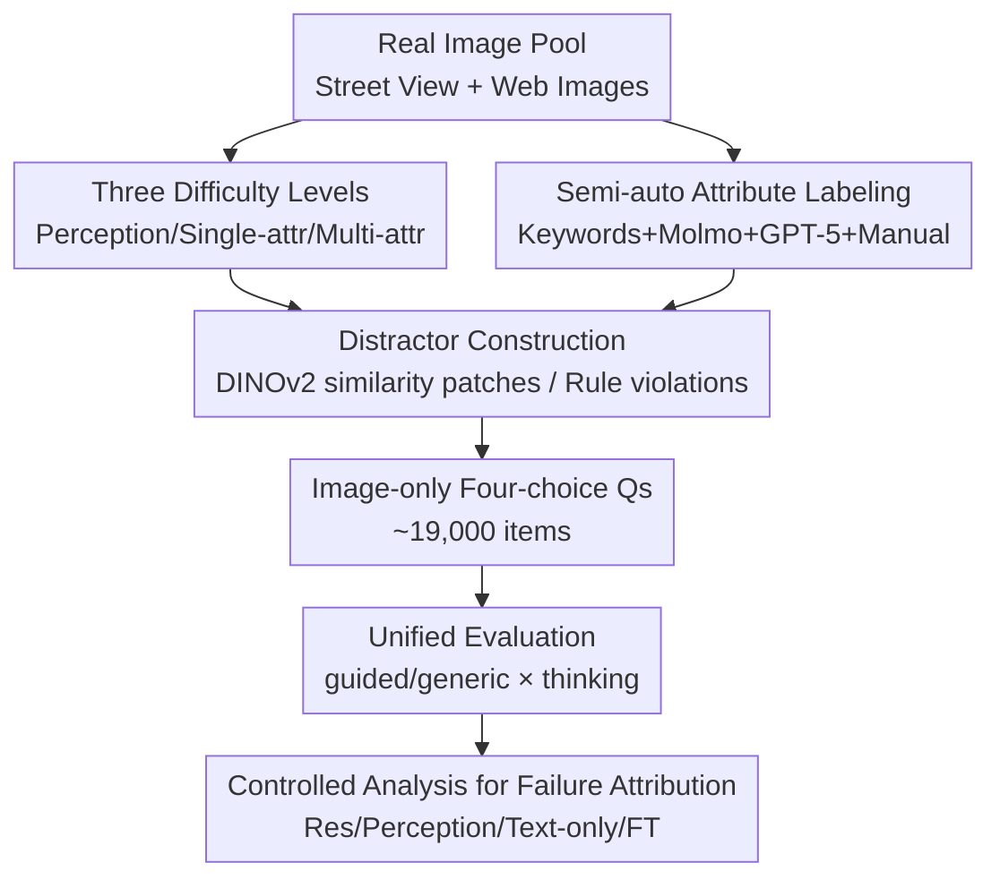

# VisRes Bench: On Evaluating the Visual Reasoning Capabilities of VLMs

**Conference**: CVPR 2026  
**Paper**: [CVF Open Access](https://openaccess.thecvf.com/content/CVPR2026/html/Tortei_VisRes_Bench_On_Evaluating_the_Visual_Reasoning_Capabilities_of_VLMs_CVPR_2026_paper.html)  
**Code**: https://visres-bench.github.io (Project page, available)  
**Area**: Multimodal VLM  
**Keywords**: Visual Reasoning, Evaluation Benchmark, De-lexicalized Priors, Perception-Reasoning Continuum, Compositional Reasoning

## TL;DR
VisRes is a visual reasoning benchmark constructed using pure images in a four-choice format, expanding tasks across three difficulty levels: "perception completion → single-attribute rules → multi-attribute composition." The study reveals that once linguistic prompts are removed, even frontier VLMs such as GPT-5 and Gemini-2.5 perform near random levels under subtle perturbations, exposing that their "reasoning" largely stems from language priors rather than true visual understanding.

## Background & Motivation
**Background**: Vision-Language Models (VLDs) have shown impressive performance in image captioning and Visual Question Answering (VQA), often interpreted as the models possessing "visual reasoning." However, in these tasks, images are often accompanied by extensive textual cues (question phrasing, option text, captions), allowing models to take shortcuts via language priors.

**Limitations of Prior Work**: Existing visual reasoning benchmarks either use synthetic images (e.g., CLEVR, RAVEN, PGM grid puzzles), which have large gaps with real images and poor transferability, or use real images but cover only a single domain (e.g., Bongard-HOI, V-PROM) without distinguishing difficulty levels. Crucially, most benchmarks fail to evaluate "perception" and "reasoning" separately—making it impossible to determine if a model failed due to poor vision (perception) or incorrect logic (reasoning).

**Key Challenge**: Cognitive neuroscience indicates that relational reasoning develops along a "perception → conceptualization" continuum—recovering object attributes from visual input (perceptual grounding) before performing single-attribute transformation reasoning (tracking changes in color/quantity), which then supports multi-attribute compositional reasoning. This means failures at the perceptual layer propagate upward: a model that cannot build reliable visual representations has no basis for rule-based reasoning. However, current benchmarks rarely cover this complete perception-reasoning chain.

**Goal**: To build a benchmark on natural images that minimizes language priors and hierarchically diagnoses where VLMs fail (perception / single-attribute / composition).

**Key Insight**: The authors start from the hierarchical mechanism of human vision—humans can complete occluded objects, continue interrupted textures, and infer abstract rules from spatial arrangements. This capability is inherently hierarchical. Thus, the benchmark is designed in three layers, each corresponding to a stage on the continuum, and entry is forced into an image-only four-choice format to cut off textual shortcuts.

**Core Idea**: Use a "hierarchical difficulty + de-lexicalized" real-image benchmark to expose the "pseudo-reasoning" of VLMs—observing performance levels at each layer when textual dependence is removed.

## Method

### Overall Architecture
VisRes is not a model but a **construction + evaluation** pipeline for a benchmark. The overall process follows two lines: the **data construction line**—processing real images into three levels with approximately 19,000 four-choice questions (Level 1: Local/Global Perceptual Completion; Level 2: Single-attribute Raven Matrices; Level 3: Multi-attribute Compositional Matrices), each with one correct option and three carefully constructed distractors; and the **evaluation and diagnosis line**—running a suite of frontier/open-source VLMs under a unified four-choice format, followed by controlled experiments (resolution variance, single-attribute recognition, text-only reasoning, fine-tuning) to locate whether failures stem from perception or reasoning.

The data-evaluation pipeline is as follows:

### Key Designs

**1. Three Difficulty Levels: Decoupling Perception and Reasoning**

To address the issue where model failures are ambiguous, VisRes splits tasks along a cognitive continuum into three levels. Level 1 tests **perceptual grounding**: local patch completion (removing an $80\times80$ pixel tile and requiring the model to select the one that continues the texture from four candidates, with perturbations like blur, brightness, rotation, edges, and orientation) and global occlusion completion (masking 50%–80% of an image to infer the correct continuation). Level 2 tests **single-attribute rule reasoning**: using $3\times3$ Raven-style matrices where the missing cell is fixed at $(2,2)$, with only one attribute (color / quantity / orientation) changing according to row-wise rules (Uniform, 3-different, 2-similar-1-different, Progression, Arithmetic min-max, etc.), while other attributes vary freely. Level 3 tests **multi-attribute compositional reasoning**: matrices governed by multiple concurrent rules (coupled rules, independent multiple rules, spiral patterns), with random missing cell positions to prevent positional shortcuts.

**2. Image-only Four-choice Format: Severing Language Shortcuts**

To counter the reliance of VLMs on textual priors, VisRes presents every question as a pure visual multiple-choice item consisting of one image and four candidates (A–D). The prompts provide no semantic content regarding "which attribute to look at" (generic prompts), forcing models to infer the task from the vision itself. The authors also retain a "guided" variant that informs the model which attribute to focus on or the potential rule type, sharing the exact same visual layout. This allows for a **systematic comparison of "with and without linguistic guidance"** on the same visual problem.

**3. Semi-automatic Annotation + Hard Distractors**

Level 2/3 requires count/color/orientation labels for each image. The authors use a semi-automatic pipeline: counts and colors are initially labeled using crawl keywords (e.g., "five white dogs"), then verified by Molmo (counting model) and GPT-5 (attribute extraction), keeping only consistent results. For distractors, Level 1 uses DINOv2-large embeddings to calculate cosine similarity and select the 3 most similar patches (DS strategy). Level 2/3 distractors are **programmatically constructed to systematically violate given rules** (e.g., changing the target attribute, reversing progressions), ensuring they look plausible but are logically incorrect.

**4. Controlled Analysis for Failure Attribution**

The authors designed four sets of controlled experiments to trace root causes. First, **resolution**: increasing input from $512^2$ to $1024^2$ and $2048^2$. Second, **pure perceptual grounding**: constructing single-cell attribute recognition tasks ("what is the color/count in this cell?") to test perception without reasoning. Third, **pure reasoning**: describing the matrix symbolically in text (e.g., "3 blue globes") to test the reasoning ceiling without image interference. Fourth, **fine-tuning**: SFT a Qwen2.5-VL-3B on Level 1 with 100k images to see if these capabilities are learnable.

## Key Experimental Results

### Main Results
Evaluation of 12 VLMs under guided prompt + thinking mode with a 32k context. Average accuracy (%) for each level (selected):

| Model | Level-1 Avg | Level-2 Avg | Level-3 Avg |
|------|-------------|-------------|-------------|
| GPT-5 | 31.10 | 49.79 | 34.39 |
| Gemini-2.5 | 33.28 | 62.29 | 33.73 |
| GPT-4o | 23.86 | 24.12 | 23.86 |
| Qwen3-VL-30B | 31.20 | 46.75 | 31.36 |
| Qwen3-VL-4B | 28.17 | 37.18 | 26.31 |
| InternVL3.5-8B | 25.49 | 25.65 | 26.88 |

Key observation: Under Level 1 perceptual perturbations, almost all models hover near the random chance line (25%). For Level 2, color reasoning is strongest (GPT-5/Gemini reach 96–97%), while orientation reasoning is extremely poor (19–30% across all models). Level 3 falls back to 21–34% for most.

### Ablation Study

| Experiment | Key Result | Description |
|------|---------|------|
| Human Baseline | ~91% | Significant gap between models and humans |
| Fine-tuned Qwen2.5-VL-3B | 25.5 → 43.7 | Geometric cues are learnable; pixel-level robustness remains difficult |
| Resolution $512\to2048$ | L1 45.17→56.51; L3 31.63→40.07 | Higher resolution helps, but is not the sole bottleneck |
| Single-cell Attribute Recognition | Color 84.6%, Count 72.4%, Orientation 39.8% | Perception of geometric attributes is a major weakness |
| Textual Symbolic Reasoning | GPT-5 L2 85.0 / L3 66.0 | Reasoning significantly improves without vision, implying the bottleneck is in the perceptual end |
| Thinking Mode Switch | Significant improvement when enabled | Explicit chain-of-thought assists visual abstraction significantly |

### Key Findings
- **Language Priors Drive "Pseudo-reasoning"**: GPT-5 reaches 85% on Level 2 when rules are symbolic text, but fails when the same rules are in images—failures occur at the stage of "transforming vision into reason-able representations."
- **Orientation as a Systematic Blind Spot**: Both in recognition and reasoning, geometric/orientation attributes perform far worse than color and count, suggesting VLM visual encoders lack sufficient directional information.
- **Scaling and Thinking Help but have Low Ceilings**: While larger models and thinking modes improve scores, a massive gap remains compared to the 91% human baseline, indicating a need for architectural integration of perception and abstraction rather than just more compute.

## Highlights & Insights
- **"De-lexicalization" is the most incisive aspect of this benchmark**: By comparing generic vs. guided prompts, the authors quantify whether a model is using vision or language priors, debunking optimistic narratives about VLM visual reasoning.
- **The Hierarchical + Controlled Attribution design is robust**: Instead of just reporting poor scores, the five controlled experiments attribute failures to specific stages, proving that perceptual and reasoning deficiencies coexist and that perceptual failures propagate upward.
- **DINOv2 Similarity-based Distractor Construction**: Using cosine similarity from self-supervised features to select "most similar but incorrect" candidates increases task difficulty from casual observation to detailed scrutiny.

## Limitations & Future Work
- **Limitations**: Fine-tuning was only performed on Level 1; it remains unknown if Level 2/3 can be mastered via SFT. Much of the data (generic, few-shot, RS distractors) is relegated to the supplementary materials.
- **Self-identified Issues**: Penalizing "thinking loops" as failures might conflate "poor reasoning" with "poor instruction following/format stability."
- **Future Directions**: Scaling Level 3 for synthetic supervision to reach fine-tuning ceilings and decoupling output stability from reasoning capacity by adding a "null output rate" metric.

## Related Work & Insights
- **vs. RAVEN / PGM / CLEVR**: These use clean, synthetic images. VisRes uses real natural images with perceptual perturbations, making it more realistic but harder to label.
- **vs. BLINK / SalBench**: These reveal perceptual flaws but lack difficulty tiers and do not decouple perception from reasoning.
- **vs. Bongard-OpenWorld / V-PROM**: These involve relational reasoning on real images but are often domain-specific; VisRes is multi-attribute and explicitly hierarchical.

## Rating
- Novelty: ⭐⭐⭐⭐ The three-layer continuum combined with de-lexicalized control is a fresh perspective, though individual components (Raven matrices) are existing methods.
- Experimental Thoroughness: ⭐⭐⭐⭐ Extensive cross-model evaluation and 5 sets of controlled analysis; deduction for only fine-tuning Level 1.
- Writing Quality: ⭐⭐⭐⭐ Clear motivation based on cognitive science; well-articulated task taxonomy.
- Value: ⭐⭐⭐⭐ Provides a quantifiable diagnostic tool for investigating whether VLMs possess true visual reasoning.

<!-- RELATED:START -->

## Related Papers

- [\[CVPR 2026\] VS-Bench: Evaluating VLMs for Strategic Abilities in Multi-Agent Environments](vs_bench_evaluating_vlms_for_strategic_abilities_in_multi_agent_environments.md)
- [\[ACL 2026\] AICA-Bench: Holistically Examining the Capabilities of VLMs in Affective Image Content Analysis](../../ACL2026/multimodal_vlm/aica-bench_holistically_examining_the_capabilities_of_vlms_in_affective_image_co.md)
- [\[CVPR 2026\] ENC-Bench: A Benchmark for Evaluating MLLMs in Electronic Navigational Chart Understanding](enc-bench_a_benchmark_for_evaluating_multimodal_large_language_models_in_electro.md)
- [\[CVPR 2026\] DiGraphHal-Bench: Evaluating Multimodal Large Language Models on Complex Directed Graphs](digraphhal-bench_evaluating_multimodal_large_language_models_on_complex_directed.md)
- [\[ACL 2026\] ShredBench: Evaluating the Semantic Reasoning Capabilities of Multimodal LLMs in Document Reconstruction](../../ACL2026/multimodal_vlm/shredbench_evaluating_the_semantic_reasoning_capabilities_of_multimodal_llms_in_.md)

<!-- RELATED:END -->
