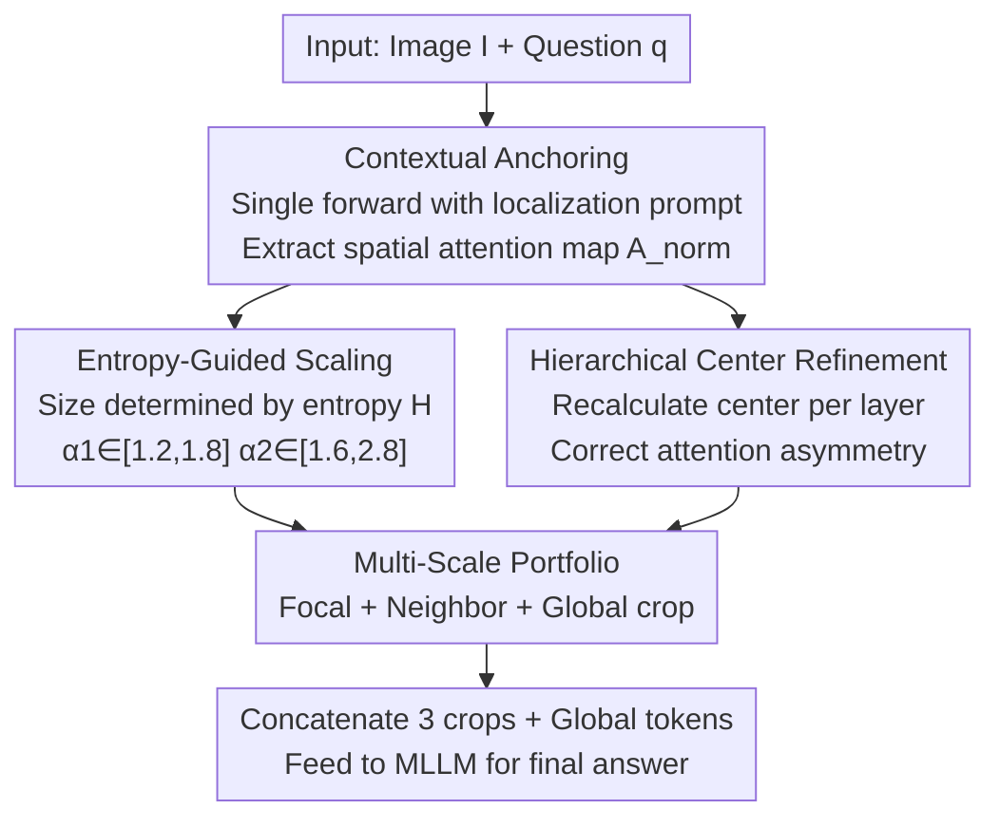

# Visual Funnel: Resolving Contextual Blindness in Multimodal Large Language Models

**Conference**: CVPR 2026  
**arXiv**: [2512.10362](https://arxiv.org/abs/2512.10362)  
**Code**: None  
**Area**: Multimodal VLM  
**Keywords**: MLLM Fine-grained Perception, Attention Cropping, Multi-scale Context, Training-free Inference Enhancement, Contextual Blindness

## TL;DR
Addressing the MLLM failure mode of "seeing details but failing to understand context" (termed Contextual Blindness by the authors), this paper proposes a training-free two-step method, Visual Funnel. It first extracts a more accurate attention map using a localization prompt, then adaptively generates a three-layer "focal $\rightarrow$ neighbor $\rightarrow$ global" multi-scale crop portfolio based on attention entropy. It achieves up to a $+16.4$ improvement over single-crop baselines across four fine-grained VQA tasks.

## Background & Motivation

**Background**: While MLLMs possess strong reasoning capabilities, their perception of small-scale details (fine text, distant object attributes, subtle state differences) remains weak, which is a major bottleneck for high-precision tasks. Mainstream solutions follow a "two-step paradigm": first Localization (identifying where relevant details are), then Integration (feeding details back to the model). Recent works (V*, ViCrop) have performed well in localization—either through multi-step iterative searches or single-forward localization via internal attention maps.

**Limitations of Prior Work**: Although localization is effective, the Integration step is generally rudimentary. Typically, a tightly bounded high-resolution crop of the target (plus the original image) is fed back into the model. The authors found that this "naive integration" introduces a critical issue: the model obtains the details but loses the intermediate-scale context required to interpret them. For instance, judging if "the girl holding a kite is short" requires comparison with another girl in the scene; tight cropping removes the reference, making the judgment impossible. In chart-based tasks, cropping out column headers or surrounding text prevents the model from completing cross-regional compositional reasoning.

**Key Challenge**: The authors formalize this as **Contextual Blindness**—even when all necessary pixels are present (the original image provides the global view, and the crop provides the focus), the model still fails. The root cause is not a lack of information but a missing bridge between focal details and the global context, causing a "structural disconnection." The core argument: **What constrains MLLM performance is not the "Quantity" of information, but the lack of "Structural Diversity" in the input.**

**Goal**: To redesign the Integration step to construct an input structure that simultaneously preserves focal, neighboring, and global contexts without training and based on a single-forward localization.

**Core Idea**: Replace "single tight cropping" with an "adaptive multi-scale crop portfolio," where crop sizes dynamically scale with attention entropy and centers are refined hierarchically to provide the model with the missing intermediate context.

## Method

### Overall Architecture
Visual Funnel is a training-free enhancement module that sits outside the standard MLLM inference pipeline. Given an image-question pair $(I,q)$, it outputs a final answer supplemented by multi-scale context. It consists of two steps: **Step 1 Contextual Anchoring** uses a localization-based prompt for a single forward pass to extract a focused spatial attention map; **Step 2 Entropy-Scaled Portfolio Generation** uses this map to determine the "scale" of each crop via attention entropy and the "center" via hierarchical refinement. This generates three crop blocks—"focal / neighbor / global"—which are concatenated with original image tokens for the final answer generation.

### Key Designs

**1. Contextual Anchoring: Extracting a "Task-Oriented" Attention Map**

A common pain point is that when a model answers a question directly without clear details, its attention may be biased or lead to hallucinations. Rather than asking for the answer immediately, this method uses a localization-oriented query—"To answer '{question}', where in the image should I look?"—to guide the model to identify the relevant region, yielding a more precise attention map. Following ViCrop, the cross-attention of the "first response token vs. all image tokens" is extracted from a predefined layer: $\mathbf{A}(I,q)\in\mathbb{R}^{H\times1\times T}$. Heads are averaged: $\hat{\mathbf{A}}(I,q)=\frac{1}{H}\sum_{h=1}^{H}\mathbf{A}^{h}(I,q)$. For projection-based models like LLaVA, spatial alignment is direct; for Q-Former models like InstructBLIP, spatial correspondence is established by multiplying attention matrices. The map is normalized into a probability distribution $\mathbf{A}_{\text{norm}}[i,j]$.

**2. Entropy-Guided Scaling: Adapting Context Size via Attention Entropy**

Fixed-size crops fail to adapt to varied questions—some require local details, while others require wide-area relations. The authors observe that **attention entropy reflects how much context a region needs**: low entropy ($H\approx0$) indicates highly concentrated attention and local answers, requiring minimal context; high entropy ($H\approx\log|\mathbf{A}|$) indicates dispersed attention or ambiguity, requiring wider context. Normalized Shannon entropy is calculated as:

$$H_{\text{norm}}(I,q)=-\frac{1}{\log(B_h\cdot B_w)}\sum_{i,j}\mathbf{A}_{\text{norm}}[i,j]\log\mathbf{A}_{\text{norm}}[i,j]\in[0,1],$$

Scaling factors for two crops are linear functions of entropy: $\alpha_1(I,q)=1.2+0.6\,H_{\text{norm}}\in[1.2,1.8]$ and $\alpha_2(I,q)=1.6+1.2\,H_{\text{norm}}\in[1.6,2.8]$. Even with high confidence (low entropy), at least $1.2\times$ and $1.6\times$ expansion is provided to prevent total isolation of the focal point.

**3. Hierarchical Center Refinement: Correcting Attention Asymmetry**

Standard multi-scale cropping assumes attention is centered, but real attention is often skewed—a target cell might be at the edge of a table. This method starts from the global centroid $\boldsymbol{\mu}_0$ and recalculates the next layer's center $\boldsymbol{\mu}_\ell(I,q)$ within the previous crop's region $\mathcal{R}_\ell$:

$$\boldsymbol{\mu}_\ell(I,q)=\frac{\sum_{(i,j)\in\mathcal{R}_\ell}\mathbf{c}_{ij}\cdot\mathbf{A}_{\text{norm}}[i,j]}{\sum_{(i,j)\in\mathcal{R}_\ell}\mathbf{A}_{\text{norm}}[i,j]},$$

where $\mathbf{c}_{ij}$ represents coordinates. This allows the crop to "drift" towards the actual information density.

**4. Multi-Scale Portfolio: Constructing Structurally Diverse Inputs**

The final input consists of three crops (at resolution $S$): $\text{Crop}_{\text{focal}}$ (centered at $\boldsymbol{\mu}_0$), $\text{Crop}_{\alpha_1}$ (neighboring context centered at $\boldsymbol{\mu}_1$, size $\alpha_1 S$), and $\text{Crop}_{\alpha_2}$ (wide area centered at $\boldsymbol{\mu}_2$, size $\alpha_2 S$). Each is resized to $S\times S$ and concatenated with the global image tokens. Unlike ViCrop (Top-3), which adds three unstructured crops, this hierarchical approach provides the "structural diversity" necessary for reasoning.

### Loss & Training
No training. Visual Funnel is a purely inference-time, training-free method that introduces no learnable parameters.

## Key Experimental Results

### Main Results
Evaluated on 7 VQA benchmarks: Grounded VQA (TextVQA / GQA / DocVQA / InfoVQA) and Recognition VQA (POPE / A-OKVQA / VQAv2). Absolute gains over the "Base" model are in parentheses.

| Model / Method | TextVQA | DocVQA | InfoVQA | GQA | POPE | VQAv2 |
|------|------|------|------|------|------|------|
| LLaVA-1.5-7B | 47.9 | 15.9 | 12.0 | 60.1 | 85.6 | 75.4 |
| + ViCrop | 54.1 | 19.4 | 12.6 | 60.4 | 87.4 | 76.1 |
| + ViCrop (Top-3) | 53.5 | 19.2 | 12.9 | 60.5 | 87.5 | 76.6 |
| **+ Visual Funnel** | **59.1 (+11.2)** | **22.8 (+7.0)** | **15.1 (+3.1)** | **61.3** | **88.3** | **76.7** |
| InstructBLIP-7B | 33.4 | 9.2 | 12.8 | 49.4 | 84.7 | 76.3 |
| + ViCrop (Top-3) | 45.8 | 10.1 | 16.0 | 49.8 | 87.0 | 77.1 |
| **+ Visual Funnel** | **49.8 (+16.4)** | **18.5 (+9.3)** | **25.1 (+12.3)** | **50.6** | **87.1** | **77.2** |
| Qwen2.5-VL-3B | 70.1 | 51.5 | 34.2 | 61.2 | 87.1 | 78.9 |
| + ViCrop (Top-3) | 76.7 | 55.3 | 39.9 | 61.4 | 88.5 | 79.4 |
| **+ Visual Funnel** | **79.8 (+9.7)** | **61.1 (+9.6)** | **49.6 (+15.4)** | **62.2** | 88.5 | **79.5** |

### Ablation Study
Decomposing contributions on Qwen2.5-VL-3B:

| Config | DocVQA | InfoVQA | Note |
|------|------|------|------|
| ViCrop (baseline) | 54.2 | 39.4 | Single crop baseline |
| w/o Step 2 (Prompt only) | 55.1 | 40.3 | Better attention alone is insufficient (+0.9) |
| w/o Step 1 (Portfolio only)| 59.8 | 47.9 | Multi-scale structure is the main driver (+5.6) |
| **Visual Funnel (Full)** | **61.1** | **49.6** | Best synergy |

### Key Findings
- **Structure >> Quantity**: Multi-scale structure (Step 2) is the primary contributor. Unstructured multi-cropping (ViCrop Top-3) can even lead to performance drops (**Redundancy Penalty**), proving that "hierarchical structure" matters more than "crop count."
- **Task Specificity**: Significant gains are observed in grounded/fine-grained tasks. Minimal gains in Recognition VQA (+0.5~1.0) suggest the method specifically solves Contextual Blindness rather than acting as a universal booster.

## Highlights & Insights
- **Re-diagnosing the Problem**: Shifts the perception limit from "insufficient information" to "insufficient structure (lack of intermediate scale)."
- **Entropy-to-Context Mapping**: An elegant way to adapt context size per question, ensuring both confidence-based precision and uncertainty-based inclusion.
- **Hierarchical Centering**: Addresses engineering edge cases like off-center targets, a detail often missed in ROI-based pipelines.

## Limitations & Future Work
- **Dependency on Initial Attention**: Relies on Step 1 providing a reasonably accurate anchor.
- **Single Focal Point Assumption**: Less effective for complex queries requiring the synthesis of multiple spatially separated regions.
- **Inference Overhead**: While training-free, processing extra crops increases latency.

## Related Work & Insights
Compared to **ViCrop**, which provides only one tight crop, Visual Funnel adds hierarchical layers to resolve Contextual Blindness. Compared to **V***, it remains training-free and model-internal without relying on external detectors or iterative searches. It represents a lightweight complementary approach to **High-Resolution Training** (like LLaVA-NeXT) by dynamically allocating context at inference time.

## Rating
- Novelty: ⭐⭐⭐⭐
- Experimental Thoroughness: ⭐⭐⭐⭐
- Writing Quality: ⭐⭐⭐⭐
- Value: ⭐⭐⭐⭐

<!-- RELATED:START -->

## Related Papers

- [\[CVPR 2026\] ORIC: Benchmarking Object Recognition under Contextual Incongruity in Large Vision-Language Models](oric_benchmarking_object_recognition_under_contextual_incongruity_in_large_visio.md)
- [\[CVPR 2026\] Evolving Contextual Safety in Multi-Modal Large Language Models via Inference-Time Self-Reflective Memory](evolving_contextual_safety_in_multi-modal_large_language_models_via_inference-ti.md)
- [\[CVPR 2026\] Unleashing the Intrinsic Visual Representation Capability of Multimodal Large Language Models](unleashing_the_intrinsic_visual_representation_capability_of_multimodal_large_la.md)
- [\[CVPR 2026\] CoVFT: Context-aware Visual Fine-tuning for Multimodal Large Language Models](covft_context-aware_visual_fine-tuning_for_multimodal_large_language_models.md)
- [\[CVPR 2026\] Predictive Regularization Against Visual Representation Degradation in Multimodal Large Language Models](predictive_regularization_against_visual_representation_degradation_in_multimoda.md)

<!-- RELATED:END -->
