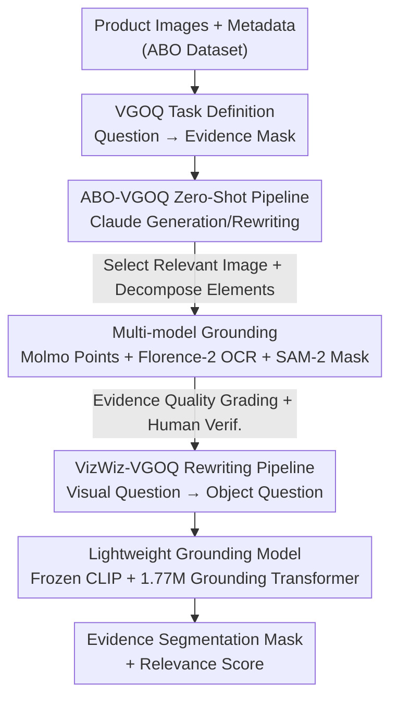

# Visual Grounding for Object Questions

**Conference**: CVPR 2026  
**Paper**: [CVF Open Access](https://openaccess.thecvf.com/content/CVPR2026/html/Everaert_Visual_Grounding_for_Object_Questions_CVPR_2026_paper.html)  
**Code**: Project Page https://martin-ev.github.io/vgoq (EPFL × Amazon)  
**Area**: Multimodal VLM / Visual Grounding  
**Keywords**: Visual Grounding, Object Questions, Evidence Segmentation, Synthetic Data Generation, Lightweight Models

## TL;DR
This paper proposes a new task, **Visual Grounding for Object Questions (VGOQ)**, which shifts the focus from "where the direct answer is" to "locating visual evidence/context that supports answering open-ended abstract questions." The authors developed two automated data pipelines to create the VizWiz-VGOQ and ABO-VGOQ benchmarks and trained a lightweight CLIPSeg-style model with only 1.77M parameters. This model outperforms large-scale models like GLaMM, UnifiedIO, and OFA on the VGOQ task and remains competitive with the contemporaneous Qwen3-VL.

## Background & Motivation
**Background**: Traditional visual grounding research is categorized into three types: open-vocabulary segmentation, referring expression segmentation (RES, e.g., "the red car on the left"), and VQA grounding (e.g., VizWiz-VQA-Grounding, TextVQA-X, masking "where the answer to the question is in the image"). A commonality among these tasks is that the annotated segmentation mask **is the answer itself** or the object directly named in the question.

**Limitations of Prior Work**: In real-world scenarios (especially e-commerce), users often ask questions that cannot be answered by simple visual identification, such as "Are these earplugs comfortable to wear?" "Is this seasoning suitable for a low-sodium diet?" or "Is this product vegan-friendly?" These are **open-ended, abstract object questions where the answer does not directly appear in the image**. Answering them requires identifying **indirect evidence**—such as silicone ear tips, "beef ravioli" on an ingredient list, or "salt-free" branding—yet existing grounding models have not been trained on such data, nor do corresponding benchmarks exist.

**Key Challenge**: Existing grounding tasks perform direct matching between "linguistic descriptions ↔ visible image elements," whereas object questions require indirect reasoning (material recognition, spatial scale, context inference, text-image integration, infographic reading, etc.) to infer functional attributes from visible features. An inference gap exists between the two.

**Goal**: (1) Formally define the VGOQ task; (2) Generate trainable and evaluable data in the absence of existing datasets; (3) Provide a lightweight grounding model capable of real-time deployment on millions of product images.

**Key Insight**: Given the lack of data, the authors use LLMs (Claude) combined with traditional grounding models to "repurpose/synthesize" existing resources into VGOQ data. This involves two paths: rewriting existing visual questions into object questions (reusing masks as evidence) and zero-shot generation of questions and evidence masks from e-commerce product images and metadata.

**Core Idea**: Redefining the goal of visual grounding from "segmenting the answer" to "segmenting the visual evidence supporting the answer," and using synthetic data to make this new task learnable, measurable, and deployable.

## Method

### Overall Architecture
The input for VGOQ consists of an open-ended object question $q$, several images of the object $(I_i)_{i=1,\dots,j}$, and optional text information $t$ (such as an e-commerce product listing). The output is a set of segmentation masks $(V_i)_{i=1,\dots,j}$ highlighting the visual evidence/context that supports answering $q$:

$$q, t, (I_i)_{i=1,\dots,j} \rightarrow (V_i)_{i=1,\dots,j}$$

In single-image cases, this simplifies to $q, t, I \rightarrow V$, allowing for evaluation using existing multimodal models and alignment with traditional VQA grounding ($q, I \rightarrow V$). For multi-image cases, images are first scored by relevance to the question, and the most relevant image is selected for grounding.

The methodology comprises **two data generation pipelines** (VizWiz-VGOQ via rewriting and ABO-VGOQ via zero-shot generation) to create training/evaluation sets, followed by **jointly training a lightweight grounding model** for deployment. The ABO pipeline is a six-step serial process as shown below:

### Key Designs

**1. VGOQ Task Definition: Changing "Segmenting Answer" to "Segmenting Evidence"**
The failure of traditional grounding on abstract questions stems from the task setting itself, which assumes "the target is directly visible and is the answer." This paper redefines the objective: given an open-ended object question, locate **visual evidence or context useful for answering**, rather than the answer itself. For example, for "Are these earplugs comfortable?", the model should highlight silicone tips or cushioning materials rather than a direct answer. This shift transforms a "direct matching" problem into an "inference from visible features to functional attributes" problem, causing existing SoTA models' gIoU to drop from 52.2% to 37.2% on the same images.

**2. VizWiz-VGOQ: Reverse Rewriting Visual Questions into Object Questions**
To address the "zero data" dilemma, the first pipeline leverages VizWiz-VQA-Grounding's existing "image-visual question-answer mask" triplets. The authors use Claude to **rewrite** visual questions (e.g., "What kind of candy is this? → pecan clusters") into natural object questions (e.g., "Can someone with a nut allergy eat these candies?"). The original mask for "pecan clusters" is then repurposed as "supporting evidence." This results in 7469 samples without additional annotation. Evidence quality is then graded by Claude using four yes/no questions to categorize samples into five levels: "Unidentifiable / No Value / Relevant but No Visual Evidence / General Visual Evidence / Specific Visual Evidence (SVE)."

**3. ABO-VGOQ: Six-step Zero-shot Pipeline with Cooperative Multi-model Generation**
The second pipeline generates questions and masks **from scratch** using images and metadata from Amazon Berkeley Objects (ABO), covering 1300 products and 8910 questions. The steps include: ① Claude simulating shopping stages to generate candidate questions; ② Rewriting questions into one abstract and 1-3 specific questions for diversity; ③ Claude scoring relevance (0-1) for metadata fields and selecting the best image; ④ Refining "Q&A" into **specific visual elements** to be grounded (boxes, points, lines, text regions); ⑤ Multi-model collaboration to map elements to pixels (Molmo 7B-D for pointing, Florence-2 for OCR, SAM-2 for converting points to masks); ⑥ Merging masks and performing quality grading with human verification (expert consensus via SageMaker GroundTruth).

**4. Lightweight CLIPSeg-style Model: Frozen Encoders + 1.77M Grounding Transformer**
To enable real-time deployment, the authors trained a lightweight model: the vision side uses **frozen** CLIP ViT to extract multi-layer features (balancing detail and semantics), while the text side uses a **frozen** CLIP text encoder for various inputs (object/visual questions, referring expressions). These are fed into a **1.77M parameter** grounding transformer. Output heads produce a $336\times336$ heatmap and a relevance score. The model is trained using Dice + Binary Cross-Entropy loss across RES, VQA grounding, and VGOQ datasets with FiLM conditioning for task-specific modulation.

### Loss & Training
Joint Loss = Dice loss + Binary Cross-Entropy (pixel-wise supervision). Multi-task training mixes RES (RefCOCO/+/g, ~320k triplets), VQA grounding (VizWiz, TextVQA-X), and VGOQ data. Training involves 10,000 steps with a batch size of 8 and a learning rate of 0.001. Only samples graded as "relevant" or higher are used for VGOQ training, with optional fine-tuning on SVE samples.

## Key Experimental Results

### Main Results
Evaluation uses gIoU (mean per-sample IoU). The table below highlights performance on "Specific Visual Evidence (SVE)" samples. Notably, for UnifiedIO-XL on **the same VizWiz images**, performance drops from 52.2% to 37.2% when shifting from visual questions (VQ) to object questions (VGOQ).

| Model | Params | VizWiz-VQA-Ground (VQ) | VizWiz-VGOQ val-SVE | ABO-VGOQ val-SVE |
|------|--------|------|------|------|
| Uniform (Full Image)| 0 | 15.6 | 15.6 | 12.9 |
| OFA-Large | 470M | 17.0 | 16.5 | 17.9 |
| GLaMM-FullScope | 7B | 30.2 | 28.1 | 20.2 |
| UnifiedIO-XL | 3B | **52.2** | 37.2 | 12.4 |
| Qwen3-VL-8B-Instruct | 8B | 47.0 | 36.0 | 30.3 |
| **Ours (LW)** | **1.77M** | 51.5 | **47.0** | **39.5** |

### Key Findings
- **Systematic performance drop from VQ to VGOQ**: SoTA models drop significantly in gIoU on the same images, proving that "finding evidence" is a non-trivial new challenge.
- **Small model outperforming large models**: The 1.77M LW model exceeds 3B/7B/8B models on VGOQ-SVE due to specialized training.
- **Lack of generalization in LLMs**: UnifiedIO-XL drops to 12.4% on out-of-domain ABO-VGOQ (worse than the uniform baseline), highlighting the value of filling the task gap.
- **Efficacy of fine-tuning by evidence grade**: Fine-tuning on SVE samples increases performance by +1.7 to +7.4 gIoU.

## Highlights & Insights
- **Reverse rewriting masks** is a clever annotation-saving trick: repurposing VQA answer masks as "evidence masks" allows task migration with zero additional human labeling.
- **Distilling LLM pipelines into small models** is a pragmatic engineering paradigm: using a heavy Claude+Molmo+Florence-2+SAM-2 ensemble for generation during training, then deploying a 1.77M model for inference.
- **Multi-model division of labor**: Combining Molmo (pointing), Florence-2 (OCR), and SAM-2 (pixel segments) compensates for individual model weaknesses, particularly in handling lines and text.

## Limitations & Future Work
- **Synthetic Data**: Benchmarks rely on automated pipelines. While mitigated by expert consensus, "what constitutes valid evidence" remains subjective.
- **Rewriting Bias**: VizWiz-VGOQ reuses masks designed for direct answers, which might not be the optimal evidence region for abstract questions.
- **Task Boundaries**: Future work is needed to differentiate between questions requiring direct visual evidence and those requiring external knowledge.

## Related Work & Insights
- **vs. VQA Grounding**: Traditional tasks locate direct answers; this work extends them to locate supporting evidence for abstract questions.
- **vs. RES / Open-Vocabulary Segmentation**: These focus on direct descriptors. The proposed model uses a similar architecture (CLIPSeg) but supports open-ended object questions.
- **vs. Large Multimodal Models**: GLaMM/UnifiedIO/OFA use unified tokens/coordinates but generalize poorly to zero-shot VGOQ. This work demonstrates the superiority of specialized data with lightweight architectures.

## Rating
- Novelty: ⭐⭐⭐⭐⭐ Formally identifies and defines the "Visual Grounding for Object Questions" task.
- Experimental Thoroughness: ⭐⭐⭐⭐ Extensive comparisons across 5 benchmarks; however, primarily relies on synthetic benchmarks.
- Writing Quality: ⭐⭐⭐⭐⭐ Technical details and logic are clear and well-illustrated.
- Value: ⭐⭐⭐⭐⭐ High practical value for e-commerce, offering a deployable lightweight model.

<!-- RELATED:START -->

## Related Papers

- [\[CVPR 2026\] Small Object, Great Challenge: A Benchmark for Small Object Visual Grounding](small_object_great_challenge_a_benchmark_for_small_object_visual_grounding.md)
- [\[CVPR 2026\] IAG: Input-aware Backdoor Attack on VLM-based Visual Grounding](iag_input-aware_backdoor_attack_on_vlm-based_visual_grounding.md)
- [\[CVPR 2026\] From Failure to Feedback: Group Revision Unlocks Hard Cases in Object-Level Grounding](from_failure_to_feedback_group_revision_unlocks_hard_cases_in_object-level_groun.md)
- [\[CVPR 2026\] GroundingME: Exposing the Visual Grounding Gap in MLLMs through Multi-Dimensional Evaluation](groundingme_exposing_the_visual_grounding_gap_in_mllms_through_multi-dimensional.md)
- [\[CVPR 2026\] Grounding Everything in Tokens for Multimodal Large Language Models](grounding_everything_in_tokens_for_multimodal_large_language_models.md)

<!-- RELATED:END -->
