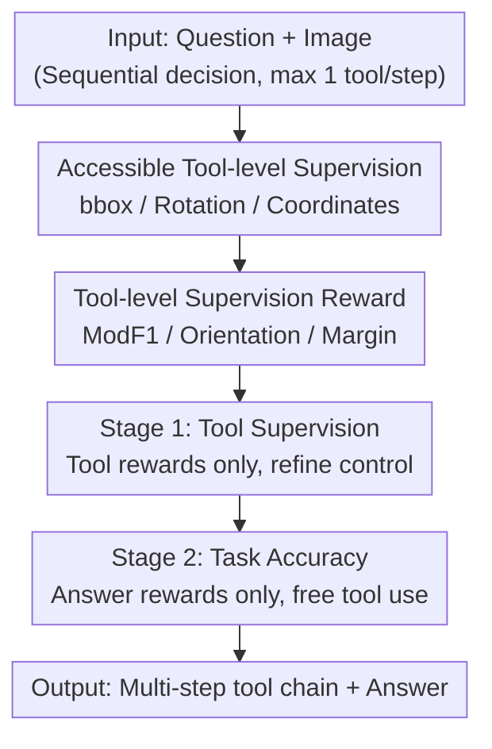

# Visual Reasoning through Tool-supervised Reinforcement Learning

**Conference**: CVPR 2026  
**arXiv**: [2604.19945](https://arxiv.org/abs/2604.19945)  
**Code**: None  
**Area**: Multimodal VLM / Visual Reasoning / Tool Use / Reinforcement Learning  
**Keywords**: Tool-supervised RL, Visual Tool Use, Multi-stage Curriculum, GRPO, Thinking and Images

## TL;DR
Addressing the issue that Multimodal Large Language Models (MLLMs) "can invoke tools but do so poorly or infrequently," this paper proposes ToolsRL. It uses a set of easily obtainable tool-level ground-truth data (bboxes, rotation angles, point/line coordinates) to directly supervise RL. A two-stage curriculum is designed: first learning to "use tools correctly," then learning to "use tools to answer correctly." This approach achieves SOTA on multiple high-resolution, rotated document, and chart understanding benchmarks, with an average tool invocation frequency (3.4 times) significantly higher than previous methods (mostly $\le 1$ time).

## Background & Motivation
**Background**: MLLMs have made significant progress in thinking-with-text, but "thinking-with-images"—performing operations like zooming, rotating, and drawing on images during reasoning to generate intermediate visual evidence—remains immature. Equipping models with visual tools like zoom-in, rotate, and draw is considered a promising direction for enhancing visual reasoning. While closed-source models like OpenAI-o3 have validated this, making open-source MLLMs "autonomously and effectively invoke tools (knowing when, how, and why)" remains an unsolved problem.

**Limitations of Prior Work**: Two mainstream training routes have inherent flaws. The **SFT route** (imitating expert tool trajectories) relies on prompts from stronger reasoning models, leading to high labor costs and poor scalability; trajectories must also be meticulously cleaned to avoid overfitting or generalization collapse. The **RL route** (e.g., GRPO, allowing models to explore tool strategies) offers better scalability but suffers from coarse reward design: rewards are either outcome-only or provide generic encouragement for any tool use, failing to inform the model whether a specific step was necessary or precise.

**Key Challenge**: Sparse, outcome-only rewards cannot simultaneously teach fine-grained tool manipulation and task objective optimization. Consequently, RL-trained models exhibit extremely low tool invocation (often less than once per trajectory) and fail to establish the "multi-step, coherent tool chains" required for complex visual reasoning—models revert to text-only guessing when facing difficult problems.

**Goal**: (1) Provide dense feedback on "correct tool usage" during RL training; (2) Resolve optimization conflicts when tool rewards and answer rewards are combined.

**Key Insight**: For a set of "simple, native, and interpretable" visual tools, ground-truth is easily accessible. Supervision for zoom-in is object bboxes; for rotate, it is the image rotation degree; for draw, it is the specific coordinates. Since these annotations are inexpensive and readily available, there is no need to synthesize expensive expert trajectories; they can be directly fed into RL as tool-level rewards.

**Core Idea**: Replace "expert trajectories/sparse answer rewards" with "direct tool-level supervision" and utilize a two-stage curriculum to decouple "learning to use tools" from "using tools to answer questions," optimizing them sequentially to avoid conflicts between heterogeneous rewards.

## Method

### Overall Architecture
ToolsRL models visual tool use as a sequential decision process with finite steps: at each step, the agent observes state $s_t$ (question + current image + history), selects an action $a_t$—either invoking a visual tool on any image in history (generating a new image and proceeding) or outputting `<answer>` to terminate. A maximum of one tool is invoked per step. The optimization goal is to maximize trajectory return using GRPO: $\max_\theta \mathbb{E}_{\tau\sim\pi_\theta}\big[\sum_{t=1}^T r(s_t,a_t)\big]$.

The core of the method lies not in the network architecture (using Qwen2.5-VL-7B) but in the **rewards** and **training curriculum**. The authors design "tool-level supervision rewards" for zoom-in, rotate-flip, and draw tools, then split training into two stages: **Stage 1 (Tool Supervision) uses only tool rewards** to refine tool manipulation; **Stage 2 (Task Accuracy) uses only answer rewards** while allowing free tool invocation to answer questions.

### Key Designs

**1. Tool-level supervision instead of expert trajectories: Direct evaluation of each invocation**

This addresses the pain points of expensive SFT trajectories and sparse RL rewards. Unlike SFT, which imitates entire trajectories, tool supervision focuses solely on whether the tool was invoked correctly using existing ground-truth. For zoom-in, the target is the object bbox; for rotate/flip, it is the inverse of a random transformation; for draw, it is the coordinates of points/lines in synthetic tasks. Dense rewards make tool precision computable without expert trajectories.

**2. Three tool-specific rewards: Translating "precision" into differentiable feedback**

Each tool category has a per-state reward $R_{\text{task}}(s_t,\mathcal{G}^{\text{task}})$:

- **Zoom-in: Modified F1 (ModF1)**. Calculates TP/FP/FN at the pixel level between predicted box $b$ and GT box $g$. $\mathrm{ModF1}(b,g)=\frac{2\,\mathrm{TP}}{2\,\mathrm{TP}+w_{\text{fp}}\,\mathrm{FP}+w_{\text{fn}}\,\mathrm{FN}}$. Asymmetric weights $w_{\text{fp}}{=}0.1,\,w_{\text{fn}}{=}1.0$ are used because "over-boxing" (FP) is less severe than "missing the target" (FN). This encourages bold zooming.
- **Rotate/Flip: Binary orientation reward**. GT is the standard orientation $o^*$. Reward is $\mathbb{1}[o(I_t)=o^*]\in\{0,1\}$—1 if corrected, 0 otherwise.
- **Draw: Unified coordinate margin reward**. Lines and points share a margin score $s(p,p^*)=\max(0,\,1-\frac{d(p,p^*)}{T_{p^*}})$, which is 1 for a direct hit and decays linearly to 0 at tolerance $T$. Line distance $d_{\text{line}}=|c-c_a^*|$ uses tolerances $T_x{=}W/4, T_y{=}H/4$. For multiple primitives, Hungarian matching finds the optimal one-to-one similarity sum $S_{\text{TP}}$, and a final F1-style reward is computed: $R_{\text{draw}}=\frac{2\,S_{\text{TP}}}{|\mathcal{C}_t^{\text{draw}}|+|\mathcal{G}^{\text{draw}}|}$.

**3. Two-stage curriculum: First "use tools correctly," then "use tools to answer"**

Initial attempts to optimize tool and answer rewards simultaneously caused models to revert to text-only reasoning because the objectives interfered. The curriculum decoouples them: **Stage 1** optimizes $R_{\text{final,stage-1}}=\frac{1}{2}(R^{\text{global}}_{\text{tool}}+R^{\text{answer}}_{\text{tool}})+R_{\text{format}}$ to stabilize tool manipulation. **Stage 2** switches back to standard QA, optimizing only $R_{\text{answer}}+R_{\text{format}}$. Tool skills become "muscle memory" in Stage 1 and are naturally employed in Stage 2.

**4. Global + Answer-conditioned tool rewards: Balancing exploration and utility**

Global rewards (best step in trajectory) encourage exploration but might reward irrelevant steps. Answer-conditioned rewards (the image cited in `<answer>`) ensure relevance but inhibit exploration. Stage 1 uses both: $R^{\text{global}}_{\text{tool}}=\max_{t}R_{\text{task}}(s_t,\mathcal{G}^{\text{task}})$ and $R^{\text{answer}}_{\text{tool}}=R_{\text{task}}(s_{t_{\text{answer}}},\mathcal{G}^{\text{task}})$. Ablations show they are complementary.

### Loss & Training
- **Algorithm**: Qwen2.5-VL-7B-Instruct + GRPO, 16 sampled trajectories per input, max 10 tool steps.
- **Rewards**: Stage 1 uses tool-specific rewards. Stage 2 uses answer rewards (normalized numerical scores for synthetic charts, LLM-judge for others).
- **Hyperparams**: 200 steps per stage, lr $1\times10^{-6}$, batch 256, no KL penalty, zoom IoU threshold 0.5.
- **Data**: Documents (DocVQA + rotation/flip augmentation), Spatial (SealVQA + Visual Probe high-res), Charts (ChartQA + ArxivQA + synthetic tasks).

## Key Experimental Results

### Main Results
ToolsRL achieves SOTA on most benchmarks for documentation, spatial reasoning, and charts:

| Dataset | Metric | ToolsRL | DeepEyes | Qwen2.5-VL Base |
|--------|------|---------|----------|-----------------|
| DocVQA-RF | ANLS | **77.3** | 61.3 | 50.2 |
| InfoVQA-RF | ANLS | **61.4** | 59.7 | 53.8 |
| InfoVQA-Res | ANLS | **71.0** | 59.5 | 50.9 |
| V-Star | Avg Acc | **92.5** | 89.8 | 75.9 |
| HR-Bench 4K | Avg Acc | 75.9 | 75.2 | 70.4 |
| VisualProbe | Acc | **46.5** | 41.6 | 28.4 |
| ChartQA-Pro | Acc | **43.5** | 38.5 | 41.2 |
| TableVQA | Acc | **70.2** | 67.4 | 66.2 |

DocVQA-RF performance is notably 16 points higher than DeepEyes, demonstrating superior robustness to orientation.

### Ablation Study

Design & Curriculum (Selection from Table 2):

| Config | DocVQA-RF | InfoVQA-Res | VisualProbe | ChartQA-Pro |
|------|-----------|-------------|-------------|-------------|
| Qwen2.5-VL-7B Base | 50.2 | 50.9 | 28.4 | 41.2 |
| Answer Reward Only | 62.6 | 60.2 | 57.9 | 42.0 |
| Answer + Cond. Tool Reward | 71.1 | 62.5 | 57.4 | 43.0 |
| Tool Super. + Answer (No Curriculum) | 58.1 | 55.7 | 53.4 | 41.6 |
| **ToolsRL (Full)** | **77.3** | **71.0** | **60.6** | **43.5** |

### Key Findings
- **Curriculum is essential**: Simultaneous optimization of tool and answer rewards is worse than no tool rewards at all.
- **Complementary rewards**: Global rewards benefit chart understanding, while answer-conditioned rewards benefit spatial reasoning.
- **Rotate/Flip shortcut traps**: If Stage 1 includes original images, the model ignores rotated ones. Training only on augmented data improves accuracy from 67.1% to 79.4%.
- **Higher frequency**: ToolsRL averages 3.4 tool calls, whereas most previous models average $\le 1$.

## Highlights & Insights
- **Tool supervision as a strategic cut**: Replacing expensive trajectories with cheap tool-level GT (bbox/angle) allows for dense rewards at near-zero cost.
- **Asymmetric FP/FN weights**: Encoding task priors into rewards (prioritizing recall for zoom) directly results in more frequent and effective tool use.
- **Curriculum decouples heterogeneous targets**: Establishing "action correctness" before "task correctness" provides a dense path for sparse rewards.
- **Unified draw rewards**: Using a margin score with Hungarian matching provides clean engineering for multiple primitive types.

## Limitations & Future Work
- **Native tools only**: The model does not invoke external models like SAM; performance is capped by native tool capabilities.
- **Dependence on structured GT**: The benefit depends on the existence of bboxes/angles; tasks without these cannot easily leverage tool supervision.
- **Synthetic data reliance**: Draw capabilities are largely trained on synthetic datasets.
- **LLM-judge dependency**: Evaluation relies on Qwen2.5-VL-72B, which may introduce biases.

## Related Work & Insights
- **vs. DeepEyes**: DeepEyes uses generic tool encouragement; ToolsRL uses GT-based dense rewards and a curriculum, leading to much higher invocation frequency and better performance.
- **vs. Mini-o3 / Chain-of-Focus**: These require SFT trajectories first; ToolsRL is RL-only using cheap tool labels.
- **vs. Simple o3**: Simple o3 relies on curated SFT data; ToolsRL uses rewards to internalize tool skills, avoiding imitation dependence.

## Rating
- Novelty: ⭐⭐⭐⭐
- Experimental Thoroughness: ⭐⭐⭐⭐⭐
- Writing Quality: ⭐⭐⭐⭐
- Value: ⭐⭐⭐⭐

<!-- RELATED:START -->

## Related Papers

- [\[CVPR 2026\] Thinking With Videos: Multimodal Tool-Augmented Reinforcement Learning for Long Video Reasoning](thinking_with_videos_multimodal_tool-augmented_reinforcement_learning_for_long_v.md)
- [\[CVPR 2026\] Reading or Reasoning? Format Decoupled Reinforcement Learning for Document OCR](reading_or_reasoning_format_decoupled_reinforcement_learning_for_document_ocr.md)
- [\[CVPR 2026\] CodeV: Code with Images for Faithful Visual Reasoning via Tool-Aware Policy Optimization](codev_code_with_images_for_faithful_visual_reasoning_via_tool-aware_policy_optim.md)
- [\[CVPR 2026\] EMO-R3: Reflective Reinforcement Learning for Emotional Reasoning in Multimodal Large Language Models](emo-r3_reflective_reinforcement_learning_for_emotional_reasoning_in_multimodal_l.md)
- [\[CVPR 2026\] ARM-Thinker: Reinforcing Multimodal Generative Reward Models with Agentic Tool Use and Visual Reasoning](arm-thinker_reinforcing_multimodal_generative_reward_models_with_agentic_tool_us.md)

<!-- RELATED:END -->
