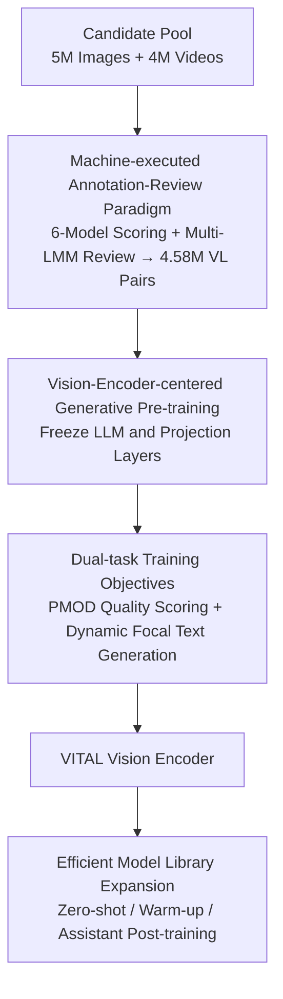

# VITAL: Vision-Encoder-centered Pre-training for LMMs in Visual Quality Assessment

**Conference**: CVPR 2026  
**Paper**: [CVF Open Access](https://openaccess.thecvf.com/content/CVPR2026/html/Jia_VITAL_Vision-Encoder-centered_Pre-training_for_LMMs_in_Visual_Quality_Assessment_CVPR_2026_paper.html)  
**Code**: https://github.com/jzhws/VITAL-Series (Available)  
**Area**: Multimodal VLM  
**Keywords**: Visual Quality Assessment, Large Multimodal Models, Vision Encoder Pre-training, Machine Annotation, Structural Transfer

## TL;DR
VITAL automatically annotates 4.58 million vision-language pairs using six scoring models followed by multi-LMM cross-review. By **freezing the LLM and training only the vision encoder** via generative pre-training, it produces a foundation vision encoder for visual quality assessment that generalizes across image/video scoring and descriptions while being seamlessly transferable to arbitrary LLM decoders.

## Background & Motivation
**Background**: Visual Quality Assessment (VQualA, including Image Quality Assessment IQA and Video Quality Assessment VQA) has increasingly adopted Large Multimodal Models (LMMs). These models treat tasks like "How is the clarity of this image?" as vision-language instruction tasks, with models such as Q-Align, DeQA-Score, and VQA² directly outputting quality scores or descriptive text.

**Limitations of Prior Work**: The authors identify two critical flaws in current VQualA LMMs. First, on the **data side**: quality annotation relies on extensive human subjective experiments (scoring by multiple people in controlled environments), which is expensive and difficult to scale. Consequently, most existing datasets are limited to single modalities or tasks, capping the model's performance. Second, on the **training side**: the mainstream approach involves supervised fine-tuning (SFT) of the entire model (including the LLM decoder). This often leads to overfitting on specific data/tasks, poor generalization, and **zero transferability**—changing the LLM scale requires retraining from scratch, which is impractical for diverse hardware requirements.

**Key Challenge**: An ideal VQualA foundation model should simultaneously achieve "universality (handling images+videos+multiple tasks), high performance, and transferability (ready-to-use with different decoders)." However, human annotation limits universality and performance, while full-parameter fine-tuning destroys transferability, creating a triplet of conflicting goals.

**Key Insight**: The authors make two pivotal judgments. First, **machines can replace human annotation**—the architectural differences between various scoring models naturally correspond to different "perceptual perspectives," effectively simulating human individual differences. Aggregating multiple machine scores into a distribution explicitly encodes annotation uncertainty, making it more robust. Second, analysis reveals that **the vision encoder is the core component of VQualA LMMs**, and pre-training has been proven to facilitate cross-domain and cross-structural transfer.

**Core Idea**: Use a "machine annotation + machine review" paradigm to create large-scale data, then **freeze the LLM and perform generative pre-training only on the vision encoder**. This embeds quality perception capabilities into a pluggable vision encoder, enabling a "pre-train once, transfer everywhere" workflow.

## Method

### Overall Architecture
VITAL consists of a three-stage pipeline: First, a pure machine-driven process compresses a candidate pool of 5M images and 4M videos into 4.58M high-quality vision-language pairs (covering "quality scoring" and "text generation"). Second, using InternVL-3-8B as a base, the **LLM decoder and projection layers are frozen while only the vision encoder is trained**. Generative pre-training is performed using two targeted losses (PMOD for scoring and focal loss for text generation) to produce the VITAL Vision Encoder. Finally, this encoder serves as a "universal socket" paired with LLM decoders of various sizes, enabling zero-shot usage or efficient warm-up with only 4,000 samples.

### Key Designs

**1. Machine-executed Annotation-Review Paradigm: Eliminating Human Bottlenecks**

To address the high cost of human annotation, VITAL delegates the entire labeling chain to machines. For scoring, six no-reference models are selected (FAST-VQA, DOVER, Q-Align for VQA; TOPIQ-NR, LIQE, QualiCLIP for IQA). Each sample is scored by these models to form a "machine opinion distribution." The authors argue that architectural differences mimic human perceptual diversity; the aggregated distribution preserves this diversity and explicitly retains uncertainty. Scores are normalized to $[0,1]$ and discretized into five quality levels (high/good/fair/poor/low) at 0.2 intervals.

For text generation, two types of labels are used with a strict "machine review" gate. Distortion identification uses 25 spatial distortions (from KADIS-700K) + 4 video-specific distortions, recorded as `[Severity]-[Distortion Type]`. Quality descriptions utilize rejection sampling: VQA²-Assistant generates descriptions, GPT-4o-mini polishes them (removing vacuous phrases like "good quality"), and they are split into single-sentence assertions. Three judges (GPT-5, Gemini-2.5-Flash, Qwen-VL-Max) vote over 3 rounds; **only unanimous votes are retained**. Finally, a "self-review" phase with semantically equivalent but differently worded prompts ensures consistency. This multi-layered validation scales high-quality machine labels to 4.58 million pairs—the largest VQualA training set to date.

**2. Vision-Encoder-centered Pre-training: Freezing LLM for Transferability**

This design directly addresses the conflict between overfitting and lack of transferability. VITAL follows the VQA² structure: the vision encoder comprises an image encoder (InternViT-300M-448px) and a motion extractor (SlowFast-R50). During training, **only the vision encoder is updated, while the LLM (Qwen2.5-7B) and all projection layers are frozen**. The logic is that since the vision encoder is the core of quality perception, embedding this capability into the encoder allows it to be plugged into any decoder without compromising the LLM's general language capabilities. Pre-training runs for 1 epoch with a batch size of 2 per GPU (~1920 GPU hours on 8×H200). A "prompt decoupling" trick is used: feeding only vision tokens without text prompts during training forces the model to evoke quality understanding directly from the visual representation.

**3. Dual-task Training Objectives: PMOD Weakly-supervised Scoring + Dynamic Focal Loss**

Scoring uses **PMOD (Proxy Machine Opinion Distribution) prediction**. From the machine opinions, the mean $\mu$ and standard deviation $\sigma$ are calculated to initialize a Gaussian $\mathcal{N}(\mu, \sigma^2)$ as the target distribution, linearly adjusted over 5 quality bins. The model outputs logits for 5 levels at the `[level]` token, calculates KL divergence $L_{kl}=\sum_{i=0}^{4} p_i\log(p_i/p_i^{pred})$ against the target PMOD, and adds a weighted cross-entropy for the prefix text:

$$L_{\text{Scoring-single}}=-\frac{1}{L}\left(\gamma\sum_{\ell=0}^{i_{level}-1}\log p(z_\ell\mid Z_\ell)-L_{kl}\right),\quad \gamma=0.01$$

For text generation, **dynamic focal loss** addresses the imbalance where the model prefers short, easy-to-learn phrases over long, rich descriptions. Focal loss dynamically adjusts weights based on the instantaneous probability of each token:

$$L_{\text{Interp}}=-\frac{1}{L}\sum_{\ell=0}^{L-1}\alpha\,(1-p(z_\ell\mid Z_\ell))^{\beta}\log p(z_\ell\mid Z_\ell),\quad \alpha=1,\ \beta=2$$

**4. Efficient Model Library Expansion: One Encoder, Multiple Decoders**

The VITAL Vision Encoder serves as a "base socket" for varied decoders. For **isomorphic decoders** (same as pre-training), full-parameter SFT is performed on 1120K public instruction data to obtain VITAL-Assistant-8B. For **heterogeneous decoders** (InternVL 1B/2B/14B, unseen during pre-training), two strategies are offered: ① **VITAL-Zero series** (pure zero-shot); ② **VITAL-Warm-up series**, which uses 4,000 samples from the pre-training set to tune only the decoder—using less than 1/1000th of the data to reach near full-training performance.

### Loss & Training
Pre-training data is mixed randomly, 1 epoch, batch size 2 per GPU (~1920 GPU hours on 8×H200). Scoring uses CE+KL weighting (single) or pure KL (pairwise). Text generation uses focal loss with $\alpha{=}1, \beta{=}2$. Downstream warm-up uses only 4,000 samples.

## Key Experimental Results

### Main Results

Video Quality Scoring (Average SRCC/PLCC across 8 datasets, italics denote OOD):

| Model | Average↑ | Note |
|------|-------|------|
| DOVER (ICCV'23) | 0.778 | Strong DNN baseline |
| KVQ (CVPR'25) | 0.780 | Previous strongest DNN |
| Q-Align (ICML'24) | 0.776 | In-domain LMM |
| InternVL3-8B (Base, Zero-shot) | 0.401 | General LMM struggles with scoring |
| **VITAL-Base-8B** | **0.820** | Outperforms all; strong OOD advantage |
| VITAL-Warm-up-1B | 0.808 | Approaches 8B performance with only 4k samples |

Image Quality Scoring (Average across 7 datasets): VITAL-Base-8B reaches **0.816**, exceeding DeQA-Score (0.799) and Q-Align (0.785), with significant leads on OOD sets like KADID and AGIQA.

Quality Description (QBench-video-test-single, Overall Accuracy):

| Model | Overall↑ | Description |
|------|----------|------|
| VQA²-Assistant | 55.56% | In-domain LMM |
| OmniVQA-Chatter | 59.94% | In-domain LMM |
| GPT-4o (24-11-20) | 52.72% | Closed-source general |
| Gemini-2.5-Pro | 62.33% | Strongest closed-source |
| VITAL-Base-8B | 51.33% | Maintains instruction following without LLM tuning |
| **VITAL-Assistant-8B** | **62.94%** | Surpasses Gemini-2.5-Pro after post-training |

### Ablation Study

Ablation of key training attributes (KoNViD-1k and KADID SRCC/PLCC):

| Configuration | KoNViD-1k | KADID | Note |
|------|-----------|-------|------|
| Base-8B (Full) | 0.878 / 0.881 | 0.759 / 0.708 | Full model |
| w/o PMOD | 0.835 / 0.840 | 0.602 / 0.668 | Mean + CE; largest drop in performance |
| w/o Pair | 0.856 / 0.867 | 0.725 / 0.687 | Without pairwise training |
| w/o Text | 0.868 / 0.873 | 0.743 / 0.712 | Without text generation task |

Linear Probing: Attaching a 1.61M linear head to the vision encoder outperforms Simple-VQA (86.91M parameters) on LIVE-VQC/KoNViD, proving that quality perception is successfully distilled into the encoder.

### Key Findings
- **PMOD is the primary contributor to performance**: Its removal causes SRCC on KADID to plummet from 0.759 to 0.602, far exceeding the impact of other tasks. Modeling machine weak labels as distributions via KL alignment is significantly more robust than "Mean + CE."
- **Freezing LLM preserves general capabilities**: VITAL-Base-8B maintains 51.33% accuracy in quality descriptions without touching the LLM, confirming that tuning only the vision encoder captures quality features without breaking language logic.
- **Focal loss improves output depth**: It prevents the model from collapsing into short outputs; the average length under focal loss better matches the ground-truth (14.83).
- **Extreme Transferability**: The Warm-up series reaches scores near the 8B model across 1B/2B/14B scales with minimal data, showing very slight OOD regression.

## Highlights & Insights
- **"Architectural Diversity ≈ Human Perceptual Variance"**: Treating the architectures of 6 scoring models as different perspectives and aggregating them into a distribution replicates the statistical essence of human subjective experiments. This provides a theoretical foundation for using PMOD as a replacement for human MOS.
- **"Vision-Encoder-centered" as an Inversion of LLM Tuning**: While others distribute capabilities across the whole model via full fine-tuning (making them non-transferable), VITAL concentrates perception in a pluggable encoder. This "freeze the giant, train the core" approach is a valuable template for multi-scale LMM deployment.
- **Robust Machine Review Pipeline**: The dual-layer rejection sampling (unanimous LMM votes + self-review) is the secret to making machine annotation viable at scale.

## Limitations & Future Work
- **Machine Label Ceiling**: If the 6 base models and the judge LMMs have systematic biases (e.g., against new AIGC distortions), the aggregated distribution cannot correct them without human oversight.
- **Discrete Scoring Levels**: Quantizing quality into 5 bins (high/good/fair/poor/low) results in a loss of fine-grained ranking information, making it difficult to distinguish between very similar samples.
- **Motion Modeling Bottleneck**: Temporal perception is tied to the relatively older SlowFast-R50; its effectiveness for long-form or complex temporal distortions remains to be seen.
- **Assistant Stage requires SFT**: Enhancing quality interpretation in VITAL-Assistant still relies on 1120K full-parameter fine-tuning, which slightly contradicts the "lightweight transfer" selling point compared to the Zero/Warm-up series.

## Related Work & Insights
- **vs DeQA-Score**: Both use soft label distributions to improve IQA, but VITAL replaces human labels with machine aggregation and expands to dual-modality and dual-tasks with better transferability.
- **vs Q-Align**: Q-Align pioneered discrete probability estimation for LMM scoring but is limited to single tasks and full-parameter fine-tuning. VITAL introduces PMOD, pairwise training, and a frozen LLM paradigm.
- **vs CLIP-IQA / ARNIQA**: VITAL belongs to the "opinion-unaware" (OU) route but significantly outperforms these methods (e.g., KonIQ SRCC 0.931 vs ARNIQA 0.795), proving generative pre-training with distribution supervision to be superior to contrastive OU approaches.

## Rating
- Novelty: ⭐⭐⭐⭐ The "encoder-centered + machine distribution" combo is a fresh paradigm for VQualA, though individual components like PMOD and focal loss are adapted from existing works.
- Experimental Thoroughness: ⭐⭐⭐⭐⭐ Comprehensive coverage across 15 scoring datasets, description benchmarks, linear probing, scaling laws, and multi-scale transfer.
- Writing Quality: ⭐⭐⭐⭐ Clear motivation and methodology; however, some formatting in equations (missing Eq. cross-references) and reliance on supplementary material for details.
- Value: ⭐⭐⭐⭐⭐ 4.58M VQualA dataset, pluggable encoder, and open-sourced library provide a practical and deployable direction for VQualA foundation models.

<!-- RELATED:START -->

## Related Papers

- [\[CVPR 2026\] UARE: A Unified Vision-Language Model for Image Quality Assessment, Restoration, and Enhancement](uare_a_unified_vision-language_model_for_image_quality_assessment_restoration_an.md)
- [\[CVPR 2026\] Probabilistic Prompt Adaptation for Unified Image Aesthetics and Quality Assessment](probabilistic_prompt_adaptation_for_unified_image_aesthetics_and_quality_assessm.md)
- [\[CVPR 2026\] FluoCLIP: Stain-Aware Focus Quality Assessment in Fluorescence Microscopy](fluoclip_stain-aware_focus_quality_assessment_in_fluorescence_microscopy.md)
- [\[CVPR 2026\] R4-CGQA: Retrieval-based Vision Language Models for Computer Graphics Image Quality Assessment](r4-cgqa_retrieval-based_vision_language_models_for_computer_graphics_image_quali.md)
- [\[CVPR 2026\] PowerCLIP: Powerset Alignment for Contrastive Pre-Training](powerclip_powerset_alignment_for_contrastive_pre-training.md)

<!-- RELATED:END -->
