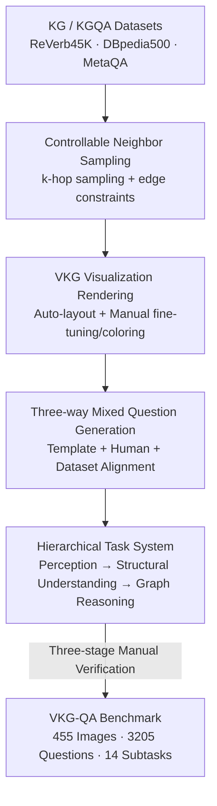

# VKG-QA: Visual Knowledge Graph-based Question Answer for Large Multimodal Models

**Conference**: CVPR 2026  
**Paper**: [CVF Open Access](https://openaccess.thecvf.com/content/CVPR2026/html/Du_VKG-QA_Visual_Knowledge_Graph-based_Question_Answer_for_Large_Multimodal_Models_CVPR_2026_paper.html)  
**Code**: https://github.com/sq413/VKG-QA (Available)  
**Area**: Multimodal VLM  
**Keywords**: Visual Knowledge Graph, Multimodal Benchmark, Structured Reasoning, Large Multimodal Models, Graph Understanding

## TL;DR
By **visualizing Knowledge Graphs as images** and tasking Large Multimodal Models (LMMs) with "looking at the graph" for question answering, the authors constructed the VKG-QA benchmark covering 3 categories, 14 subtasks, and 3,205 questions. Evaluations of 19 LMMs reveal that current models generally struggle to "understand graph structures," with structural perception (degree, direction, connectivity) being the most prominent weakness. Closed-source models significantly outperform open-source counterparts.

## Background & Motivation

**Background**: Knowledge Graphs (KGs) are structured knowledge representations describing entities and relations, widely used in QA, recommendation, and scientific discovery. Integrating KGs into LMMs to enhance factuality and reasoning is a current hot topic. The dominant approach is to "linearize" the graph into textual triple sequences (e.g., `(Safari, comes with, OS X)`) to feed into LLMs.

**Limitations of Prior Work**: Linearization flattens **high-order relational cues** within the graph. Once relations become a long sequence of triples, models must reconstruct the topology mentally, often failing on multi-hop questions. They must manually assemble scattered triples back into a graph and then reason along paths, a process made fragile by tokenized representations.

**Key Challenge**: The value of a KG lies precisely in its **graph structure** (connectivity, directionality, degree, cycles, components), whereas textual sequences naturally lose this spatial and topological information. Current benchmarks evaluate either natural image recognition or unstructured visual reasoning, but **no systematic evaluation exists for whether models can "understand a rendered knowledge graph."**

**Goal**: (1) Propose a new paradigm—**visualizing KGs as images** to leverage the visual-spatial capabilities of LMMs for perceiving and reasoning over graph structures; (2) Create a benchmark to measure these capabilities at a fine-grained level; (3) Identify exactly where current LMMs fail in "visualized structural reasoning."

**Key Insight**: Inspired by the strong generalization of LMMs on vision-language tasks, the authors hypothesize that **images are better suited than text for carrying graph structures**. Spatial distribution of nodes, edge directions, and cycles are "visible at a glance" in images, sparing models from textual topological reconstruction. This intuition aligns with the concept of DeepSeek-OCR compressing text into images.

**Core Idea**: Replace "linearized triples + textual reasoning" with "rendered KG images + visual question answering." Construct a benchmark progressing from pixel-level perception to logical reasoning to probe the true limits of LMMs in structured visual understanding.

## Method

The "Method" involves a **semi-automatic, human-in-the-loop benchmark construction pipeline**: extracting subgraphs from large KGs → rendering them into Visual Knowledge Graph (VKG) images → generating three categories of QA pairs → manual verification. The result is 455 VKG images, 3,205 questions, and 14 subtasks.

### Overall Architecture

The input consists of existing KG/KGQA datasets (ReVerb45K, DBpedia500, MetaQA), and the output is a QA evaluation set with standard answers. The process entails three steps: **Step 1 Graph Generation** (subgraph extraction + rendering), **Step 2 Question Generation** (template/human/dataset alignment), and **Step 3 Manual Verification** (semantic alignment, visual clarity, logical consistency). Tasks are organized progressively: Perception → Structural Understanding → Graph Reasoning.

### Key Designs

**1. Controllable Neighbor Sampling: Balancing Density and Information**

Randomly sampling subgraphs from large KGs leads to results that are either too sparse or too dense for human/model legibility. The authors perform $k$-hop ($k=1,2,3$) neighbor sampling around a center entity, limiting the number of nodes per hop. Subgraphs are discarded if they are too sparse or dense to maintain **balanced visual complexity**. For directed KGs, the original topology is strictly preserved. To control readability, a linear constraint is applied to the number of edges:

$$|E| = w \times |V|$$

where $|E|$ is the number of edges, $|V|$ is the number of nodes, and $w \in \{1.2, 1.3, 1.5\}$. For reasoning tasks, the subgraph centers on the **question entity** from MetaQA, explicitly **preserving the reasoning path to the answer entity** to ensure local context and logic chains remain intact.

**2. Visual Rendering: Turning Abstract Topology into Legible Images**

To ensure the models can perceive the graph, the authors use interactive rendering (pyvis) for initial layout, followed by **manual fine-tuning of node positions and edge alignments** to minimize overlaps and increase spatial separability. Nodes within the same subgraph are **colored differently** to enhance visual expressiveness (supporting "color recognition" subtasks). This step is foundational: if rendering is ambiguous (unclear edges or directions), the benchmark cannot measure actual reasoning capability.

**3. Hierarchical Three-Category, 14-Subtask System: Decoupling Perception and Reasoning**

To determine whether a model fails due to "not seeing the graph" or "failing to reason," the tasks are structured into three levels:

- **General Image Understanding (900 questions, 28%)**: Color recognition, existence judgment, basic counting, spatial location, text extraction. These are pixel-level perception tasks without structural semantics.
- **Graph Structural Understanding (1985 questions, 62%)**: Degree analysis, relationship direction, cycle detection, connectivity assessment. These test the perception of topological/geometric properties.
- **Graph-based Reasoning (320 questions, 10%)**: 1-hop, multi-hop, superlative, and conditional reasoning. 1-hop/multi-hop questions are sourced from MetaQA, while higher-order reasoning is manually annotated from DBpedia500.

**4. Three-way Question Generation + Three-stage Manual Verification**

To balance scale and quality, three strategies are used: **Template Generation** (e.g., "Which node connects to {node} via {edge}?"), **Expert Human Design** (for complex structural semantics), and **Dataset Alignment** (extracting QA pairs from MetaQA). A rigorous manual verification stage follows to ensure **Semantic Alignment**, **Visual Clarity**, and **Logical Consistency**, correcting ambiguous phrasing or incorrect labels.

## Key Experimental Results

### Main Results

19 LMMs were evaluated in a zero-shot setting using their default prompts and accuracy as the metric. Representative results for the 14 subtasks are shown below:

| Model | Color | Degree | Direction | Connectivity | Multi-hop | Avg. |
|------|------|------|------|--------|------|------|
| GPT-5 (Closed) | 93.4 | 77.5 | 92.1 | 94.4 | 86.7 | **85.6** |
| Gemini-2.5-pro (Closed) | 98.3 | 74.7 | 94.4 | 82.1 | 87.5 | 84.0 |
| Gemini-2.5-flash (Closed) | 97.1 | 66.9 | 92.6 | 69.8 | 78.3 | 79.0 |
| Qwen2.5-VL-72B (Open) | 67.1 | 48.7 | 80.6 | 53.4 | 68.3 | 63.1 |
| GLM-4.5V (Open) | 87.1 | 48.5 | 87.5 | 27.2 | 75.8 | 62.7 |
| Qwen2.5-VL-7B (Open) | 69.2 | 35.3 | 74.1 | 21.0 | 59.2 | 51.4 |
| Gemma-3-12B (Open) | 19.2 | 30.0 | 62.0 | 43.8 | 63.3 | 42.3 |

Three conclusions: (1) **LMMs generally struggle**: Even GPT-5 scores only 85.6%, while open-source models fall below 65%. (2) **Large gap between closed and open-source**: Closed-source models are more robust on structure-heavy tasks like degree analysis. (3) **Structural understanding is the bottleneck**: Even for top models, degree analysis remains difficult compared to reasoning.

### Visual vs Text Comparison

A subset of 760 questions was tested by replacing images with equivalent textual triples:

| Subtask | GPT-5 (LMM · Visual) | GPT-5-chat (LLM · Text) | Gain |
|--------|---------|----------|----------|
| Connectivity | 94.6 | 56.6 | **+38.0** |
| Degree | 82.1 | 77.4 | +4.7 |
| 1-hop Reasoning | 100 | 89.7 | +10.3 |
| Average (Avg.) | **88.8** | 77.1 | +11.7 |

Visual input consistently outperforms textual input in structural tasks, particularly in connectivity (+38%), proving that rendered graphs provide a more intuitive encoding of topology.

### Key Findings

- **Perception errors are the primary failure mode**: Error analysis of GPT-4o shows that **83.0% of failures are perception-based** (misidentifying edges, directions, or spatial positions), while reasoning errors accounts for only 12.8%. This suggests the bottleneck is "visual grounding."
- **Performance degrades with hop count**: Scores drop as hop count increases from 1 to 3, but closed-source models exhibit a much shallower decline than open-source ones.
- **Scaling helps structural understanding, not basic perception**: Increasing Qwen2.5-VL from 7B to 72B significantly improved structural understanding and reasoning, but perception accuracy remained nearly saturated.

## Highlights & Insights
- **The "Visualize for VQA" paradigm is ingenious**: It addresses the fundamental flaw of linearized triples—loss of topology. Visualizing KGs leverages LMMs' spatial perception to bypass the fragility of mental reconstruction from text, evidenced by the +38% gain in connectivity.
- **Decoupled evaluation is reusable**: Separating perception from reasoning allows for precise error attribution. This methodology can be transferred to other domains like chart understanding or circuit diagram analysis.
- **"83% perception errors" is a clear signal**: It indicates that the bottleneck for LMMs on structured images lies in the visual encoder's ability to ground fine-grained edges and directions accurately.

## Limitations & Future Work
- **Diagnostic benchmark, not a new method**: The paper focuses on diagnosis without proposing a new algorithm to fix the identified issues (e.g., specific graph-aware visual pre-training).
- **Visualization rendering as a variable**: Performance depends on rendering quality (layout, color). The sensitivity of models to different rendering styles was not systematically explored.
- **Graph scale is limited**: Subgraphs are kept small for human readability. Whether the conclusions extend to massive, dense KGs with hundreds of nodes remains unknown.

## Related Work & Insights
- **vs Text-based KG-augmented LLMs**: Traditional methods use textual sequences; this work uses images. While text remains strong for long-chain symbolic reasoning, images are vastly superior for capturing topological structures.
- **vs General Multimodal Benchmarks (MMMU, etc.)**: Unlike benchmarks focusing on natural scenes or expert knowledge, VKG-QA specifically targets "rendered structural knowledge," filling a gap in structured multimodal reasoning evaluation.

## Rating
- Novelty: ⭐⭐⭐⭐ The "visualized KG" paradigm is fresh and the visual vs. text comparison is compelling.
- Experimental Thoroughness: ⭐⭐⭐⭐ 19 LMMs across 14 subtasks; however, error analysis sample size was small.
- Writing Quality: ⭐⭐⭐⭐ Clear motivation and hierarchical structure.
- Value: ⭐⭐⭐⭐ Provides a scalable platform for graph-perception evaluation and identifies "visual grounding" as the key future research direction.

<!-- RELATED:START -->

## Related Papers

- [\[CVPR 2026\] VinQA: Visual Elements Interleaved Long-form Answer Generation for Real-World Multimodal Document QA](vinqa_visual_elements_interleaved_long-form_answer_generation_for_real-world_mul.md)
- [\[CVPR 2026\] StaR-KVQA: Structured Reasoning Traces for Implicit-Knowledge Visual Question Answering](star-kvqa_structured_reasoning_traces_for_implicit-knowledge_visual_question_ans.md)
- [\[CVPR 2026\] 4DP-QA: Scalable QA for 4D Perception in Vision Language Models](4dp-qa_scalable_qa_for_4d_perception_in_vision_language_models.md)
- [\[ACL 2026\] WikiSeeker: Rethinking the Role of Vision-Language Models in Knowledge-Based Visual Question Answering](../../ACL2026/multimodal_vlm/wikiseeker_rethinking_the_role_of_vision-language_models_in_knowledge-based_visu.md)
- [\[CVPR 2026\] GraphVLM: Benchmarking Vision Language Models for Multimodal Graph Learning](graphvlm_benchmark_vlm_graph_learning.md)

<!-- RELATED:END -->
