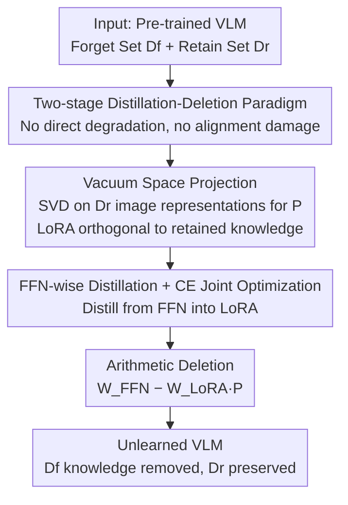

# VL-Eraser: Vacuum Distillation for Machine Unlearning in Vision-Language Models

**Conference**: CVPR 2026  
**Paper**: [CVF Open Access](https://openaccess.thecvf.com/content/CVPR2026/html/Wang_VL-Eraser_Vacuum_Distillation_for_Machine_Unlearning_in_Vision-Language_Models_CVPR_2026_paper.html)  
**Code**: TBD  
**Area**: Multimodal VLM / Machine Unlearning / AI Safety  
**Keywords**: Machine Unlearning, Vision-Language Models, Cross-modal Alignment, LoRA, Knowledge Distillation

## TL;DR
VL-Eraser points out that traditional "reverse-training" unlearning in VLMs primarily destroys cross-modal alignment rather than truly removing knowledge. It reformulates unlearning as a two-stage "distillation-then-deletion" process: first, distilling the targeted knowledge into a set of LoRAs under "vacuum space" constraints, and then subtracting these LoRAs from the original model to achieve cleaner deletion while preserving model utility.

## Background & Motivation
**Background**: Machine Unlearning (MU) aims to erase the influence of specific private, copyrighted, or sensitive data from a model without retraining from scratch. The dominant approach is **reverse-training**: optimizing pre-training objectives in reverse on the forget set $D_f$ (e.g., Gradient Ascent GA, KL divergence minimization, Negative Preference Optimization NPO) to intentionally degrade performance on that data. These methods are relatively mature for unimodal tasks.

**Limitations of Prior Work**: The effectiveness of reverse-training is questionable for Vision-Language Models (VLMs). VLM capabilities depend on two factors: (1) **accurate knowledge** within individual modules, and (2) **reliable alignment** between modalities. When reverse-training lowers performance on $D_f$, it is unclear whether it erases knowledge or merely disrupts the alignment between the vision encoder and the language model. Using probes like "Where does Donald Trump live?", the authors found that while the model seemingly "fails to answer" multimodal questions, the unlearning quality barely improves when probed with **text-only questions** or after **reloading the original projection layers**. This suggests that most "unlearning" stems from damaged alignment rather than true knowledge deletion, posing a **knowledge leakage risk**.

**Key Challenge**: Reverse-training achieves unlearning by "degrading performance," but in VLMs, this degradation first harms the fragile cross-modal alignment. Once alignment is broken, either excessively high loss causes early stopping, or the language model continues to be "trained" on low-quality data from a misaligned vision encoder. Both scenarios hinder true knowledge removal.

**Goal**: Design an unlearning paradigm that does not rely on destroying alignment, achieving both clean deletion (low residual knowledge on the forget set) and high utility (minimal performance drop on retain/real sets).

**Key Insight**: Instead of performing "subtraction by degradation" directly on the original model, it is better to **isolate the knowledge to be forgotten into an external module** and then subtract that module entirely, leaving the original model's alignment structure untouched.

**Core Idea**: Reformulate unlearning as a "**Distillation $\to$ Deletion**" process—first distill knowledge from the FFN into a LoRA under "vacuum space" constraints, then subtract the LoRA from the original model using parameter arithmetic: $W_{\text{FFN}} - W_{\text{LoRA}}P$.

## Method

### Overall Architecture
VL-Eraser decomposes VLM unlearning into two sequential stages. **Stage 1: Vacuum Distillation**: A set of LoRAs is attached to the Feed-Forward Networks (FFN, the primary knowledge store in Transformers) of each VLM block. The frozen FFN acts as the "teacher" and the LoRA as the "student" to distill target knowledge from the forget set $D_f$. Simultaneously, a "vacuum space" projection matrix $P$, estimated from the retain set $D_r$, constrains the LoRA to directions orthogonal to retained knowledge. **Stage 2: Arithmetic Deletion**: The distilled LoRA is treated as an "expert in forget knowledge" and subtracted from the original FFN: $W_{\text{unlearned}} = W_{\text{FFN}} - W_{\text{LoRA}}\cdot P$. The orthogonality of the vacuum space ensures that retained knowledge remains largely unaffected.

### Key Designs

**1. Two-stage "Distill-then-Delete" Paradigm: Isolating instead of Degrading**
The pain point is that reverse-training in VLMs inevitably damages fragile cross-modal alignment, leading to "superficial unlearning." VL-Eraser avoids actively degrading model performance during training. It does not perform reverse optimization on original parameters but instead "moves" the knowledge to be forgotten into an external LoRA (Stage 1) and then "excises" it (Stage 2). The optimization objectives (distillation loss + cross-entropy) aim to **approximate/replicate** the forget knowledge within the LoRA rather than destroy the original model, keeping the alignment structure intact.

**2. Vacuum Space Projection: Automatic Filtering via Left Null Space Orthogonality**
Precisely isolating "forget knowledge" from entangled VLM parameters is difficult; naive distillation might also capture retained knowledge. The authors constrain distillation to the **vacuum space (left null space)** of retained knowledge. A matrix $Y$ is in the vacuum space of $X$ if $YX = 0$. Projecting the student parameters $W_{\text{LoRA}}$ into the vacuum space of retained representations $H_r$ ensures:
$$\text{Proj}_{vacuum}(W_{\text{LoRA}})\cdot H_r = 0,$$
making the LoRA naturally orthogonal to retained knowledge. In practice, visual inputs drive most representation variance in VLM tasks, so the vacuum space is estimated using only retain set images: SVD is performed on pooled image representations $H_{image}$, and the projection matrix $P = \hat U\hat U^\top$ is constructed from eigenvectors corresponding to zero singular values.

**3. FFN-wise Distillation Loss + CE Joint Optimization**
To ensure the LoRA successfully captures knowledge from the FFN, the authors propose an **FFN-wise distillation loss** that maximizes the cosine similarity between the "teacher FFN output" and the "projected LoRA output" per block:
$$L^l_{Distill}=\frac{1}{S}\sum_{s=1}^{S}\Big(1-\frac{(W^l_{\text{FFN}}H_{l,s})^\top (W^l_{\text{LoRA}}P_l H_{l,s})}{\lVert W^l_{\text{FFN}}H_{l,s}\rVert_2\,\lVert W^l_{\text{LoRA}}P_l H_{l,s}\rVert_2}\Big),$$
and $L_{Distill}=\frac{1}{N}\sum_l L^l_{Distill}$ across all blocks. A standard **cross-entropy loss** $L_{CE}$ for next-token prediction is added to maintain knowledge fidelity. The total objective is $L_{Total}=\lambda L_{Distill}+(1-\lambda)L_{CE}$. 

**4. Arithmetic Deletion: Parameter Subtraction for Precise Unlearning**
After distillation, unlearning is achieved via simple parameter arithmetic: $W_{\text{unlearned}}=W_{\text{FFN}}-W_{\text{LoRA}}\cdot P$. For forget samples $H_f$, $(W_{\text{FFN}}-W_{\text{LoRA}}P)H_f\to 0$, effectively excising the knowledge. For retain samples $H_r$, the projection ensures $W_{\text{LoRA}}P H_r\approx 0$, so $(W_{\text{FFN}}-W_{\text{LoRA}}P)H_r\to W_{\text{FFN}}H_r$, leaving retained knowledge unharmed.

### Loss & Training
- **Total Objective**: $L_{Total}=\lambda L_{Distill}+(1-\lambda)L_{CE}$, where $\lambda$ balances distillation and fidelity.
- **Vacuum Space Estimation**: SVD is performed only on $D_r$ image representations for efficiency.
- **Scope**: LoRAs are applied only to FFNs. Optimization occurs only on $D_f$, while $D_r$ is used only for **inference** to obtain representations, making the training cost significantly lower than methods requiring fine-tuning on $D_r$.

## Key Experimental Results
The benchmark is **MLLMU-Bench** (synthetic profiles). Backbones include **LLaVA-1.5-7B** and **Qwen2-VL-7B-Instruct**. Evaluation metrics cover classification (Acc), generation (ROUGE-L), and cloze (Acc) across Forget/Retain/Real sets.

### Main Results
LLaVA-1.5-7B, 5% Forget, Visual-QA:

| Method | Classification Forget↓ | Classification Retain↑ | ROUGE Forget↓ | ROUGE Retain↑ | Cloze Forget↓ | Cloze Retain↑ |
|------|------|------|------|------|------|------|
| Vanilla | 51.2 | 47.9 | 0.570 | 0.494 | 27.1 | 26.3 |
| GA | 39.4 | 39.7 | 0.392 | 0.418 | 21.2 | 19.2 |
| NPO | 41.9 | 42.1 | 0.510 | 0.415 | 17.4 | 21.8 |
| MMUnlearner | 32.6 | 41.9 | 0.462 | 0.458 | 22.4 | 24.6 |
| **VL-Eraser** | **26.2** | **43.4** | **0.256** | **0.473** | **13.4** | **25.8** |

VL-Eraser achieves the lowest Forget scores (cleanest deletion) while maintaining Retain scores closest to the Vanilla model. The advantage is even more pronounced in Textual-QA, confirming that traditional methods fail to remove knowledge within the language model.

### Ablation Study
LLaVA-1.5-7B, 5% Forget, Visual-QA:

| Config | Classification Forget↓ | Classification Retain↑ | ROUGE Retain↑ | Cloze Retain↑ | Description |
|------|------|------|------|------|------|
| Vanilla | 51.2 | 47.9 | 0.494 | 26.3 | Original model |
| w/o Vacuum | 25.4 | 36.6 | 0.385 | 18.4 | Forget increases but Retain plummets |
| w/o $L_{Distill}$ | 38.4 | 42.6 | 0.445 | 22.2 | Unlearning significantly weakened |
| w/o $L_{CE}$ | 32.6 | 44.7 | 0.458 | 24.8 | Insufficient unlearning |
| **VL-Eraser** | 26.2 | 43.4 | 0.473 | 25.8 | Best balance |

### Key Findings
- **Vacuum space is critical for utility**: Without it, Retain drops from 43.4 to 36.6 because unconstrained distillation erases non-target knowledge due to generalization.
- **Both losses are indispensable**: $L_{CE}$ ensures knowledge fidelity while $L_{Distill}$ aligns parameter distributions; missing either weakens unlearning.
- **High Efficiency**: Training time for VL-Eraser (465s) is comparable to NPO (451s), whereas methods requiring $D_r$ fine-tuning (e.g., MMUnlearner) take $\sim$8163s ($\sim$20$\times$).

## Highlights & Insights
- **Diagnostic Value**: The insight that "unlearning $\neq$ performance degradation" in VLMs is highly valuable. The authors prove that traditional unlearning mostly artifacts from damaged alignment via textual probes and projection reloading.
- **Vacuum Space as an Elegant Tool**: Using the algebraic property $YX=0$ to decouple "forget/retain" knowledge is more robust than "soft weighting" with losses. It is a mechanism-level guarantee that the deletion does not touch retained knowledge.
- **Separation before Excision**: Reformulating unlearning as a deterministic parameter subtraction makes the process more controllable compared to optimization routines that require careful early stopping.

## Limitations & Future Work
- **Image-only Vacuum Estimation**: Whether text-related retained knowledge is fully protected by this image-based projection remains to be verified for text-heavy tasks.
- **Synthetic Data**: Evaluations are limited to MLLMU-Bench synthetic profiles; real-world privacy or copyright scenarios with more entangled knowledge require further testing.
- **Scalability and Robustness**: The study focuses on 5–10% forget ratios; the impact of sequential/incremental unlearning and the robustness against "re-learning" attacks after arithmetic deletion are unexplored.

## Related Work & Insights
- **vs. GA/NPO (Reverse-training)**: These methods directly degrade performance on $D_f$, whereas VL-Eraser isolates and removes knowledge. VL-Eraser avoids alignment collapse, resulting in lower residual knowledge in Textual-QA.
- **vs. MMUnlearner**: Both target VLM-specific parameters, but MMUnlearner requires fine-tuning on $D_r$ (20$\times$ cost). VL-Eraser achieves comparable or better results with much lower cost.
- **vs. CLIPErase/SIU**: Earlier methods were often tailored to specific datasets or associations (e.g., CLIP's image-text pairs). VL-Eraser provides a backbone-agnostic two-stage paradigm effective for LLaVA and Qwen2 architectures.

## Rating
- Novelty: ⭐⭐⭐⭐⭐ 
- Experimental Thoroughness: ⭐⭐⭐⭐ 
- Writing Quality: ⭐⭐⭐⭐ 
- Value: ⭐⭐⭐⭐⭐ 

<!-- RELATED:START -->

## Related Papers

- [\[CVPR 2026\] Towards Reasoning-Preserving Unlearning in Multimodal Large Language Models](towards_reasoning-preserving_unlearning_in_multimodal_large_language_models.md)
- [\[CVPR 2026\] VL-RouterBench: A Benchmark for Vision-Language Model Routing](vl-routerbench_a_benchmark_for_vision-language_model_routing.md)
- [\[CVPR 2026\] Which Concepts to Forget and How to Refuse? Decomposing Concepts for Continual Unlearning in Large Vision-Language Models](which_concepts_to_forget_and_how_to_refuse_decomposing_concepts_for_continual_un.md)
- [\[CVPR 2026\] Multimodal Distribution Matching for Vision-Language Dataset Distillation](multimodal_distribution_matching_for_vision-language_dataset_distillation.md)
- [\[CVPR 2026\] Uncertainty-Aware Knowledge Distillation for Multimodal Large Language Models](uncertainty-aware_knowledge_distillation_for_multimodal_large_language_models.md)

<!-- RELATED:END -->
