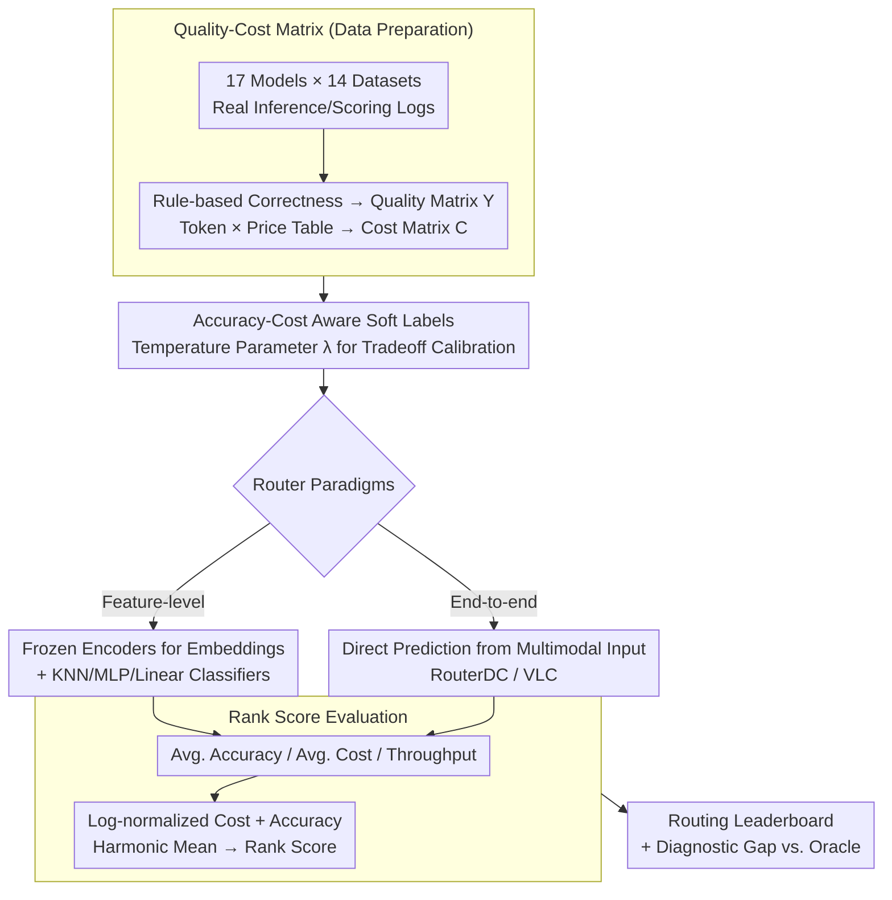

# VL-RouterBench: A Benchmark for Vision-Language Model Routing

**Conference**: CVPR 2026  
**arXiv**: [2512.23562](https://arxiv.org/abs/2512.23562)  
**Code**: [https://github.com/VL-RouterBench](https://github.com/VL-RouterBench)  
**Area**: Multimodal VLM  
**Keywords**: Model routing, VLM, benchmark, efficiency-quality tradeoff, multi-model selection

## TL;DR
This paper introduces VL-RouterBench, the first systematic routing benchmark for Vision-Language Models (VLMs), covering 14 datasets, 17 candidate models, and 519,180 sample-model pairs. It evaluates 10 routing methods and reveals a significant performance gap between the current optimal routers and the ideal Oracle.

## Background & Motivation
**Background**: Multi-model routing has evolved from engineering optimization to critical infrastructure. Different VLMs exhibit significant differences in inference cost and capabilities; no single model can simultaneously guarantee performance and efficiency across all request types. While routing research in the LLM domain is mature (RouterBench, RouterEval, RouterArena, etc.), the VLM domain lacks systematic benchmarks.

**Limitations of Prior Work**: VLM routing faces multiple unique challenges: (a) highly diverse task types (VQA, visual reasoning, chart OCR, etc.) emphasizing different abilities; (b) multimodal fusion mechanisms remain an open problem with significant variance in modal interaction and semantic representation; (c) visual-specific issues such as semantic density and cross-modal alignment.

**Key Challenge**: Existing LLM routing benchmarks focus on text and cannot directly adapt to VLM scenarios—defining "the optimal routing decision" for VLMs is more difficult within a unified framework.

**Goal**: Construct a specialized VLM routing benchmark providing a unified data preparation, training, and evaluation pipeline to promote reproducibility and comparability in VLM routing research.

**Key Insight**: Build a quality-cost matrix starting from raw inference and scoring logs of VLMs, and design an accuracy-cost-aware soft-label training strategy.

**Core Idea**: Establish the first VLM routing benchmark covering 30,540 samples × 17 models, providing a complete pipeline from data to evaluation.

## Method

### Overall Architecture
VL-RouterBench addresses the problem of determining which VLM should handle a given "image + question" request to achieve the best balance between accuracy and inference cost. The benchmark decomposes this into a reproducible pipeline: first, collect real inference logs from 17 candidate models across 14 datasets to build an offline quality-cost matrix; second, use this matrix to train routers using soft labels with a temperature parameter to continuously adjust between "accuracy-centric" and "cost-centric" preferences; finally, compare 10 routing methods using unified metrics (Average Accuracy, Average Cost, Throughput, and Rank Score). Evaluated routers span two paradigms: **Feature-level** (extracting embeddings from frozen text/vision encoders followed by lightweight classifiers like KNN/MLP/Linear) and **End-to-end** (e.g., RouterDC, VLC, which predict directly from multimodal inputs).

### Key Designs

**1. Quality-Cost Matrix: Offline Encoding of Correctness and Cost**

Training and evaluation require knowing if a model is correct and how much it costs for every sample. Correctness is determined via rule-based evaluation (option matching for multiple-choice or string matching for open-ended questions) to obtain the 0/1 quality matrix $Y$. Cost is calculated using input/output token counts from logs multiplied by public pricing: $C_{i,j} = n_{i,j}^{in} \cdot c_j^{in} + n_{i,j}^{out} \cdot c_j^{out}$, forming the cost matrix $C$. This ensures consistency across different experimental runs.

**2. Accuracy-Cost Aware Soft Labels: Continuous Tradeoff via $\lambda$**

Hard labels (assigning a single optimal model) fail to capture the continuous tradeoff between accuracy and cost. Routing training is formulated as a multi-objective optimization problem, yielding analytical soft labels through Lagrangian multipliers:

$$t_i^{(\lambda)}(j) = \frac{\mathbf{1}\{Y_{i,j}=1\} \cdot \exp(-\lambda \cdot C_{i,j})}{\sum_{j:Y_{i,j}=1} \exp(-\lambda \cdot C_{i,j})}$$

Probability is distributed only among models that answer correctly ($Y_{i,j}=1$), weighted exponentially by cost. When $\lambda=0$, it distributes probability equally among correct models (accuracy-only); as $\lambda \to \infty$, probability concentrates on the cheapest correct model.

**3. Rank Score: Unifying Accuracy and Cost into a Single Metric**

Since accuracy (percentage) and cost (USD) have different scales, they cannot be directly compared. Cost is log-normalized to a $[0,100]$ interval ($C_{norm}$) and combined with average accuracy $\bar{A}$ using a weighted harmonic mean:

$$S(\beta) = \frac{(1+\beta)\cdot\bar{A}\cdot C_{norm}}{\beta\cdot\bar{A}+C_{norm}}$$

The harmonic mean ensures that poor performance in either metric significantly penalizes the total score, with $\beta$ determining the relative importance of accuracy.

## Key Experimental Results

### Main Results——Comparison of Routing Methods

| Router | Avg. Acc.↑ | Avg. Cost↓ | Rank Score↑ | Rank |
|--------|-----------|-----------|------------|------|
| Oracle | 95.60 | $0.37 | 93.68 | 0 |
| Strongest | 78.01 | $2.72 | - | - |
| RouterDC (1st) | - | - | Highest | 1 |
| VLC (2nd) | - | - | - | 2 |
| MLP (3rd) | - | - | - | 3 |

### Ablation Study——Modality Fusion

| Fusion Method | Description |
|---------|------|
| Text Features Only | Suboptimal; lacks visual discriminative signals |
| Visual Features Only | Weakest; lacks task instruction information |
| Normalized Concatenation | Optimal; simple and effective |

### Key Findings
- **Significant Routing Gains**: Learned routing systems generally provide more stable accuracy than any single model at comparable or lower costs.
- **Multimodal Feature Effectiveness**: Simple normalized concatenation of text and visual embeddings supports highly competitive routers, consistently outperforming unimodal approaches.
- **Gap with Oracle**: A clear gap remains between the best routers and the Oracle, suggesting room for improvement in utilizing visual cues and modeling textual structures.
- **Model Coverage**: Includes 17 candidate models (1B to 78B parameters), spanning two orders of magnitude in scale.

## Highlights & Insights
- **First VLM Routing Benchmark**: Fills a gap in systematic routing evaluation for VLMs with a complete pipeline (data $\to$ training $\to$ evaluation).
- **Mathematical Elegance of Soft Labels**: Analytical soft labels derived from Lagrangian optimization allow for continuous control of the accuracy-cost tradeoff via a single $\lambda$ parameter.
- **Diagnostic Value of the Oracle Gap**: Clearly identifies that future improvements should focus on finer visual cues and structural text modeling.

## Limitations & Future Work
- Considers only single-image inputs; does not cover multi-image or video VLM scenarios.
- Correctness evaluation is limited to rule-based matching, excluding open-ended generation tasks.
- Cost estimation is based on token counts and pricing tables, ignoring actual latency and throughput variations.
- Routers introduce additional overhead for feature extraction and classification, which may be inefficient for low-cost models.
- Does not explore the robustness of routers on out-of-distribution (OOD) data.

## Related Work & Insights
- **vs. RouterBench/RouterEval**: These focus on LLM text routing; VL-RouterBench is the first for VLMs, adding multimodal fusion evaluation.
- **vs. RouterArena**: Borrowing the Rank Score design, VL-RouterBench extends it to multimodal contexts.
- **GPT-5 Integrated Routing**: Industry trends suggest routing as a unified interface feature, highlighting the practical value of this research.

## Rating
- Novelty: ⭐⭐⭐⭐ First VLM routing benchmark.
- Experimental Thoroughness: ⭐⭐⭐⭐⭐ Comprehensive coverage across datasets, models, and methods.
- Writing Quality: ⭐⭐⭐⭐ Well-structured with clear derivations.
- Value: ⭐⭐⭐⭐ Directly applicable to efficient VLM deployment.

<!-- RELATED:START -->

## Related Papers

- [\[CVPR 2026\] VL-Eraser: Vacuum Distillation for Machine Unlearning in Vision-Language Models](vl-eraser_vacuum_distillation_for_machine_unlearning_in_vision-language_models.md)
- [\[ICLR 2026\] VL-JEPA: Joint Embedding Predictive Architecture for Vision-language](../../ICLR2026/multimodal_vlm/vl-jepa_joint_embedding_predictive_architecture_for_vision-language.md)
- [\[CVPR 2026\] µVLM: A Vision Language Model for µNPUs](mvlm_a_vision_language_model_for_mnpus.md)
- [\[CVPR 2026\] Medic-AD: Towards Medical Vision-Language Model's Clinical Intelligence](medic-ad_towards_medical_vision-language_models_clinical_intelligence.md)
- [\[CVPR 2026\] Beyond Single Images: A Comprehensive Benchmark for Album-Level Vision-Language Understanding](beyond_single_images_a_comprehensive_benchmark_for_album-level_vision-language_u.md)

<!-- RELATED:END -->
