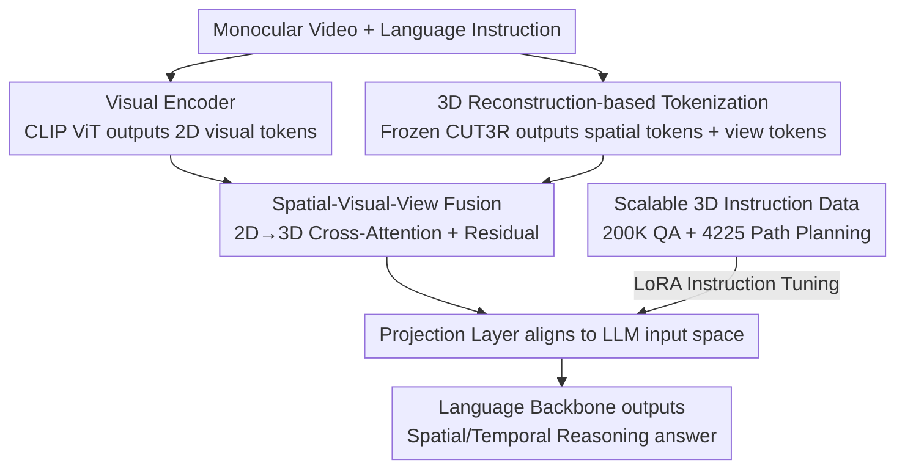

# VLM-3R: Vision-Language Models Augmented with Instruction-Aligned 3D Reconstruction

**Conference**: CVPR 2026  
**Paper**: [CVF Open Access](https://openaccess.thecvf.com/content/CVPR2026/html/Fan_VLM-3R_Vision-Language_Models_Augmented_with_Instruction-Aligned_3D_Reconstruction_CVPR_2026_paper.html)  
**Area**: Multimodal VLM  
**Keywords**: Visual Spatial Intelligence, 3D Reconstruction Instruction Tuning, Monocular Video, Spatio-temporal Reasoning, Geometric Encoder

## TL;DR
VLM-3R integrates a metric-scale feed-forward 3D reconstruction model (CUT3R) with a VLM. It extracts implicit scene geometry tokens and camera motion tokens from **pure monocular video**, which are then fused into visual features via cross-attention for instruction tuning. This allows the model to perform spatial and temporal reasoning without relying on depth sensors or pre-built point cloud maps, achieving the highest performance among open-source models on VSI-Bench and the newly proposed VSTI-Bench.

## Background & Motivation
**Background**: Large models are expanding from 2D images/videos to 3D scenes, aiming to approach human visual spatial intelligence—estimating distance, judging orientation, remembering layouts, and planning routes. Current mainstream approaches fall into two categories: one relies on depth sensors (RGB-D) to provide 3D geometry during tuning and inference; the other use off-the-shelf SLAM/reconstruction algorithms for **offline pre-building** of explicit 3D maps (usually point clouds), which are then aligned or fed into the language model.

**Limitations of Prior Work**: Neither path is easily scalable. Dependency on depth sensors locks models into specific sensor-equipped environments, rendering massive amounts of monocular video unusable; dependency on offline pre-built maps turns the method into a multi-stage slow pipeline, making it slow to react and difficult to perform real-time reasoning in new scenes. More critically, traditional reconstruction (and some new geometric Transformers like VGGT) outputs **normalized depth**, losing real-world scale. "Scale ambiguity" causes **metric-related** reasoning, such as "how many meters is this table from the camera" or "how large is this object," to fail, which in turn contaminates the VLM's spatial understanding.

**Key Challenge**: There is a sacrifice of either scalability (tied to sensors/offline pipelines) or metric accuracy (using lightweight geometric encoders with normalized depth). Spatial intelligence requires being "end-to-end from raw video" while remaining "scale-aware," two requirements that have not been simultaneously satisfied.

**Goal**: To build an end-to-end, scale-aware VLM that directly understands scene geometry, camera motion, and spatial relationships from image sequences **without any intermediate reconstruction steps during inference**, while also leveraging the common sense of language models to assist in spatial and embodied reasoning.

**Key Insight**: The authors bet on CUT3R—a multi-view geometric model that can **directly regress globally aligned, metric-scale** 3D structures from monocular video. Its implicit latents have already compressed "geometry + camera viewpoint," avoiding sparse, irregularly sized, and hard-to-encode explicit point clouds.

**Core Idea**: Replace explicit depth/point cloud inputs with CUT3R's implicit 3D tokens (scene tokens + camera view tokens). These are injected into the VLM via cross-attention, followed by alignment tuning using 200,000 3D reconstruction instruction data entries—"treating metric-scale reconstruction as an implicit token poured into the language model."

## Method

### Overall Architecture
The input to VLM-3R is a monocular video sequence $\{I_t\}_{t=1}^{N}$ (each frame $I_t \in \mathbb{R}^{H\times W\times 3}$) and a language instruction, and the output is a text response to spatial/temporal questions. Built upon a standard VLM architecture (here based on LLaVA-NeXT-Video), it features two parallel encoding branches: a native **Visual Encoder** (CLIP ViT) providing 2D appearance tokens, and a **Geometric Encoder** (frozen CUT3R) providing metric-scale scene geometry tokens and camera pose tokens. The two branches are fused in the **Spatial-Visual-View Fusion** module using 2D→3D cross-attention, then passed through a projection layer to align with the LLM's input space, concatenated with instruction tokens, and fed into the language backbone. The entire system is fine-tuned using supervised instruction tuning, but both the visual and geometric encoders remain frozen, with only the fusion attention blocks and projection layers (LoRA) being trained.

### Key Designs

**1. 3D Reconstruction-based Tokenization: Compressing metric-scale geometry into implicit tokens, bypassing sparse point clouds**

To address the issue that "explicit point clouds are sparse, token counts vary per frame, and are hard to encode," VLM-3R does not feed point clouds directly but instead utilizes CUT3R’s **intermediate implicit representation**. CUT3R processes video frame-by-frame: the current frame $I_t$ passes through an image encoder to obtain feature tokens $F_t = f_{enc}(I_t)$; then $F_t$, along with a learnable pose query token $z$ and the previous recurrent state $s_{t-1}$, is sent to the decoder $f_{dec}$ to obtain the updated state, context-rich image tokens $F'_t$, and pose-related tokens $z'_t$:

$$[z'_t, F'_t],\ s_t = f_{dec}([z, F_t],\ s_{t-1})$$

The reconstruction heads would normally decode $F'_t, z'_t$ into 3D point maps $P_{map_t}$ and relative camera poses $T_t$, but the authors discard these explicit outputs. Instead, they directly use the enriched **spatial tokens $F'_t$ (scene context) and camera view tokens $z'_t$ (camera motion)** as 3D reconstruction tokens. Crucially, CUT3R outputs **metric-scale** (rather than normalized) geometry, which fundamentally lowers the alignment difficulty for spatial instructions like "how many meters" or "how large"—this is exactly why it outperforms VG-LLM or Spatial-MLLM which use normalized depth. To ensure token alignment between the visual and geometric encoders, input images are scaled to $432\times432$, and weights for both encoders are frozen throughout.

**2. Spatial-Visual-View Fusion: Injecting 3D priors into 2D appearance via cross-attention with residuals to preserve appearance**

Having 3D tokens is not enough—they must be merged with the VLM's native visual tokens without washing out appearance information. The spatial tokens and view tokens are concatenated into a unified 3D representation $Z_{3D} = \text{Concat}(F'_t, z'_t)$. Then, the VLM's visual tokens $H_v$ serve as the query, and $Z_{3D}$ acts as the key/value in a cross-attention mechanism:

$$H_{attn} = \text{softmax}\!\left(\frac{(H_v W_Q)(Z_{3D} W_K)^T}{\sqrt{d_k}}\right)(Z_{3D} W_V)$$

where $W_Q, W_K, W_V$ are learnable projections. To "inject 3D priors while retaining original appearance," a residual connection yields enriched visual representations $H'_v = H_v + H_{attn}$. $H'_v$ then passes through two projection layers to align with the LLM space, concatenated with instruction tokens $[H'_v; H_{instruct}]$ for the backbone. This design allows each 2D visual token to "query" the 3D tokens for needed geometric/viewpoint information, while the residual ensures semantic appearance is not overwritten—unifying appearance, geometric priors, and camera viewpoints into a single set of tokens for joint reasoning. Integrating view tokens also helps the model **decouple the camera's self-motion from relative object relationships**, which is key to its strength in temporal tasks.

**3. Scalable 3D Reconstruction Instruction Data Pipeline: Expanding from 5K manual labels to 200K+ auto-generated entries**

Architecture requires data reinforcement. VSI-Bench contains only about 5,000 human-labeled QA pairs, insufficient for training robust spatial reasoning. The authors built a highly automated data pipeline: for open-source datasets like ScanNet, ScanNet++, and ARKitScenes that include 3D geometry, semantics, and instance metadata, they first construct a **spatio-temporal scene graph**—each frame is a temporal node, and each object instance is a node with global/local coordinates and semantic attributes. Thus, precise relationships between instances and the camera at any moment can be retrieved, allowing for the automatic generation of QA covering seven of the eight tasks in VSI-Bench. Path planning tasks use the **Habitat simulator**: an agent follows navigation instructions through discrete actions (turn/forward/stop), sampling thousands of feasible paths and generating text descriptions based on the agent's position, orientation, visible objects, and traveled segments, resulting in 4,225 QA entries following the VSI-Bench format. In total, over 200,000 spatial reasoning QA pairs were generated. The pipeline strictly follows the official train/test splits of source datasets to prevent leakage.

**4. VSTI-Bench: The first benchmark for testing "camera-motion-induced spatio-temporal changes"**

To push evaluation from static 3D understanding to temporal dynamics, the authors created the Vision-Spatial-Temporal Intelligence benchmark (VSTI-Bench), featuring approximately 138.6K QA. Its clever design uses **static** scenes where all perceived motion comes from **camera movement**, thereby cleanly testing whether the "model can infer changes in spatial relationships over time caused by camera motion." Tasks are divided into three categories: Camera Dynamics (49.6%, including displacement and movement direction), Camera-Object Interaction (38.4%, including absolute/relative distances), and Relative Object Position (12.0%). QA are also auto-generated from spatio-temporal scene graphs. Metrics include Accuracy for multiple-choice questions (MCA) and Mean Relative Accuracy for numerical questions (NA):

$$\text{MRA} = \frac{1}{10}\sum_{\theta \in \{0.5, 0.55, \dots, 0.95\}}\mathbb{1}\big(|\hat{y}-y|/y < 1-\theta\big)$$

This measures prediction proximity across multiple tolerance levels, offering more stability than a single threshold.

### Loss & Training
The training goal follows the language modeling objective of LLaVA-NeXT-Video. For efficient adaptation, **LoRA** (rank 128, scale 256) is used for fine-tuning. The visual encoder and CUT3R spatial encoder are frozen; only the 3D fusion attention blocks and projection layers (plus an alignment block) are updated. Training is conducted for 1 epoch on NVIDIA H200s.

## Key Experimental Results

### Main Results

VSI-Bench (Eight spatial reasoning tasks, open-source models ranked by Avg):

| Method | Avg | Abs.Dist | Room Size | Rel.Dir | Obj.Count |
|------|-----|----------|-----------|---------|-----------|
| Gemini-2.5 Pro (Closed-source) | 51.5 | 34.9 | 64.3 | 47.8 | 43.8 |
| Spatial-MLLM-4B | 47.0 | 34.8 | 63.1 | 46.2 | 65.3 |
| VG-LLM-4B | 47.3 | 37.8 | 55.2 | 45.6 | 66.0 |
| LLaVA-NeXT-Video-7B (Baseline 2D) | 35.6 | 14.0 | 47.8 | 42.4 | 48.5 |
| LLaVA-Next-Video-7B (Tuned with Ours) | 57.7 | 43.6 | 70.8 | 68.9 | 70.6 |
| **VLM-3R (7B)** | **60.9** | **49.4** | **67.1** | **80.5** | 70.2 |

VLM-3R ranks first among open-source models, even surpassing the closed-source Gemini-2.5 Pro (60.9 vs 51.5). Compared to the 2D-only baseline, absolute distance improved from 20.2 to 49.4, room size from 12.3 to 67.1, and relative direction from 42.4 to 80.5 (one of the largest gains).

VSTI-Bench (Temporally-aware spatial reasoning):

| Method | Avg | Cam.Displace | Cam.Mov.Dir | Cam-Obj Rel.Dist |
|------|-----|--------------|-------------|------------------|
| Human Level | 77.0 | 51.4 | 46.8 | 94.3 |
| Gemini-2.5 Pro (Closed-source) | 42.4 | 29.2 | 8.0 | 60.7 |
| LLaVA-NeXT-Video-72B | 44.0 | 32.3 | 10.5 | 50.9 |
| LLaVA-NeXT-Video-7B (Baseline) | 40.0 | 28.2 | 1.8 | 55.6 |
| **VLM-3R (7B)** | **58.8** | **39.4** | **39.6** | **68.6** |

On temporal tasks, the 7B VLM-3R (58.8) significantly outperforms the 72B baseline (44.0). Performance on camera movement direction rocketed from 1.8 to 39.6—confirming the critical role of view tokens in "decoupling camera motion."

### Ablation Study

| Configuration | Key Finding | Description |
|------|---------|------|
| 2D-only Baseline | VSI-Bench Avg 35.6 | Visual tokens only, no 3D geometry |
| 2D Tuned only with Ours | Avg 57.7 | The data pipeline contributes significant independent gains |
| Full VLM-3R | Avg 60.9 | Integration of data + 3D token fusion |
| + Mix 30K General Video | Video-MME 59.9→62.1 (+2.2pp) | General video understanding barely degrades |

### Key Findings
- **Data and Architecture provide independent gains**: Fine-tuning the 2D baseline with only the 200K spatial data pulled VSI-Bench Avg from 35.6 to 57.7; adding the 3D reconstruction token fusion further increased it to 60.9. This suggests "data generation" and "geometric injection" address separate areas and are additive.
- **View tokens are essential for temporal reasoning**: Temporal tasks (especially camera movement direction) showed the sharpest gains (1.8 to 39.6), validating that explicitly listing camera view tokens helps the model separate "camera in motion" from "relative object relationships."
- **Matching models using ground-truth depth with monocular video**: On ScanQA and SQA3D, VLM-3R is competitive with Video-3D LLM and LLaVA-3D, which require GT depth, proving that implicit metric reconstruction is sufficient.
- **Adding domain data does not hurt general capability**: After mixing in 30K general videos, Video-MME accuracy actually rose to 62.1%, within 1pp of original LLaVA-NeXT-Video; it also generalizes well on OST-Bench for online embodied exploration (unseen during training).

## Highlights & Insights
- **The choice of "implicit tokens over explicit point clouds" is critical**: Using the intermediate representations $F'_t, z'_t$ from the CUT3R decoder avoids sparse/variable-length/hard-to-encode point clouds while retaining metric scale—this selection was decisive in outperforming models using normalized depth.
- **Minimalist tuning with frozen dual encoders**: Using LoRA to update only attention and projection layers for 1 epoch keeps the cost of "adding 3D capability" very low, making it friendly for reproduction and transfer.
- **Clever benchmark design with "static scene + moving camera"**: VSTI-Bench deliberately keeps scenes static so all motion is camera-driven, cleanly isolating "temporal spatial reasoning" for evaluation; it's transferable to any embodied task measuring self-motion understanding.
- **Data pipeline driven by a unified spatio-temporal scene graph**: Using frames as temporal nodes and instances as spatial nodes allowed seven types of spatial QA and five types of temporal QA to be derived from a single graph, a "scene graph as intermediate representation" concept that can be reused for other large-scale spatial labeling needs.

## Limitations & Future Work
- **Dependency on CUT3R reconstruction quality**: The entire spatial capability is built on the frozen geometric encoder; failures of CUT3R in reflective, textureless, or highly dynamic scenes propagate directly to the VLM, and frozen weights prevent the model from correcting these.
- **Training data is entirely static indoor scenes**: QA originates from ScanNet-related datasets (static, handheld cameras). Generalization to truly dynamic scenes with moving objects or outdoor/large-scale environments is not fully verified.
- **Metric sensitivity**: NA tasks use MRA, and different benchmarks vary in difficulty and protocol; absolute numerical values across tables should not always be directly compared. Reproduction baseline discrepancies also suggest environment sensitivity.
- **Future Directions**: Allow geometric encoders to participate in training (partial unfreezing or distillation) to adapt to new domains; introduce reconstruction of truly dynamic objects; explore lighter view token expressions to reduce token overhead for long videos.

## Related Work & Insights
- **vs. LLaVA-3D / ROSS3D**: They rely on RGB-D spatial QA with depth supervision. Ours requires no depth sensors or pre-built maps, using pure monocular video end-to-end for better scalability at the cost of dependency on feed-forward reconstruction quality.
- **vs. Spatial-MLLM / VG-LLM**: Also integrates geometric tokens via Geometric Transformers (VGGT), but VGGT only outputs normalized depth lacking global metric scale, restricting metric-related reasoning (distance, object size). Ours switches to metric-scale CUT3R, which is the root cause for substantial leads in absolute distance and room size tasks.
- **vs. SLAM/Offline Reconstruction + LLM pipelines**: Those methods pre-build explicit point clouds for the LLM; they are slow for new scenes and sensitive to scale, risking irreversible damage to spatial understanding. Ours implements reconstruction as implicit tokens requiring no extra steps during inference.
- **vs. VSI-Bench**: This work not only sets new SOTAs on it but also fills the missing temporal dimension (VSTI-Bench) and automatically expands its ~5K data scale to 200K+.

## Rating
- Novelty: ⭐⭐⭐⭐ Connecting metric-scale feed-forward reconstruction implicit tokens to a VLM is a clear and effective combination innovation, along with a new benchmark for camera motion temporal reasoning.
- Experimental Thoroughness: ⭐⭐⭐⭐⭐ Covers VSI/VSTI/OST/ScanQA/SQA3D/Video-MME benchmarks, includes ablation of data vs. architecture, and comparisons with depth-supervised models.
- Writing Quality: ⭐⭐⭐⭐ Architecture and data pipelines are explained clearly with complete formulas; some benchmark details are scattered in appendices.
- Value: ⭐⭐⭐⭐⭐ "Spatial intelligence from monocular video without sensors/pre-built maps" is highly valuable for embodied AI and robotics; the data pipeline and benchmarks are reusable.

<!-- RELATED:START -->

## Related Papers

- [\[CVPR 2026\] G$^2$VLM: Geometry Grounded Vision Language Model with Unified 3D Reconstruction and Spatial Reasoning](g2vlm_geometry_grounded_vision_language_model_with_unified_3d_reconstruction_and.md)
- [\[CVPR 2026\] RE-VLM: Event-Augmented Vision-Language Model for Scene Understanding](re-vlm_event-augmented_vision-language_model_for_scene_understanding.md)
- [\[CVPR 2026\] Harmonious Parameter Adaptation in Continual Visual Instruction Tuning for Safety-Aligned MLLMs](harmonious_parameter_adaptation_in_continual_visual_instruction_tuning_for_safet.md)
- [\[CVPR 2026\] R4: Retrieval-Augmented Reasoning for Vision-Language Models in 4D Spatio-Temporal Space](r4_retrieval-augmented_reasoning_for_vision-language_models_in_4d_spatio-tempora.md)
- [\[CVPR 2026\] Abstract 3D Perception for Spatial Intelligence in Vision-Language Models](abstract_3d_perception_for_spatial_intelligence_in_vision-language_models.md)

<!-- RELATED:END -->
