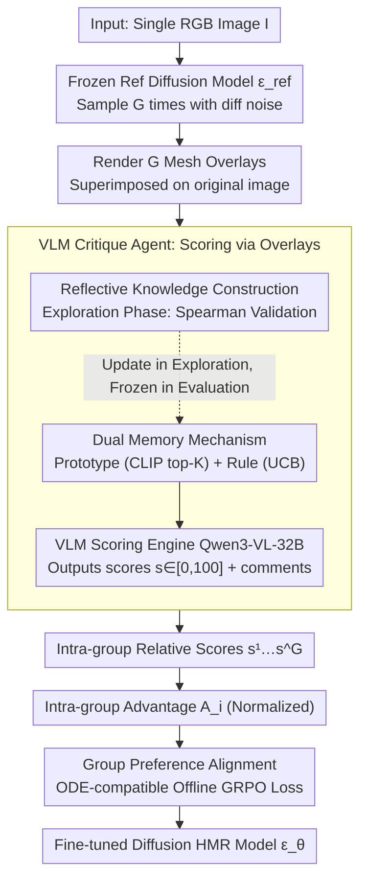

# VLM-Guided Group Preference Alignment for Diffusion-based Human Mesh Recovery

**Conference**: CVPR2026  
**arXiv**: [2602.19180](https://arxiv.org/abs/2602.19180)  
**Institution**: Nanyang Technological University, HKUST(GZ), SenseTime Research, A*STAR
**Code**: To be confirmed  
**Area**: Multimodal VLM  
**Keywords**: Human Mesh Recovery, diffusion model, VLM, GRPO, Preference Alignment, Critique Agent

## TL;DR

A VLM-based dual-memory self-reflective Critique Agent is proposed to generate group-level preference signals for diffusion-based human mesh recovery. The diffusion model is fine-tuned via Group Preference Alignment, significantly improving HMR accuracy in in-the-wild scenarios without 3D annotations.

## Background & Motivation

Monocular Human Mesh Recovery (HMR) is an inherently ill-posed problem: a single 2D image can correspond to multiple 3D poses. Existing methods fall into three categories:

- **Optimization Methods** (e.g., SMPLify): Iterative optimization but prone to local optima.
- **Regression Methods** (e.g., HMR, HybrIK): Directly predict a single result, unable to handle depth/occlusion ambiguity.
- **Probabilistic Methods** (e.g., ScoreHypo, ADHMR): Generate multiple hypotheses but often at the cost of accuracy.

While diffusion-based HMR methods can generate diverse hypotheses, they suffer from two key flaws:

1. **Inconsistency between prediction and input**: Generated 3D meshes often deviate from 2D image evidence, especially in occluded and complex scenes.
2. **Unreliable DPO guidance**: The HMR-Scorer used by ADHMR scores based only on 2D joint features, which is easily deceived by poses that match contours but are physically implausible. Furthermore, DPO only performs pairwise comparisons, ignoring the quality relationships among multiple predictions within a group.

## Core Problem

How to provide high-quality preference supervision signals for diffusion-based HMR, enabling the model to learn to generate physically plausible and image-consistent human meshes on in-the-wild data lacking 3D ground truth?

## Method

### Overall Architecture

This paper addresses a specific challenge: while diffusion HMR can sample multiple 3D meshes from one image, identifying the most reliable one is difficult. Previous scorers (e.g., ADHMR's HMR-Scorer) only consider 2D joints and are often misled by poses that project correctly but are physically impossible. DPO also wastes relative information among a group of predictions by only using pairwise comparisons. The pipeline replaces the scorer with a more credible "judge" and feeds its judgment back into the diffusion model.

Specifically: A frozen reference diffusion model first samples $G$ times per image to obtain a set of diverse mesh predictions. These are rendered as overlays on the original image and passed to a VLM Critique Agent, which assigns relative scores to the group like a human expert. Finally, these scores are converted into intra-group advantages to fine-tune the diffusion model using an offline GRPO objective that preserves ODE sampling efficiency. Meshes with high scores are pushed toward lower denoising loss, while low-scored ones are pushed away. The entire loop requires no 3D ground truth, making it applicable to in-the-wild data.

### Key Designs

**1. VLM Critique Agent: Expert-like Scoring via Image Overlays**

Traditional scorers regress a score from 2D joint coordinates, failing to detect interpenetration or incorrect depth relationships. This leads to being misled by "projectively correct but 3D implausible" poses. Ours changes the input: each predicted mesh is rendered as an overlay on the original image. Given RGB image $I$ and $n$ overlays $\{\hat{I}_j\}_{j=1}^n$, the VLM (backbone **Qwen3-VL-32B**) outputs scores $s_j \in [0, 100]$ and comments $c_j$. Since judgment occurs in pixel space, the agent utilizes VLM visual semantic priors to identify errors like self-penetration, limb misalignment, and depth inversion invisible to 2D scorers.

**2. Dual Memory Mechanism: Rule and Prototype Memories with UCB Balancing**

To prevent scoring instability, the VLM is equipped with two complementary external memories:

| Memory Type | Content | Data Structure | Function |
|---------|---------|---------|------|
| **Rule Memory** $\mathcal{M}_R$ | Evaluation rule texts | $(t_i, T_i, N_i^u, N_i^s)$: Rule text, semantic tag, usage count, success count | Provides general criteria |
| **Prototype Memory** $\mathcal{M}_P$ | Typical evaluated cases | $(v_i, r_i, T_i)$: CLIP visual embedding, reasoning with score, semantic tag | Provides reference cases |

Each scoring step involves two retrieval paths. Prototype retrieval uses the CLIP embedding $v_q$ of the query image to find top-$K$ historical cases in $\mathcal{M}_P$. Rule retrieval selects rules via a hybrid score $\Psi_i$:

$$\Psi_i = \mathrm{R}(T_q, T_i) + \mathrm{U}_i$$

Where $\mathrm{R}(T_q, T_i) = |T_q \cap T_i|$ is semantic relevance. $\mathrm{U}_i$ uses the Upper Confidence Bound (UCB) logic from multi-armed bandits to give under-utilized/unverified rules a chance to appear:

$$\mathrm{U}_i = \rho_i + C\sqrt{\frac{\log N_{\text{total}}}{N_i^u + 1}}$$

$\rho_i = N_i^s / N_i^u$ is the historical success rate. This biases toward high-success rules while avoiding starvation of potentially effective new rules. Retrieved rules and prototypes are dynamically concatenated into the prompt.

**3. Reflective Knowledge Construction: Agent-driven Rule Distillation**

Memories are not handcrafted but cultivated by the agent during an **exploration phase**. For a batch of data with GT metrics: the agent scores using dual memory; typical case embeddings and reasoning are written to $\mathcal{M}_P$. Rule updates are performed—if the Spearman rank correlation between agent scores and GT metrics exceeds threshold $\tau$, the rule is "successful" ($N_i^s+1$). Crucially, the VLM performs "new rule mining" by comparing its output with GT to propose 1–2 new rules for $\mathcal{M}_R$. Memories are frozen during evaluation for consistency.

**4. Group Preference Alignment: ODE Efficiency with GRPO Signals**

GRPO typically aligns LLM stochastic decoding, but diffusion HMR often uses deterministic ODE samplers (e.g., DDIM). Directly adopting GRPO with SDE sampling would require training along the entire trajectory, which is expensive. This work extracts the **"relative advantage from a group" semantics of GRPO while maintaining ODE sampling**. The dataset is sampled offline. Relative quality is converted to advantage weights to adjust the model. Using a frozen reference model $\epsilon_{\text{ref}}$, $G$ samples per image are generated to obtain:

$$\{s^1, \ldots, s^G\} = \mathcal{C}_{\text{VLM}}(I, \mathbf{m}^1, \ldots, \mathbf{m}^G)$$

This creates an automated preference dataset $\mathcal{G}_{\text{HMR}} = \{(I, (\mathbf{m}^1, s^1), \ldots, (\mathbf{m}^G, s^G))\}$.

### Loss & Training

The training objective is derived in three steps. First, scores $\{s^i\}_{i=1}^G$ are normalized into intra-group advantages:

$$A_i = \frac{s_i - \text{mean}(\{s_i\}_{i=1}^G)}{\text{std}(\{s_i\}_{i=1}^G)}$$

Second, the sampling is viewed as a conditional policy $p_\theta(\mathbf{m} | \mathbf{c})$, yielding an advantage-weighted log-likelihood ratio objective:

$$\mathcal{L}(\theta) = -\mathbb{E}_{\mathbf{c}, \{\mathbf{m}^i\}} \left[\sum_{i=1}^G A(\mathbf{m}^i) \log \frac{p_\theta(\mathbf{m}^i | \mathbf{c})}{p_{\text{ref}}(\mathbf{m}^i | \mathbf{c})}\right]$$

Third, using Diffusion-DPO reparameterization to replace the ratio with denoising losses:

$$\log \frac{p_\theta(\mathbf{m}^i | \mathbf{c})}{p_{\text{ref}}(\mathbf{m}^i | \mathbf{c})} \approx T\lambda_t \mathbb{E}_{t, \epsilon}[L_{\text{DM}}^{\text{ref}}(\mathbf{x}_t^i, \epsilon) - L_{\text{DM}}^\theta(\mathbf{x}_t^i, \epsilon)]$$

Resulting in the final loss:

$$\mathcal{L}(\theta) = \mathbb{E}_{\mathbf{m} \sim \mathcal{G}_{\text{HMR}}, t, \epsilon} \; \beta T \lambda_t \sum_{i=1}^G \left[A(\mathbf{m}^i)(L_{\text{DM}}^\theta(\mathbf{x}_t^i, \epsilon) - L_{\text{DM}}^{\text{ref}}(\mathbf{x}_t^i, \epsilon))\right]$$

## Key Experimental Results

### Main Results (Selected Tab.1)

| Method | Type | M | 3DPW MPJPE↓ | 3DPW PA-MPJPE↓ | H36M MPJPE↓ | H36M PA-MPJPE↓ |
|------|------|---|------------|----------------|------------|----------------|
| ScoreHypo | Prob | 100 | 63.0 | 37.6 | 38.4 | 26.0 |
| ADHMR | Prob | 100 | 57.2 | 33.5 | 36.9 | 24.8 |
| **Ours** | Prob | 100 | **52.5** | **31.5** | **35.0** | **23.9** |
| **Ours†** | Prob | 100 | **49.9** | **31.9** | **34.3** | **23.5** |

- Ours vs ADHMR (M=100): 3DPW MPJPE reduced by 8.2% (57.2→52.5).
- Ours† using InstaVariety in-the-wild data (preference signals only) further reduces 3DPW MPJPE to 49.9.

### Ablation Study (Tab.2)

| Configuration | 3DPW PVE↓ | MPJPE↓ | PA-MPJPE↓ |
|-----|-----------|--------|-----------|
| Base Diffusion | 73.4 | 63.0 | 37.6 |
| + SFT | 70.2 | 61.3 | 36.5 |
| DPO + Critique Agent | 63.9 | 53.1 | 33.4 |
| Ours w/o Critique Agent (HMR-Scorer) | 65.4 | 54.9 | 34.7 |
| **Ours (Full)** | **59.5** | **49.9** | **31.9** |

- Group Alignment vs DPO: MPJPE reduced by 6.0% (53.1→49.9), validating group signals over pairwise.
- Critique Agent significantly outperforms HMR-Scorer.

### Key Findings

The removal of the self-reflection mechanism results in the largest performance drop, proving its necessity for ranking stability.

## Highlights & Insights

1. **First VLM Critique Agent for HMR**: Dual memory (Rule + Prototype) + Self-reflection provides stronger 3D awareness (identifying self-penetration/depth errors) than traditional 2D joint scorers.
2. **Elegant GRPO Migration**: Avoids expensive SDE trajectory training; allows group-level preference signal extraction while maintaining ODE sampling efficiency.
3. **In-the-wild Fine-tuning without 3D GT**: Successfully fine-tunes on datasets like InstaVariety using only relative preference signals from the agent.
4. **UCB Exploration Strategy**: Automatically balances rule utilization and exploration using multi-armed bandit principles.

## Limitations & Future Work

1. **VLM Inference Cost**: Qwen3-VL-32B is computationally expensive for large-scale preference dataset construction.
2. **Exploration Phase Dependency**: Rule learning still requires 3D ground truth from synthetic or lab data.
3. **Group Size Sensitivity**: Impact of group size ($G$) beyond 20 is not fully explored.
4. **Single-person Support**: Restricted to the SMPL single-person model.

## Related Work & Insights

- **vs ADHMR**: ADHMR uses DPO with a 2D-joint-based scorer. Ours provides 3D-aware scores and group-level alignment.
- **vs ScoreHypo**: ScoreHypo selects the best hypothesis but does not refine the generative distribution.
- **vs GRPO for Diffusion** (DAPO, D-GRPO): These methods require online SDE rollout; ours uses offline GRPO with ODE.

## Rating

- Novelty: ⭐⭐⭐⭐
- Experimental Thoroughness: ⭐⭐⭐⭐
- Writing Quality: ⭐⭐⭐⭐
- Value: ⭐⭐⭐⭐

<!-- RELATED:START -->

## Related Papers

- [\[ACL 2025\] OmniAlign-V: Towards Enhanced Alignment of MLLMs with Human Preference](../../ACL2025/multimodal_vlm/omnialign-v_towards_enhanced_alignment_of_mllms_with_human_preference.md)
- [\[CVPR 2026\] Diffusion Guided Chain-of-Vision for Large Autoregressive Vision Models](diffusion_guided_chain-of-vision_for_large_autoregressive_vision_models.md)
- [\[ICML 2026\] Beyond VLM-Based Rewards: Diffusion-Native Latent Reward Modeling](../../ICML2026/multimodal_vlm/beyond_vlm-based_rewards_diffusion-native_latent_reward_modeling.md)
- [\[AAAI 2026\] Towards Human-AI Accessibility Mapping in India: VLM-Guided Annotations and POI-Centric Analysis in Chandigarh](../../AAAI2026/multimodal_vlm/towards_human-ai_accessibility_mapping_in_india_vlm-guided_annotations_and_poi-c.md)
- [\[CVPR 2026\] Uncertainty-guided Compositional Alignment with Part-to-Whole Semantic Representativeness in Hyperbolic Vision-Language Models](uncertainty-guided_compositional_alignment_with_part-to-whole_semantic_represent.md)

<!-- RELATED:END -->
