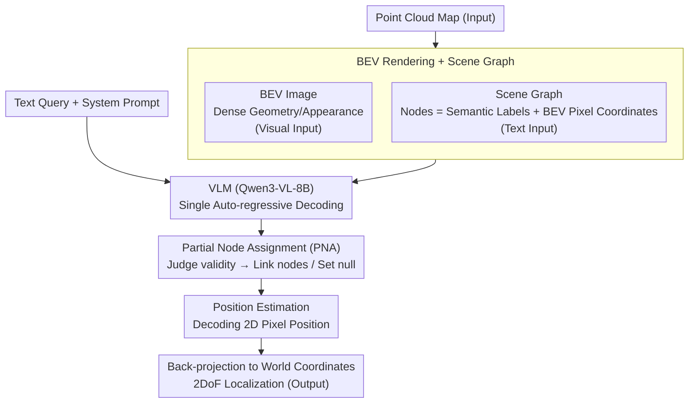

# VLM-Loc: Localization in Point Cloud Maps via Vision-Language Models

**Conference**: CVPR 2026  
**arXiv**: [2603.09826](https://arxiv.org/abs/2603.09826)  
**Code**: Yes (see paper repository)  
**Area**: Multimodal VLM  
**Keywords**: Text-to-point cloud localization, BEV, Scene graph, VLM spatial reasoning, Autonomous driving

## TL;DR
The VLM-Loc framework is proposed, which converts 3D point cloud maps into BEV images and scene graphs for structured spatial reasoning by VLMs. Combined with a Partial Node Assignment (PNA) mechanism for fine-grained text-to-point cloud alignment, it significantly outperforms previous SOTA on the self-built CityLoc benchmark with a 14.20% improvement in Recall@5m.

## Background & Motivation
**Background**: Text-to-Point Cloud (T2P) localization aims to infer precise spatial positions in 3D point cloud maps from natural language descriptions, typically applied in scenarios like Robo-taxi passengers describing surroundings to assist localization. Existing methods such as Text2Pos, Text2Loc, and CMMLoc adopt a coarse-to-fine strategy.

**Limitations of Prior Work**: (a) Sub-maps in the fine-grained localization phase are usually restricted to small, simple areas (e.g., 30m × 30m), oversimplifying actual environmental complexity; (b) Existing methods adopt an end-to-end position prediction paradigm, lacking explicit spatial reasoning, which limits localization accuracy in complex environments.

**Key Challenge**: Simple text-point cloud correspondence matching cannot effectively handle large-scale, complex spatial environments—it requires the model to interpret spatial relationships in language and connect them to the environment.

**Goal**: (a) Perform fine-grained T2P localization in larger and more complex areas; (b) Introduce explicit spatial reasoning capabilities; (c) Handle partial matching issues between text descriptions and maps.

**Key Insight**: Leverage the powerful multimodal reasoning capabilities of VLMs for spatial description understanding and localization by converting 3D point clouds into BEV images + scene graphs that VLMs can process.

**Core Idea**: Convert point clouds into BEV images + scene graphs for VLM spatial reasoning, and use the PNA mechanism to explicitly align text cues with scene graph nodes, achieving interpretable fine-grained localization.

## Method

### Overall Architecture
This paper addresses fine-grained T2P localization: given a natural language description of the surroundings (e.g., "A building is ahead, a row of cars is parked on the left"), determine the speaker's precise location in a large-scale urban point cloud map. Prior methods treated this as end-to-end position regression—encoding text and point clouds, calculating similarity, and outputting coordinates—a black-box process that struggles with large scenes and lacks interpretability.

VLM-Loc takes a different route: instead of directly "guessing coordinates," it translates the point cloud into two representations understandable by Vision-Language Models, allowing the VLM to "find objects and determine locations based on the map" like a human. Specifically, the point cloud map is rendered into a BEV top-down view (providing dense geometric layout) and extracted into a scene graph (each object is a node with a semantic label and pixel coordinates on the BEV map). The VLM (Qwen3-VL-8B-Instruct) uses the BEV image as visual input and the scene graph with system prompts and text queries as text input. Through a single auto-regressive decoding step, it performs Partial Node Assignment (PNA, determining which objects in the text correspond to which nodes) and then estimates the target's 2D pixel position, which is finally back-projected to world coordinates. The flowchart below shows the data flow from point clouds to world coordinates, with three contribution stages (BEV rendering + Scene Graph, PNA, Position Estimation) sequentially linked within the VLM's decoding.

### Key Designs

**1. BEV Rendering + Scene Graph: Translating Point Clouds into VLM-readable "Images"**

VLMs cannot directly process raw point clouds. The paper proposes two complementary conversions. The BEV image orthogonally projects the point cloud to the ground and rasterizes it into an RGB top-down image $I \in \mathbb{R}^{H \times W \times 3}$, where each object takes the average color of its points, preserving dense geometric layout and appearance. The scene graph $\mathcal{G}=(\mathcal{V},\mathcal{E})$ abstracts the scene into a discrete structure, where each node $n_i=(i, l_i, \mathbf{u}_i)$ records the index, semantic label $l_i$, and the object's pixel coordinates $\mathbf{u}_i$ on the BEV map. These two representations are complementary: BEV provides fine-grained visual cues, while the scene graph provides high-level semantics. Providing both to the VLM is more conducive to spatial reasoning than either alone (Ablation: BEV only 13.21, Scene Graph only 24.62).

**2. Partial Node Assignment (PNA): Teaching the Model to Distinguish Useful Cues from Noise**

Map coverage is finite, and objects mentioned in a description may not all fall within the current map—some are beyond boundaries or only partially visible. Forcing every text-mentioned object to match a node introduces noise. PNA performs an "availability judgment" for each mentioned object: calculating the distance between its projection center $A$ in the full map and its visible part's center $B$ in the current pose cell. If the distance is less than a threshold $\tau$, it is valid and linked to the corresponding scene graph node; otherwise, it is null. Thresholds are dynamic: 5m for countable "object" classes (e.g., car, pole) and 15m for large-area "stuff" classes (e.g., building, road), as large objects' visible centers shift more easily. This improves robustness as the model learns to judge cue reliability before use (adding PNA increased the Scene Graph performance from 24.62 to 32.34).

**3. Position Estimation: Integrating Coordinate Prediction into Single Decoding**

After node assignment, the final step is generating the position. Rather than using a separate regression head, the paper integrates position prediction into the VLM's auto-regressive decoding. The model outputs a JSON string containing matched "text phrase ↔ node" pairs and the target's 2D pixel position in the BEV coordinate system, which is then back-projected to world coordinates based on the known BEV scale. Generating correspondences and spatial coordinates in a single decoding step ensures the localization conclusion is based on identified nodes, making the reasoning chain consistent and naturally interpretable.

### A Complete Example
Consider the query: "A building is ahead of me, a row of parked cars is on the right, and a street light pole is to the front left." In the rendering stage, the point cloud of the current pose cell is projected into a BEV image and a scene graph with nodes like building#0, car#1~#4, pole#5, tree#6, and road#7. For PNA judgment: the visible center of building#0 is 4m (< 15m) from its full center, marked valid. For the cars, three are within 5m and marked valid, while one is partly outside the boundary (> 5m) and marked null. pole#5 is 6m (> 5m) away and marked null (the pole mentioned by the speaker is actually outside the map). Thus, the three text phrases map to {building#0, [car#1, car#2, car#3], null}. In position estimation, the VLM outputs these matches and provides pixel coordinates based on the "building ahead, cars right" relative orientation. The missing pole is not forced into a match, preventing it from pulling the localization in the wrong direction—demonstrating the value of PNA over "full assignment."

> ⚠️ Node numbers and distances above are illustrative examples for mechanism explanation and do not represent specific values from the original text.

### Loss & Training
The model is trained using standard auto-regressive cross-entropy loss. Fine-tuning is performed using LoRA via the Swift framework (rank=8, $\alpha=16$), updating only LoRA parameters while the vision encoder and language backbone remain frozen. Training was conducted on 8×RTX 4090 for 2 epochs.

## Key Experimental Results

### Main Results — CityLoc-K Localization Accuracy

| Method | Val R@5m | Val R@10m | Test R@5m | Test R@10m |
| :--- | :--- | :--- | :--- | :--- |
| Text2Pos | 16.48 | 40.69 | 14.62 | 38.27 |
| Text2Loc | 18.91 | 45.26 | 17.97 | 41.22 |
| CMMLoc | 20.77 | 48.65 | 21.71 | 46.67 |
| **VLM-Loc** | **36.23** | **63.66** | **35.91** | **63.81** |

### Ablation Study — Component Contributions

| Configuration | BEV | SG | PNA | Test R@5m |
| :--- | :---: | :---: | :---: | :--- |
| (a) BEV only | ✓ | ✗ | ✗ | 13.21 |
| (b) SG only | ✗ | ✓ | ✗ | 24.62 |
| (c) SG+PNA | ✗ | ✓ | ✓ | 32.34 |
| (d) BEV+SG | ✓ | ✓ | ✗ | 29.79 |
| (e) Full | ✓ | ✓ | ✓ | **35.91** |

### Key Findings
- VLM-Loc achieves 35.91% Recall@5m on the CityLoc-K test set, surpassing the strongest baseline CMMLoc by 14.20 percentage points.
- Scene graphs are more important than BEV images for localization (24.62 vs 13.21), as relational structural information is more effective than dense appearance.
- PNA contribution is significant: adding PNA improves the SG configuration by 7.72% and the full model by 6.12% compared to BEV+SG.
- Directional cues are the most critical text component: removing direction drops R@5m from 35.91% to 18.01%.
- Strong cross-domain generalization: significantly leads on CityLoc-C, which uses completely different point cloud sources (UAV aerial vs vehicle LiDAR).

## Highlights & Insights
- **Paradigm Innovation for VLM in T2P Localization**: First use of VLM spatial reasoning for T2P localization, bridging 3D and 2D VLMs via BEV+Scene Graphs.
- **Partial Node Assignment Mechanism**: Elegantly handles the practical issue of objects in text being absent from the map, improving performance by over 18% compared to full assignment.
- **Dominant Role of Directional Information**: Experiments clearly prove that directional cues are decisive for spatial reasoning, as performance nearly halves when they are removed.

## Limitations & Future Work
- Text queries are auto-generated from templates, which differs from human natural language descriptions.
- BEV rendering loses height information, which may be insufficient for scenes requiring 3D reasoning.
- LoRA fine-tuning might limit the VLM's ability to adapt to BEV domain shifts.
- While the CityLoc benchmark is larger and more complex than KITTI360Pose, it remains focused on urban environments.
- Interactive conversational localization (multi-turn refinement) has not yet been explored.

## Related Work & Insights
- **vs Text2Pos/Text2Loc/CMMLoc**: These methods directly learn text-3D correspondences without explicit reasoning; VLM-Loc significantly outperforms them using structured representation + VLM reasoning.
- **vs VLM+3D methods like 3DRS/SpatialVLM**: These focus mainly on indoor scene understanding/grounding; VLM-Loc is the first applied to large-scale outdoor localization tasks.

## Rating
- Novelty: ⭐⭐⭐⭐ Applying VLM to T2P localization is a novel direction, and the BEV+Scene Graph conversion is creative.
- Experimental Thoroughness: ⭐⭐⭐⭐ Comprehensive ablation studies, including cross-domain generalization and multiple VLM backbones.
- Writing Quality: ⭐⭐⭐⭐ Clear structure and well-defined problems.
- Value: ⭐⭐⭐⭐ Provides an effective paradigm for applying VLM spatial reasoning to localization.

<!-- RELATED:START -->

## Related Papers

- [\[CVPR 2026\] Point Cloud as a Foreign Language for Multi-modal Large Language Model](point_cloud_as_a_foreign_language_for_multi-modal_large_language_model.md)
- [\[CVPR 2026\] Mechanisms of Object Localization in Vision-Language Models](mechanisms_of_object_localization_in_vision-language_models.md)
- [\[CVPR 2025\] Generalized Few-Shot 3D Point Cloud Segmentation with Vision-Language Model](../../CVPR2025/multimodal_vlm/generalized_few-shot_3d_point_cloud_segmentation_with_vision-language_model.md)
- [\[CVPR 2026\] µVLM: A Vision Language Model for µNPUs](mvlm_a_vision_language_model_for_mnpus.md)
- [\[ICCV 2025\] Exploiting Vision Language Model for Training-Free 3D Point Cloud OOD Detection](../../ICCV2025/multimodal_vlm/exploiting_vision_language_model_for_training-free_3d_point_cloud_ood_detection_.md)

<!-- RELATED:END -->
