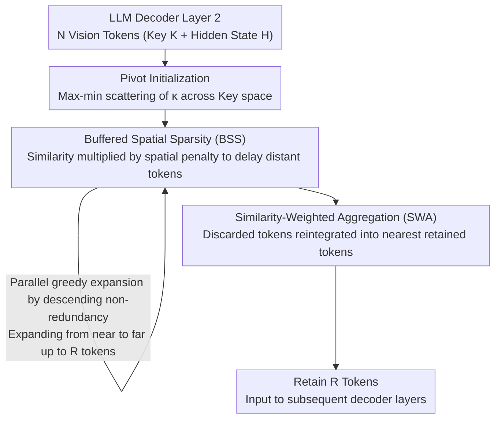

# VLM-Pruner: Buffering for Spatial Sparsity in an Efficient VLM Centrifugal Token Pruning Paradigm

**Conference**: CVPR 2026  
**arXiv**: [2512.02700](https://arxiv.org/abs/2512.02700)  
**Code**: [https://github.com/Casey-bit/VLMPruner](https://github.com/Casey-bit/VLMPruner)  
**Area**: Multimodal VLM  
**Keywords**: Vision token pruning, Inference acceleration, Spatial sparsity, Training-free, VLM efficiency

## TL;DR
VLM-Pruner is proposed as a training-free centrifugal token pruning method that balances redundancy elimination and local detail integrity through the Buffered Spatial Sparsity (BSS) criterion. It consistently outperforms existing methods across five VLMs at an 88.9% pruning rate while achieving end-to-end inference acceleration.

## Background & Motivation
**Background**: VLMs combine vision encoders with LLMs to excel in image understanding tasks. However, high-resolution images generate a massive number of vision tokens, leading to significant computational overhead due to the quadratic complexity of attention. Training-free token pruning has emerged as a mainstream solution.

**Limitations of Prior Work**: Current strategies suffer from distinct flaws: (a) **Importance-driven** methods (e.g., FastV) retain tokens based on attention scores but tend to concentrate selections in similar local regions, leading to redundancy; (b) **Redundancy elimination** methods (e.g., DivPrune/DART) greedily select tokens with the lowest similarity but ignore spatial relationships, resulting in scattered selections that fail to fully cover target object details.

**Key Challenge**: A fundamental contradiction exists between reducing redundancy (selecting highly dissimilar tokens) and maintaining local integrity (selecting spatially contiguous tokens). Excessive pursuit of diversity causes selections to jump sporadically between foreground and background.

**Goal**: Design a token pruning method that simultaneously balances redundancy elimination and spatial continuity.

**Key Insight**: Observing that target object details require spatially adjacent tokens for coverage, this work proposes a "centrifugal" selection approach—expanding outward from core points.

**Core Idea**: Through the BSS criterion, token selection prioritizes spatially proximal yet low-redundancy tokens, achieving an ordered centrifugal expansion from near to far.

## Method

### Overall Architecture
VLM-Pruner addresses specific pain points: existing training-free pruning either clusters tokens by attention (causing redundancy) or jumps between foreground and background via greedy similarity (failing local coverage). The core mechanism is a "centrifugal" selection: first scattering mutually distant seeds across the image, then expanding outward in concentric circles to ensure retained tokens are both non-redundant and spatially continuous on objects. Integrated into the second LLM decoder layer, the process involves three stages: pivot initialization, BSS-guided greedy expansion, and information back-propagation via SWA—all without modifying VLM weights.

### Key Designs

**1. Pivot Initialization: Scattering semantic-mutually exclusive seeds to anchor centrifugal expansion**
To prevent greedy selection from being misled by isolated background noise, VLM-Pruner uses a max-min strategy to iteratively select $\kappa$ seeds. Each step selects a candidate "farthest" from the current set: $j_t = \arg\max_{j \in \mathcal{C}} \min_{j' \in \mathcal{S}_{t-1}} \|\mathbf{K}_j - \mathbf{K}_{j'}\|_2$. Notably, max-min distances are calculated in the **key** space (rather than the hidden state space used for subsequent greed). The key space has lower dimensionality and naturally refines semantic identity, reducing interference from redundant information during seeding.

**2. Buffered Spatial Sparsity (BSS) Criterion: Expanding outward from seeds rather than jumping to edges**
Pure redundancy elimination tends to be scattered because distant background tokens often have the lowest similarity and are selected first. BSS addresses this by multiplying similarity with a spatial distance "penalty factor": $\widetilde{M}_{ij} = M_{ij}(1+\lambda\bar{\delta}_i(\mathcal{S}))$, where $\bar{\delta}_i(\mathcal{S}) = \min_{j \in \mathcal{S}} D_{ij}^{(sp)} / D_{max}$ is the normalized minimum spatial distance from a candidate to the selected set. Distant tokens have their similarity significantly amplified, making them appear "more redundant" and less likely to be selected early. Intuitively, after selecting a token on a fork handle, the next selection prioritizes tokens immediately adjacent to it to complete the object line. As the selection set $\mathcal{S}$ grows, the $\bar{\delta}_i$ term monotonically decreases, ensuring the greedy objective remains submodular and the expansion stable.

**3. Similarity-Weighted Aggregation (SWA): Recycling information from discarded outer tokens**
Centrifugal expansion proceeds from center to periphery, meaning outer tokens are sacrificed first. SWA performs "information recycling": each discarded token $u$ finds its most similar retained counterpart $j^*(u) = \arg\max_{j \in \mathcal{S}} M_{uj}$ and merges its features via weighted aggregation: $\mathbf{H}_j = \beta\mathbf{H}_j + (1-\beta)\sum_{u} \alpha_{u\to j}\mathbf{H}_u$ (with $\beta=0.3$). This ensures retained tokens represent both their own semantics and the surrounding discarded context, compensating for the peripheral data loss inherent in centrifugal selection.

### Acceleration Strategy
The similarity matrix $M \in \mathbb{R}^{N \times N}$ is the primary overhead. VLM-Pruner implements three optimizations: calculating similarity using only the $q=256$ channels with the highest variance (reducing complexity from $O(N^2 d)$ to $O(N^2 q)$); parallel batch evaluation of candidates; and a threshold schedule that progresses from strict to loose ($\tau^{(0)}=0.8$, step 0.1) to block isolated distant tokens initially and relax constraints only in later stages.

## Key Experimental Results

### Main Results—LLaVA-1.5-7B at Different Pruning Rates

| Method | 192 Retained (66.7%) Avg. | 128 Retained (77.8%) Avg. | 64 Retained (88.9%) Avg. |
|------|---------------------|---------------------|---------------------|
| FastV | 96.45% | 92.95% | - |
| DART | 98.40% | 97.00% | - |
| DivPrune | 97.80% | 96.40% | - |
| **Ours** | **98.85%** | - | **Best** |

### Ablation Study

| Configuration | Effect |
|------|---------|
| w/o BSS (Pure Redundancy) | Scattered selections similar to DivPrune |
| w/o SWA | Loss of peripheral information; performance drop |
| w/o pivot (Random Init) | Uneven initial coverage |
| Full VLM-Pruner | Optimal balance |

### Key Findings
- VLM-Pruner consistently leads across 13 benchmarks and 5 VLMs, with the competitive advantage widening as the pruning rate increases.
- Retains competitiveness even at an extreme 88.9% pruning rate, validating that centrifugal selection better preserves target object details.
- Visualizations show VLM-Pruner selects tokens in dense, ordered patterns on target objects (e.g., 4 continuous tokens on a fork), whereas DivPrune/DART jump sporadically between foreground and background.
- Unlike importance-based methods, VLM-Pruner permits moderate local clustering to maintain detail integrity rather than penalizing all proximity.

## Highlights & Insights
- **Centrifugal Pruning Paradigm**: Challenges the current "importance vs. diversity" dichotomy by proposing a new direction: expanding outward from local dense coverage.
- **Mathematical Elegance of BSS**: Achieves a "proximity-first" effect through simple spatial modulation, effectively altering selection order while maintaining submodularity.
- **Training-free & Universal**: Requires no weight modification, offering a plug-and-play solution that is consistently effective across different models.

## Limitations & Future Work
- Systematic research into whether the second decoder layer is the optimal location for pruning is still needed.
- Numerous hyperparameters ($\lambda$, $\tau^{(0)}$, $\Delta\tau$, $\beta$) require more thorough sensitivity analysis.
- The method assumes spatial continuity of target objects; it may underperform in highly fragmented or heavily occluded scenes.
- Pre-calculating the similarity matrix $M$ remains an overhead that could become a bottleneck for very high-resolution inputs.
- Comparisons with training-based methods (e.g., ATP-LLaVA) are currently absent.

## Related Work & Insights
- **vs FastV/SparseVLM** (Importance-driven): VLM-Pruner avoids the redundant clustering that sometimes makes importance-based methods perform worse than random pruning.
- **vs DivPrune/DART** (Redundancy-elimination): While these pursue global diversity, they cause scattered selections. VLM-Pruner achieves ordered expansion via BSS.
- **vs MustDrop/FiCoCo** (Local penalty methods): These penalize all clustering, whereas VLM-Pruner recognizes that moderate clustering is essential for detail preservation.

## Rating
- Novelty: ⭐⭐⭐⭐ Centrifugal pruning and the BSS criterion are creative designs.
- Experimental Thoroughness: ⭐⭐⭐⭐⭐ Comprehensive assessment across 5 VLMs, 13 benchmarks, and 3 pruning rates.
- Writing Quality: ⭐⭐⭐⭐ Clear logical chain from motivation to experiment with excellent visualizations.
- Value: ⭐⭐⭐⭐ High practical utility as a training-free method with transferable design insights.

<!-- RELATED:START -->

## Related Papers

- [\[CVPR 2026\] TransPrune: Token Transition Pruning for Efficient Large Vision-Language Model](transprune_token_transition_pruning_for_efficient_large_vision-language_model.md)
- [\[CVPR 2026\] DocPrune: Efficient Document Question Answering via Background, Question, and Comprehension-aware Token Pruning](docpruneefficient_document_question_answering_via_background_question_and_compre.md)
- [\[CVPR 2026\] DUET-VLM: Dual Stage Unified Efficient Token Reduction for VLM Training and Inference](duet-vlm_dual_stage_unified_efficient_token_reduction_for_vlm_training_and_infer.md)
- [\[ACL 2026\] HiPrune: Hierarchical Attention for Efficient Token Pruning in Vision-Language Models](../../ACL2026/multimodal_vlm/hiprune_hierarchical_attention_for_efficient_token_pruning_in_vision-language_mo.md)
- [\[CVPR 2026\] HAWK: Head Importance-Aware Visual Token Pruning in Multimodal Models](hawk_head_importance-aware_visual_token_pruning_in_multimodal_models.md)

<!-- RELATED:END -->
