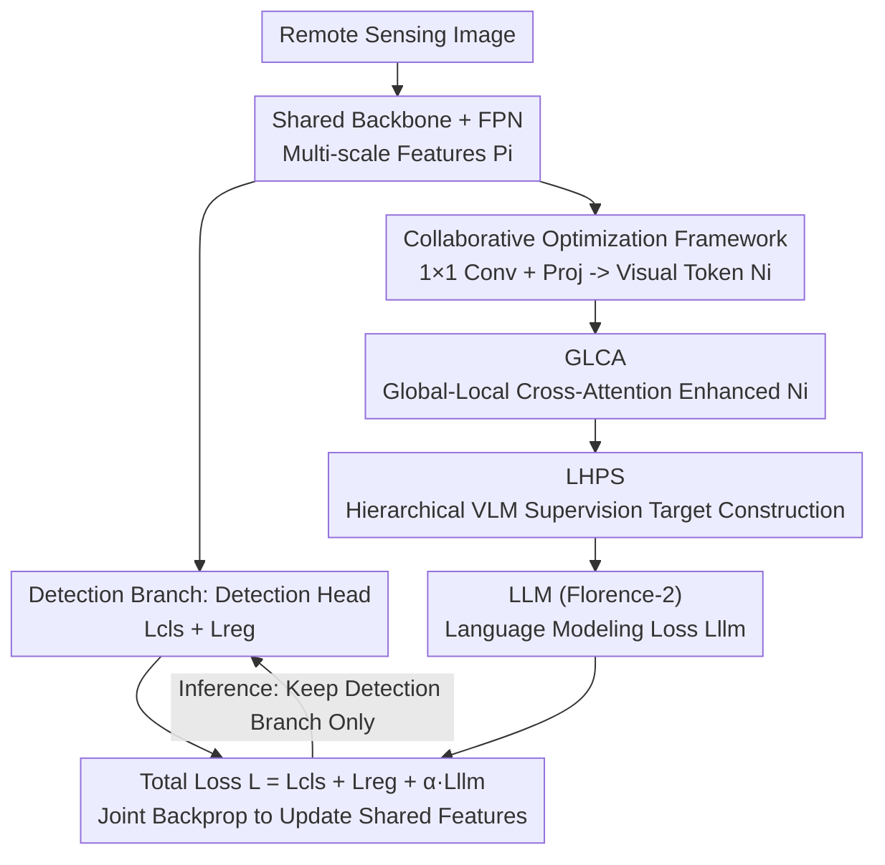

# VLM4RSDet: Collaborative Optimization with Vision-Language Model for Enhancing Remote Sensing Object Detection

**Conference**: CVPR 2026  
**Paper**: [CVF Open Access](https://openaccess.thecvf.com/content/CVPR2026/html/Shi_VLM4RSDet_Collaborative_Optimization_with_Vision-Language_Model_for_Enhancing_Remote_Sensing_CVPR_2026_paper.html)  
**Code**: https://github.com/cszzshi/VLM4RSDet (Available)  
**Area**: Remote Sensing Object Detection / Multimodal VLM  
**Keywords**: Remote Sensing Object Detection, Vision-Language Model, Collaborative Training, Dense Small Objects, Florence-2

## TL;DR
VLM4RSDet enables a conventional closed-set detector and a vision-language model (Florence-2) to share a vision backbone and perform joint backpropagation during the training phase, "distilling" VLM prior knowledge into the detector’s features. During inference, the VLM is discarded, leaving only the standard detection branch. This achieves SOTA detection accuracy with **zero additional overhead** (e.g., mAP$_{0.5:0.95}$ on VisDrone2019 improved by 7.5% over previous best methods).

## Background & Motivation

**Background**: Remote sensing object detection (satellite imagery, UAV aerial photography) has seen significant improvements in recent years regarding label assignment, scale variation, arbitrary orientation, and background noise, with closed-set (fixed category) detection accuracy steadily increasing. Another research line introduces Vision-Language Models (VLMs), which possess massive prior knowledge and contextual reasoning capabilities, theoretically helping detectors "understand" complex scenes.

**Limitations of Prior Work**: Most existing works integrating VLMs into detection (e.g., LLMDet, YOLO-World, Grounding DINO) target **open-vocabulary** scenarios. Applying them directly to closed-set remote sensing detection faces two major issues: first, their accuracy often fails to outperform modern conventional closed-set detectors; second, the reliance on large language models or extra modules results in high inference costs and deployment overhead. Thus, while VLM priors are valuable, the "usage" is suboptimal—sacrificing precision and efficiency for open-vocabulary flexibility.

**Key Challenge**: There is a natural conflict between the VLM prior knowledge required for accuracy gains and the "lightweight, no extra modules" requirement for deployment efficiency. Obtaining VLM knowledge typically requires keeping it during inference; staying lightweight usually means abandoning it.

**Goal**: To break the accuracy bottleneck of conventional closed-set remote sensing detectors using VLM prior knowledge **without increasing any inference or deployment overhead**.

**Key Insight**: The author's key observation is that the value of VLMs lies in shaping visual features during the **training phase**, rather than necessitating their presence during inference. If the detector and VLM share the same visual feature extraction network and gradients from both sides are backpropagated to these shared features during training, the VLM can "etch" its knowledge into the features. During inference, the VLM can be removed, and the remaining detector still benefits from these "better-trained" features.

**Core Idea**: A collaborative optimization framework is proposed where the VLM acts as a "feature mentor" during training rather than an inference component. Additionally, two modules (GLCA, LHPS) are introduced to enhance the VLM branch's perception and output precision specifically for dense small objects in remote sensing.

## Method

### Overall Architecture
The training workflow utilizes a "dual-branch shared backbone" structure. A remote sensing image passes through a backbone (e.g., ResNet-50) and FPN to obtain multi-scale features $P_i$ ($i=1{,}\dots{,}5$, channel 256). These $P_i$ are **simultaneously** fed into two branches: the detection branch calculates classification loss $\mathcal{L}_{cls}$ and regression loss $\mathcal{L}_{reg}$ as usual; the VLM branch converts $P_i$ into visual tokens, enhances them via GLCA, concatenates them with text prompts, and feeds them into the Florence-2 LLM to calculate the language modeling loss $\mathcal{L}_{llm}$. The three losses are weighted and **backpropagated together**, with gradients flowing back to the shared backbone and FPN. Consequently, VLM prior knowledge "permeates" the detector through shared features. During inference, the entire VLM branch is removed, running only the standard detection architecture (the red-box area in the diagram below), ensuring parameters, FLOPs, and FPS remain identical to the original detector.

Before feeding $P_i$ into the VLM, a format conversion is required: a $1{\times}1$ convolution compresses channels to $d_v{=}1024$, followed by `interpolate` and `reshape` to $\mathbb{R}^{N\times L_v\times d_v}$ ($L_v{=}32{\times}32$). Finally, a projector maps it to the LLM input dimension $d$ to obtain visual tokens $N_i$:

$$N_i = \mathrm{Proj}(\mathrm{Reshape}(\mathrm{Inter}(\mathrm{Conv}_{1\times 1}(P_i))))$$

GLCA enhances $N_i$ into $T_i^v$, which is concatenated with text features $T^t$ along the sequence dimension as $T_i=\mathrm{Concat}(T_i^v, T^t)$ for the LLM. The LLM's supervision target is a sequence of text tokens representing bounding boxes: HBB uses "category + top-left + bottom-right" coordinates, and OBB uses four vertices in clockwise order, with multiple objects separated by `<sep>`.

### Key Designs

**1. Collaborative Optimization Framework: Shared Features during Training, Detector Only during Inference**

This design directly addresses the core challenge of obtaining VLM priors without inference overhead. Conventional detectors and Florence-2-Base share multi-scale features $P_i$ extracted from the backbone+FPN. While the detector calculates $\mathcal{L}_{cls}+\mathcal{L}_{reg}$, the VLM branch treats $P_i$ as visual tokens for language modeling $\mathcal{L}_{llm}$. The total loss is:

$$\mathcal{L} = \mathcal{L}_{cls} + \mathcal{L}_{reg} + \alpha\cdot\mathcal{L}_{llm}$$

Since $\mathcal{L}_{llm}$ is significantly larger in magnitude, $\alpha$ is set to 0.05 for balance. Crucially, as gradients from the VLM branch pass through the **shared** backbone and FPN, VLM knowledge is injected into the features used by the detector. Removing the VLM branch at inference time leaves the detector structure unchanged, which is the fundamental reason for "free" VLM prior gains.

**2. GLCA (Global-Local Cross-Attention): Enhancing Features with High-Level Global Context**

Tokens $N_i$ in the VLM branch are scale-independent, lacking cross-scale context. GLCA observes that the highest layer $N_5$ in the feature pyramid naturally carries global information, while $N_i$ retains local details. GLCA treats local features $N_i$ ($i=1{,}2{,}3{,}4$) as Queries and global features $N_5$ as Keys and Values for cross-attention, adding the result back to $N_i$ residually:

$$T_i^v = \begin{cases} \mathrm{Softmax}\!\left(\dfrac{N_i N_5^{\top}}{\sqrt{d}}\right) N_5 + N_i, & i=1,2,3,4 \\[4pt] N_5, & i=5 \end{cases}$$

This injects global context into visual tokens at every scale, providing the LLM with a more complete perception. This fixes the "tunnel vision" of the VLM branch across scales at zero cost during inference.

**3. LHPS (Learnable Hierarchical Prediction Strategy): Distributing Detection Based on Object Size**

Florence-2 by default predicts all objects in an image using a **single** feature layer. However, remote sensing images have extremely high object density (over 60% of objects in VisDrone are smaller than 20 pixels), which overwhelms a single layer's output precision. LHPS adopts the FPN strategy of assigning objects of different scales to different layers. Objects are sorted by size and divided into 5 groups, assigned to multi-scale features $T_i$ ($i=1{,}\dots{,}5$). Instead of fixed counts, **learnable parameters** $\beta_i$ represent the proportion for each group, normalized and rounded up:

$$\beta_i^{\ast} = \frac{\beta_i}{\sum_{j=1}^{5}\beta_j}, \qquad M_i = \lceil \beta_i^{\ast}\times M \rceil$$

where $M$ is the total object count. This decomposes the dense object task into size-stratified sub-tasks, with ratios adapting during training.

### Loss & Training
Total loss $\mathcal{L}=\mathcal{L}_{cls}+\mathcal{L}_{reg}+\alpha\mathcal{L}_{llm}$, with $\alpha{=}0.05$. VLM uses pre-trained Florence-2-Base, visual input resized to $32{\times}32$ with 1024 channels, and a maximum token length of 2048. AI-TOD / VisDrone use SGD (momentum 0.9, weight decay 1e-4, initial lr 0.02) with 2x / 1x schedules. DOTA uses AdamW for 30 epochs. Implementation is based on MMDetection / MMRotate on 4×RTX 4090. Collaborative training requires only 12 epochs, significantly fewer than the 50 epochs needed for standalone Florence-2 fine-tuning.

## Key Experimental Results

### Main Results
Covering two HBB datasets (AI-TOD, VisDrone2019), two OBB datasets (DOTA-v1.0/v1.5), and one general dataset (MS COCO), VLM4RSDet achieves consistent gains across multiple detectors:

| Dataset | Metric | Baseline Detector | +VLM4RSDet | Gain |
|---------|--------|-------------------|------------|------|
| AI-TOD | mAP$_{0.5:0.95}$ | DetectoRS 14.8 | 28.5 | +13.7 |
| VisDrone2019 | mAP$_{0.5:0.95}$ | DetectoRS 25.7 | 31.4 | +5.7 |
| VisDrone2019 | mAP$_{0.5:0.95}$ | DN-FPN 37.8 (Prev. SOTA) | 45.3 | **+7.5** |
| DOTA-v1.0 | mAP$_{0.5}$ | LEGNet-S 80.03 | 84.07 (New SOTA) | +4.04 |
| DOTA-v1.5 | mAP$_{0.5}$ | LEGNet-S 72.89 | 78.42 | +5.53 |
| MS COCO | mAP$_{0.5:0.95}$ | Faster R-CNN 37.4 | 42.0 | +4.6 |

On DOTA-v1.0, VLM4RSDet outperforms "pure VLM detectors" like Florence-2-Base / Large by 34.90 / 29.30 points in mAP$_{0.5}$, proving that the "collaborative training + discard" strategy is superior to using VLMs directly as detectors.

### Ablation Study
Ablation on VisDrone2019 based on DetectoRS (Table 6):

| Config | mAP$_{0.5:0.95}$ | Relative |
|--------|------------------|----------|
| DetectoRS Baseline | 25.7 | — |
| + Collaborative Framework | 28.5 | +2.8 |
| + Framework + GLCA | 29.8 | +1.3 |
| + Framework + LHPS | 30.2 | +1.7 |
| + Framework + GLCA + LHPS (Full) | 31.4 | +5.7 |

Overhead Analysis (Table 8): During inference, parameters, FLOPs, and FPS for the base detectors **remain unchanged** with VLM4RSDet. Compared to fine-tuned Florence-2-Base, it saves 73.8% parameters and 74.0% FLOPs on average, while achieving 4.1 higher mAP$_{0.5:0.95}$ and 21.4 higher FPS.

### Key Findings
- **The collaborative framework is the primary driver**: The "dual-branch shared features" alone yield +2.8 mAP, exceeding the individual gains of GLCA (+1.3) and LHPS (+1.7).
- **GLCA and LHPS are complementary**: Combining them yields +5.7, suggesting they address different bottlenecks (perception vs. hierarchical output).
- **The "Free Lunch" is the core value**: It pushes the strong DN-FPN baseline up by 7.5 points with zero extra inference cost and shows stability on MS COCO (+4~5 mAP).
- **Alpha balance**: Since $\mathcal{L}_{llm}$ is much larger than detection losses, setting $\alpha$ too high allows the VLM to dominate and misguide the detector; 0.05 is the optimal balance.

## Highlights & Insights
- **"Train together, discard during inference" is a clean paradigm**: It bypasses the dilemma of carrying a heavy VLM during inference. VLM knowledge is injected into the shared features via gradients. This approach is transferable to any task where large model priors are desired but deployment weight is a concern.
- **Workflow determines the limit for Florence-2**: Using Florence-2 directly as a detector yields only 40~55 mAP$_{0.5}$, but using it as a "training mentor" pushes LEGNet to 84+. This 34-point gap proves that "distillation-style collaboration" is far more efficient than "hard-tasking as a detection head."
- **LHPS applies FPN philosophy to VLMs**: Conventionally, VLMs like Florence-2 output all boxes in one go. LHPS re-introduces hierarchical division of labor to the VLM's text output, resolving the dense small object pain point.

## Limitations & Future Work
- **Closed-set limitation**: Because the VLM is removed for inference, the flexibility of open-vocabulary detection is lost.
- **Wasted VLM inference capability**: This method provides no benefit for tasks requiring language interaction or explainable output (e.g., VQA). It is strictly a feature enhancement technique.
- **Training cost**: While inference is zero-cost and training epochs (12) are few, running dual branches during training significantly increases memory usage and reduces training FPS compared to pure detectors.
- **Fixed global context in GLCA**: Using only $N_5$ for global context is a strong assumption. Future work could explore more flexible global feature selection.

## Related Work & Insights
- **vs. Open-vocabulary VLMs (LLMDet, etc.)**: These maintain language modules during inference for flexibility, but their accuracy is lower than closed-set SOTA. Ours prioritizes closed-set accuracy and efficiency.
- **vs. Pure VLM Detectors (Florence-2, LMM-Det)**: Direct fine-tuning is heavy and less accurate for closed-set tasks. We prove "collaboration" is 34.9 mAP better on DOTA.
- **vs. Remote Sensing Detectors (LEGNet, DN-FPN)**: These improve via structural changes but lack external priors. Ours acts as a plug-in to boost them further.

## Rating
- Novelty: ⭐⭐⭐⭐ The "Collaborative train, discard inference" paradigm is clean and novel for closed-set RS detection.
- Experimental Thoroughness: ⭐⭐⭐⭐⭐ Extensive datasets (HBB+OBB+General) and multiple baselines with complete ablations.
- Writing Quality: ⭐⭐⭐⭐ Clear structure and formulas, though some LHPS grouping details are brief.
- Value: ⭐⭐⭐⭐ Plug-and-play, zero inference cost with stable gains makes it very deployment-friendly.

<!-- RELATED:START -->

## Related Papers

- [\[CVPR 2026\] CF-IPT: Cross-Modal Fusion Interactive Prompt Tuning of Vision-Language Pre-Trained Model for Multisource Remote Sensing Data Classification](cf-ipt_cross-modal_fusion_interactive_prompt_tuning_of_vision-language_pre-train.md)
- [\[CVPR 2026\] Boosting Vision-Language Models Towards Cross-Domain Incremental Object Detection](boosting_vision-language_models_towards_cross-domain_incremental_object_detectio.md)
- [\[ICLR 2026\] PhysLLM: Harnessing Large Language Models for Cross-Modal Remote Physiological Sensing](../../ICLR2026/multimodal_vlm/physllm_harnessing_large_language_models_for_cross-modal_remote_physiological_se.md)
- [\[NeurIPS 2025\] CHOICE: Benchmarking the Remote Sensing Capabilities of Large Vision-Language Models](../../NeurIPS2025/multimodal_vlm/choice_benchmarking_the_remote_sensing_capabilities_of_large_vision-language_mod.md)
- [\[CVPR 2026\] UNI-OOD: Unified Object- and Image-level Out-of-Distribution Detection via Cross-Context Attentive Vision-Language Modeling](uni-ood_unified_object-_and_image-level_out-of-distribution_detection_via_cross-.md)

<!-- RELATED:END -->
## Related Papers

- [\[CVPR 2026\] UniChange: Unifying Change Detection with Multimodal Large Language Model](unichange_unifying_change_detection_with_multimodal_large_language_model.md)
- [\[CVPR 2026\] GeoDiT: A Diffusion-based Vision-Language Model for Geospatial Understanding](geodit_a_diffusion-based_vision-language_model_for_geospatial_understanding.md)
- [\[CVPR 2026\] Rotation Invariant and Symmetry Aware Pixel Difference Network for Remote Sensing Object Detection](rotation_invariant_and_symmetry_aware_pixel_difference_network_for_remote_sensin.md)
- [\[CVPR 2026\] ORSATR-X: A Foundation Model based on Differential-and-Excitation Networks for Optical Remote Sensing Object Recognition](orsatr-x_a_foundation_model_based_on_differential-and-excitation_networks_for_op.md)
- [\[CVPR 2026\] CF-IPT: Cross-Modal Fusion Interactive Prompt Tuning of Vision-Language Pre-Trained Model for Multisource Remote Sensing Data Classification](cf-ipt_cross-modal_fusion_interactive_prompt_tuning_of_vision-language_pre-train.md)

<!-- RELATED:END -->
