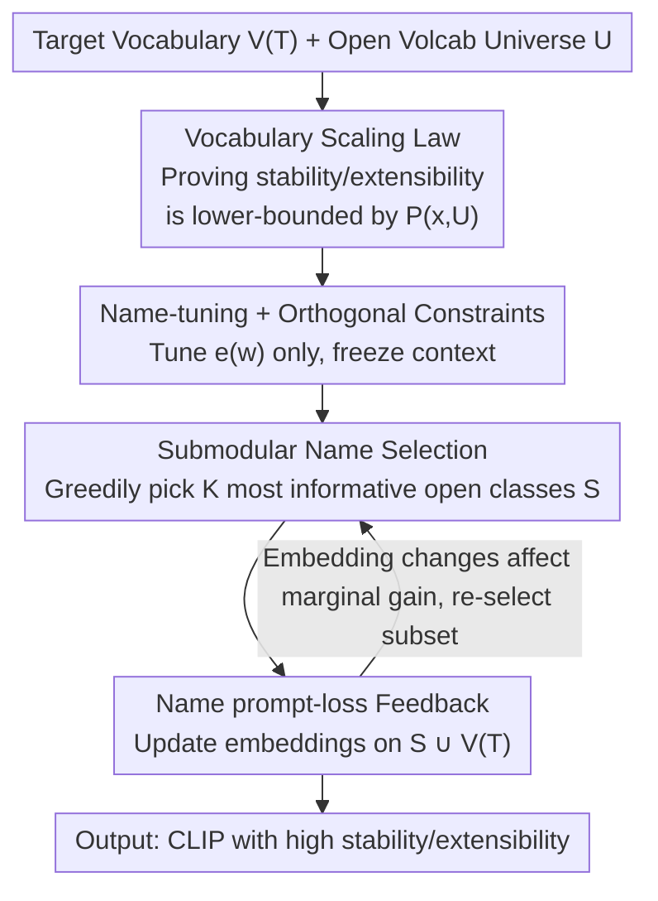

# Vocabulary Scaling Law: Tuning Open-vocabulary Predictors for Their Openness

**Conference**: CVPR 2026  
**Paper**: [CVF Open Access](https://openaccess.thecvf.com/content/CVPR2026/html/Chen_Vocabulary_Scaling_Law_Tuning_Open-vocabulary_Predictors_for_Their_Openness_CVPR_2026_paper.html)  
**Area**: Multimodal VLM  
**Keywords**: CLIP Open-vocabulary, Vocabulary Scaling Law, stability/extensibility, Submodular Optimization, Prompt-tuning  

## TL;DR
This paper theoretically proves that the ability of CLIP to maintain accuracy on old classes (stability) and recognize new classes (extensibility) as the vocabulary expands is lower-bounded by the "prediction confidence over the complete open vocabulary universe $U$." Based on this, it proposes three tuning principles (covering the entire $U$, tuning only class-name embeddings, and adding orthogonal constraints to trained/open class-name embeddings) and implements SVFT, a fine-tuning method that uses submodular greedy selection to approximate $U$. SVFT significantly outperforms existing fine-tuning methods in both stability and extensibility.

## Background & Motivation
**Background**: The hallmark capability of vision-language models like CLIP is "open-vocabulary prediction"—given an image and a set of user-defined class names (`a photo of a [CLASS]`), each class name can be encoded into classification weights for recognition, no longer restricted by fixed category sets. Fine-tuning methods for CLIP generally follow three paths: adapters (inserting small modules outside the frozen encoder), prompt-tuning (tuning the context embeddings of the template), and name-tuning (directly tuning the class-name embeddings).

**Limitations of Prior Work**: Almost all CLIP fine-tuning schemes and evaluation protocols assume an unrealistic premise—that test images happen to belong to the classes constituting the open vocabulary. In other words, "open-vocabulary predictors are actually evaluated under a closed-set, static setting." However, once the vocabulary is expanded (mixing in "distractor" classes the image does not belong to, or requiring recognition of new classes unseen during training), studies like [22] have shown that CLIP and its fine-tuning methods degrade significantly. The paper formalizes these pressures into two metrics (see Figure 2):

- **stability**: How much accuracy the model maintains on its known/fine-tuned classes after mixing a large number of unseen "distractors" into the vocabulary.
- **extensibility**: The model's zero-shot recognition capability for new classes not involved in fine-tuning, as the same vocabulary expands.

**Key Challenge**: The fine-tuning objectives of existing methods focus solely on the target training vocabulary $V^{(T)}$, never considering the names of open classes $U/V^{(T)}$. Consequently, as the vocabulary grows, more "uncalibrated" open classes appear in the softmax denominator, continuously diluting the confidence of the correct class, leading to a drop in both stability and extensibility. There is also a dilemma: crudely tuning the model for all classes in $U$ would destroy the embeddings of unseen classes that were already learned well, undermining zero-shot generalization.

**Goal**: First, provide a theoretical explanation for "why openness inevitably degrades during vocabulary expansion," then offer operable principles on "which direction to tune and which parameters to adjust," and finally make these principles computationally feasible (since $U$ is too large to tune per class).

**Key Insight**: Proving that stability/extensibility are lower-bounded by "the correct class confidence over the complete vocabulary universe $U$, $P^{(w_y)}_{f,g}(x, U)$" $\rightarrow$ Therefore, tuning should be oriented towards the entire $U$, tuning only class-name embeddings with orthogonal constraints $\rightarrow$ Use submodular greedy selection to pick a "small, most informative subset of open class names" to approximate the optimization of $U$, maintaining theoretical properties while ensuring computational feasibility.

## Method

### Overall Architecture
The paper is structured as "proving a law first, then designing a method based on it." The method consists of two parts: the **Vocabulary Scaling Law**, which provides three tuning guidelines (Takeaway 1/2), and **SVFT (Submodular-Vocabulary Fine-tuning)**, which transforms these guidelines into a computable bilevel optimization algorithm.

First, the notation: CLIP uses a vision encoder $f$ and a text encoder $g$ to predict an image $x$ on a target vocabulary $V^{(T)}=\{w_i\}$:

$$\hat y = \arg\max_{i} \frac{\exp(\langle g(T(e(w_i))), f(x)\rangle/\gamma)}{\sum_k \exp(\langle g(T(e(w_k))), f(x)\rangle/\gamma)}$$

Where $e(w_i)$ is the **class-name embedding** for $w_i$, and $T(\cdot)$ is the context template embedding. The paper explicitly decouples these two, corresponding to the "name-tuning (tuning $e$)" and "context-tuning (tuning $T$)" routes. The vocabulary scaling process $V^{(T)}_i = \cup_{j=1}^i V_j$ continuously merges new class blocks until $V^{(T)}_M = U$ (the universe covering all open classes). Stability $\mathrm{ACC}_S$ and extensibility $\mathrm{ACC}_E$ are obtained by evaluating along this expansion sequence and averaging over multiple random sequences (Eq. 3, 4).

The workflow of SVFT is a feedback loop of bilevel optimization: each step uses submodular greedy selection to pick a representative subset $S$ of size $K$ from $U/V^{(T)}$, feeds $S\cup V^{(T)}$ into the class-name prompt-loss, and updates the class-name embeddings. The updated embeddings modify the marginal gain of the submodular function for the next round, leading to a new subset—this cycle repeatedly approximates the infeasible goal of "tuning on the entire $U$" using "small subsets."

### Key Designs

**1. Vocabulary Scaling Law: openness is lower-bounded by "full-vocabulary confidence", thus optimization must target the entire $U$**

This is the foundation, addressing the pain point that "existing methods only focus on $V^{(T)}$ and collapse when the vocabulary expands." The authors prove a monotonic inequality chain for the confidence of the correct class $w_y$ along the expansion sequence (Proposition 1): as the vocabulary expands from $V^{(T)}_1$ to $V^{(T)}_M=U$, more classes enter the denominator, and the correct class confidence monotonically decreases, $P^{(w_y)}_{f,g}(x, V^{(T)}_M) \le \cdots \le P^{(w_y)}_{f,g}(x, V^{(T)}_1)$. By decomposing extensibility (Eq. 5), its first term is exactly stability, so both are bounded by the "confidence on the full vocabulary $U$, $P^{(w_y)}_{f,g}(x, U)$." This directly leads to **Takeaway 1**: To simultaneously improve stability and (the $V^{(T)}$ part of) extensibility, the fine-tuning objective must not only cover $V^{(T)}$ but also include class names from the entire open vocabulary universe $U$—because optimizing the lower bound raises the ceiling for the entire sequence. This also explains why current methods are sub-optimal: their loss functions lack class names from $U/V^{(T)}$, failing to control degradation durante expansion.

**2. Tuning class-name embeddings only + Orthogonal Constraints: Balancing extensibility without sacrificing zero-shot performance**

Takeaway 1 is not enough because the open classes $U/V^{(T)}$ lack training images; the second term of extensibility relies on pre-trained zero-shot capabilities. Expanding the test instance (Eq. 8), the authors found that if the model backbone or context embeddings are tuned to raise $P(x,U)$, both terms in the softmax denominator change **simultaneously**, failing to guarantee a net gain in extensibility. However, if **only the class-name embeddings exclusive to $V^{(T)}$**, $\{e(w)|w\in V^{(T)}\}$, are tuned, only the $V^{(T)}$ term in the denominator changes. By suppressing the response of $V^{(T)}$ classes to open-class images, extensibility can be steadily improved. Since open-class training data is unavailable, the authors use a proxy—**adding orthogonal constraints between $V^{(T)}$ and $U/V^{(T)}$ class-name embeddings**: adding a term $\lambda\,\mathbb{E}_{w\in V^{(T)},\,w'\in U/V^{(T)}}\langle g(T(e(w))), g(T(e(w')))\rangle$ to the objective to prevent training class query embeddings from drifting into directions that affect open classes. This is **Takeaway 2** and the second term of the SVFT loss.

**3. SVFT: Submodular greedy selection to make "tuning on the entire $U$" computationally feasible**

Combining Takeaway 1/2 results in an ideal objective (Eq. 9) that optimizes all class-name embeddings in $U$. However, $U$ must be large for openness evaluation to be meaningful, making class-by-class tuning computationally impossible. SVFT rewrites this as bilevel optimization (Eq. 10): the inner loop tunes class-name embeddings on a selected subset $S\cup V^{(T)}$, while the outer loop selects at most $K$ classes from $U/V^{(T)}$ to make the subset objective $F(\cdot, S)$ approximate the full objective $F(\cdot, U)$ as closely as possible. The key observation: by rescaling the inner product in the orthogonal term with a constant to $[0, 2]$, the set function $F(\{e(w)\}, S)$ satisfies **submodularity** (diminishing marginal returns, Definition 2). Thus, "maximizing $F$ under the cardinality constraint $|S|\le K$" is a standard constrained submodular maximization problem (Theorem 3), solvable via simple and efficient linear greedy search, with a $(1-1/e)$ approximation guarantee: $F(\{e(w)\}, \hat S) \ge (1-\tfrac{1}{e})\,F(\{e(w)\}, S^*)$. This step is the core contribution connecting "open-vocabulary learning" with "submodularity," making the optimization of $U$ both scalable and near-optimal.

### Loss & Training
The bilevel objective of SVFT (Eq. 10): the inner loop minimizes $\mathbb{E}_{\langle x,y\rangle\sim D^{train}_{V^{(T)}}}[-\log P^{(w_y)}_{f,g}(x, S\cup V^{(T)}) + \lambda\,\mathbb{E}_{w\in V^{(T)}, w'\in S}(\langle g(T(e(w))), g(T(e(w')))\rangle + 1)]$, and the outer loop $\max_{S\subset U/V^{(T)}, |S|\le K}$ selects the subset using greedy search. Only class-name embeddings $e(w)$ are tuned, while context embeddings and encoders are frozen; $\lambda$ controls the stability↔extensibility trade-off; inner prompt-tuning follows the learning-to-name route of [8]. Each round alternates between "selecting subset $\rightarrow$ updating embeddings $\rightarrow$ embedding changes update marginal gain $\rightarrow$ re-selecting."

## Key Experimental Results

### Main Results
**Validation of Vocabulary Scaling Law (Table 1, ViT-B/16, CIFAR100)**: Pairwise comparisons validating Takeaway 1/2. Acc-C is closed-set accuracy; Δ after Acc-E/Acc-S is the drop relative to closed-set.

| Config (CIFAR100) | Acc-C | Acc-E (Δ) | Acc-S (Δ) | Conclusion |
|---|---|---|---|---|
| Context-based PT (V(T)) | 83.6 | 76.9 (−6.7) | 76.7 (−6.9) | Tunes context, covers V(T) only |
| Context-based PT (U) | 84.1 | 73.2 (−10.9) | 80.4 (−2.7) | Covering U improves stability but extensibility collapses |
| Name-based PT (V(T)) | 84.2 | 79.4 (−4.8) | 77.8 (−6.4) | Name-tuning > Context-tuning |
| Name-based PT (U) | 85.6 | 81.4 (−4.2) | 82.8 (−2.8) | U coverage + name-tuning improves both (Takeaway 1) |
| **Name-based PT + Orth (U)** | **87.8** | **83.7 (−4.1)** | **85.2 (−2.6)** | Adding orthogonal constraints is optimal (Takeaway 2) |

Interpretation: ① "Covering U" is generally superior to "V(T) only," and name-tuning is superior to context-tuning (both Acc-C and extensibility are better)—verifying Takeaway 1; ② However, extensibility for context-based PT (U) drops to −10.9, showing that merely raising $P(x,U)$ is insufficient; only name-tuning works; ③ Name-based PT (U) with orthogonal constraints leads across the board—verifying Takeaway 2.

**Robustness to Adversarial Classes (Birds / Rare Species, fair full-class-name comparison)**: Comparing against strong baselines MAPLE and CLIP-Adapter by feeding all $U/V^{(T)}$ class names, then evaluating on "adversarial classes maximized by the SVFT training objective."

| Method | Birds (Adversarial) | Rare Species (Adversarial) | Description |
|---|---|---|---|
| MAPLE | 54.46 | 7.14 | Near collapse under adversarial vocab (7.14 for Rare Species) |
| CLIP-Adapter | 73.63 | 80.36 | Significant drop |
| **SVFT** | **91.06** | **87.50** | Nearly unaffected by adversarial classes |

### Ablation Study
| Config | Phenomenon | Description |
|---|---|---|
| Subset selection: linear greedy (default) | Best stability/extensibility | Submodular greedy is the optimal selection strategy (Fig 5) |
| Subset selection: Random | Significantly worse than greedy | Selecting same number of class names randomly lacks informativeness |
| Subset selection: Bi-Search [4] | Worse than greedy | Bilevel search has a worse approximation ratio |
| Subset selection: Full (Using all U) | Inferior to greedy / Costly | Confirms "picking a small subset" is both feasible and sufficient |
| SVFT (V(T)) (No submodular selection, V(T) names only) | Weaker than full SVFT | Equivalent to Class-name PT on V(T), lacking open class approximation |
| Neural Scaling vs Vocabulary Scaling | Switching to larger/stronger CLIP yields minimal gain | Δ for stability/extensibility only slightly reduced |

### Key Findings
- **Vocabulary Scaling Law > Neural Scaling Law**: Replacing CLIP with larger architectures (CLIP/SLIP/DeCLIP/PE across different scales) provides very limited improvement in stability/extensibility drops. What truly works is the vocabulary-side strategy of "tuning name embeddings facing $U$ + orthogonal constraints." This shows openness is a tuning objective problem, not solved by simply stacking model parameters.
- **"Name-tuning only" is the key switch for extensibility**: Context-based PT (U) raised stability to −2.7 but crashed extensibility to −10.9, while name-based PT (U) raised both—validating the denominator analysis in Eq. 8 (only name-tuning avoids simultaneous perturbation).
- **SVFT's strength lies in stability, which drives extensibility**: On Rare Species, as negative classes expand from 20 to 400, SVFT accuracy drops <2 points, whereas the strongest baseline CLIP-Adapter drops ~15 points. The lead in extensibility narrows as open-class samples increase (as all models inevitably degrade), but SVFT degrades much slower.
- **Adversarial classes expose baseline fragility**: On adversarial classes specifically picked by the SVFT objective, MAPLE drops to 7.14 on Rare Species, while SVFT stays stable at 87.50, proving that explicit optimization of "full vocabulary + orthogonality" grants robustness in open-world scenarios.

## Highlights & Insights
- **Formalizing "openness degradation" as a lower bound**: Proposition 1's monotonic inequality chain + extensibility decomposition (Eq. 5) cleanly unifies two empirical metrics into a single optimization target $P(x,U)$. This is the most elegant step of the paper—it transforms "where to tune" from intuition into a provable conclusion.
- **Deriving "what to tune" from the denominator**: Eq. 8 expands the extensibility test instance softmax denominator, directly revealing that "tuning names affects one term, while tuning the backbone affects two," leading to Takeaway 2. This analytical approach of reverse-engineering tunable parameters from denominator structure is transferable to other contrastive open-set problems.
- **Bridging Open-vocabulary Learning and Submodularity**: By rescaling the orthogonal inner product to $[0,2]$ to satisfy monotonicity, the authors cast "picking representative class names" as constrained submodular maximization with a $(1-1/e)$ guarantee. This technique of "rescaling for monotonicity + greedy selection" is generalizable to scenarios requiring informative subsets to approximate expensive global targets.

## Limitations & Future Work
- **Acknowledged Limitations**: ① Assumes a predefined, finite vocabulary universe $U$, but real-world name space is nearly boundless; if $U$ misses confusing classes at deployment, the bound loosens. ② Greedy submodular selection requires calculating marginal gains for all candidates in $U/V^{(T)}$, a bottleneck for massive vocabularies. ③ Tuning only name embeddings with a frozen encoder limits expressiveness in domains far from CLIP's pre-training distribution. ④ Orthogonal constraints are a computable proxy rather than a sufficient condition; in high-dimensional space, semantically related classes can "nearly orthogonally" satisfy it.
- **Personal Insights on Limitations**: Core validation is concentrated on ImageNet subsets and CIFAR100; gaps on Entity13/Living17 are less pronounced (as the authors admit, harder fine-grained sets like Birds/Rare Species are needed to show differentiation).
- **Potential Improvements**: Using LLMs to dynamically construct vocabularies to relax the static $U$ assumption; using lazy/stochastic greedy methods to reduce selection costs; performing lightweight vision-side adaptation while maintaining orthogonal constraints; introducing taxonomic priors for more structured regularization; and extending the Vocabulary Scaling Law to open-vocabulary detection/segmentation with SVFT in a continual learning loop.

## Related Work & Insights
- **vs. Open-set/Open-world Learning**: Traditional open-set learning identifies unseen classes as "unknown" and merges new samples incrementally. CLIP open-vocabulary prediction is post-training-free zero-shot inference; the issue is not "rejecting unknowns" but "not degrading as the vocabulary expands."
- **vs. Context-based prompt-tuning (CoOp/CoCoOp)**: They tune context template embeddings; this paper proves that simultaneously disturbs both terms of the softmax denominator, failing to preserve extensibility.
- **vs. Name-tuning (learning-to-name [8/18/19])**: This paper builds on them by adding two components—theoretical "cover U + orthogonality" guidance and engineering submodular subset selection—giving name-tuning an openness-oriented objective and scalable implementation for the first time.
- **vs. Adapters (CLIP-Adapter/MAPLE)**: They insert small modules; experiments show they are fragile under adversarial or large negative vocabularies because they don't incorporate open class names into the optimization objective.

## Rating
- Novelty: ⭐⭐⭐⭐⭐ First to formalize CLIP's stability/extensibility as a provable lower bound and bridge open-vocabulary learning with submodularity.
- Experimental Thoroughness: ⭐⭐⭐⭐ Validates Takeaways via pairwise ablation and adversarial stress tests, though core datasets are somewhat limited.
- Writing Quality: ⭐⭐⭐ Mathematically rigorous, but dense notation and some sections (Eq. 8 expansion) have high barriers for engineering-focused readers.
- Value: ⭐⭐⭐⭐ Provides actionable tuning principles (cover U / tune names / add orthogonality) for open-world CLIP deployment.

<!-- RELATED:START -->

## Related Papers

- [\[CVPR 2026\] Reconstructing CLIP for Open-Vocabulary Dense Perception](reconstructing_clip_for_open-vocabulary_dense_perception.md)
- [\[CVPR 2026\] Towards Open-Vocabulary Industrial Defect Understanding with a Large-Scale Multimodal Dataset](towards_open-vocabulary_industrial_defect_understanding_with_a_large-scale_multi.md)
- [\[CVPR 2026\] SynCLIP: Synonym-Coherent Language-Image Pretraining for Robust Open-Vocabulary Dense Perception](synclip_synonym-coherent_language-image_pretraining_for_robust_open-vocabulary_d.md)
- [\[AAAI 2026\] O3SLM: Open Weight, Open Data, and Open Vocabulary Sketch-Language Model](../../AAAI2026/multimodal_vlm/o3slm_open_weight_open_data_and_open_vocabulary_sketch-language_model.md)
- [\[CVPR 2026\] Thinking Beyond Labels: Vocabulary-Free Fine-Grained Recognition using Reasoning-Augmented LMMs](thinking_beyond_labels_vocabulary-free_fine-grained_recognition_using_reasoning-.md)

<!-- RELATED:END -->
