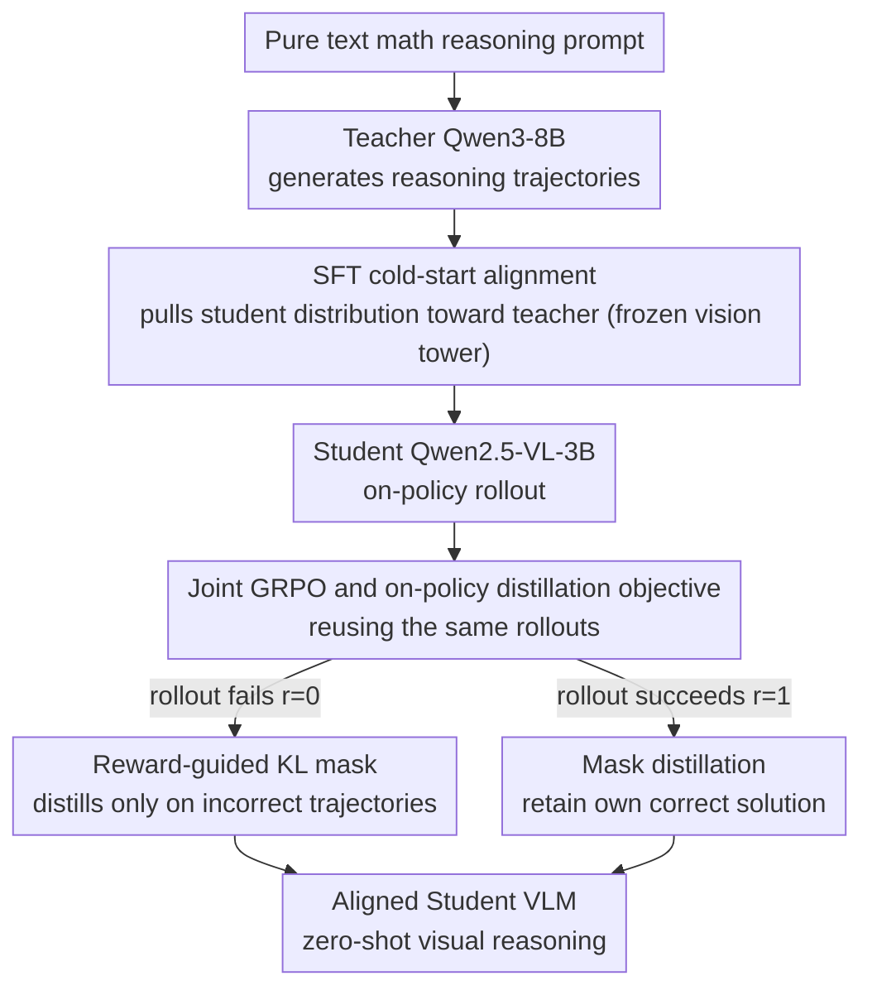

# VOLD: Reasoning Transfer from LLMs to Vision-Language Models via On-Policy Distillation

**Conference**: CVPR 2026  
**Paper**: [CVF Open Access](https://openaccess.thecvf.com/content/CVPR2026/html/Bousselham_VOLD_Reasoning_Transfer_from_LLMs_to_Vision-Language_Models_via_On-Policy_CVPR_2026_paper.html)  
**Area**: Multimodal VLM  
**Keywords**: Reasoning Transfer, On-policy Distillation, GRPO, Text-only Training, VLM Reasoning

## TL;DR
VOLD utilizes a text-only teacher LLM (Qwen3-8B) to train the reasoning capabilities of a vision-language student model (Qwen2.5-VL-3B). It first performs distribution alignment via SFT using teacher-generated reasoning trajectories, then integrates GRPO reinforcement learning with "on-policy distillation" (reverse KL) for joint optimization on the same rollouts. **Without using any vision-language reasoning data during the entire process**, VOLD outperforms methods trained directly on multimodal data across four visual reasoning benchmarks: MMMU-Pro, MathVision, and LogicVista.

## Background & Motivation
**Background**: Text-only reasoning models (DeepSeek-R1, QwQ, Qwen3) have advanced rapidly by leveraging RL bootstrapping on massive, auto-verifiable text reasoning trajectories. Naturally, researchers seek to transfer this reasoning capability to the visual modality to enable "multi-step reasoning" in VLMs.

**Limitations of Prior Work**: The primary bottleneck is data. High-quality **visual reasoning** data is extremely scarce. Most existing vision-language datasets focus on basic perception tasks (e.g., "what object is on the sofa") and lack samples requiring multi-step reasoning. Manual annotation of visual reasoning trajectories is expensive and difficult to automate or scale. Conversely, text reasoning data for math and coding can be generated and verified automatically at scale.

**Key Challenge**: While text reasoning data is scalable, the target capability is required for the visual modality, creating a "modality gap." Existing approaches have shortcomings: 1) Synthetic visual trajectories (Vision-R1, OpenVLThinker, R1-OneVision) convert images into text descriptions for distillation, but captions fail to capture rich visual information; 2) Training on hard samples from benchmarks (VLAA-Thinker, VLM-R1) risks test set contamination; 3) Pure text transfer (X-Reasoner) relies solely on SFT and RL, **wasting the potential of the teacher model** during the training phase by leaving it idle without continuous guidance.

**Goal**: Efficiently transfer the reasoning capabilities of a text-only teacher to a VLM student without using any visual reasoning data, while **maintaining the active guidance of the teacher throughout the training process**.

**Key Insight**: Research in text-to-text transfer (KDRL, Qwen3) has demonstrated that combining RL with teacher distillation significantly improves RL sample efficiency. On-policy distillation provides token-level teacher supervision on trajectories sampled by the student. The authors adapt this insight to the cross-modal setting.

**Core Idea**: Replace the KL regularization term against the old policy in GRPO with a reverse-KL on-policy distillation term, allowing the teacher to provide dense guidance on the student's own rollouts. However, cross-modal transfer requires the student and teacher output distributions to be aligned first; thus, a cold-start SFT phase is essential for the distillation to be effective.

## Method

### Overall Architecture
VOLD is a **two-stage post-training pipeline**. The student is the vision-language model Qwen2.5-VL-3B, and the teacher is the text-only Qwen3-8B (both share the same tokenizer and vocabulary, which is a prerequisite for calculating KL divergence). **Stage 1** uses reasoning trajectories generated by the teacher to perform SFT on the student, pulling the student's output distribution toward the teacher (policy alignment). **Stage 2** computes two signals simultaneously on the same batch of student rollouts: the sparse trajectory-level reward from GRPO and the dense token-level distillation loss from the teacher for joint optimization. Training data for both stages consists of **pure text mathematics problems**, yet the final model performs zero-shot reasoning on new vision-language problems.

The key to the pipeline is that both GRPO and on-policy distillation require the expensive step of "sampling trajectories from the student policy." VOLD reuses the same rollouts for both objectives, injecting teacher guidance into RL with nearly zero additional overhead.

### Key Designs

**1. SFT Cold-start Alignment: Aligning distributions before distillation**

On-policy distillation is sensitive to **state distribution shift**. Reverse-KL distillation $D_{KL}(\pi_\phi(\cdot|h_t)\,\|\,\pi_\theta(\cdot|h_t))$ is calculated on prefixes $h_t \sim \pi_\theta$ sampled by the student. If the student policy $\pi_\theta$ is too far from the teacher's support set $\pi_\phi$, the teacher's distribution on these "outlier prefixes" becomes diffuse and uninformative, leading to weak gradients or high variance. Since reverse-KL is mode-seeking, it pulls the student toward the teacher's mode at each $h_t$; if $h_t$ is an outlier, this may over-regularize irrelevant regions and destabilize training.

Thus, Stage 1 involves SFT using a teacher-generated trajectory dataset $D_{teacher}=\{(q_j,\tau^*_j)\}$ (where trajectories $\tau^*_j\sim\pi_\phi(\cdot|q_j)$ and prompts are taken from Mixture-of-Thoughts), minimizing the negative log-likelihood of teacher trajectories under the student policy:

$$\mathcal{L}_{SFT}(\theta) = -\mathbb{E}_{(q,\tau^*)\sim D_{teacher}}\left[\sum_{t=1}^{|\tau^*|}\log\pi_\theta(y^*_t|q,y^*_{<t})\right]$$

During this stage, the vision encoder is frozen and only the language component is updated to maintain visual capabilities while focusing on language alignment. After alignment, the states encountered during student rollouts mostly fall within regions where the teacher has sufficient probability mass, making token-level KL informative and stable. Ablations (Table 2) show that skipping this step or using SFT with generic trajectories (e.g., DeepSeek-R1 MoT) rather than the specific Qwen3-8B teacher's trajectories yields **almost zero benefit from on-policy distillation** in Stage 2.

**2. Unified Objective: Replacing GRPO Reference KL with Teacher Distillation**

Standard GRPO includes a KL regularization term $\beta D_{KL}(\pi_\theta\|\pi_{ref})$ against a reference model $\pi_{ref}$, where advantages $A_i = \frac{r_i-\bar r}{\sigma_r+\delta}$ are estimated via group relative comparison. Based on recent findings (Dr.GRPO, DAPO) that the reference KL term can often be removed without performance loss, the authors replace it with a reverse-KL term pulling toward the teacher:

$$\mathcal{L}_{VOLD}(\theta) = \mathcal{L}_{GRPO}(\theta) + \beta\cdot\mathbb{E}_{q,\tau\sim\pi_\theta}\left[\sum_{t=1}^{T}D_{KL}(\pi_\phi(\cdot|h_t)\,\|\,\pi_\theta(\cdot|h_t))\right]$$

Here, GRPO handles "exploration" by pushing the student toward high-reward solutions using trajectory-level binary rewards ($r\in\{0,1\}$ via exact match of `boxed{...}` answers). The distillation term handles "exploitation" by providing dense token-level guidance on the student's own rollout prefixes. Both run on the **same set of on-policy samples**. Since calculating the full vocabulary KL is expensive, a "k2" estimator for Monte-Carlo approximation is used in practice.

**3. Reward-guided KL Mask: Selective Imitation**

RL and distillation can sometimes conflict. When a student discovers a **correct but non-teacher-like** reasoning path, the distillation term may interfere by forcing it back toward the teacher. The authors resolve this with a "selective imitation" principle—**distilling only on incorrect responses**. Given the binary reward, $(1-r(\tau))$ serves as a natural mask:

$$\mathcal{L}_{VOLD\text{-}masked}(\theta) = \mathcal{L}_{GRPO}(\theta) + \beta\cdot\mathbb{E}_{q,\tau\sim\pi_\theta}\left[(1-r(\tau))\sum_{t=1}^{T}D_{KL}(\pi_\phi(\cdot|h_t)\,\|\,\pi_\theta(\cdot|h_t))\right]$$

When a rollout receives a positive reward ($r=1$), the KL term is masked, allowing the student to retain its successful strategy. Only incorrect rollouts ($r=0$) receive teacher guidance. This effectively divides labor between "imitation" (when wrong) and "exploration" (when right).

### Loss & Training
- **SFT**: Trained on MoT-Teacher-8B corpus (re-generated by the teacher, containing only trajectories <8192 tokens, no answer filtering to focus on distribution alignment). Batch size 256, LR $5\times10^{-5}$, 4000 steps (~5 epochs), frozen vision tower.
- **RL**: GRPO on pure text orz-57k math data. 60 steps, KL coefficient $\beta=0.1$, 5 rollouts per prompt, batch size 256, LR $6\times10^{-6}$. Uses asymmetric clipping $\epsilon_{upper}=0.3, \epsilon_{lower}=0.2$ to encourage exploration.
- **Validation**: Geo3K dataset is used to monitor the "text-to-vision" reasoning transfer during training.

## Key Experimental Results

### Main Results
The student and all baselines originate from the same Qwen2.5-VL-3B-Instruct base. "Images in FT" indicates whether images were used during fine-tuning.

| Model | Images in FT | MMMU-Pro | MathVision | MathVista | MathVerse | DynaMath | WeMath | LogicVista |
|------|:---:|:---:|:---:|:---:|:---:|:---:|:---:|:---:|
| Qwen2.5-VL-3B (Base) | - | 27.1 | 21.9 | 61.2 | 31.2 | 42.7 | 22.9 | 40.3 |
| X-Reasoner-3B (Reproduction) | ✗ | 31.0 | 24.4 | 61.1 | 35.7 | 47.2 | 30.6 | 41.1 |
| VLM-R1 3B-Math | ✓ | 28.6 | 21.9 | 62.7‡ | 32.2‡ | 42.7 | 30.0 | 40.5 |
| VLAA-Thinker 3B | ✓ | 24.6 | 24.4 | 61.0‡ | 36.4 | 47.5 | 31.5 | 38.5 |
| **VOLD (Ours)** | ✗ | **32.0** | **28.0** | 61.9 | **37.9** | **50.7** | **31.8** | **45.0** |

(‡ indicates partial training on the evaluation set, suggesting contamination.) VOLD is best on 6 out of 7 benchmarks, with significant gains on difficult tasks: MathVision 28.0% (Base 21.9%) and LogicVista 45.0% (Base 40.3%). VOLD outperforms baselines even though they utilized visual data or encountered evaluation images during training.

### Ablation Study
Component Analysis (Table 3, SFT using MoT-Teacher-8B):

| SFT | RL | On-policy Distill | MMStar | MathVision | LogicVista | Note |
|:---:|:---:|:---:|:---:|:---:|:---:|------|
| ✓ | ✗ | ✗ | 49.7 | 18.6 | 28.9 | SFT only, worse than base |
| ✓ | ✓ | ✗ | 50.5 | 24.0 | 38.3 | RL added, moderate gain |
| ✓ | ✓ | ✓ | **55.2** | **28.0** | **45.0** | Full VOLD, best performance |

Policy Alignment Ablation (Table 2): When using standard MoT (DeepSeek-R1) for SFT, performance for RL-only and SFT+RL+Distillation is nearly identical (41.1 LogicVista), indicating **zero benefit from distillation** without specific teacher alignment. Using the proper Qwen3-8B trajectories for alignment provides the leap to 45.0.

### Key Findings
- **Alignment is a "switch" for distillation**: Without distribution alignment, adding distillation provides no performance gain. Alignment is the essential foundation.
- **SFT alone degrades performance but is necessary**: Unfiltered teacher trajectories contain errors, making SFT-only worse than the base model. However, it establishes the foundation for subsequent distillation.
- **Learning Dynamics**: VOLD consistently converges to a higher level of accuracy and reward compared to vanilla GRPO, starting from the same SFT baseline.

## Highlights & Insights
- **Replacing Reference KL with Teacher KL**: By utilizing the often-removed reference KL slot in GRPO for teacher distillation, VOLD injects dense guidance into RL at virtually zero cost by reusing rollouts.
- **Reward-guided Masking**: The $(1-r)$ mask elegantly separates "imitation" from "exploration," preventing distillation from suppressing novel, correct student strategies.
- **First Cross-modal On-policy Distillation**: VOLD extends on-policy distillation from text-to-text to text-to-vision, proving that text reasoning resources can effectively overflow into the multimodal domain.
- **Paradigm Value**: By bypassing the need for scarce visual reasoning data, VOLD offers a more sustainable path for training complex multimodal reasoning.

## Limitations & Future Work
- **Unfiltered SFT Trajectories**: The performance drop in SFT-only is due to incorrect teacher trajectories. Future work could involve filtering these, though re-generating the corpus is computationally expensive.
- **Hard Constraint on Shared Tokenizer**: Reverse-KL requires identical vocabularies, limiting teacher selection to the same model family (e.g., Qwen).
- **Evaluation Scope**: Experiments were focused on a 3B student and primarily mathematical reasoning. Generalization to larger scales or other reasoning types (e.g., spatial, scientific) is yet to be fully explored.

## Related Work & Insights
- **vs X-Reasoner**: Both use text-only training, but VOLD's use of on-policy distillation leads to significant improvements (e.g., 28.0 vs 24.4 on MathVision).
- **vs VLAA-Thinker / VLM-R1-Math**: These methods use multimodal data but suffer from data scarcity and potential contamination. VOLD is cleaner and more effective using only text.
- **vs DeepSeek-R1 / GRPO**: VOLD builds upon GRPO and is orthogonal to other RL improvements like Dr.GRPO or DAPO.

## Rating
- Novelty: ⭐⭐⭐⭐⭐ 
- Experimental Thoroughness: ⭐⭐⭐⭐ 
- Writing Quality: ⭐⭐⭐⭐⭐ 
- Value: ⭐⭐⭐⭐⭐ 

<!-- RELATED:START -->

## Related Papers

- [\[ICML 2026\] Decomposed On-Policy Distillation for Vision-Language Reasoning: Steering Gradients for Visual Grounding](../../ICML2026/multimodal_vlm/decomposed_on-policy_distillation_for_vision-language_reasoning_steering_gradien.md)
- [\[CVPR 2026\] CodeV: Code with Images for Faithful Visual Reasoning via Tool-Aware Policy Optimization](codev_code_with_images_for_faithful_visual_reasoning_via_tool-aware_policy_optim.md)
- [\[CVPR 2026\] Understanding Task Transfer in Vision-Language Models](understanding_task_transfer_in_vision-language_models.md)
- [\[CVPR 2026\] Multimodal Distribution Matching for Vision-Language Dataset Distillation](multimodal_distribution_matching_for_vision-language_dataset_distillation.md)
- [\[CVPR 2026\] HiconAgent: History Context-aware Policy Optimization for GUI Agents](hiconagent_history_context-aware_policy_optimization_for_gui_agents.md)

<!-- RELATED:END -->
