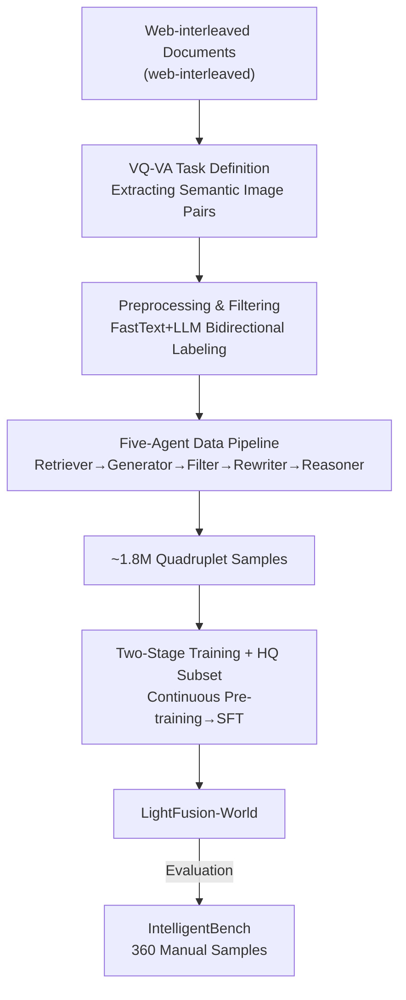

# VQ-VA World: Towards High-Quality Visual Question-Visual Answering

**Conference**: CVPR 2026  
**Paper**: [CVF Open Access](https://openaccess.thecvf.com/content/CVPR2026/html/Gou_VQ-VA_World_Towards_High-Quality_Visual_Question_Visual_Answering_CVPR_2026_paper.html)  
**Code**: https://github.com/chenhuigou/VQ-VA-World  
**Area**: Multimodal VLM  
**Keywords**: Visual Question Answering, Image Generation, Data Construction, Agent Pipeline, World Knowledge

## TL;DR
This paper brings the capability of "visual question-visual answering" (VQ-VA)—originally exclusive to closed-source systems like GPT-Image or NanoBanana—to open-source models. It utilizes a five-agent pipeline to extract approximately 1.8 million training samples from web-based interleaved documents that "require world knowledge and reasoning to complete image transformations," accompanied by the manually annotated IntelligentBench. After fine-tuning LightFusion on this data, the IntelligentBench score surged from 7.78 to 53.06, surpassing all open-source models and significantly narrowing the gap with closed-source systems.

## Background & Motivation
**Background**: Leading multimodal generation systems such as GPT-Image and NanoBanana have demonstrated an "emergent" capability: given a photo of a broken window and asked "what might be on the ground now," they can generate an image of shattered glass; given an illustration of a bull market and asked "what is the opposite trend," they can draw a bear representing a bear market. The authors define this ability to "answer a visual question with a new image" as VQ-VA. It requires models not only to condition on input images and instructions but also to leverage internalized world knowledge and multi-step reasoning to produce semantically coherent images.

**Limitations of Prior Work**: VQ-VA is almost entirely monopolized by closed-source systems. Open-source image-to-image (I2I) models score nearly zero on such tasks, as they often misunderstand the question or lack the world knowledge necessary to synthesize correct visual answers (Table 2 shows UniWorld-V1 at only 1.94 and the original LightFusion at 7.78).

**Key Challenge**: The authors diagnose the bottleneck not as the model architecture, but as the **data**. Most open-source solutions are trained on standard image editing datasets that emphasize predefined operations (adding, deleting, or replacing objects; style transfer), where the target image is a **pixel-level direct modification** of the source. In contrast, VQ-VA requires "semantic-level knowledge/reasoning associations between the source and answer images" (e.g., wheel $\rightarrow$ racing car, mathematical equation $\rightarrow$ its function graph, house window $\rightarrow$ shattered glass). Existing datasets severely lack these "free-form, knowledge-intensive" samples. Table 1 quantifies this gap: existing large-scale datasets fail almost all four attributes (Freeform/QA/Knowledge-Centric/Real-Image), while the proposed dataset satisfies all, with the number of unique concept words in instructions reaching 87,900 (the next highest, SEED-Data-Edit, is only 29,200).

**Goal**: (1) Define what kind of data is suitable for VQ-VA; (2) design an automated pipeline that can run at web-scale to build such data; (3) provide a benchmark that truly assesses knowledge and reasoning.

**Core Idea**: Transform the "VQ-VA capability" problem into a "VQ-VA data" problem—treating web-interleaved documents (naturally rich in world knowledge and closely related image-text pairs) as the resource, refining them into "question image + question text + reasoning chain + answer image" quadruplets using a multi-agent pipeline, and "teaching" a standard open-source model VQ-VA by fine-tuning it on this data.

## Method

### Overall Architecture
VQ-VA World is a **data-centric** framework. The pipeline is divided into two stages: **Preprocessing** and the **Agent Construction Pipeline**. Preprocessing filters truly "knowledge/design-related" documents from massive, noisy web-interleaved data; the agent pipeline then converts these clean documents into high-quality VQ-VA samples. The entire pipeline operates at web-scale, eventually producing approximately 1.8 million samples (24.35% reasoning, 30.37% design knowledge, 43.69% world knowledge). Once the data is prepared, a two-stage training strategy (continuous pre-training + SFT on high-quality subsets) is used to inject capabilities into the open-source unified multimodal model, LightFusion, resulting in LightFusion-World. Beyond the data framework, the authors independently constructed the manual evaluation benchmark, IntelligentBench.

### Key Designs

**1. Formalization of VQ-VA Task and Data Source Selection: Grounding "Knowledge/Reasoning" in Semantic Transformations of Image Pairs**

The difficulty of VQ-VA lies in determining what training samples force a model to learn to answer with an image rather than perform simple editing. The authors' criterion is that the target transformation $(\text{Image}_1, \text{Image}_2)$ must **inherently require knowledge or reasoning**, such as (wheel, racing car), (math equation, function plot), or (house window, shattered glass). These transformations capture semantic links rather than surface pixel changes. By providing $\text{Image}_1$ and constructing a transformational question where the answer is exactly $\text{Image}_2$, the model is forced to learn knowledge-related VQ-VA capabilities. Based on this, the authors select **web-interleaved documents** as the source: multiple images in a webpage naturally revolve around a central theme and often share implicit "knowledge links," making them ideal for VQ-VA pairs. This step is the methodological cornerstone of the paper—it transforms the vague problem of "teaching models VQ-VA" into an automatable data engineering problem of "extracting image pairs satisfying semantic transformation criteria from web documents."

**2. Preprocessing: Efficient Web-Scale Document Labeling via FastText + LLM Loop**

Web corpora are web-scale, making LLM-based classification for every item slow and expensive. Borrowing from the DeepSeek-Math pipeline, the authors design an efficient labeling loop: first, an LLM (Qwen2.5-14B) labels a small batch to identify desired sample types; then, a lightweight FastText classifier is trained on these labels for high-throughput mass labeling; finally, the LLM **refines** the coarse labels produced by FastText. This "LLM starts $\rightarrow$ Light classifier scales $\rightarrow$ LLM finishes" loop combines the quality of the large model with web-scale cost efficiency. Preprocessing retains only knowledge and design categories, resulting in clean interleaved documents.

**3. Five-Agent Data Construction Pipeline: Decomposing "Sample Generation" into Decoupled Workers**

This is the core engine. The authors modularize data construction into an "agentic" pipeline where five independent workers manage sub-tasks. Each is driven by an advanced VLM (e.g., GPT-4o, Seed1.5VL-Thinking) with specialized system prompts and Chain-of-Thought (CoT), ensuring workers **do not share memory** to maintain decoupling:

- **Retriever**: Selects image pairs from interleaved documents that support free-form questions, preferring pairs with non-trivial knowledge/reasoning relationships. The input is the **entire document** to provide thematic context.
- **Instruction Generator**: Writes natural language questions centered on one image such that the other image is the correct answer. Questions cover categories like temporal/causal relationships, compositional/spatial structures, and scientific/analytical phenomena.
- **Filter**: Removes low-quality triplets $\langle \text{question image}, \text{question text}, \text{answer image} \rangle$. Three sub-scorers—Question Score (QS), Answer Score (AS), and Context Dependence Score (CDS)—score samples on a scale of $\{0, 1, 2\}$, **retaining only perfect scores** ($QS+AS+CDS=6$). The CDS specifically ensures the answer cannot be derived solely from text, preventing "context shortcuts."
- **Rewriter**: Generates multiple variants of the question to improve instruction diversity and following.
- **Reasoner**: Generates a linguistic reasoning chain for each triplet, explaining how the source image transforms into the target image. This forms a **quadruplet** used for fine-tuning.

**4. High-Quality Subset Selection & Two-Stage Training: Broad-to-Fine Training and Temporal Knowledge**

The authors employ a "continuous pre-training + SFT" strategy. The first stage uses the full 1.8M dataset, while the second stage focuses on a smaller, higher-quality subset (the top one-third, roughly 500k samples). Additionally, they leverage the fact that **video models naturally encode temporal knowledge**, using the Seedance video model to construct approximately 100k temporal-related VQ-VA samples. For LightFusion, VQ-VA World data is mixed at a 25% sampling ratio, training for 45k steps in total.

**5. IntelligentBench: A Curated Benchmark for Higher-Order Semantic Reasoning**

To evaluate VQ-VA systematically, the authors created IntelligentBench with 360 manually curated samples across world knowledge (171), design knowledge (88), and reasoning (101). Unlike RISEBench or KRIS-Bench, IntelligentBench (1) includes tasks requiring high-order semantic reasoning that transcends visible information in the source image, and (2) utilizes real web content with ground-truth reference images rather than synthetic data. GPT-4o is used as the default automated judge, showing 80.6% agreement with humans.

## Key Experimental Results

### Main Results: IntelligentBench (The VQ-VA Battlefield)
Scores are normalized to 0–100. Models unable to produce images receive a 0.

| Model | Open-source Status | World Knowledge | Design Knowledge | Reasoning | Overall |
| :--- | :--- | :---: | :---: | :---: | :---: |
| GPT-Image-1 (Closed) | Closed | 84.5 | 80.68 | 81.19 | **82.64** |
| NanoBanana (Closed) | Closed | 81.6 | 82.95 | 80.69 | 81.67 |
| BAGELThink | Open Weights | 61.99 | 55.11 | 62.38 | 60.42 |
| Qwen-Image | Open Weights | 38.07 | 33.66 | 32.75 | 34.31 |
| FLUX.1-Kontext-Dev | Open Weights | 20.18 | 24.43 | 19.80 | 21.11 |
| UniWorld-V1 | Fully Open | 2.92 | 0.57 | 1.49 | 1.94 |
| LightFusion (Baseline) | Fully Open | 5.26 | 11.93 | 8.42 | 7.78 |
| **LightFusion-World (Ours)** | Fully Open | 50.58 | 57.95 | 52.97 | **53.06** |

Ours ranks first among fully open-source models (53.06 vs. 7.78 baseline, an **absolute gain of 45.28**), even surpassing Qwen-Image (34.31), which was pre-trained on massive private data.

### Key Findings
- **Data is the Source of Capability**: Without changing the architecture, switching the data improved IntelligentBench from 7.78 to 53.06, validating that the VQ-VA bottleneck lies in data.
- **VQ-VA Capability Spills Over**: Significant gains were also observed in reasoning-based editing benchmarks like RISEBench (4.2$\rightarrow$15.3) and KRIS-Bench (52.52$\rightarrow$61.85).
- **Limited Gains in Standard Editing**: Gains on GEdit-Bench (6.06$\rightarrow$6.58) and ImgEdit-Bench (3.77$\rightarrow$3.85) were modest, highlighting the domain gap between "pixel-level editing" and "knowledge-driven generation."

## Highlights & Insights
- **Reducing "Emergent Ability" to a "Data Problem"**: Rather than scaling architectures or RL, the authors demonstrate that the VQ-VA bottleneck is the missing distribution of knowledge-intensive image pairs.
- **Web-Interleaved Documents as Natural Ore**: The insight that multiple images on a single webpage often share "knowledge links" provides a scalable way to find semantic image pairs automatically.
- **Combatting "Context Shortcuts"**: The specialized Context Dependence Score (CDS) removes samples where the answer can be guessed from text alone, preventing the model from ignoring the question image.
- **Cross-Modal Augmentation**: Using video models to supplement temporal VQ-VA knowledge is a clever way to leverage temporal encoding for static image tasks.

## Limitations & Future Work
- **Gap with Closed-Source**: 53.06 vs. 80.6+ indicates that purely fine-tuning a lightweight model on data still hits a performance ceiling.
- **Reliance on Strong VLMs**: The five-agent pipeline depends on models like GPT-4o, tying data quality and cost to (partially closed) models.
- **Referee Bias**: Using GPT-4o as a judge might favor outputs with similar styles; more neutral evaluation protocols are needed.
- **Standard Editing Performance**: Modest improvements on standard editing tasks suggest that this data should be mixed with traditional editing data for deployment.

## Related Work & Insights
- **Comparison with Standard Editing (InstructPix2Pix, etc.)**: Standard datasets target pixel-level changes via explicit instructions; Ours targets VQ-VA, requiring the synthesis of entirely new images based on reasoning.
- **Comparison with RISEBench/KRIS-Bench**: While these benchmarks move toward reasoning, they still reward pixel precision and rely on synthetic data; IntelligentBench uses real web content and focuses on higher-order semantic reasoning.
- **Methodological Inspiration**: The bidirectional FastText + LLM labeling loop is a generalizable paradigm for scaling high-quality, expensive LLM judgments to web-scale corpora.

## Rating
- Novelty: ⭐⭐⭐⭐ Transforms VQ-VA from an emergent phenomenon into a systemic data problem.
- Experimental Thoroughness: ⭐⭐⭐⭐⭐ Comprehensive evaluation across five benchmarks and three domains.
- Writing Quality: ⭐⭐⭐⭐ Clear motivation; Table 1 effectively quantifies the data gap.
- Value: ⭐⭐⭐⭐⭐ Provides infrastructure (data, pipeline, benchmark, weights) to push open-source multimodal generation forward.

<!-- RELATED:START -->

## Related Papers

- [\[CVPR 2026\] StaR-KVQA: Structured Reasoning Traces for Implicit-Knowledge Visual Question Answering](star-kvqa_structured_reasoning_traces_for_implicit-knowledge_visual_question_ans.md)
- [\[CVPR 2026\] SEA: Evaluating Sketch Abstraction Efficiency via Element-level Commonsense Visual Question Answering](sea_evaluating_sketch_abstraction_efficiency_via_element-level_commonsense_visua.md)
- [\[CVPR 2026\] DocPrune: Efficient Document Question Answering via Background, Question, and Comprehension-aware Token Pruning](docpruneefficient_document_question_answering_via_background_question_and_compre.md)
- [\[CVPR 2026\] Does Language Shift Break Medical Vision-Language Models? Indonesian Radiology Visual Question Answering Case Study](does_language_shift_break_medical_vision-language_models_indonesian_radiology_vi.md)
- [\[CVPR 2026\] Visual-Aware CoT: Achieving High-Fidelity Visual Consistency in Unified Models](visual-aware_cot_achieving_high-fidelity_visual_consistency_in_unified_models.md)

<!-- RELATED:END -->
