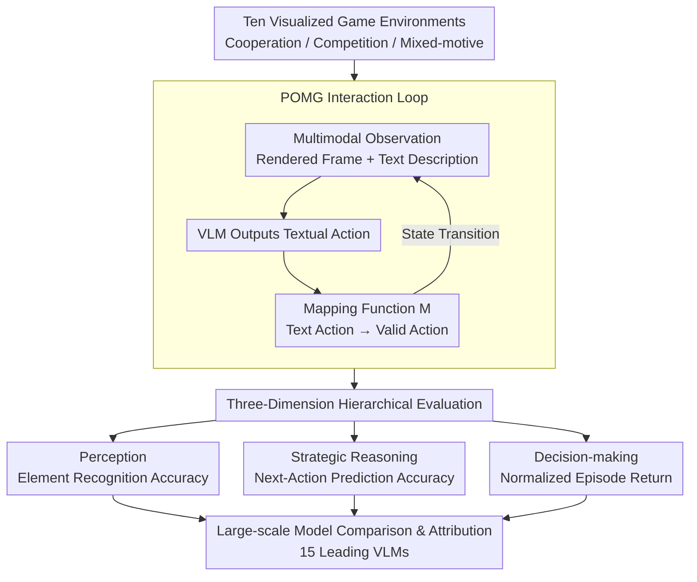

# VS-Bench: Evaluating VLMs for Strategic Abilities in Multi-Agent Environments

**Conference**: CVPR 2026 (Oral)  
**arXiv**: [2506.02387](https://arxiv.org/abs/2506.02387)  
**Code**: [GitHub](https://github.com/VS-Bench/VS-Bench)  
**Area**: Multimodal VLM  
**Keywords**: Vision-Language Models, Multi-agent Evaluation, Game Theory, Strategic Reasoning, Benchmark

## TL;DR
This paper introduces VS-Bench, a multimodal benchmark consisting of ten visualized game environments. It systematically evaluates the strategic capabilities of VLMs in multi-agent settings across three dimensions: perception, strategic reasoning, and decision-making. The study reveals that current state-of-the-art models still exhibit a significant gap from optimal performance in reasoning and decision-making.

## Background & Motivation

1. **Background**: Evaluation of VLMs has evolved from static tasks (image captioning, VQA) to interactive agent benchmarks, covering software engineering, GUI operations, gaming, and embodied control. However, existing VLM benchmarks almost exclusively focus on single-agent settings.
2. **Limitations of Prior Work**: The real world is inherently multi-agent, involving cooperation, competition, and mixed-motive interactions. Existing multi-agent LLM evaluations (e.g., GT-Bench, MAgIC) are restricted to text-only environments, failing to assess the ability of models to process visual observations. Simplifying visual information into text descriptions loses critical data such as spatial layouts and motion cues.
3. **Key Challenge**: Three unique challenges of multi-agent environments—non-stationary dynamics, interdependent decision-making, and equilibrium selection—are entirely absent in single-agent benchmarks. Meanwhile, the additional complexity introduced by visual observations is ignored by text-only benchmarks.
4. **Goal**: To construct a comprehensive multimodal multi-agent evaluation platform covering three interaction types—cooperation, competition, and mixed-motive—to thoroughly assess VLM strategic capabilities across perception, strategic reasoning, and decision-making.
5. **Key Insight**: Adapt classic environments from game theory and multi-agent reinforcement learning (MARL) into visualized games where VLMs receive multimodal observations (image + text) and output actions.
6. **Core Idea**: Provide a comprehensive and standardized evaluation of VLM strategic abilities through ten meticulously designed visualized environments across three game types, paired with a hierarchical evaluation protocol (perception $\rightarrow$ reasoning $\rightarrow$ decision-making).

## Method

### Overall Architecture
VS-Bench aims to identify specific failure points when a single-agent VLM is placed in a visualized multi-agent game. To this end, the paper formalizes each environment as a Partially Observable Markov Game (POMG): in each round, each agent receives a multimodal observation $\mathcal{O}_i = (\mathcal{I}_i, \mathcal{T}_i)$—a rendered game frame and a textual instruction. The model outputs a textual action, which is then translated by a mapping function $\mathcal{M}$ into a valid executable action for the environment to transition to the next state. The benchmark consists of three components: ten visualized environments across three game categories, an evaluation protocol that decomposes "strategic ability" into three hierarchical levels, and a comparative study across 15 leading VLMs.

### Key Designs

**1. Ten Visualized Game Environments: Transforming Game Theory Classics into VLM-Understandable Visuals**

Text-only multi-agent benchmarks (GT-Bench, MAgIC) suffer from a major flaw: compressing boards, kitchens, or maps into text loses spatial layouts and motion cues critical for interaction. VS-Bench adapts ten environments from game theory and MARL into rendered frames—Cooperative (Hanabi, Overcooked, Knights-Archers-Zombies), Competitive (Breakthrough, Kuhn Poker, Atari Pong, MPE), and Mixed-motive (Coin Dilemma, Monster Hunt, Battle of Colors). These environments span various game attributes: fully/partially observable, deterministic/stochastic, synchronous/asynchronous, and symmetric/asymmetric, requiring different capabilities like spatial perception, Theory of Mind, long-term planning, and teamwork.

**2. Three-Dimension Hierarchical Evaluation: Decomposing "Strategic Ability" into Perception, Reasoning, and Execution**

Winning rates alone cannot distinguish whether a model failed due to "unclear perception," "incorrect reasoning about opponents," or "poor decision-making despite correct reasoning." VS-Bench decomposes evaluation into three levels. The Perception dimension tests visual element recognition accuracy with 400 annotated samples per environment. The Strategic Reasoning dimension tests Theory of Mind by requiring models to predict the next actions of other agents. The Decision-making dimension measures performance via normalized episode returns, where random strategies are anchored at 0 and an oracle (optimal performance) is anchored at 100. Failure at any level provides a bottleneck localization.

**3. Large-Scale Model Comparison & Attribution Analysis: Identifying "Why and Where" Models Fail**

VS-Bench evaluates 15 leading VLMs—6 proprietary reasoning models, 6 proprietary chat models, and 3 open-source models—under unified settings (Temperature 1.0, 8K max tokens). Attribution analysis explores several axes: multimodal vs. text-only observations to isolate visual contribution; test-time scaling comparing IO, CoT prompting, and native reasoning; and social behavior analysis under specific persona settings, alongside human baseline comparisons and failure case studies.

### Loss & Training
This work is a benchmarking study and does not involve model training. All models use a unified inference configuration: temperature 1.0, maximum output tokens 8K, with reasoning models allowed an additional 16K reasoning tokens.

## Key Experimental Results

### Main Results

**Perception Evaluation** (Element Recognition Accuracy %):

| Model | Overall | Hanabi | Overcooked | Breakthrough | Pong |
|------|------|--------|------------|-------------|------|
| o3 | **84.9** | 79.7 | 69.8 | 97.2 | 64.6 |
| Gemini-2.5-pro | 83.4 | 79.9 | 54.5 | 98.5 | 86.5 |
| Qwen2.5-VL-72B | 80.3 | 76.0 | 72.9 | 75.1 | 65.2 |

**Strategic Reasoning** (Next-Action Prediction Accuracy %):

| Model | Overall | Best Env | Worst Env |
|------|------|---------|---------|
| o3 | **46.6** | Poker 67.0% | Pong 25.8% |
| Claude-3.7-sonnet | 40.4 | Poker 65.2% | Overcooked 26.0% |
| Random | 23.0 | — | — |

**Decision-making Evaluation** (Normalized Return %):

| Model | Overall | Best Coop | Best Comp | Best Mixed |
|------|------|---------|---------|------------|
| o3 | **31.4** | Hanabi 55.8 | Board 65.0 | Hunt 24.0 |
| Gemini-2.5-pro | 23.2 | Overcooked 17.1 | Board 55.0 | Battle 33.8 |
| Human Avg | **62.7** | — | — | — |

### Ablation Study

| Configuration | Decision overall | Description |
|------|---------|------|
| Multimodal Obs | 31.4% | Standard setting (o3) |
| Text-only Obs | Slightly Higher | Still far below oracle after removing visual challenge |
| Chat + IO prompting | ~4.8% | GPT-4.1 |
| Chat + CoT prompting | Significant Gain | CoT significantly improves chat models |
| Reasoning model | 31.4% | Reasoning models are consistently optimal |

### Key Findings
- **Perception is largely solved**: All models achieved overall accuracy $\ge 67.8\%$; the best model (o3) reached 84.9%, with reasoning models showing no significant advantage here.
- **Strategic reasoning is the critical bottleneck**: The best model (o3) only reached 46.6% accuracy and performed particularly poorly in video-game-like environments (Overcooked, Pong, Hunt), highlighting the coupled challenge of visual observation and strategic interaction.
- **Decision-making capacity is severely lacking**: 4 out of 15 models performed worse than a random strategy; o3 scored only 31.4%, surpassing only 12.9% of human participants.
- **Open-source models rival reasoning models in mixed-motive games**: InternVL3 in Coin Dilemma and Qwen2.5-VL in Monster Hunt achieved high scores through cooperative strategies.
- **Persona settings significantly impact social games**: Setting "self-interested" or "cooperative" personas for o3 significantly altered its behavior and performance.

## Highlights & Insights
- **The three-dimension hierarchical evaluation design** is ingenious: the progression from perception to reasoning to decision-making allows for precise diagnosis of whether a model "cannot see," "cannot think," or "cannot act." This methodology is transferable to other complex task benchmarks.
- **Social behavior analysis** provides the most interesting insight: Open-source models, due to a higher inclination toward cooperative strategies, outperformed stronger reasoning models in mixed-motive games. This suggests that being "smart" and being "collaborative" may be distinct capability dimensions.
- **Multimodal vs. Text-only comparisons** reveal that removing visual challenges provides only marginal improvements, indicating the core bottleneck lies in strategic reasoning rather than visual perception.

## Limitations & Future Work
- While ten games cover three types, the scale is limited and lacks complex real-world scenarios (e.g., autonomous driving, financial trading).
- Evaluation primarily considers 2-player settings, lacking large-scale multi-agent scenarios.
- All models used unified parameter settings, without fully exploring optimal configurations for each model.
- Future Directions: (1) Training specialized multi-agent strategy models; (2) Exploring in-context learning of VLMs in games; (3) Developing methods to enhance Theory of Mind capabilities in VLMs.

## Related Work & Insights
- **vs. GT-Bench / GAMA-Bench**: These evaluate LLM gaming via text-only environments. VS-Bench extends this to multimodal inputs and offers a more comprehensive evaluation (Perception + Reasoning + Decision vs. Decision-only).
- **vs. MAgIC / LLMArena**: Also text-only multi-agent evaluations; VS-Bench's visualized environments are closer to real-world multi-agent interactions.
- **vs. VisualWebArena / OSWorld**: These are single-agent VLM benchmarks; VS-Bench uniquely introduces the challenges of multi-agent interactions.

## Rating
- Novelty: ⭐⭐⭐⭐ First multimodal multi-agent VLM benchmark, filling a significant gap.
- Experimental Thoroughness: ⭐⭐⭐⭐⭐ 15 models $\times$ 10 environments $\times$ 3 dimensions, including human baselines and in-depth analysis.
- Writing Quality: ⭐⭐⭐⭐ Clear structure, well-designed tables, and deep analysis.
- Value: ⭐⭐⭐⭐⭐ Provides a standardized evaluation platform for VLM multi-agent strategic abilities with findings that guide future research.

<!-- RELATED:START -->

## Related Papers

- [\[CVPR 2026\] VisRes Bench: On Evaluating the Visual Reasoning Capabilities of VLMs](visres_bench_on_evaluating_the_visual_reasoning_capabilities_of_vlms.md)
- [\[CVPR 2026\] QUANTIPHY: A Quantitative Benchmark Evaluating Physical Reasoning Abilities of Vision-Language Models](quantiphy_a_quantitative_benchmark_evaluating_physical_reasoning_abilities_of_vi.md)
- [\[ACL 2026\] AICA-Bench: Holistically Examining the Capabilities of VLMs in Affective Image Content Analysis](../../ACL2026/multimodal_vlm/aica-bench_holistically_examining_the_capabilities_of_vlms_in_affective_image_co.md)
- [\[CVPR 2026\] Hierarchical Attacks for Multi-Modal Multi-Agent Reasoning](hierarchical_attacks_for_multi-modal_multi-agent_reasoning.md)
- [\[CVPR 2026\] Do VLMs Perceive or Recall? Probing Visual Perception vs. Memory with Classic Visual Illusions](do_vlms_perceive_or_recall_probing_visual_perception_vs_memory_with_classic_visu.md)

<!-- RELATED:END -->
