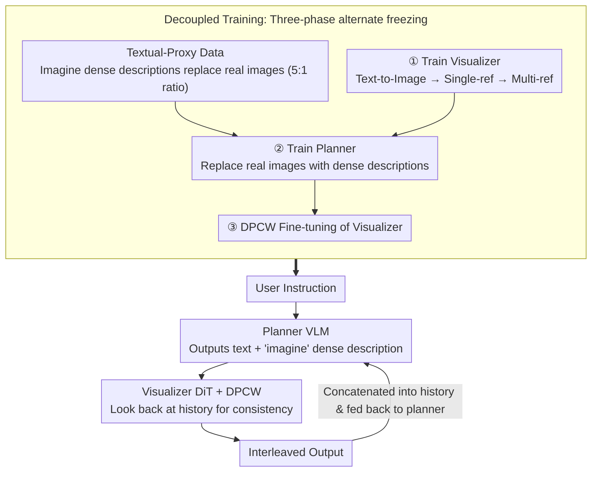

# Wan-Weaver: Interleaved Multi-modal Generation via Decoupled Training

**Conference**: CVPR 2026  
**arXiv**: [2603.25706](https://arxiv.org/abs/2603.25706)  
**Code**: [https://doubiiu.github.io/projects/WanWeaver](https://doubiiu.github.io/projects/WanWeaver)  
**Area**: Multi-modal VLM  
**Keywords**: Interleaved multi-modal generation, decoupled training, textual-proxy data, visual consistency, planning-visualization

## TL;DR

Wan-Weaver proposes a decoupled architecture consisting of a Planner (VLM) and a Visualizer (DiT). By training the planner with large-scale textual-proxy data instead of real interleaved data, it achieves SOTA interleaved text-image generation. It reaches an Overall score of 8.67 on OpenING, surpassing GPT-4o (8.20) and performing competitively with Nano Banana (8.85), while maintaining strong understanding capabilities (MMMU 74.9).

## Background & Motivation

1.  **Background**: Interleaved multi-modal generation requires models to generate coherent content with interspersed text and images based on user instructions, such as illustrated tutorials or storyboarding. While GPT-4o+DALL-E3 leads via pipeline methods, open-source solutions (Anole, Emu3) still lag significantly.
2.  **Limitations of Prior Work**: (1) High-quality real interleaved data is extremely scarce—web-crawled data often has poor quality and high copyright risks. (2) Joint training of text understanding and image generation leads to mutual interference, where generation training typically degrades understanding performance. (3) Maintaining visual consistency in long-sequence generation is difficult, often leading to "identity shifting" for characters across multiple images.
3.  **Key Challenge**: Interleaved generation requires both "planning ability" (deciding when to insert images and their descriptions) and "visual consistency" (maintaining character/style across images). The training signals and data requirements for these two tasks are fundamentally different.
4.  **Goal**: To optimize planning and visualization capabilities separately through decoupled training, using synthetic textual-proxy data to substitute for scarce real interleaved data.
5.  **Key Insight**: Interleaved generation can be split into two independently trainable sub-tasks. The planner only needs to learn "where to insert an image and what its detailed description should be," which can be trained using pure text. The visualizer only needs to learn "how to generate consistent images based on descriptions and reference images."
6.  **Core Idea**: Decoupled Training + Textual-proxy data + Dense Prompt Context Window (DPCW) attention mechanism.

## Method

### Overall Architecture

Wan-Weaver addresses the task of generating coherent content with interspersed text and illustrations from a single prompt. Its core design splits this task into two distinct roles: a **Planner** responsible for determining the "narrative flow, insertion points, and detailed image descriptions," and a **Visualizer** responsible for rendering the planner's descriptions into actual images while ensuring character and style consistency.

The inference cycle proceeds as follows: the user instruction is processed by the Planner (based on QWen2.5-VL-32B Think version), which outputs standard text and inserts `<imagine>…</imagine>` tags at appropriate locations containing dense descriptions. The Visualizer (Twin DiT) takes these descriptions for diffusion generation, utilizing the DPCW attention mechanism to attend to previously generated image features in the context, ensuring the new image matches previous styles and characters. This alternating process creates the final interleaved output. The system is supported by a training workflow that separates planning from visualization: the planner is trained on textual-proxy data, while the visualizer is trained on reference image data.

### Key Designs

**1. Decoupled Training: Splitting Planning and Rendering into Three Non-Interfering Phases**

Interleaved generation usually requires simultaneous "planning" and "visual consistency" capabilities, yet their training signals often conflict—joint training image losses often degrade language understanding. Wan-Weaver employs a three-stage alternate freezing strategy: first, the planner is frozen to train the visualizer sequentially on T2I, single-reference, and multi-reference consistency modes. Second, the visualizer is frozen while fine-tuning the planner using textual-proxy data (replacing images with descriptions). Finally, a DPCW fine-tuning stage allows the visualizer to adapt to the new conditioning via context windows. The total training volume includes 9.6T tokens for the visualizer and 35.72G tokens for the planner. Ablations show that decoupled training allows the visual loss to drop smoothly from ~0.25 to 0.15, whereas joint training suffers from constant oscillation.

**2. Textual-Proxy Data: Circumventing Data Scarcity by Using Dense Descriptions as Image Proxies**

High-quality interleaved data is nearly impossible to crawl without quality or copyright issues. Wan-Weaver’s breakthrough is the realization that the planner does not need to "see" images; it only needs to learn "where to place them and what they should contain." This can be taught using pure text. By replacing every image in target interleaved datasets with a VLM-generated dense description wrapped in `<imagine>` tags, the planner sees a pure text sequence. Proxies come from three sources: LLM-synthesized user queries, VLM-back-captioned image galleries, and refined multi-image narratives clustered via SigLIP. Generation and understanding data are mixed in a 5:1 ratio, effectively bypassing the interleaved data bottleneck through infinite synthetic text.

**3. Dense Prompt Context Window (DPCW): Maintaining Consistency Across N Images**

Standard diffusion models only condition on the current prompt, unaware of previously generated images, leading to character "drifting." DPCW implements a self-attention window around the dense prompts. An attention mask allows the current denoising image to attend to visual features of previously generated images in the context, using 3D RoPE to encode temporal positions. This ensures the visualizer considers not just "what to draw now" but "what the subject looked like before," maintaining appearance and style consistency across long sequences.

### Mechanism

Consider the prompt: "Create an illustrated story about Robin the fox's day." The Planner first outputs: "In the morning, Robin peeks out of his den," followed by an `<imagine>A small orange fox, fluffy tail, peeking out of a den, morning light, watercolor style</imagine>` tag. The Visualizer generates Image ①. Next, the Planner writes: "At noon, he goes to the river to drink," and outputs a second `<imagine>` tag. This time, the Visualizer uses DPCW to look back at the orange fur and tail features from Image ①, ensuring the fox in Image ② is the same character. This process continues, with each visualization step referencing all previous images. Throughout this, the Planner never "sees" a real image; it only processes "Text + `<imagine>` description" sequences.

### Loss & Training

The visualizer uses a Flow-matching loss, while the planner uses standard autoregressive cross-entropy. The visualizer's three-stage training progressively builds consistency: T2I (Text-to-Image) → +SI2I (Single-image reference) → +MI2I (Multi-image reference).

## Key Experimental Results

### Main Results

| Method | OpenING Overall ↑ | WeaverBench Overall ↑ | MMMU (Understanding) ↑ | GenEval (T2I) ↑ | DPG (T2I) ↑ |
| :--- | :--- | :--- | :--- | :--- | :--- |
| Anole | 5.75 | 3.74 | - | - | - |
| Emu3 | 5.76 | - | - | - | - |
| Gemini + Flux | 7.23 | - | - | - | - |
| GPT-4o + DALL-E3 | 8.20 | - | - | - | - |
| Nano Banana | 8.85 | 8.38 | - | - | - |
| Bagel | - | - | 55.3 | 0.88 | 85.07 |
| **Ours (Wan-Weaver)** | **8.67** | **8.43** | **74.9** | **0.89** | **87.21** |

### Ablation Study

| Configuration | Effect | Description |
| :--- | :--- | :--- |
| Decoupled vs. Joint | Visual Loss 0.15 vs. 0.25 | Decoupled is more stable |
| Data Ratio 0g:1u | Token acc ~0% | Understanding data lacks generation ability |
| Data Ratio 5g:1u | Optimal | Generation-led with understanding assistance |
| T2I only | Basic alignment | Lacks reference capability |
| +SI2I | Appearance retention | Single-image reference |
| +MI2I | Long-range consistency | Full capability |

### Key Findings

- Wan-Weaver maintains understanding performance nearly identical to its base QWen2.5-VL-32B (MMMU 74.9 vs. 75.1), proving decoupled training prevents generation from degrading understanding.
- The OpenING score of 8.67 approaches or exceeds GPT-4o+DALL-E3 (8.20) in several metrics, indicating open-source solutions are hitting the ceiling of closed-source performance.
- Image editing performance (ImgEdit 4.31) significantly outperforms specialized editing models like Step1X-Edit (3.06).

## Highlights & Insights

- **Ingenious Textual-Proxy Design**: Replacing images with dense descriptions to train the planner elegantly sidesteps the interleaved data scarcity problem—a clever form of "data dimensionality reduction."
- **Engineering Value of Decoupled Training**: The planner and visualizer can be upgraded independently without retraining the entire system, significantly lowering maintenance costs.
- **Three-in-One Paradigm**: A single model achieves SOTA levels in understanding (MMMU 74.9), generation (GenEval 0.89), and editing (ImgEdit 4.31).

## Limitations & Future Work

- Users must pre-specify the resolution and aspect ratio; the model cannot yet adaptively decide these based on content.
- Sequential generation bottleneck: all generated content must be fed back into the model, leading to linear GPU memory growth for long sequences.
- Improved generation does not yet feed back to enhance understanding; bi-directional enhancement remains an open problem.
- Occasional structural collapse (e.g., unexpected grid layouts instead of independent images) suggests flaws in geometric reasoning and symbol grounding.

## Related Work & Insights

- **vs. GPT-4o+DALL-E3**: Compared to the closed-source pipeline (8.20), Wan-Weaver (8.67) shows advantages in multi-step consistency (8.56 vs. 8.38) and content completeness (9.41 vs. 8.66).
- **vs. Bagel/UniWorld**: These unified models suffer from degraded understanding (MMMU 55-59) due to joint training, while Wan-Weaver maintains 74.9 through decoupling.
- **vs. Emu3**: The pure discrete token approach of Emu3 reaches only 5.76 on OpenING, with Wan-Weaver's lead stemming from superior visual quality and consistency.

## Rating

- Novelty: ⭐⭐⭐⭐⭐ Decoupled training and textual-proxy data are significant innovations for interleaved generation.
- Experimental Thoroughness: ⭐⭐⭐⭐⭐ Comprehensive evaluation on OpenING, WeaverBench, and single-modal benchmarks with detailed ablations.
- Writing Quality: ⭐⭐⭐⭐ Clear methodology, though training details are dense.
- Value: ⭐⭐⭐⭐⭐ A milestone for bringing open-source interleaved generation to closed-source performance levels.

<!-- RELATED:START -->

## Related Papers

- [\[CVPR 2026\] DuoGen: Towards Autonomous Interleaved Multimodal Generation](duogen_towards_autonomous_interleaved_multimodal_generation.md)
- [\[CVPR 2026\] Narrative Weaver: Towards Controllable Long-Range Visual Consistency with Multi-Modal Conditioning](narrative_weaver_towards_controllable_long-range_visual_consistency_with_multi-m.md)
- [\[CVPR 2026\] WEAVE: Unleashing and Benchmarking the In-context Interleaved Comprehension and Generation](weave_unleashing_and_benchmarking_the_in-context_interleaved_comprehension_and_g.md)
- [\[CVPR 2026\] Decoupled and Reusable Adaptation for Efficient Cross-Modal Transfer](decoupled_and_reusable_adaptation_for_efficient_cross-modal_transfer.md)
- [\[CVPR 2026\] CogniVerse: Revolutionizing Multi-Modal Retrieval-Augmented Generation with Cognitive Reflection and Geometric Reasoning](cogniverse_revolutionizing_multi-modal_retrieval-augmented_generation_with_cogni.md)

<!-- RELATED:END -->
