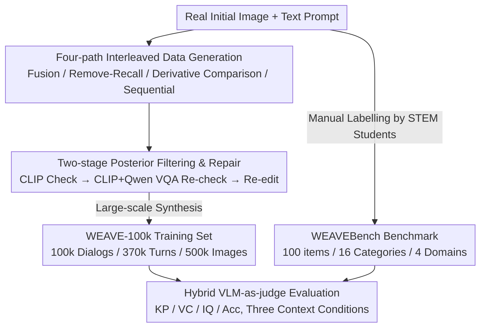

# WEAVE: Unleashing and Benchmarking the In-context Interleaved Comprehension and Generation

**Conference**: CVPR 2026  
**Paper**: [CVF Open Access](https://openaccess.thecvf.com/content/CVPR2026/html/Chow_WEAVE_Unleashing_and_Benchmarking_the_In-context_Interleaved_Comprehension_and_Generation_CVPR_2026_paper.html)  
**Code**: https://weichow23.github.io/weave (Project Page)  
**Area**: Multimodal VLM  
**Keywords**: Unified Multimodal Model, Interleaved Comprehension and Generation, Multi-turn Image Editing, Visual Memory, Benchmark

## TL;DR
WEAVE constructs the first interleaved cross-modal comprehension and generation data suite for "multi-turn with historical context." It includes a 100k multi-turn dialogue training set (WEAVE-100k), a 100-question manually annotated benchmark (WEAVEBench), and a hybrid VLM evaluation framework. The study reveals that current unified multimodal models collectively fail at multi-turn image editing/generation requiring "visual memory," whereas fine-tuning with WEAVE-100k enables the emergence of visual memory capabilities.

## Background & Motivation
**Background**: Unified Multimodal Models (UMM) integrate image "comprehension" and "generation/editing" into a single framework. Recent progress in instruction-based image editing and multi-image synthesis allows for linguistic descriptions, reference images, and iterative editing across multiple images.

**Limitations of Prior Work**: Existing datasets and benchmarks are almost exclusively **single-turn**. Each edit is treated as an isolated instruction with no dependencies. However, real-world image creation is not a "one-off" process; creating comics or visual stories requires repeated backtracking and reuse of prior results, where every frame must maintain consistency in character appearance, lighting, and narrative. For instance, "removing a flower from a vase and then accurately returning the same flower several turns later" requires the model to remember visual content from previous turns.

**Key Challenge**: To teach a model "visual memory + context-consistent reasoning," data that **explicitly depicts the temporal dependencies of multi-turn editing** is required. Such high-quality interleaved datasets are missing, and corresponding evaluation benchmarks are entirely non-existent. Most open-source models are restricted to single-turn editing, while closed-source models (e.g., Nano Banana, Seedream) demonstrate some multi-turn memory that has not been systematically measured.

**Goal**: (1) Create a truly multi-turn, interleaved dataset with historical context; (2) Develop a benchmark for evaluating "multi-turn generation + visual memory + world knowledge reasoning"; (3) Verify if such data can improve UMM performance and elicit visual memory.

**Key Insight**: The authors observe that the essence of multi-turn editing is "retrieving and reusing objects/layouts/styles from previous turns." By deliberately embedding chains such as "remove-recall," "fusing multi-turn results," and "narrative progression" that necessitate looking back at history, the model can learn visual memory.

**Core Idea**: Reconstruct data and evaluation using "interleaved multi-turn" formats. Each input explicitly includes the text-image history of previous turns. Four data generation paths are designed to trigger visual memory, paired with a hybrid VLM-as-judge framework that considers both reference images and the original image plus instructions.

## Method

### Overall Architecture
WEAVE is a tripartite suite consisting of a **dataset + benchmark + evaluation protocol**, aiming to make "interleaved multi-turn comprehension-generation" trainable and measurable. The pipeline consists of three parts: first, generating the large-scale training set **WEAVE-100k** (100k dialogues, 370k turns, 500k images) via four generation paths and two-stage posterior filtering; second, the manually annotated **WEAVEBench** (100 questions, 16 task categories across Science/Creation/Logic/Game domains); and third, a **hybrid VLM-as-judge** evaluation across four dimensions under three context conditions. For validation, Bagel is fine-tuned on WEAVE-100k, while 22 models are benchmarked on WEAVEBench.

### Key Designs

**1. Four-path Interleaved Data Generation: Embedding "Visual Memory" in Data**
Simply stacking multi-turn edits does not force a model to remember history. The authors design four complementary paths where the correct answer for the current turn depends on previous content: (i) **Multi-image fusion**: Incorporating previously edited or generated images into the current result, forcing reference to historical artifacts; (ii) **Remove-then-back**: Removing/replacing an object and then accurately adding it back turns later, testing memory of deleted items; (iii) **Derivative imagination and comparison**: Deriving or imagining alternatives before fusion for comparison; (iv) **Sequential procedures**: Performing continuous operations based on narrative progression or structured editing (e.g., frame-by-frame visual storytelling). The resulting data averages 3.79 turns and 5.01 images per dialogue, with over 60% containing $\ge 5$ images, naturally providing long-range context.

**2. Two-stage Posterior Filtering and Repair: Quality Control for Synthetic Data**
To handle noise from automated generation, two validation stages are implemented. The first stage uses a **CLIP check** for alignment between generated results and instructions. The second stage uses a **CLIP + Qwen VQA re-check** to verify if the edit actually occurred and if untouched regions remained intact. Samples failing these checks undergo **Re-edit** (Refine and Repair) or are discarded. This "generation → double verification → refinement" loop ensures the 100k samples provide performance gains during fine-tuning.

**3. Multi-dimensional Task Design in WEAVEBench: Integrating World Knowledge**
Beyond basic editing, the benchmark covers 16 task categories across Science, Creation, Logic, and Game domains, intentionally incorporating problems requiring **world knowledge + multi-turn visual memory**. Examples include identifying a person's nationality, generating a famous tower from that country's capital, and placing the person in front of it (requiring cultural knowledge + multi-turn ID consistency), or physical/commonsense reasoning like thin-film interference or traffic light reactions. Since models must **autonomously generate** outputs to feed into the next turn during evaluation, error accumulation is naturally exposed.

**4. Hybrid VLM-as-judge: Contextual Referencing**
To handle the lack of a single "ground truth" in multi-turn generation, the authors employ a **hybrid strategy** where the VLM judge observes both the "reference image" and the "original image + edit instruction." Scoring is based on predefined key points across four metrics: **Key Point Correctness (KP)** for edit compliance; **Visual Consistency (VC)** for preserving non-target regions and object IDs; **Image Quality (IQ)**; and **Accuracy (Acc)** for comprehension tasks. The Pearson correlation between GPT-4.1 judge scores and human experts stayed stable at $>0.8$.

### A Complete Example
In a "Totoro Story" task from WEAVEBench: ① Change the background of #1 to the most famous mountain in its country (Japan); ② Generate the most famous tower in the capital of the woman's country (Tokyo Tower); ③ Place the woman from #1 in front of the tower generated in step ②. This chain tests cross-turn retrieval (visual memory), "Japan $\rightarrow$ Tokyo Tower" reasoning (world knowledge), and the correct fusion of prior outputs (mountain, tower, person).

## Key Experimental Results

### Main Results (Benchmarking 22 Models on WEAVEBench)
The hybrid Avg scores indicate that even strong models only reach 0.68 / 0.767, showing multi-turn interleaved generation is far from solved. Creative tasks performed better than science/logic tasks, highlighting world knowledge integration as a weakness.

| Model | Type | Science | Creation | Logic | Game | Avg |
|------|------|---------|----------|-------|------|-----|
| GPT-4.1 | LLM | 0.705 | 0.500 | 0.167 | 0.167 | 0.464 |
| Step1X-Edit v1.1 | Edit | 0.574 | 0.714 | 0.700 | 0.625 | 0.669 |
| FLUX.1 Kontext | Edit | 0.589 | 0.756 | 0.639 | 0.610 | 0.689 |
| Seedream 4.0 | UMM | 0.683 | 0.847 | 0.679 | 0.635 | **0.765** |
| Nano Banana | UMM | 0.710 | 0.843 | 0.730 | 0.613 | **0.767** |
| Bagel | UMM | 0.378 | 0.475 | 0.406 | 0.365 | 0.446 |
| **Bagel + WEAVE-100k** | UMM | 0.537 | 0.706 | 0.567 | 0.531 | **0.640** |

Fine-tuning the open-source Bagel with WEAVE-100k improved its score from 0.446 to 0.640 (**+42.5%**), nearing the performance of closed-source models.

### Key Experimental Results (Downstream Task Gains)
Fine-tuning Bagel with WEAVE-100k yielded gains across multiple public benchmarks, notably doubling scores on RISEBench:

| Benchmark | Metric | Bagel | +WEAVE-100k | Gain |
|------|------|-------|-------------|------|
| MMMU (Comprehension) | Acc | 55.3 | 60.7 | +9.8% |
| GEdit-EN-full (Editing) | Avg | 6.52 | 6.83 | +4.8% |
| RISEBench·Spatial (Sync) | Score | 14.0 | 21.0 | **+50%** |
| RISEBench·Causal | Score | 5.6 | 6.7 | ↑ |
| GenEval·Overall | Score | 0.82 | 0.84 | ↑ |

### Key Findings
- **Context is a Double-Edged Sword**: While comprehension tasks improved significantly with historical context (QwenVL increased by 163%), generation performance in open-source single-turn models **degraded** (Qwen-Edit dropped 5.3%–8.6%) due to localization failures in long contexts. Closed-source models like Nano utilized context positively.
- **Sequential > Concatenated Input**: Feeding images sequentially significantly outperformed multi-image concatenation; Bagel's performance dropped 10.3% with concatenation.
- **Error Accumulation**: Performance declines as turns increase due to autonomous generation feeding back into the model, a common bottleneck.
- **Judge Reliability**: GPT-4.1's correlation with human experts is $>0.8$.

## Highlights & Insights
- The **"Remove-Recall" path** is a sophisticated design that converts abstract "visual memory" into an automatically synthesizable and verifiable task (delete-then-add, comparing pre/post images).
- The **hybrid evaluation** uses both reference images and the original image/instruction, mitigating the issue where creative but valid generations are penalized for not matching a single reference.
- The **context-divergence discovery** (context benefits comprehension but hurts single-turn generation models) quantitatively exposes the "single-turn-only" bottleneck in current open-source models.
- The results suggest that "visual memory" capability is likely constrained by **data availability** rather than architectural limitations.

## Limitations & Future Work
- **Single backbone validation**: Training was primarily verified on Bagel; generalizability across other UMM architectures remains to be fully explored.
- **Benchmark scale**: WEAVEBench consists of 100 high-quality items, which may have limited tail coverage compared to larger automated benchmarks.
- **VLM-Judge dependence**: While correlated with humans, the judge relies on predefined key points and might misinterpret creative solutions outside these bounds.
- **Synthetic data bias**: Despite filtering, the gap between synthetic and real creation distributions, and the biases of the filtering models (CLIP/Qwen), may be inherited.
- **Error accumulation**: A fundamental solution to the performance decay across turns remains an open problem.

## Related Work & Insights
- **vs. MagicBrush**: MagicBrush treats multi-turn edits as independent requests; WEAVE is the first to explicitly model cross-turn visual memory dependencies.
- **vs. AnyEdit / GPT-Image-Edit-1.5M**: These rely on GPT-4o for scale but remain single-turn; WEAVE uniquely addresses the "interleaved/multi-turn/visual memory" intersection.
- **Insight**: Treating "historical dependencies" as a first-class citizen in data design, rather than an afterthought in evaluation, is a transferable strategy for diverse long-range consistency generation tasks (e.g., video editing, 3D asset iteration).

## Rating
- **Novelty**: ⭐⭐⭐⭐⭐ (First interleaved multi-turn data suite with visual memory)
- **Experimental Thoroughness**: ⭐⭐⭐⭐ (Extensive 22-model benchmark, though restricted to one training backbone)
- **Writing Quality**: ⭐⭐⭐⭐ (Clear motivation and well-defined protocol)
- **Value**: ⭐⭐⭐⭐⭐ (Publicly available data and benchmark addressing a critical UMM gap)

<!-- RELATED:START -->

## Related Papers

- [\[CVPR 2026\] DuoGen: Towards Autonomous Interleaved Multimodal Generation](duogen_towards_autonomous_interleaved_multimodal_generation.md)
- [\[CVPR 2026\] Wan-Weaver: Interleaved Multi-modal Generation via Decoupled Training](wan-weaver_interleaved_multi-modal_generation_via_decoupled_training.md)
- [\[CVPR 2026\] Adapting In-context Generation for Enhanced Composed Image Retrieval](adapting_in-context_generation_for_enhanced_composed_image_retrieval.md)
- [\[CVPR 2026\] Benchmarking Single-Factor Physical Video-to-Audio Generation](benchmarking_single-factor_physical_video-to-audio_generation.md)
- [\[CVPR 2026\] VinQA: Visual Elements Interleaved Long-form Answer Generation for Real-World Multimodal Document QA](vinqa_visual_elements_interleaved_long-form_answer_generation_for_real-world_mul.md)

<!-- RELATED:END -->
